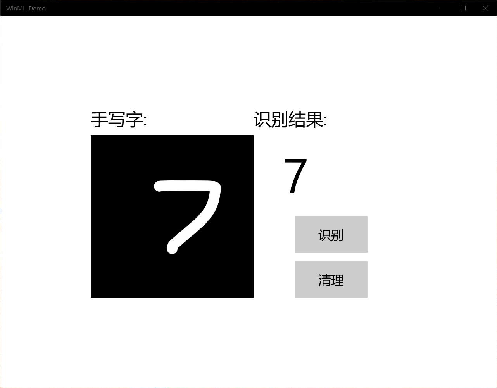

# 第六次作业
## MNIST手写应用
### 先决条件

* Windows 10（版本1809或更高版本）
* Windows 10 SDK（内部版本17763或更高版本）
* Visual Studio 2019（或Visual Studio 2017 15.7.4版或更高版本）
* 适用于Visual Studio 2019或2017的 Windows Machine Learning Code Generator扩展
* 一些基本的UWP和C＃知识
### 启动UWP

从GitHub下载项目后，启动Visual Studio并打开MNIST_Demo.sln文件（该文件应该位于 \ Windows-Machine-Learning \ Samples \ MNIST \ Tutorial \ cs）。如果解决方案显示为不可用，则需要在解决方案资源管理器中右键单击该项目，然后选择Reload Project。

我们提供了带有已实现的XAML控件和事件的模板，包括：

* InkCanvas绘制数字。 用于解释数字并清除画布的按钮。 帮助程序将InkCanvas输出转换为VideoFrame的例程。 在解决方案资源管理器内部，该项目具有三个主要代码文件：

* MainPage.xaml-我们所有的XAML代码都为InkCanvas，按钮和标签创建UI 。

* MainPage.xaml.cs-我们的应用程序代码所在的位置。

* Helper.cs-裁剪和转换图像格式的帮助程序例程。

### 构建并运行项目

在Visual Studio工具栏中，将解决方案平台更改为x64，以在您的设备为64位时在本地计算机上运行该项目，如果设备为32位，则在x86上运行。（您可以在Windows设置应用中检入：“ 系统”>“关于”>“设备规格”>“系统类型”。）

要运行项目，请单击工具栏上的“ 开始调试”按钮，或按F5键。该应用程序应该显示一个InkCanvas，用户可以在其中写一个数字，一个Recognize按钮来解释该数字，一个空标签字段，其中解释后的数字将以文本形式显示，以及一个Clear Digit按钮来清除InkCanvas。
### 添加模型

右键单击解决方案资源管理器中的Assets文件夹，然后选择“ 添加” >“ 现有项”。将文件选择器指向ONNX模型的位置，然后单击添加。

该项目现在应该有两个新文件： mnist.onnx-训练的模型。 mnist.cs -Windows ML生成的代码
### 加载，绑定和评估模型

对于Windows ML应用程序，我们要遵循的模式是：“加载”>“绑定”>“求值”。

加载机器学习模型。 将输入和输出绑定到模型。 评估模型并查看结果。 我们将使用mnist.cs中生成的接口代码来加载，绑定和评估应用程序中的模型。

首先，在MainPage.xaml.cs中，我们实例化模型，输入和输出。将以下成员变量添加到MainPage类：

private mnistModel ModelGen;
private mnistInput ModelInput = new mnistInput();
private mnistOutput ModelOutput;

然后，在LoadModelAsync中，我们将加载模型。我们使用任何模型的方法（也就是之前这个方法应该叫的MainPage的加载事件，在的OnNavigatedTo覆盖，或之前的任何地方recognizeButton_Click被调用）。该mnistModel类表示MNIST模式并创建系统默认设备上的会话。要加载模型，我们调用CreateFromStreamAsync方法，并传入ONNX文件作为参数。

接下来，我们要将输入和输出绑定到模型。生成的代码还包括mnistInput和mnistOutput包装器类。所述mnistInput类表示该模型的预期输入，并且mnistOutput类表示该模型的预期的输出。

要初始化模型的输入对象，请调用mnistInput类构造函数，传入您的应用程序数据，并确保输入数据与模型期望的输入类型匹配。该mnistInput类期待一个ImageFeatureValue，所以我们使用一个辅助方法获取ImageFeatureValue为输入。

使用helper.cs中包含的帮助函数，我们将复制InkCanvas的内容，将其转换为ImageFeatureValue类型，然后将其绑定到我们的模型。

对于输出，我们只需使用指定的输入调用EvaluateAsync。输入初始化后，调用模型的EvaluateAsync方法以根据输入数据评估模型。EvaluateAsync将您的输入和输出绑定到模型对象，并在输入上评估模型。

由于模型返回了输出张量，因此我们首先要将其转换为友好的数据类型，然后解析返回的列表以确定哪个数字具有最高的概率并显示该数字。

最后，我们要清除InkCanvas，以允许用户绘制另一个数字

### 启动应用程序

构建并启动应用程序后（按F5键），我们将能够识别在InkCanvas上绘制的数字。运行效果图如下所示

### 实验总结
通过本节课的学习，我学会了mnist手写应用，我们对ai有了更深的了解，mnist手写应用对操作i系统的配置有要求，而runtime就木有，所以这次实验出现的主要问题就是操作系统的配置上，最后通过自己的努力最终解决了问题，完成了实验
