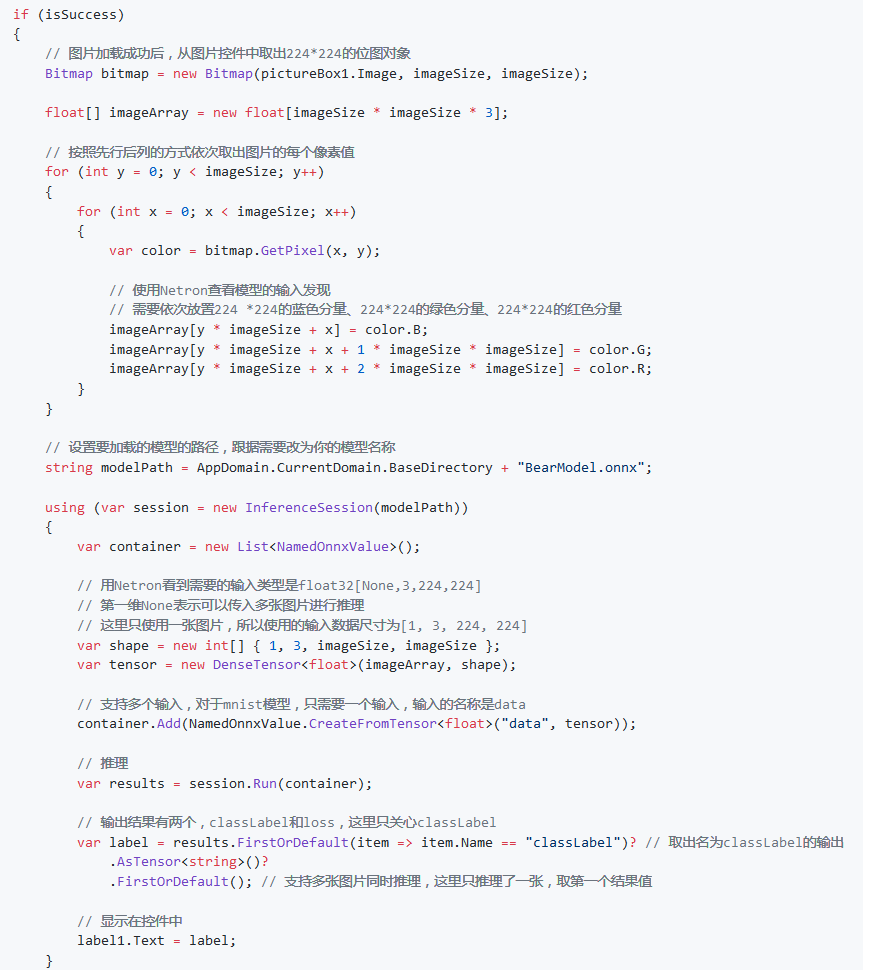
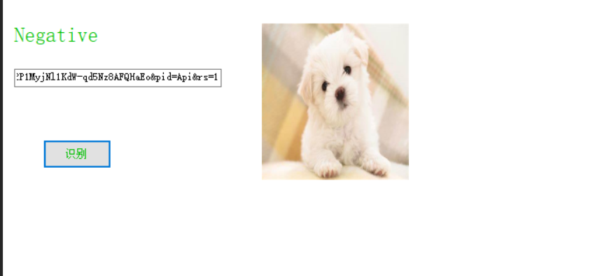

201702041 chenziliang  写代码  
201702044 lixiang  演讲  
201702075 yuminxue  写报告
# 使用ONNX Runtime封装onnx模型并推理   
ONNX Runtime，一种用于ONNX格式的AI模型的推理引擎。首先应正确安装并配置了Visual Studio 2017 和 C#开发环境  
## 界面设计
创建Windows窗体应用(.NET Framework)项目，并给项目起名。在解决方案资源管理器中找到Form1.cs，双击，打开界面设计器。从工具箱中向Form中依次拖入控件并调整。   

左侧从上下到依次是：  
Label控件，将内容改为“输入要识别的图片地址：  
TextBox控件，可以将控件拉长一些，方便输入URL  
Button控件，将内容改为“识别”  
Lable控件，将label的内容清空，用来显示识别后的结果。因为label也没有边框，所以在界面看不出来。可以将此控件的字体调大一些，能更清楚的显示推理结果。  

  
右侧的控件是一个PictureBox，用来预览输入的图片，同时，也从这个控件中取出对应的图片数据，传给模型推理类库去推理。建议将控件属性的SizeMode更改为StretchImage，并将控件长和宽设置为同样的值，保持一个正方形的形状，这样可以方便我们直观的了解模型的输入。  
## 添加模型文件到项目中
打开解决方案资源管理器中，在项目上点右键->添加->现有项，在弹出的对话框中，将文件类型过滤器改为所有文件，然后导航到模型所在目录，选择模型文件并添加。模型是在应用运行期间加载的，所以在编译时需要将模型复制到运行目录下。在模型文件上点右键，属性，然后在属性面板上，将生成操作属性改为内容，将复制到输出目录属性改为如果较新则复制。  
## 添加OnnxRuntime库
打开解决方案资源管理器，在引用上点右键，管理NuGet程序包。在打开的NuGet包管理器中，切换到浏览选项卡，搜索onnxruntime，找到Microsoft.ML.OnnxRuntime包，当前版本是0.4.0，点击安装，按提示完成安装。在解决方案上点右键，选择配置管理器。在配置管理器对话框中，将活动解决方案平台切换为x64。如果没有x64，在下拉框中选择新建，按提示新建x64平台。
## 测试代码
 
## 总结及结果展示
这次试验通过使用ONNX Runtime封装onnx模型并推理识别图片。以下是识别的一些结果：实验结果中除了熊类可以识别，其他种类的动物均不能识别。  
  
  
  
  
    
在实验过程中，一开始识别图片时，图片在显示上存在一点问题，只显示图片的局部，从而导致有些图片识别不出来，在把属性中的行为中的SizeMode中normal改成Stretchlmage即可让图片显示完全。
  
在实验的基础上，对布局的颜色做了一些改变  
  
    
这是通道，零通道是蓝色，一通道时绿色，二通道是红色。  
  

