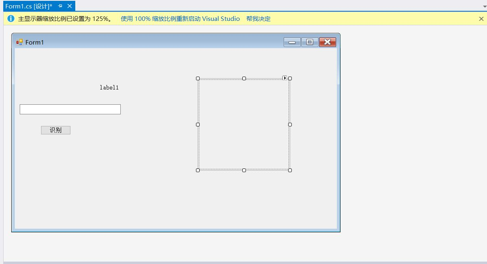
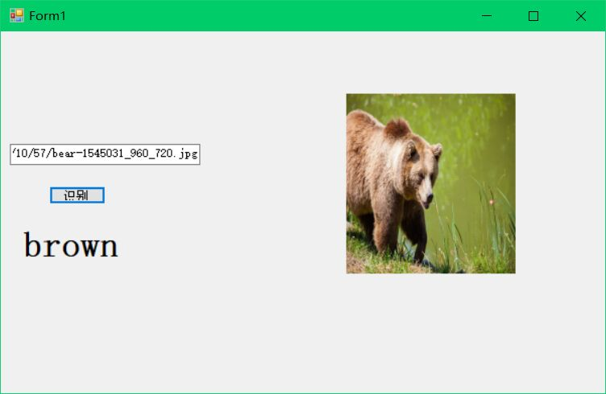
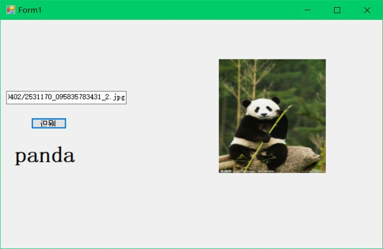
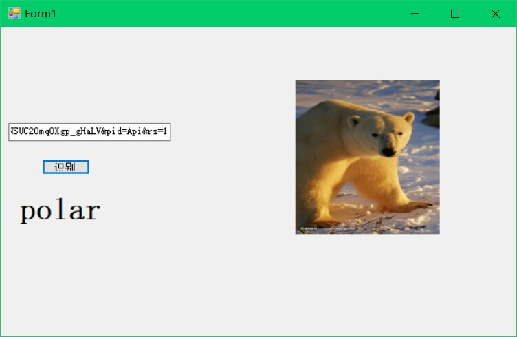
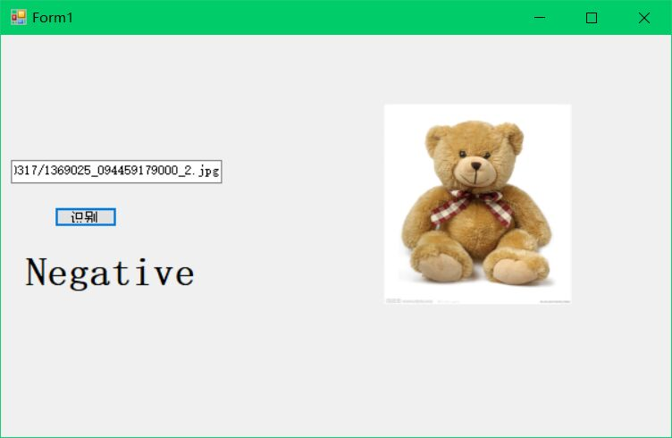

### 20191017

小组成员：wx，bianxr，lixuanyu
学号：201702061

#### 车载信息系统实验————图像识别应用之看图识熊
       实验前言：在保证了开发环境是“安装配置了Visual Studio2017和C#”后，
       我们根据老师提供的方法，小组成员分工，一步步进行操作，并完成了实验。
##### 实验步骤总结
* 一 界面设计
在创建Windows窗体应用(.NET Framework)项目后，我们给项目起名为ClassifyBear。随后在解决方案资源管理器中找到Form1.cs，双击，打开界面设计器。从工具箱中向Form中依次拖入控件并调整。
一开始我们并不知道在哪里给控件修改名字，导致报错。后来找到了错误的原因是我们修改的是控件本身的名字，而不是他的text，在找到错误后我们进行了修改，最终完成了这一步骤。
最终效果图如下：



* 二 添加模型文件到项目中
打开解决方案资源管理器中，在项目上点右键->添加->现有项，在弹出的对话框中，将文件类型过滤器改为所有文件，然后导航到模型所在目录，选择模型文件并添加。
* 三 添加OnnxRuntime库
这里的OnnxRuntime库是老师发来的，直接下载成功后，我们将其放到我们创建的目录下，然后下载版本为0.4.0的Microsoft.ML.OnnxRuntime包，最后将架构运行库改为x64即可。
* 四 处理输入并加载模型进行推理
这一步的主要任务是添加代码，即添加我们的行为响应。
首先增加代码:
```c++
private const int imageSize = 224;
```
这一步的主要作用是使用Netron查看模型，得到模型的输入应为224，224 大小的图片。我们在一开始界面设计的时候，将PictureBox的size大小改为了224，224.这一步与之对应，当前最新的定制化视觉服务导出的模型需要的输入图片大小为224*224。

随后在button1_Click中添加代码（双击button即可找到），
```c++
label1.Text = string.Empty;
pictureBox1.Image = null;
pictureBox1.Refresh();
```
这一步的作用是识别之前先重置界面显示的内容

然后添加代码
```c++
bool isSuccess = false;
try
{
    pictureBox1.Load(textBox1.Text);
    isSuccess = true;
}
catch (Exception ex)
{
    MessageBox.Show($"读取图片时出现错误：{ex.Message}");
    throw;
}
```
这一步的代码可以让图片控件加载图片，如果加载不成功，则显示读取图片时出现错误，增加代码为这里做部分解释：
```c++
for (int y = 0; y < imageSize; y++)
    {
        for (int x = 0; x < imageSize; x++)
        {
            var color = bitmap.GetPixel(x, y);
            imageArray[y * imageSize + x] = color.B;
            imageArray[y * imageSize + x + 1 * imageSize * imageSize] = color.G;
            imageArray[y * imageSize + x + 2 * imageSize * imageSize] = color.R;
        }
    }
 ```
 按照先行后列的方式依次取出图片的每个像素值,使用Netron查看模型的输入发现需要依次放置224 * 224的蓝色分量、224* 224的绿色分量、224* 224的红色分量

 ```c++
 var shape = new int[] { 1, 3, imageSize, imageSize };
        var tensor = new DenseTensor<float>(imageArray, shape);
```
用Netron看到需要的输入类型是float32[None,3,224,224],第一维None表示可以传入多张图片进行推理,这里只使用一张图片，所以使用的输入数据尺寸为[1, 3, 224, 224].

如果加载成功，将图片数据处理成需要的大小，然后加载模型进行推理。但是要注意的是，这里的数据转换一定要按照前面查看的模型的信息来转换，图片大小需要长宽都是224像素，并且要依次放置所有的蓝色分量、所有的绿色分量、所有的红色分量，如果顺序不正确，不能达到最佳的推理结果。

* 五 测试
编译运行，然后在网上找一张熊的图片，把地址填到输入框内，然后点击识别按钮，就可以看到识别的结果了。因为我们一开始怕出错，所以用的是老师已经给的熊的图片。后来成功后，我们找到了网络上的图片，也成功运行.
  






* 六 实验错误总结
  在本次试验中我们遇到了很多困难，一开始我们不知道将代码安插在哪里，导致很多报错，在一点点找到错误后，我们成功运行，发现虽然代码没有问题，最后可以成功运行出来，但我们没有办法识别出熊。
  我们想，会不会是我们图片地址有问题，我们将图片放到本地，通过属性查看了地址后输入其中，但还是出不来。最后通过老师和同学的帮助下，我们发现问题的原因其实不在于图片地址，而在于我们的代码还是有问题。
  随后，我们发现了笨办法，直接复制了老师的代码，想要走捷径。事实证明，做事情还是要脚踏实地，在加入代码后，更多的错误接踵而至。收拾好心情一行一行的修改，我们找到了问题的原因在于老师的代码的控件名字和我们的不同，我们想，将我们的控件名字修改成和老师的一样可以吗？事实证明，还是不可以想着走捷径。最后我们索性全部重新做，重新开始，在不停地重复中磨练自己的耐心，也对这个实验更加深入理解，更加熟练。最后，我们成功了。

* 七 实验心得
     
     在本次实验中，我们遇到了很多问题，有过很多次失败后又重新开始。在一步步出现问题，找到问题，解决问题的过程中，使我们对这次实验有了更加深刻的理解，同时也磨练了我们的心性。这次实验感受最深的是，我们不能想着走捷径，实验是要一步步做的，每一步都对应着一个行为，每个行为都会生成相对应的代码，如果想着走捷径，那必然会有很多冲突出现。然后又是做事要耐心，这次试验我们重新尝试至少三四次，一开始会焦躁，但是越急越没用，一步步按照步骤做，一步步检查，修改。正因为这些，也让我们在最后运行成功后更加有成就感。
     这是我们第一次小组合作，成员之间每个人都起了很大的作用，我们各自分工，完成自己负责的部分，合作的非常愉快。也学习到了很多，知道了团队合作的重要性。


  
  
