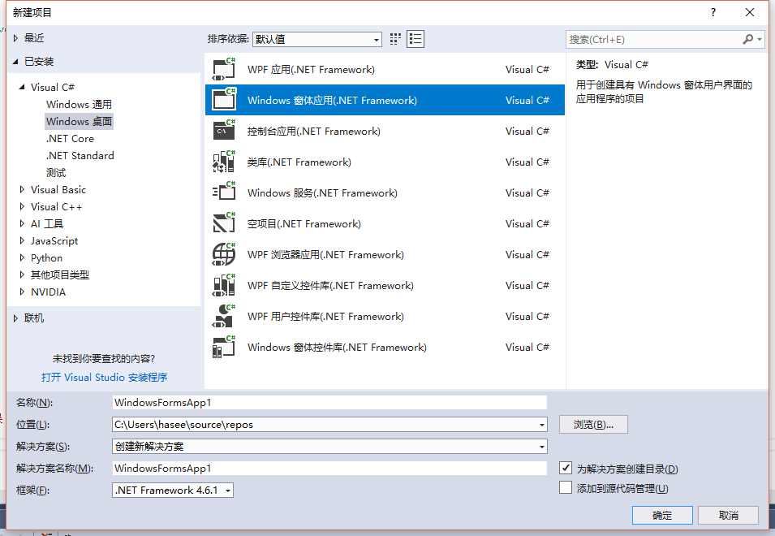
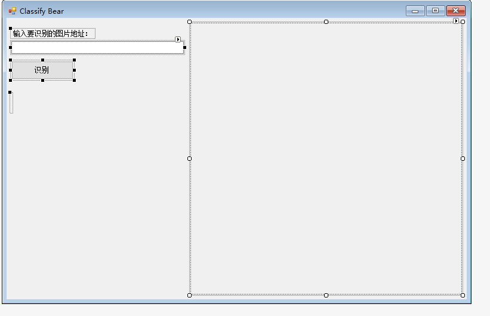
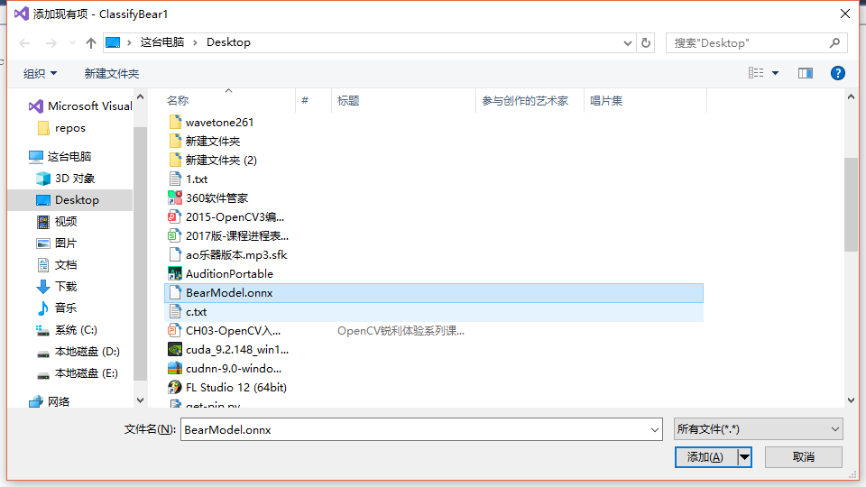
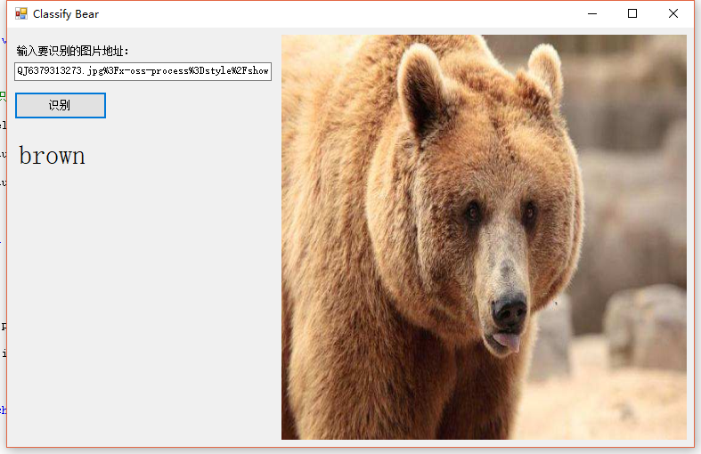
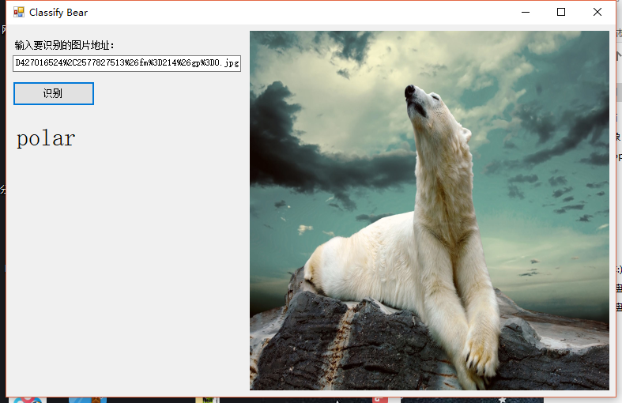
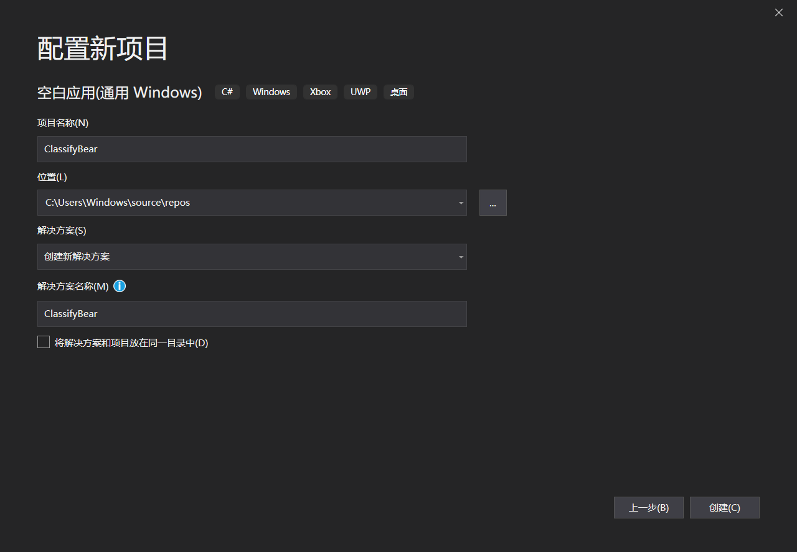
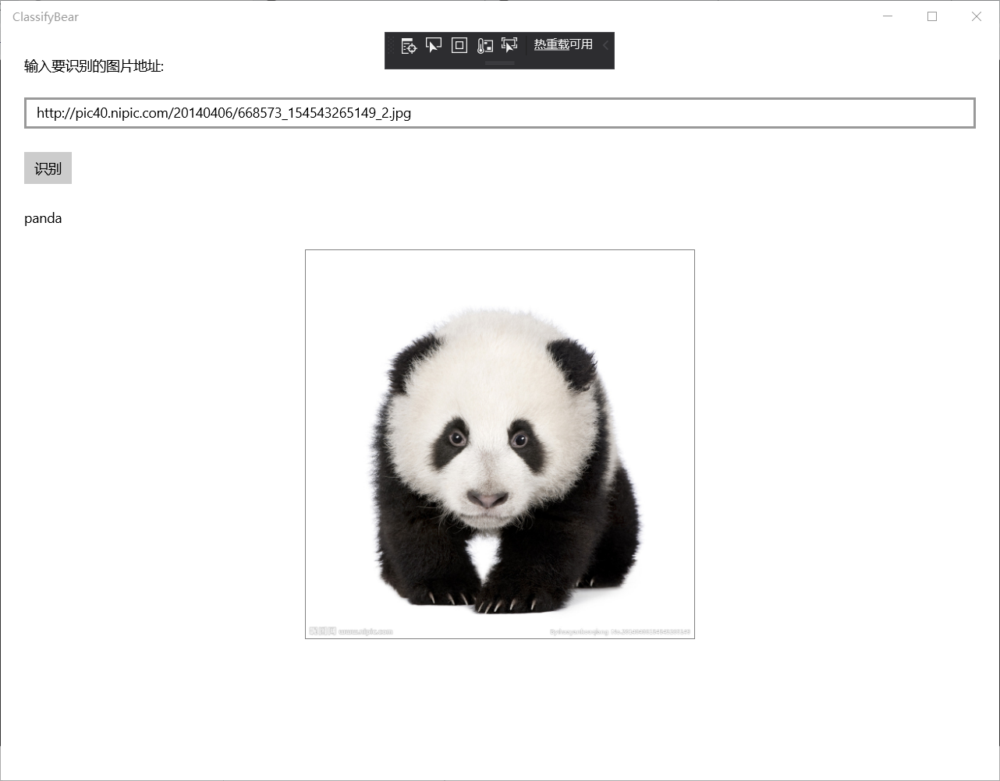
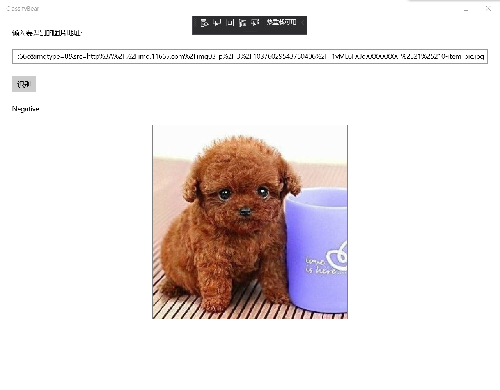

## 第四组

201702053梅振东:调试代码，编写文档，演讲

201702064周思佳:调试代码，编写文档，演讲

201702039吴言艳:调试代码，编写文档

# 看图识熊
## 一.通过OnnxwithRuntime实现看图识熊
操作步骤
  1. 创建项目
  2. 界面设计
   
   在解决方案资源管理器中找到Form1.cs，双击，打开界面设计器。从工具箱中向Form中依次拖入控件并调整，
   最终效果如下图所示：

   左侧从上下到依次是：

   Label控件，将内容改为“输入要识别的图片地址：

   TextBox控件，可以将控件拉长一些，方便输入URL

   Button控件，将内容改为“识别”

   Lable控件，将label的内容清空，用来显示识别后的结果。因为label也没有边框，所以在界面看不出来。可以将此控件的字体调大一些，能更清楚的显示推理结果。
   3. 添加模型文件到项目中
   打开解决方案资源管理器中，在项目上点右键->添加->现有项，在弹出的对话框中，将文件类型过滤器改为所有文件，然后导航到模型所在目录，选择模型文件并添加。本示例中使用的模型文件是BearModel.onnx。
   
   3. 添加OnnxRuntime库
   
   
   4. 在Form1.cs上点右键，选择查看代码，打开Form1.cs的代码编辑窗口。
     添加一个成员变量
     // 使用Netron查看模型，得到模型的输入应为224*224大小的图片
     private const int imageSize = 224; 
     回到Form1的设计界面，双击识别按钮，会自动跳转到代码页面并添加了button1_Click方法，在其中添加以下代码
     label1.Text = string.Empty;
     pictureBox1.Image = null;
     pictureBox1.Refresh();
     后面按照步骤进行就行了

   5. 测试

   棕熊可以识别
   
   北极熊可以识别
   
   熊本熊不能识别
   

## 二.通过OnnxwithWinML实现看图识熊
老师没有要求，在这里略微讲一下步骤：
>1. 安装模型
>2. 新建项目
>3. 修改版本 
>4. 添加模型文件
>5. 修改文件属性
>6. 设计界面 修改MainPage.xaml中的代码

输入框tbImageUrl中用来输入要识别的图片的URL

按钮tbRun用来触发加载图片

文本框tbBearType用来显示识别的结果

图片控件imgBear用来预览要识别的图片，同时，我们也从这个控件中取出对应的图片数据，传给我们的模型推理类库去推理。
>7. 添加按钮的事件响应与添加图片控件的事件响应 在MainPage.xaml.cs添加类

>8. 加载模型并推理
>9. 运行测试

北极熊可以识别

棕熊可以识别

黑熊可以识别

熊猫可以识别

两只熊就不能识别了

狗不能识别

漫画熊不能识别

光头强不能识别

## 总结
本次课学习图像识别，用了一个案例看图识熊,我们组用了两种方法，一个是使用ONNX Runtime封装onnx模型，另一个是使用Windows Machine Learning加载ONNX模型,开始都是配环境，在配环境过程中遇到很多困难，毕竟第一次接触这些，但我们对应问题慢慢解决了，然后开始代码测试，在测试中有好多函数调用不出来，最后发现有些设置没有设置好，弄好后测试成功。最后在网上搜图都识别出来，有的熊识别不出来。这次学习收获颇多，学习了图像识别各个方面的知识，虽然遇到很多困难，但也因为这些丰富了我们的经验。