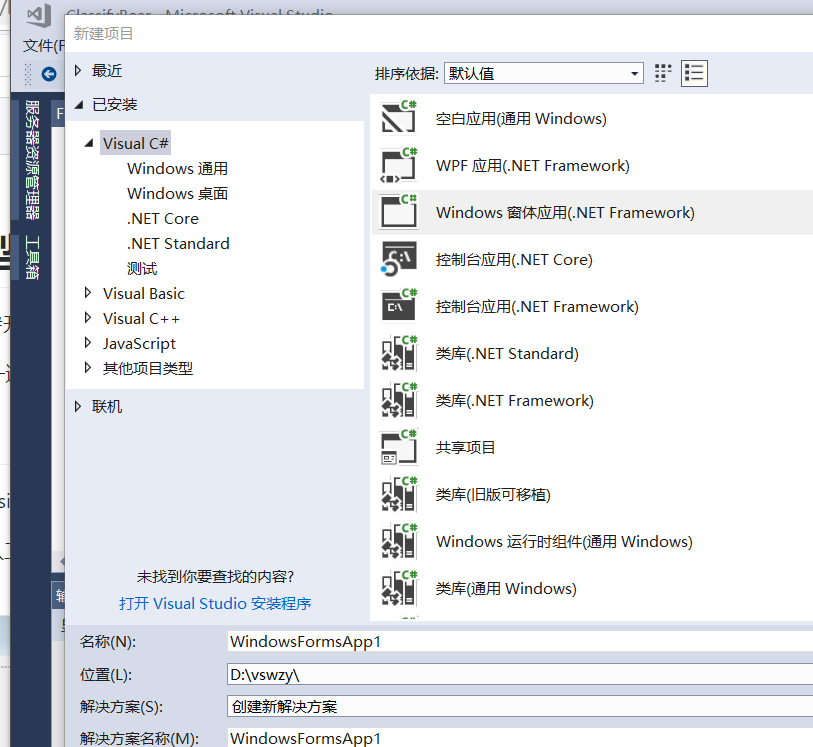
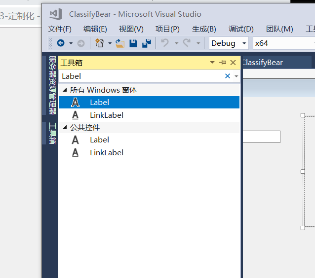
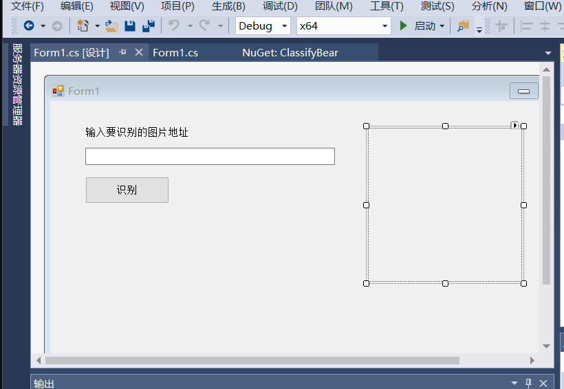
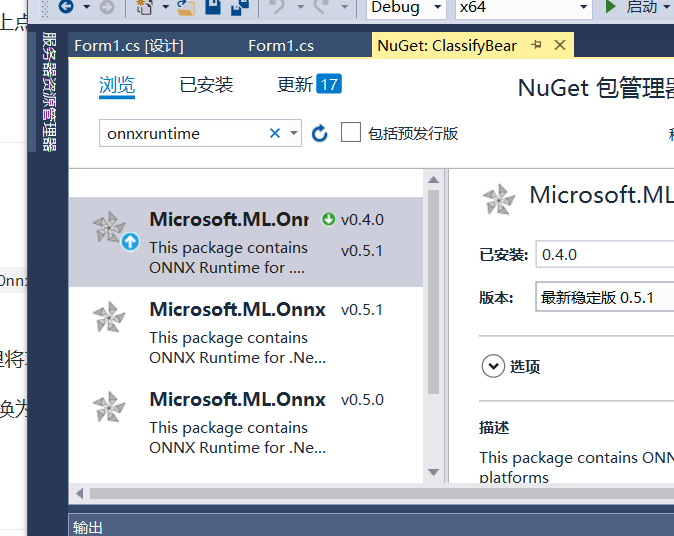
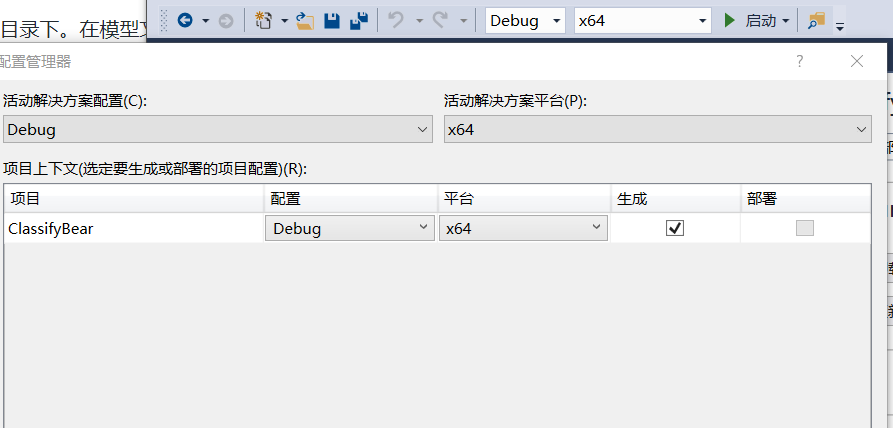
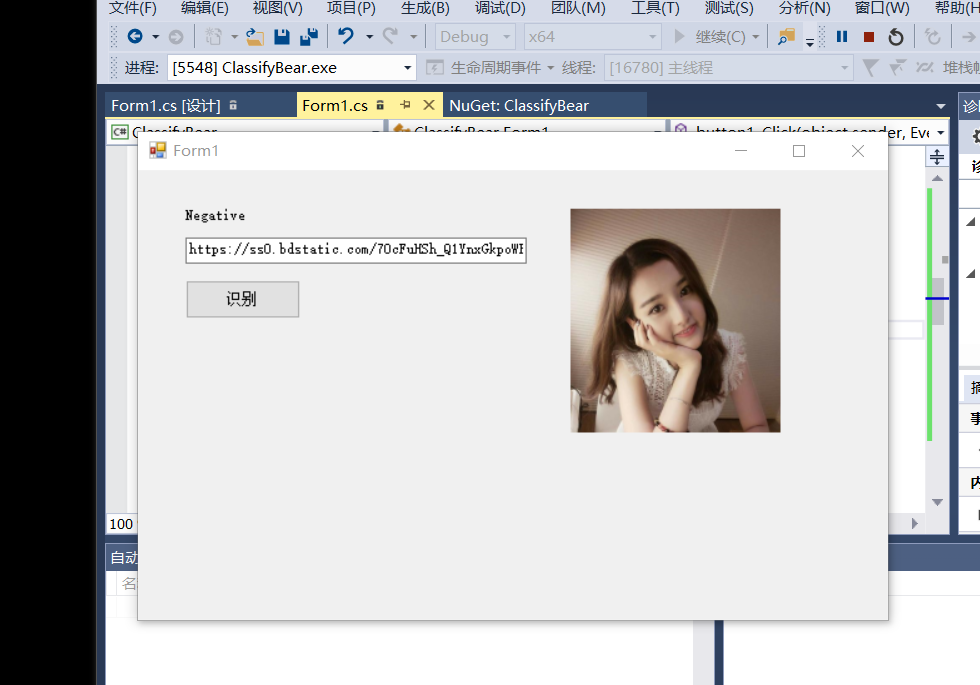

汪佳惠（201702065）任文博（201702062）王振宇（201702464）
# 图像识别案例-看图识熊
## 使用ONNX Runtime封装onnx模型并推理
进行这一步之前，需要安装和配置Visual Studio 2017 和 C#开发环境。
### 步骤
#### 1.界面设计
创建Windows窗体应用(.NET Framework)项目，这里给项目起名ClassifyBear。

在解决方案资源管理器中找到Form1.cs，双击，打开界面设计器。从工具箱中向Form中依次拖入控件并调整

最终效果如下图所示：

#### 2.添加模型文件到项目中

打开解决方案资源管理器中，在项目上点右键->添加->现有项，在弹出的对话框中，将文件类型过滤器改为所有文件，然后导航到模型所在目录，选择模型文件并添加。本示例中使用的模型文件是BearModel.onnx。

模型是在应用运行期间加载的，所以在编译时需要将模型复制到运行目录下。在模型文件上点右键，属性，然后在属性面板上，将生成操作属性改为内容，将复制到输出目录属性改为如果较新则复制。
#### 3.添加OnnxRuntime库
微软开源的OnnxRuntime库提供了NuGet包，可以很方便的集成到Visual Studio项目中。

打开解决方案资源管理器，在引用上点右键，管理NuGet程序包。

在打开的NuGet包管理器中，切换到浏览选项卡，搜索onnxruntime，找到Microsoft.ML.OnnxRuntime包，当前版本是0.4.0，点击安装，稍等片刻，按提示即可完成安装。

当前NuGet发布的OnnxRuntime库支持x64及x86架构的运行库，建议使用x64的，所以这里将项目的目标架构改为x64。

在解决方案上点右键，选择配置管理器。在配置管理器对话框中，将活动解决方案平台切换为x64。如果没有x64，在下拉框中选择新建，按提示新建x64平台。
#### 4.处理输入并加载模型进行推理
在Form1.cs上点右键，选择查看代码，打开Form1.cs的代码编辑窗口。

添加一个成员变量

使用Netron查看模型，得到模型的输入应为224*224大小的图片
private const int imageSize = 224;

回到Form1的设计界面，双击识别按钮，会自动跳转到代码页面并添加了button1_Click方法，在其中添加以下代码：

首先，每次点击识别按钮时都先将界面上显示的上一次的结果清除，识别之前先重置界面显示的内容，然后，让图片控件加载图片

bool isSuccess = false;
try
{
    pictureBox1.Load(textBox1.Text);
    isSuccess = true;
}
catch (Exception ex)
{
    MessageBox.Show($"读取图片时出现错误：{ex.Message}");
    throw;
}

如果加载成功，将图片数据处理成需要的大小，然后加载模型进行推理。
#### 5.测试
编译运行，在地址框内填入图片的地址，点击识别的按钮，就能显示出图片了运行效果图如下所示

## 总结
本节课我们学习了通过使用ONNX Runtime封装onnx模型， ONNX全称是Open Neural Network Exchange，是微软和Facebook发布的一个深度学习开发工具生态系统，旨在让AI开发人员能够随着项目发展而选择正确的工具。ONNX所针对的是深度学习开发生态中最关键的问题之一，在任意一个框架上训练的神经网络模型，无法直接在另一个框架上用。开发者需要耗费大量时间精力把模型从一个开发平台移植到另一个。因此，如何实现不同框架之间的互操作性，简化从研究到生产的路径，成为了重中之重。ONNX的工作原理是：实时跟踪某个神经网络是如何在这些框架上生成的，接着，使用这些信息创建一个通用的计算图，利用ONNX Runtime封装模型具有与ONNX版本保持一致，传统ML支持，高性能，跨平台支持的优点，为我们的学习提供了更加便捷的环境
## 心得体会
通过本次学习，培养了我们的自主学习能力和动手能力，需要我们细心和有足够的耐心，一步一步跟着我已有的资料去做，就能完成