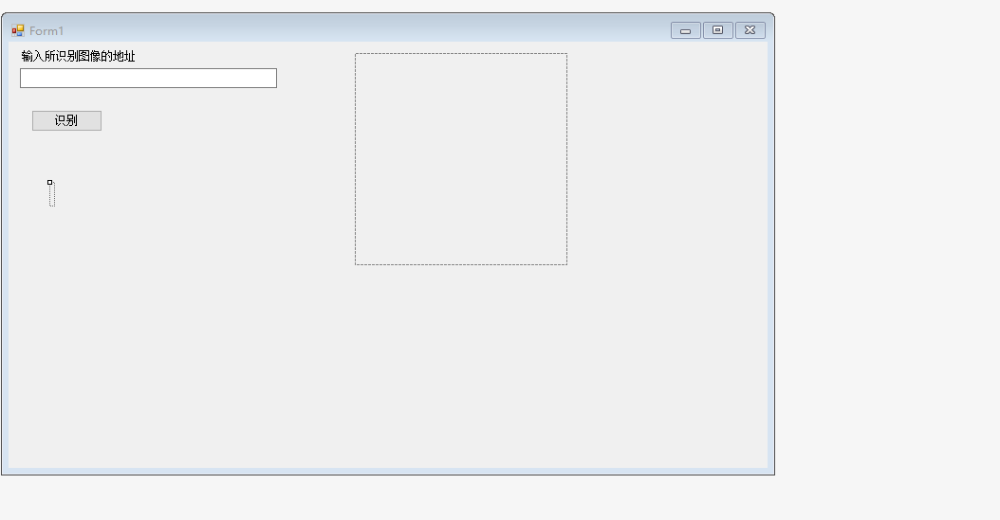
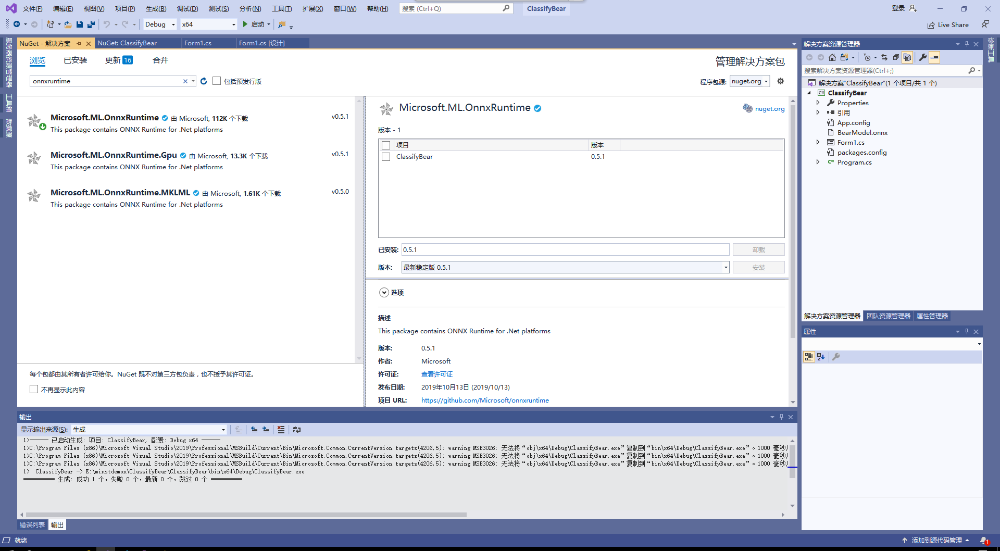
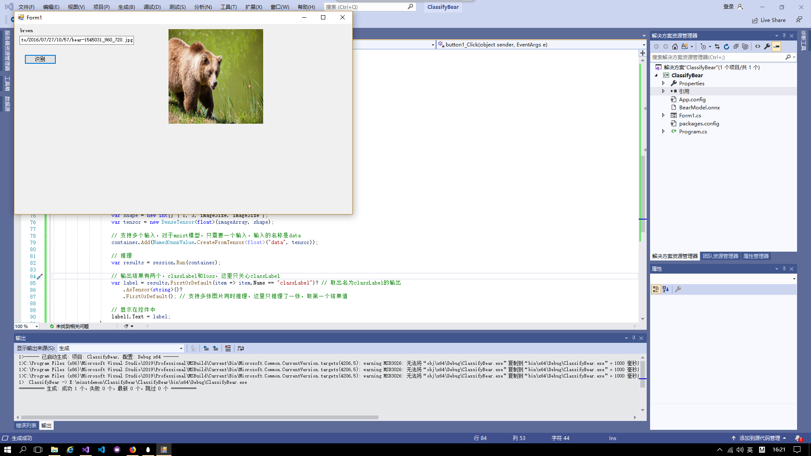

### 傅思康201702042 姜玉辉201702043 罗思201702073
## 使用ONNX Runtime封装onnx模型并推理
### 界面设计
  参考老师所给出的资料，我们完成了最初步的界面设计。

  在Windows窗体应用中打开页面设计器，从工具箱中依次拖出Label控件，TextBox控件和Button控件，最后再加上一个PictureBox用来预览输入的图片。

  同时，也从这个控件中取出对应的图片数据，传给模型推理类库去推理。

  将控件属性的SizeMode更改为StretchImage，并将控件长和宽设置为同样的值，保持一个正方形的形状，这样可以方便直观的了解模型的输入.

  
  ### 添加模型文件到项目中
  打开解决方案资源管理器中，在项目上点右键->添加->现有项，在弹出的对话框中，将文件类型过滤器改为所有文件，然后导航到模型所在目录，选择模型文件并添加。
  
  在编译时需要将模型复制到运行目录下。
  
  在模型文件上点右键，属性，然后在属性面板上，将生成操作属性改为内容，将复制到输出目录属性改为如果较新则复制。

  ### 添加OnnxRuntime库
  打开解决方案资源管理器，在引用上点右键，管理NuGet程序包。

  在打开的NuGet包管理器中，切换到浏览选项卡，搜索onnxruntime，找到Microsoft.ML.OnnxRuntime包，当前版本是0.4.0，点击安装，稍等片刻，按提示即可完成安装。

  在解决方案上点右键，选择配置管理器。在配置管理器对话框中，将活动解决方案平台切换为x64。如果没有x64，在下拉框中选择新建，按提示新建x64平台。
  
  
  ### 处理输入并加载模型进行推理
  在Form1.cs上点右键，选择查看代码，打开Form1.cs的代码编辑窗口。
  将老师所给的代码复制到Form1.cs中，再编译运行，输入图片的地址，点击识别按钮，
  得到的结果为

  

### 总结
  在本次实验中，我们小组通过分工合作顺利完成了本次工程。在添加代码的过程中，遇到了一些问题，大部分是由于没有认真按老师所给资料的过程一步一步完成，过程有所疏忽导致最后运行结果运行不出来。通过老师和同学们的帮助，我们解决了所出现的问题。在运行过程中，遇到了找不到onnxruntime的dll问题，后来才知道是编译时相关库没有拷到运行目录中，要先清理解决方案，然后再重新编译结局方案。也可以手动到解决方案目录