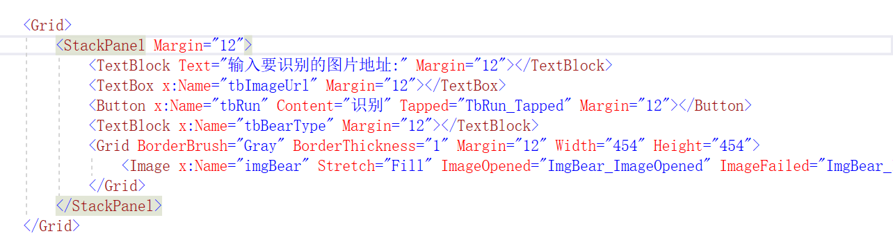
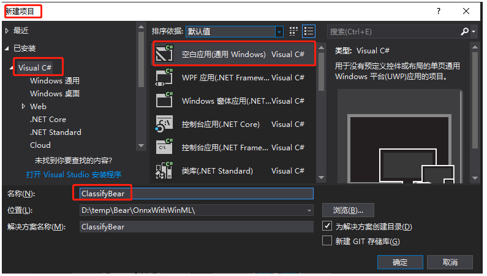
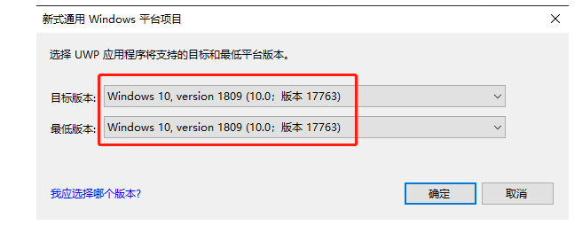
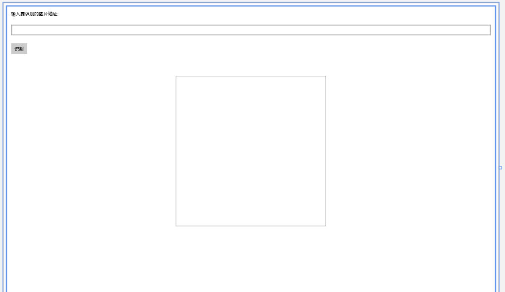
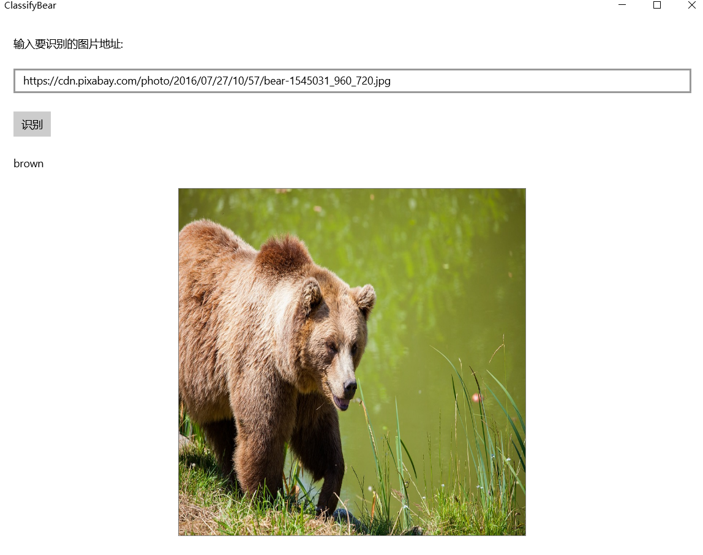
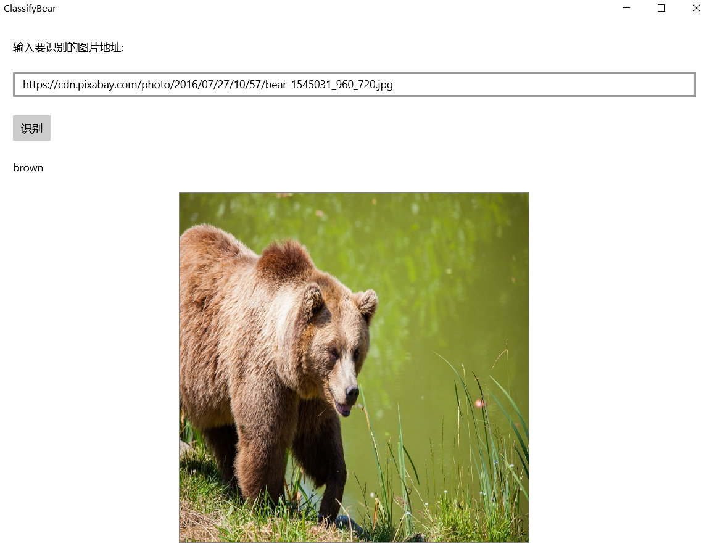
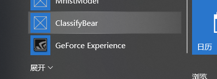

# **第一组**
    201702041chenziliang
    201702075yuminxue
    201702044lixiang

## **总体比较**
### **配置比较**
>AI Tools和ONNXRuntime是一个**Windows窗体应用(.NET Framework)项目**，WinML是**通用windows(ump)**。

>AI Tools其配置较为复杂，是一年前的技术，需要tensorflow,onnx,还得cuda和cudnn。其中里面的版本还是一个学问，不能装错。ONNXRuntime比较容易配置

>ONNXRuntimes方法是需要项目添加onnxruntime0.4.0的。

>WinML不需要做什么。
### **模板比较**
`AI Tools的模板是用cuda训练出来的，文件格式比较复杂`
**ONNXRuntime和WinML的模板简单，都是.onnx的格式**

### **界面设计比较**
>ONNXRuntimes和AI Tools是一样的，可以自己添加工具如pictureBox等，然后对控件编程和实例化，赋予功能。

>WinML是则是编程设计界面的

### **生成结果比较**
>ONNXRuntimes和AI Tools是一样的,是一个窗口，关闭就消失的。

>WinML是一个应用，会在你的系统里面，以后不用开**vs运行**，直接在电脑程序打开就行。

------
**下面是WinML的报告**
## 使用Windows Machine Learning加载ONNX模型并推理

## 环境要求
Windows Machine Learning支持在Windows应用程序中加载并使用训练好的机器学习模型。Windows 10从10.0.17763.0版本开始提供这套推理引擎，所以需要安装17763版本的Windows 10 SDK进行开发，并且需要运行在17763及以上版本的Windows 10中。
## 创建UWP项目
打开Visual Studio ，新建项目，在Visual C#分类中选择空白应用(通用 Windows)，填写项目名称为ClassifyBear，点击确定

在弹出的对话框中，设置目标版本和最低版本都是17763,
当然也可以设置更新版本的。

## 添加模型文件到项目中
打开解决方案资源管理器中，在项目中的Assets目录上点右键->添加->现有项，添加模型文件BearModel.onnx
模型是在应用运行期间加载的，所以在编译时需要将模型复制到运行目录下。在模型文件上点右键，属性，然后在属性面板上，将生成操作属性改为内容，将复制到输出目录属性改为如果较新则复制。

打开解决方案资源管理器，应该可以看到在项目根目录自动生成了和模型同名的代码文件BearModel.cs，里面就是对该模型的一层封装，包括了输入输出的定义、加载模型的方法以及推理的方法。

## 设计界面
打开MainPage.xaml，将整个Grid片段替换为如下代码：
<Grid>
    <StackPanel Margin="12">
        <TextBlock Text="输入要识别的图片地址:" Margin="12"></TextBlock>
        <TextBox x:Name="tbImageUrl" Margin="12"></TextBox>
        <Button x:Name="tbRun" Content="识别" Tapped="TbRun_Tapped" Margin="12"></Button>
        <TextBlock x:Name="tbBearType" Margin="12"></TextBlock>
        <Grid BorderBrush="Gray" BorderThickness="1" Margin="12" Width="454" Height="454">
            <Image x:Name="imgBear" Stretch="Fill" ImageOpened="ImgBear_ImageOpened" ImageFailed="ImgBear_ImageFailed"></Image>
        </Grid>
    </StackPanel>
</Grid>
显示效果如下图：

输入框tbImageUrl中用来输入要识别的图片的URL

按钮tbRun用来触发加载图片

文本框tbBearType用来显示识别的结果

图片控件imgBear用来预览要识别的图片，同时，我们也从这个控件中取出对应的图片数据，传给我们的模型推理类库去推理。这里将图片控件设置为正方形并且将Stretch属性设置为Fill。
## 添加按钮的事件响应
前面XAML文件中给按钮添加事件，这里在MainPage.xaml.cs中完成对应的实现，从输入框中读入图片的URL，然后让图片控件加载该URL对应的图片：
private void TbRun_Tapped(object sender, TappedRoutedEventArgs e)
{
    tbBearType.Text = string.Empty;

    Uri imageUri = null;
    try
    {
        imageUri = new Uri(tbImageUrl.Text);
    }
    catch (Exception)
    {
        tbBearType.Text = "URL不合法";
        return;
    }

    tbBearType.Text = "加载图片...";

    imgBear.Source = new BitmapImage(imageUri);
}
## 添加图片控件的事件响应
前面XAML文件中给图片控件添加了两个事件：图片加载完成的事件和加载失败的事件，这里在MainPage.xaml.cs中完成对应的实现：
private void ImgBear_ImageOpened(object sender, RoutedEventArgs e)
{
    RecognizeBear();
}

private void ImgBear_ImageFailed(object sender, ExceptionRoutedEventArgs e)
{
    tbBearType.Text = "图片加载失败";
}
## 处理模型的输入
打开自动生成的模型封装文件BearModel.cs可以看到需要的输入如下：
public sealed class BearModelInput
{
    public ImageFeatureValue data; // BitmapPixelFormat: Bgra8, BitmapAlphaMode: Premultiplied, width: 227, height: 227
}

下面是处理图片输入的代码：
private async Task<BearModelInput> GetInputData()
{
    // 将图片控件重绘到图片上
    RenderTargetBitmap rtb = new RenderTargetBitmap();
    await rtb.RenderAsync(imgBear);

    // 取得所有像素值
    var pixelBuffer = await rtb.GetPixelsAsync();

    // 构造模型需要的输入格式
    SoftwareBitmap softwareBitmap = SoftwareBitmap.CreateCopyFromBuffer(pixelBuffer, BitmapPixelFormat.Bgra8, rtb.PixelWidth, rtb.PixelHeight);
    VideoFrame videoFrame = VideoFrame.CreateWithSoftwareBitmap(softwareBitmap);
    ImageFeatureValue imageFeatureValue = ImageFeatureValue.CreateFromVideoFrame(videoFrame);

    BearModelInput bearModelInput = new BearModelInput();
    bearModelInput.data = imageFeatureValue;
    return bearModelInput;
}
## 加载模型并推理
自动生成的模型封装文件BearModel.cs中已经封装了加载模型的方法和推理的方法，直接调用就可以：
private async void RecognizeBear()
{
    // 加载模型
    StorageFile modelFile = await StorageFile.GetFileFromApplicationUriAsync(new Uri($"ms-appx:///Assets/BearModel.onnx"));
    BearModelModel model = await BearModelModel.CreateFromStreamAsync(modelFile);

    // 构建输入数据
    BearModelInput bearModelInput = await GetInputData();

    // 推理
    BearModelOutput output = await model.EvaluateAsync(bearModelInput);

    tbBearType.Text = output.classLabel.GetAsVectorView().ToList().FirstOrDefault();
}
## 测试及结果展示
编译运行，然后在网上找一张熊的图片，把地址填到输入框内，然后点击识别按钮，就可以看到识别的结果了。注意，这个URL应该是图片的URL，而不是包含该图片的网页的URL。

生成应用项目
