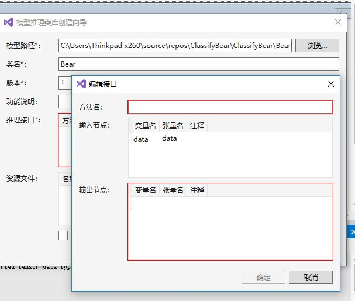
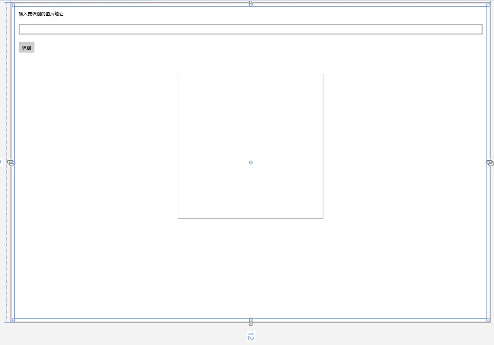
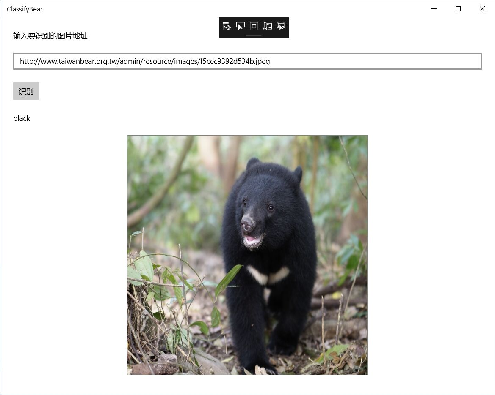
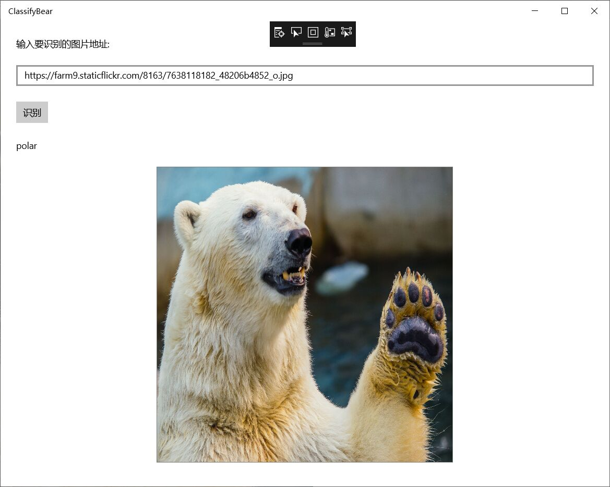

###     20191018第二次小组实验
 小组成员：wx，bianxr，lixuanyu
 学号：201702052，201702061，201702050
  
     本次课的主要内容是用onnxWithRuntime,onnxWithToolsforAi,OnnxWithWinML
     这三种方法实现看图识熊。并比较这三种方式，了解各种方法的优缺点。由于
     onnxWithRuntime的方法上节课已经实现，所以本次报告着重介绍onnxWithToolsforAi,
     OnnxWithWinML这两种方式，以及他们之间的区别。本次实验也是分小组进行的，
     我们将组内分工好后，开始了今天的实验。

#### 一 用onnxWithToolsforAi实现看图识熊
* 实验步骤总结：
1. 界面设计
   首先创建一个新项目（ 注意，项目路径不要包含中文），打开界面设计，将工具箱中向Form中依次拖入Label，TextBox，Button，PictureBox控件并调整。其中PictureBox控件来预览输入的图片，同时，我们也从这个控件中取出对应的图片数据，传给我们的模型推理类库去推理。建议将控件属性的SizeMode更改为StretchImage，并将控件长和宽设置为同样的值，保持一个正方形的形状，这样可以方便我们直观的了解模型的输入。

   

2. 封装模型推理类库
首先需要将解决方案平台设置为x64，将类名输入框中填入模型推理类的名字，这里用Bear。然后点击推理接口，在弹出的编辑接口对话框中，随便起个方法名，这里用Infer。输入节点的变量名和张量名填入data，输出节点的变量名和张量名填入classLabel，字母拼写要和之前查看模型时看到的拼写一模一样。然后就可以在解决方案资源管理器看到新建的模型推理类库了。



3. 使用模型推理类库
在添加对模型推理类库的引用后，打开Form1.cs的代码编辑窗口，添加两个成员变量。
首先要得到模型输入的大小为227 * 227的图片，然后建立模型推理类，这一步骤的代码是：
```c++
private const int imageSize = 227;
private Model.Bear model;
```
随后初始化模型推理对象，这一步骤的代码是：
```c++
private void Form1_Load(object sender, EventArgs e)
{
    model = new Model.Bear();
}
```
之后将button中添加button_click代码，只要是让button拥有每次点击识别按钮时都先将界面上显示的上一次的结果清除的功能。然后让图片控件加载图片，如果加载成功，将图片数据传给模型推理类库来推理。注意，这里的数据转换一定要按照前面查看的模型的信息来转换，图片大小需要长宽都是227像素，并且要依次放置所有的蓝色分量、所有的绿色分量、所有的红色分量，如果顺序不正确，不能达到最佳的推理结果。
最后编译运行测试，选择一张熊的图片，把地址填到输入框内，就可以看到识别结果。
* 实验总结
     
     本次实验我们按照所归纳的步骤一步步进行，但是最后还是有很多报错，在仔细对照之后，我们小组没法解决报错的问题，最后通过老师的讲解了解到AI tools配置非常复杂，且对操作系统版本号有很高的要求，我们电脑的配置跟它的要求有很大差别，另外，有些同学的电脑没有独立显卡，仅有集成显卡，也导致配置时关于英伟达显卡配置无法操作。虽然本次尝试最终没有得到良好的结果，但我们储备了一些Al tools的经验。


#### 二 用OnnxWithWinML实现看图识熊
* 实验步骤总结：
1. 创建UWP项目并添加模型文件到项目中：
   首先如前两次试验一样创建一个空白应用，然后将assets上添加模型文件BearModel.cs，BearModel.cs里面就是对该模型的一层封装，包括了输入输出的定义、加载模型的方法以及推理的方法。

2. 设计界面
   替换所给的代码，输入框tbImageUrl中用来输入要识别的图片的URL按钮tbRun用来触发加载图片文本框tbBearType用来显示识别的结果图片控件imgBear用来预览要识别的图片，同时，我们也从这个控件中取出对应的图片数据，传给我们的模型推理类库去推理。这里将图片控件设置为正方形并且将Stretch属性设置为Fill，可以保证图片拉伸显示为一个正方形的形状，这样可以方便我们直观的了解模型的输入，因为在前面查看模型信息的时候也看到了，该模型的输入图片应是227*227的正方形。上面的XAML片段中分别给按钮和图片控件添加了事件响应。
   
3. 添加按钮和图片控件的事件响应
   在MainPage.xaml.cs读入图片的URL，然后让图片控件加载该URL对应的图片。这是按钮对事件的响应。
   想要添加图片控件的事件相应，需要一个ImageFeatureValue类型的数据，可以使用ImageFeatureValue.CreateFromVideoFrame从VidelFrame中创建。使用ImageFeatureValue时，你可以不用担心图片格式的转换和缩放，系统会自动处理图片来匹配模型需要的输入格式。
4. 加载模型并推理
   自动生成的模型封装文件BearModel.cs中已经封装了加载模型的方法和推理的方法，直接调用就可以，这是最关键的一步，主要代码是：
   ```c++
   private async void RecognizeBear()
   {
   StorageFile modelFile = await StorageFile.GetFileFromApplicationUriAsync(new Uri($"ms-appx:///Assets/BearModel.onnx"));
   BearModelModel model = await BearModelModel.CreateFromStreamAsync(modelFile);
   BearModelInput bearModelInput = await GetInputData();
   BearModelOutput output = await model.EvaluateAsync(bearModelInput);
   tbBearType.Text = output.classLabel.GetAsVectorView().ToList().FirstOrDefault();
   }     
   ```

5. 最后运行成功的结果如图：
   
   

* 实验总结：
      
      本次实验我们运用OnnxWithWinML实现了看图识熊，由于有了前两次的经验，对代码和每个步骤的目的有了更清楚的理解，所以这一次做起来比较顺利。利用OnnxWithWinML实现的程序可以直接在windows下生成一个软件，我们可以直接启动该程序进行识别操作，而不需要再次启动vs的调试操作。


#### 三次看图识熊实验的对比分析
 第一次看图识熊实验是在ONUX Runtime封装的环境下，通过Machine Learning来实现对活熊的识别，据实测，仅仅黑熊、棕熊、北极熊、熊猫可识别，而卡通熊无法识别。主要是添加OnnxRuntime库，在这个库里处理输入并加载模型进行推理。OnnxRuntime库的是用于各种ML和DNN框架和工具支持的机器学习模型的互操作格式。通用格式使框架之间的互操作变得更容易，并最大程度地扩大了硬件优化投资的范围。微软在开源代码中提供了大量框架和引擎。第一个是开放式神经网络交换（ONNX）Runtime，这是一种用于ONNX格式的机器学习模型的高性能推理引擎。它可从GitHub上获取，可以自定义并直接集成到现有代码库中，或者从源代码编译，在Windows 10，Linux和各种其他操作系统上运行。ONNX对于深度学习模型来说，是一种platform-agnostic格式，可以实现开源AI框架之间的互操作性，例如谷歌的TensorFlow，微软的Cognitive Toolkit，Facebook的Caffe2和Apache的MXNet。微软，AWS和Facebook在大约一年前于2017年9月联合发布了应用，亚马逊，Nvidia，英特尔和AMD等公司正在对其进行积极的开发。
 第二次使用Windows Machine Learning加载ONNX模型来实现对熊的识别，并可以生成独立的一个程序，加载并使用训练好的机器模型来进行识图工作，两者原理相近。但是AI tools这个由于操作系统的版本问题不符合要求而不能进行，故只能通过看代码来理解原理。
 这三个onnxWithRuntime是体验定制化视觉服务，onnxWithToolsforAi是体验AI集成开发环境，OnnxWithWinML是体验离线模型推理应用。
 

#### 课程总结
     这节课我们主要用了OnnxWithWinML和onnxWithToolsforAi两种方式来实现看图识熊功能，
     虽然onnxWithToolsforAi这种方式的库存在很多漏洞，我们最终没能成功运行，但实际上
     我们的目的是通过按照步骤一步步操作的过程中了解这种方法，如果光凭步骤来看，肯定
     没有自己亲自做一遍理解的深入。所以最后即使没有做出来，我们也很有收获。掌握了
     这三种看图识熊的方法，让我们对人工智能有了更加深刻的理解。我们小组三个成员之间
     每个人都起了很大的作用，我们各自分工，完成自己负责的部分，合作的非常愉快。
     也学习到了很多，知道了团队合作的重要性。
