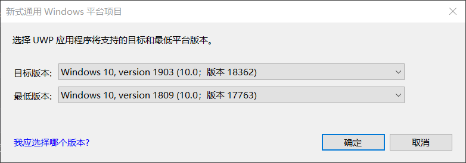
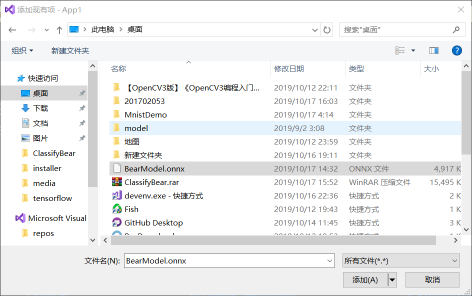
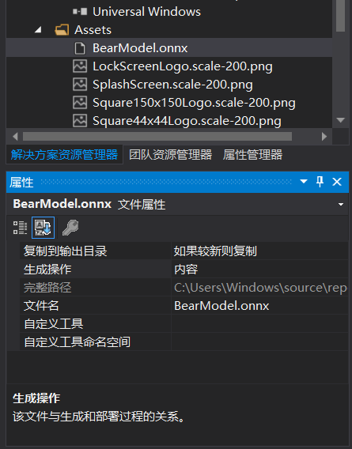
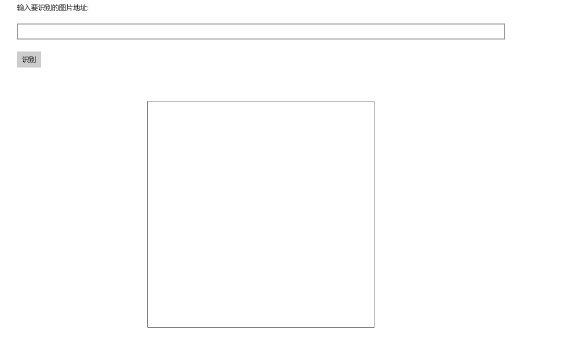
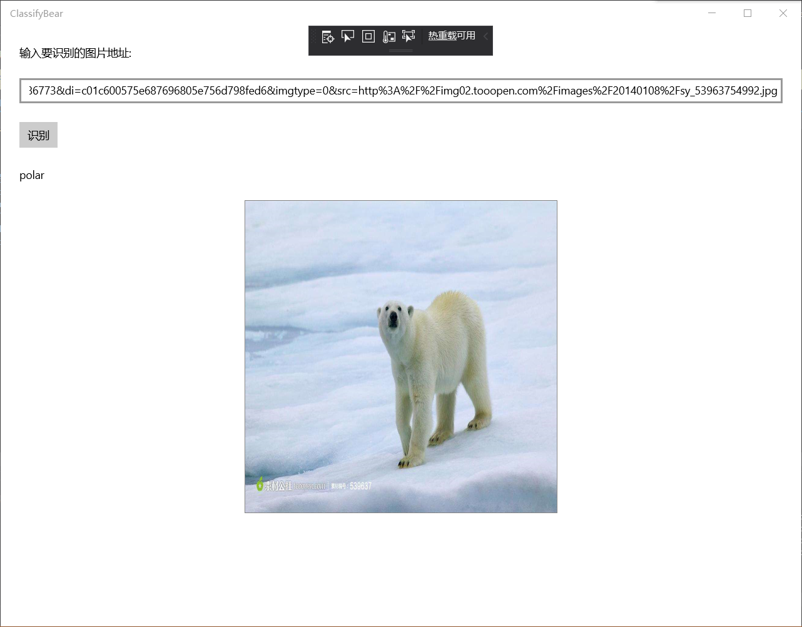
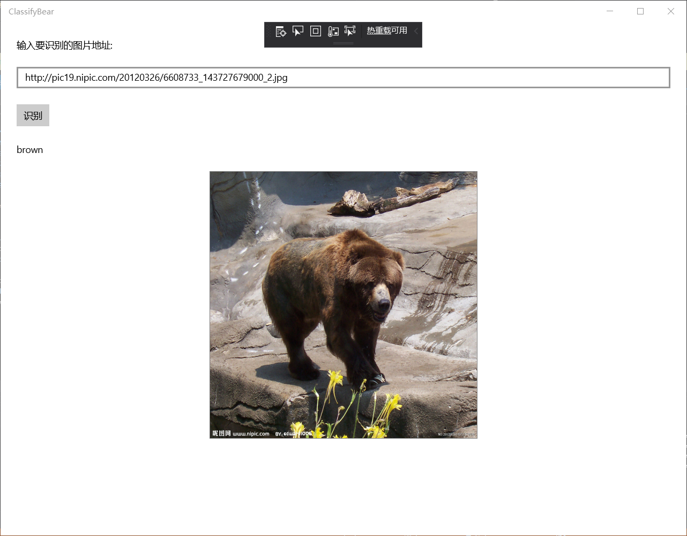
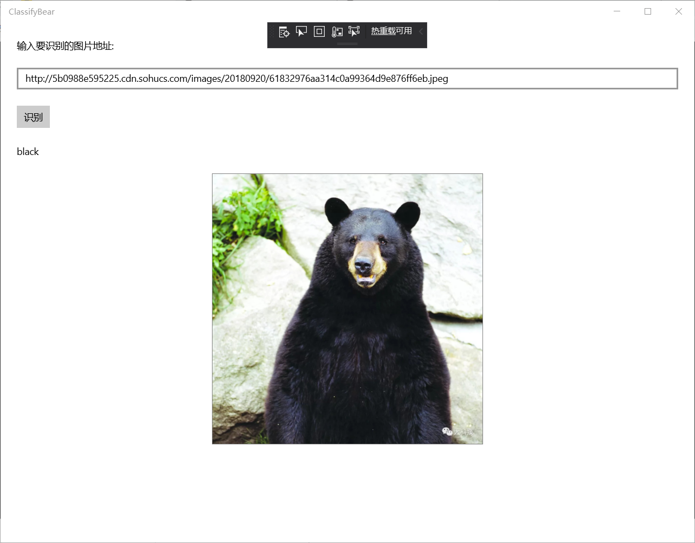
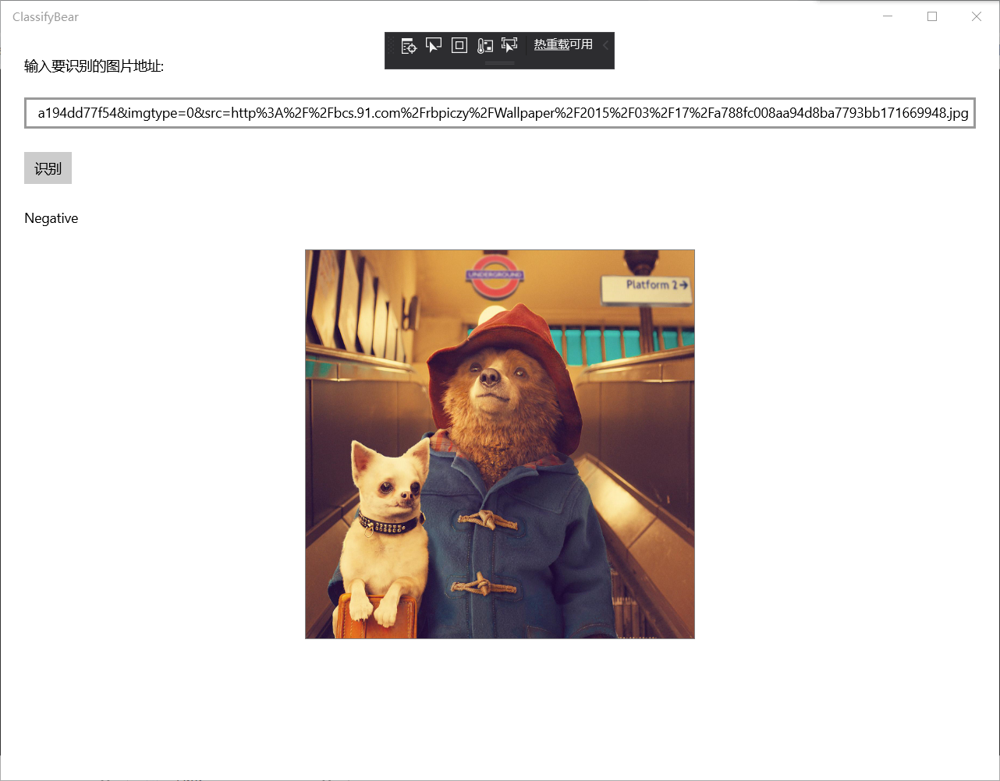

## 第四组

201702053梅振东

201702064周思佳

201702039吴言艳

# 看图识熊
## 一.使用Windows Machine Learning加载ONNX模型并推理
步骤：
>1. 安装模型

>2. 创建UWP项目

打开Visual Studio 2017，新建项目，在Visual C#分类中选择空白应用(通用 Windows)，填写项目名称为ClassifyBear，点击确定。

>3. 修改版本 ：
在弹出的对话框中，设置目标版本和最低版本：

>4. 添加模型文件：
打开解决方案资源管理器中，在项目中的Assets目录上点右键->添加->现有项，添加模型文件BearModel.onnx。

>5. 修改文件属性：
在模型文件上点右键，属性，然后在属性面板上，将生成操作属性改为内容，将复制到输出目录属性改为如果较新则复制。

打开解决方案资源管理器，应该可以看到在项目根目录自动生成了和模型同名的代码文件BearModel.cs，里面就是对该模型的一层封装，包括了输入输出的定义、加载模型的方法以及推理的方法。
>6. 设计界面 修改MainPage.xaml中的代码，将整个Grid片段修改替换，然后出现下图

输入框tbImageUrl中用来输入要识别的图片的URL

按钮tbRun用来触发加载图片

文本框tbBearType用来显示识别的结果

图片控件imgBear用来预览要识别的图片，同时，我们也从这个控件中取出对应的图片数据，传给我们的模型推理类库去推理。
>7. 添加按钮的事件响应与添加图片控件的事件响应 在MainPage.xaml.cs添加TbRun_Tapped类，在MainPage.xaml.cs中完成对应的实现，从输入框中读入图片的URL，然后让图片控件加载该URL对应的图片；前面XAML文件中给图片控件添加了两个事件：图片加载完成的事件（ImgBear_ImageOpened）和加载失败的事件（ImgBear_ImageFailed）；打开自动生成的模型封装文件BearModel.cs，添加ImageFeatureValue类型的数据；然后输入处理图片的代码。
>8. 加载模型并推理：自动生成的模型封装文件BearModel.cs中已经封装了加载模型的方法和推理的方法，直接调用就可以
>9. 运行测试

北极熊可以识别

棕熊可以识别

黑熊可以识别

熊猫可以识别

两只熊就不能识别了

狗不能识别

漫画熊不能识别

## 比较与总结
本次学习使用Windows Machine Learning加载ONNX模型并推理，跟上次学习的使用ONNX Runtime封装onnx模型些许不同，但开始创建项目中WindowsML选择的是空白应用(通用 Windows），而另一个选择Windows窗体应用(.NET Framework)项目，后面的设置目标版本和最低版本基本上是一样的，添加模型文件到项目中过程也基本一样。然后ONNX Runtime需要添加库，另一个直接设计界面。ONNX Runtime需要打开Form1.cs的代码编辑窗口，WindowsML需要添加事件。输入的代码不同，因为用的项目不同，出来的界面也有所不同。这次实验，我们小组在操作的过程时，遇到一些问题，在测试的时候直接粘贴网页的图片，从而测试不出来，因为这个URL应该是图片的URL，而不是包含该图片的网页的URL。不能直接在网页粘贴，要打开图片才能粘贴，才能测试成功。其他还有一些小的问题，但重新再做一次就解决了。然后，我们在这次学习中，学习到如何用不同的方法加载onnx模型，也在操作中了解这两个方法的不同，对于这次学习我们收获颇多。

