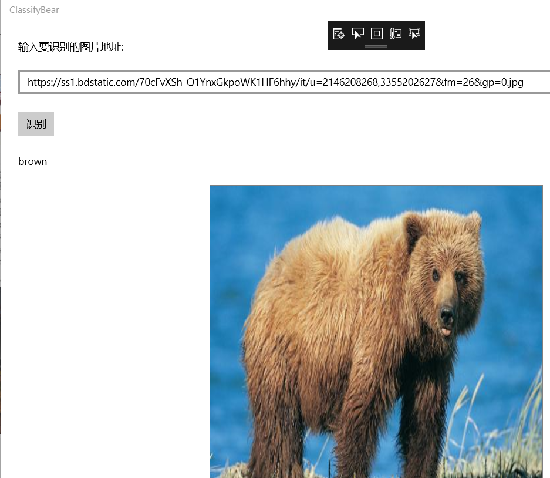
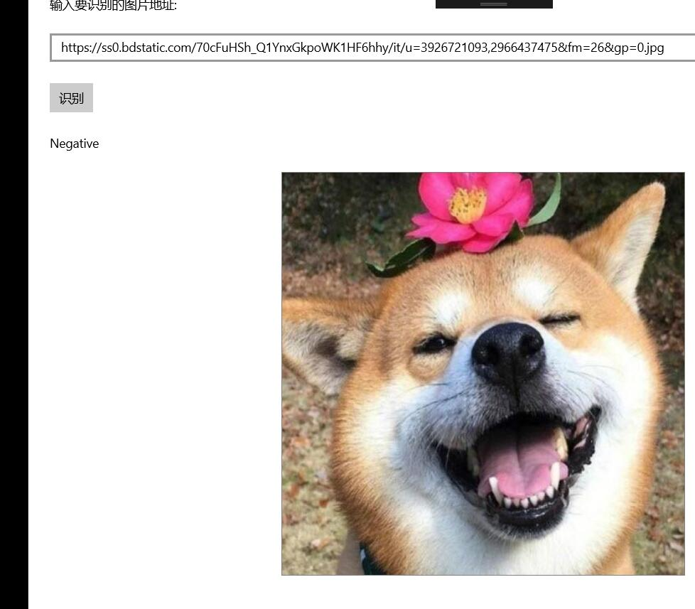
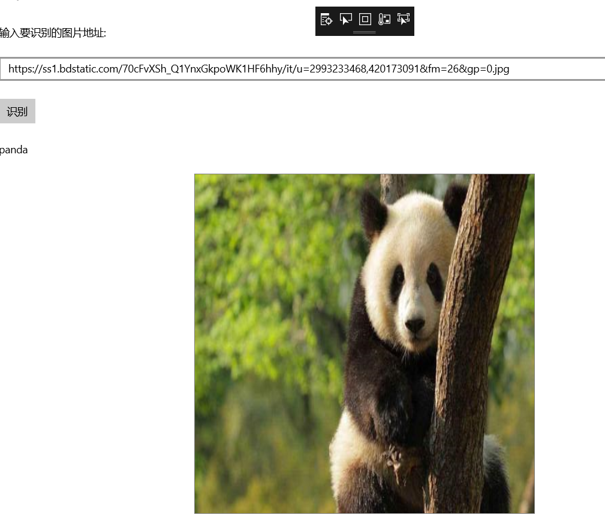
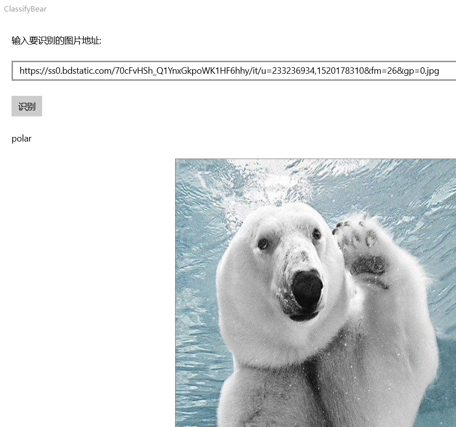

# 图像识别案例-看图识熊
## 使用Windows Machine Learning加载ONNX模型并推理
### 实验步骤
#### 环境要求

Windows Machine Learning支持在Windows应用程序中加载并使用训练好的机器学习模型。Windows 10从10.0.17763.0版本开始提供这套推理引擎，所以需要安装17763版本的Windows 10 SDK进行开发，并且需要运行在17763及以上版本的Windows 10中。
#### 创建UWP项目

打开Visual Studio 2017，新建项目，在Visual C#分类中选择空白应用(通用 Windows)，填写项目名称为ClassifyBear，点击确定

在弹出的对话框中，设置目标版本和最低版本都是17763

#### 添加模型文件到项目中

打开解决方案资源管理器中，在项目中的Assets目录上点右键->添加->现有项，添加模型文件BearModel.onnx

模型是在应用运行期间加载的，所以在编译时需要将模型复制到运行目录下。在模型文件上点右键，属性，然后在属性面板上，将生成操作属性改为内容，将复制到输出目录属性改为如果较新则复制。

打开解决方案资源管理器，应该可以看到在项目根目录自动生成了和模型同名的代码文件BearModel.cs，里面就是对该模型的一层封装，包括了输入输出的定义、加载模型的方法以及推理的方法。
如果在解决方案资源管理器中没有看到该文件，说明生成失败，失败的原因可能是路径中包含中文、或者onnx模型不合法、或者其它原因，可以尝试手动生成。生成成功后，可以手动将生成的BearModel.cs添加项目中；如果还是生成失败，需要根据错误信息继续排查原因
#### 设计页面
输入框tbImageUrl中用来输入要识别的图片的URL

按钮tbRun用来触发加载图片

文本框tbBearType用来显示识别的结果
    
图片控件imgBear用来预览要识别的图片，同时，我们也从这个控件中取出对应的图片数据，传给我们的模型推理类库去推理。这里将图片控件设置为正方形并且将Stretch属性设置为Fill，可以保证图片拉伸显示为一个正方形的形状，这样可以方便我们直观的了解模型的输入，因为在前面查看模型信息的时候也看到了，该模型的输入图片应是227*227的正方形。
#### 添加按钮的事件响应
#### 添加图片控件的事件响应
#### 加载模型并推理
#### 测试
#### 编译运行，把地址填入框内，然后点击识别按钮，就可以看到识别的按钮，运行效果图如下所示

## 总结
本节课学习了使用Windows Machine Learning加载ONNX模型并推理，和上次课的使用ONNX Runtime封装onnx模型大致流程差不多，但是有些细节不同，我觉得主要的不同是在设计页面上，使用ONNX Runtime封装onnx模型是要先通过界面设计器，从工具箱向Form中依次拖入控件来进行页面的设计，而使用windows machine learning是通过改写Mainpage.xaml中的gide，来直接设计显示页面，在加载模型的过程中，自动生成的封装文件中已经封装了加载模型的方法和推理的方法，可以直接调用
