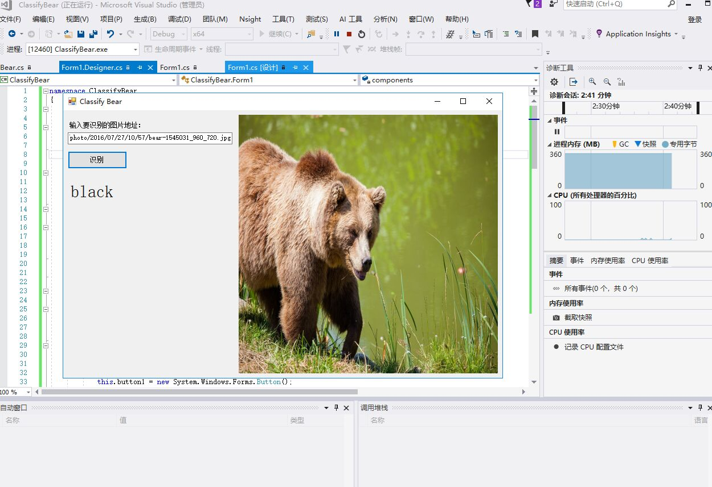
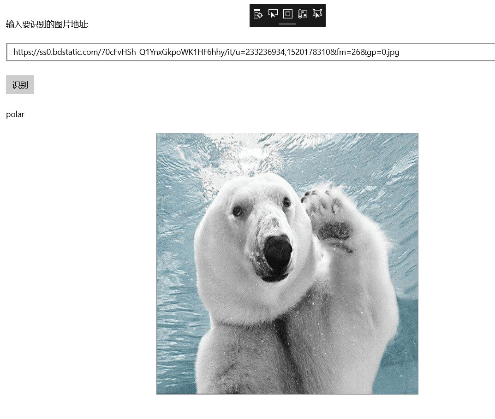
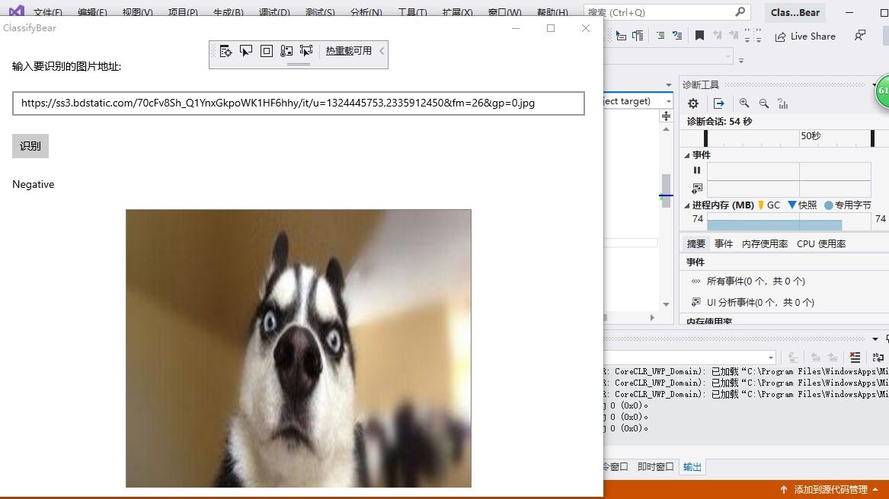
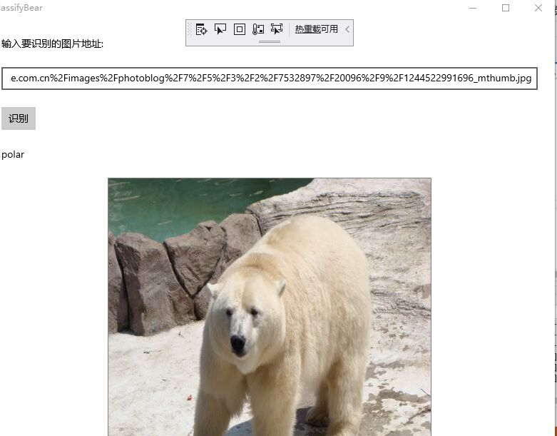
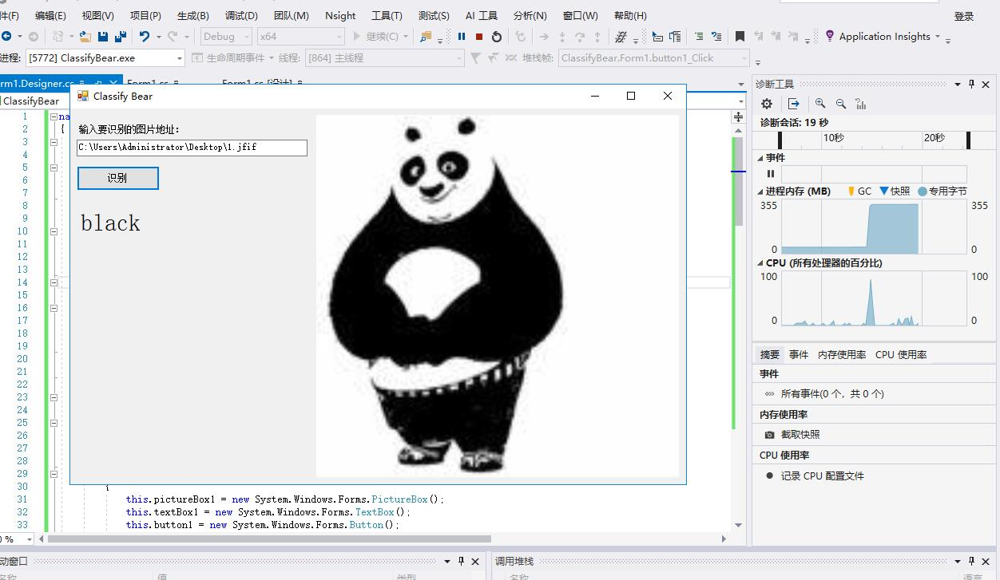

### 傅思康201702042 姜玉辉201702043 罗思201702073

## 使用Windows Machine Learning加载ONNX模型推理
### 环境要求
Windows Machine Learning支持在Windows应用程序中加载并使用训练好的机器学习模型。Windows 10从10.0.17763.0版本开始提供这套推理引擎，所以需要安装17763版本的Windows 10 SDK进行开发，并且需要运行在17763及以上版本的Windows 10中。
### 创建UWP项目
  打开Visual Studio 2017，新建项目，在Visual C#分类中选择空白应用(通用 Windows)，填写项目名称为ClassifyBear，点击确定

### 添加模型文件到项目中
打开解决方案资源管理器中，在项目中的Assets目录上点右键->添加->现有项，添加模型文件BearModel.onnx
模型是在应用运行期间加载的，所以在编译时需要将模型复制到运行目录下。在模型文件上点右键，属性，然后在属性面板上，将生成操作属性改为内容，将复制到输出目录属性改为如果较新则复制。

打开解决方案资源管理器，应该可以看到在项目根目录自动生成了和模型同名的代码文件BearModel.cs，里面就是对该模型的一层封装，包括了输入输出的定义、加载模型的方法以及推理的方法。
### 设计界面

## 比较AI Tools、ONNX Runtime、WinML
### 界面设计
AI Tools与ONNX Runtime，WinMl的界面设计一致
### 封装模型推理类
AI Tools：添加新项目对话框中，将左侧目录树切换到AI Tools下的Inference，右侧选择模型推理类库，下方填入项目名称，这里用Model作为名称。确定以后会出现检查环境的进度条，耐心等待一会就可以出现模型推理类库创建向导对话框。点击模型路径后面的浏览按钮，选择前面下载的BearModel.onnx模型文件。

确定后如果弹出“正在创建项目…”的进度条，一直不消失，这里只需要在类名后面的输入框内点一下，切换下焦点即可。

ONNX Runtime：先将模型添加到项目中，再添加OnnxRuntime库，在打开的NuGet包管理器中，切换到浏览选项卡，搜索onnxruntime，找到Microsoft.ML.OnnxRuntime包，当前版本是0.4.0，点击安装，稍等片刻，按提示即可完成安装。

### 使用模型推理类库
AI Tools：首先添加对模型推理类库的引用，切换到解决方案资源管理器，在ClassifyBear项目的引用上点右键，选择添加引用。在弹出的引用管理器对话框中，选择项目、解决方案，右侧可以看到刚刚创建的模型推理类库，勾选该项目，点击确定即可。再在Form1.cs中添加代码,再运行代码

ONNX Runtime：处理输入并加载模型进行推理，在Form1.cs中添加代码，运行其结果

WinML：先添加按钮事件，在XAML文件中给按钮添加事件，这里在MainPage.xaml.cs中完成对应的实现，从输入框中读入图片的URL，然后让图片控件加载该URL对应的图片。再添加图片控件的事件响应，在XAML文件中给图片控件添加了两个事件：图片加载完成的事件和加载失败的事件，这里在MainPage.xaml.cs中完成对应的实现。再进行加载模型并推理，这是最关键的一步，也是非常简单的一步。自动生成的模型封装文件BearModel.cs中已经封装了加载模型的方法和推理的方法，直接调用就可以，再运行程序即可

### 总结
 通过本节课的学习，我们小组完成了本次课题的要求。分工合作提高了小组的效率也让我们能学习更多的知识。
