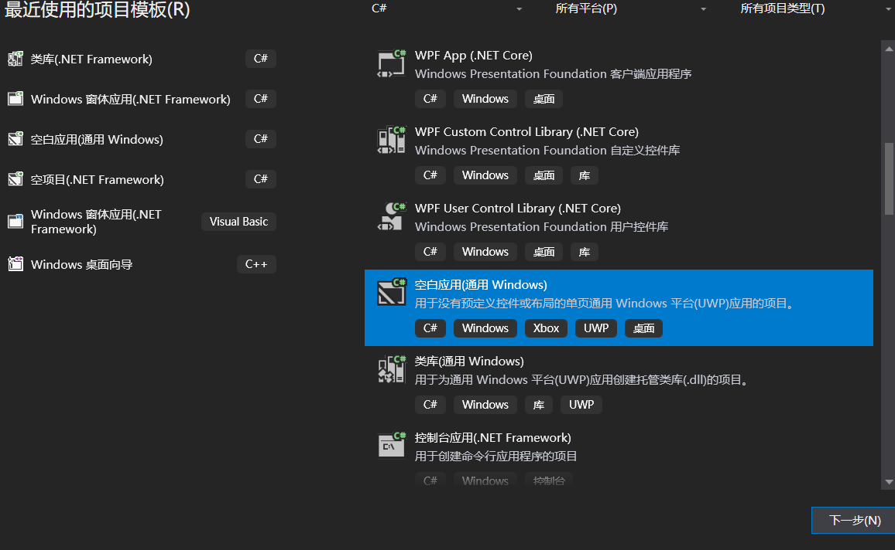
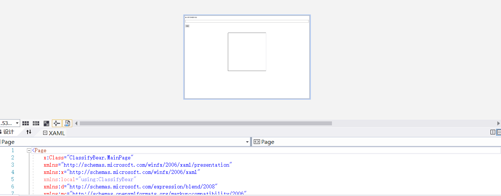
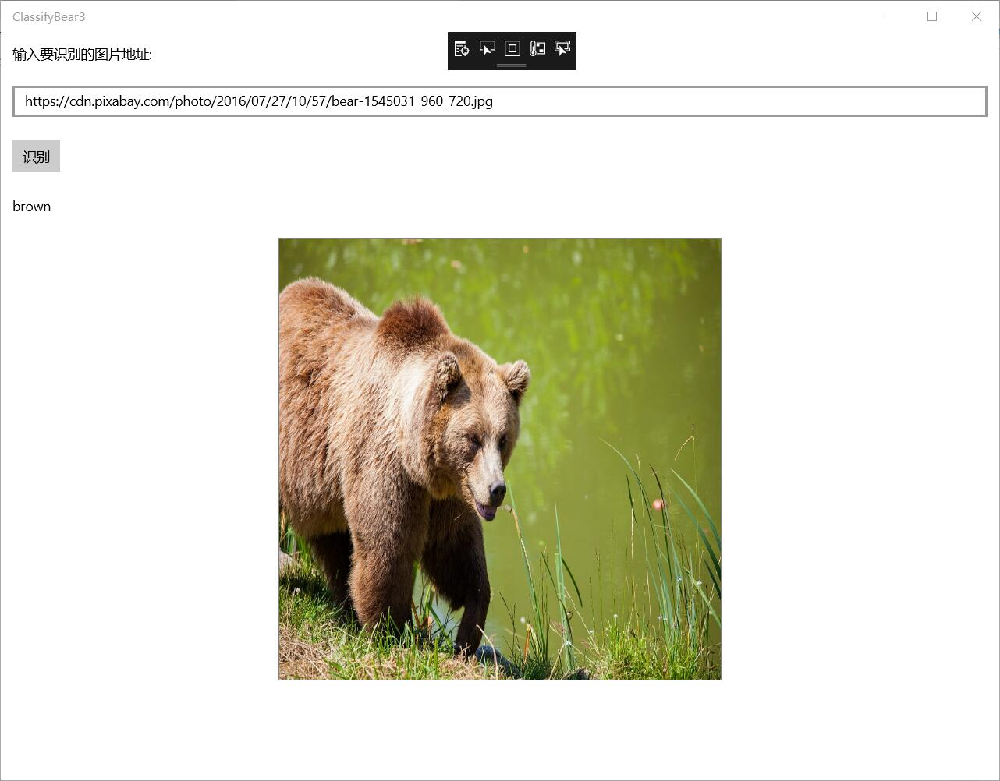
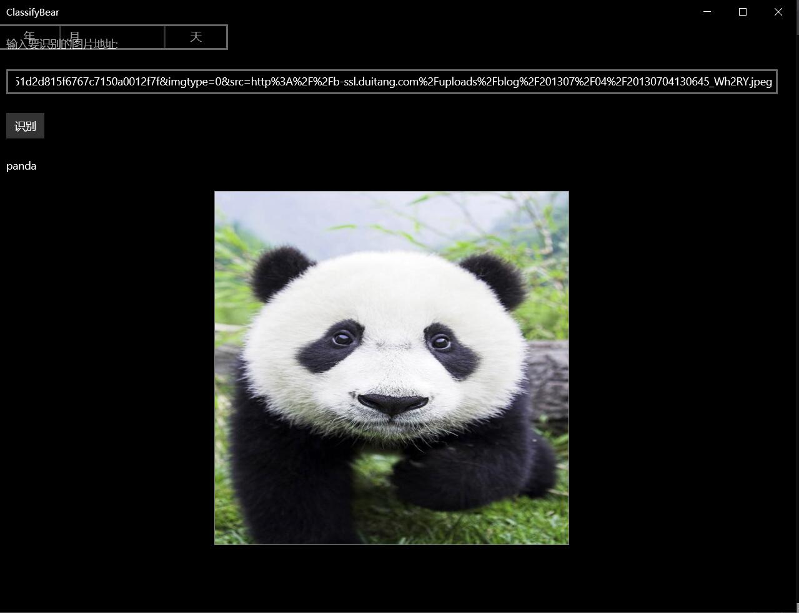
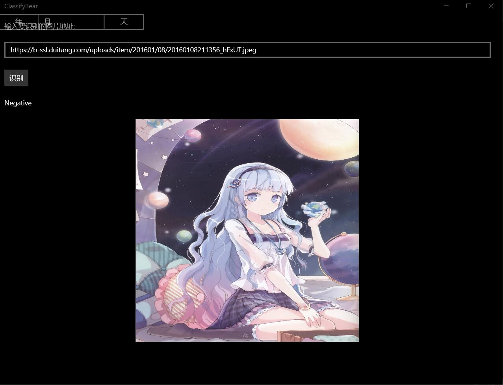

# 第二次小组实验
第七组成员：201702058黄智超、201702045赵良标、201702049张嘉惠
## 使用Windows Machine Learning加载ONNX模型并推理
### 一.环境要求
Windows Machine Learning支持在Windows应用程序中加载并使用训练好的机器学习模型。Windows 10从10.0.17763.0版本开始提供这套推理引擎，所以需要安装17763版本的Windows 10 SDK进行开发，并且需要运行在17763及以上版本的Windows 10中。
### 二.创建UWP项目
* 打开VS，新建项目，选择空白应用（通用Windows），填写项目名称为ClassifyBear,点击确定。

* 在弹出的对话框中，设置目标版本和最低版本

### 三.添加模型文件到项目中
* 打开解决方案资源管理器中，在项目中的Asset目录上点右键->添加->现有项，添加模型文件BearModel.onnx
* 模型属性是在应用运行期间加载的，所以在编译时需要将模型复制到运行目录下。在模型文件上点右键，属性，然后在属性面板上，将生成操作属性改为内容，将复制到输出目录属性改为如果较新则复制。
* 打开解决方案资源管理器，应该可以看到在项目根目录自动生成了和模型同名的代码文件BearModel.cs，里面就是对该模型的一层封装，包括了输入输出定义、加载模型的方法以及推理的方法。
### 四.设计页面
打开MainPage.xaml，将整个Grid片段替换代码：
显示效果图如下：

* 输入框tbImageURL中用来输入要识别的图片的URL
* 按钮tbRun用来触发加载图片
* 文本框tbBearType用来显示识别的结果
* 图片控件imgBear用来预览要识别的图片，同时，我们也从这个控件中取出对应的图片数据，传给我们的模型推理类库去推理。
注意：这里将图片控件设置为正方形并且将Stretch属性设置为Fill，可以保证图片拉伸显示为一个正方形的形状，这样可以方便我们直观的了解模型的输入，因为在前面查看模型信息的时候也看到了，该模型的输入图片应是227*227的正方形。
### 五.添加按钮的事件响应
* 前面XAML文件中给按钮添加事件，这里在MainPage.xaml.cs中完成对应的实现，从输入框中读入图片的URL，然后让图片控件加载该URL对应的图片
### 六.添加图片控件的事件响应
* 前面XAML文件中给图片控件添加了两个事件：图片加载完成的事件和加载失败的事件，这里在MainPage.xaml.cs中完成对应的实现

* 处理模型的输入
打开自动生成的模型封装文件BearModel.cs可以看到需要的输入如下：
public sealed class BearModelInput
{
    public ImageFeatureValue data; // BitmapPixelFormat: Bgra8, BitmapAlphaMode: Premultiplied, width: 227, height: 227
}
注意：这里需要一个ImageFeatureValue类型的数据，可以使用ImageFeatureValue.CreateFromVideoFrame从VidelFrame中创建。使用ImageFeatureValue时，你可以不用担心图片格式的转换和缩放，系统会自动处理图片来匹配模型需要的输入格式。目前支持的像素格式为Gray8、Rgb8和Bgr8，色值范围为0-255。
* 处理图片输入的代码
### 七.加载模型并推理
自动生成的模型封装文件BearModel.cs中已经封装了加载模型的方法和推理的方法，直接调用就可以。
### 八.测试
编译运行，然后在网上找一张熊的图片，把地址填到输入框内，然后点击识别按钮，就可以看到识别的结果了。注意，这个URL应该是图片的URL，而不是包含该图片的网页的URL。效果图如下：

##  使用Win ML加载ONNX模型与ONNX Runtime封装onnx模型并推理的比较
* 使用Win ML加载ONNX模型并推理
  创建空白应用(通用 Windows)项目
  界面设计： 输入框tbImageUrl中用来输入要识别的图片的URL
            按钮tbRun用来触发加载图片
            文本框tbBearType用来显示识别的结果
            图片控件imgBear用来预览要识别的图片
* 使用ONNX Runtime封装onnx模型并推理
  创建Windows窗体应用(.NET Framework)项目
  设置目标版本和最低版本都是17763
  界面设计： Label控件，将内容改为“输入要识别的图片地址：”
            TextBox控件，可以将控件拉长一些，方便输入URL
            Button控件，将内容改为“识别”

* 效果图的比较：
  使用ONNX Runtime封装onnx模型并推理的效果图：
  
  
  使用Win ML加载ONNX模型并推理的效果图：
   
  
## 总结 
    本次小组实验整体来说是比较顺利的，比较遗憾的是程序代码只在两台电脑上运行过。其原因是在另外一台电脑上无法生成BearModel.cs。本次实验了解并试验了使用Windows Machine Learning加载ONNX模型并推理，其中，Windows Machine Learning支持在Windows应用程序中加载并使用训练好的机器学习模型。Windows 10从10.0.17763.0版本开始提供这套推理引擎，所以需要安装17763版本的Windows 10 SDK进行开发，并且需要运行在17763及以上版本的Windows 10中。此外，通过与上次实验使用ONNX Runtime封装onnx模型并推理进行比较，发现两者的不同：创建项目类型不同——空白应用（(通用 Windows)和Windows窗体应用(.NET Framework)，界面设计的不同等，并形象地用效果图做出对比。在实验过程中，充分利用了小组成员分工合作，共同完成的好处。