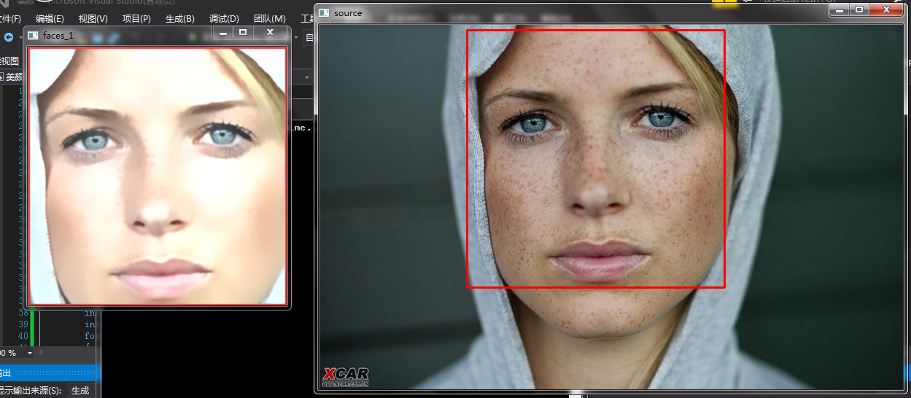

# OPencv实现人脸检测+美颜功能
## 一、初步想法
美颜相机是女孩子的最爱，基于现在美颜功能的广泛使用，我想利用学习到的opencv的知识进行图像的美颜，让图片变得更加漂亮。

## 二、设计思路
（1）人脸检测：
人脸检测依靠opencv中的cascadeClassfier级联分类器
美颜：
（2）实现方法比较简单，主要实现方案就是
①先调亮度，
②再结合高斯模糊与双边模糊进行磨皮，
③最后进行图像增强。

## 三、预期结果

# 基于ONNX Runtime的手写数字推理识别的UI设计
## 一、初步想法
对手写数字推理识别的界面设计加上一个图片背景，还要加入一些不一样的控件，例如“恭喜您，识别成功”“good”...
## 二、设计思路
对MainPage.xmal进行改写
①加入Button按钮
②text控件
③背景图片
④加入不同的Logo图案
## 三、预期结果
最终实现一个界面美观的手写字识别系统，让人喜欢使用的一个系统。