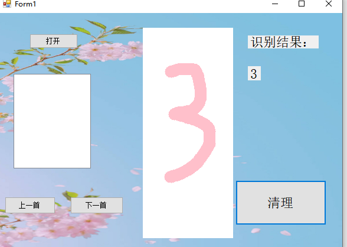
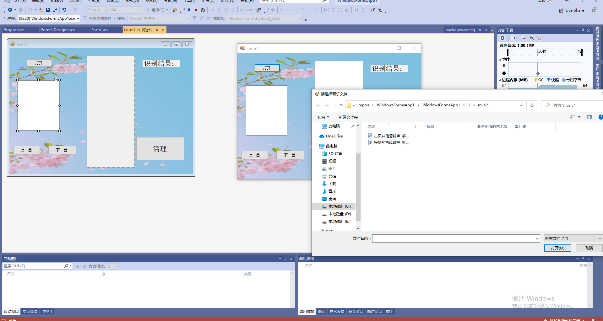
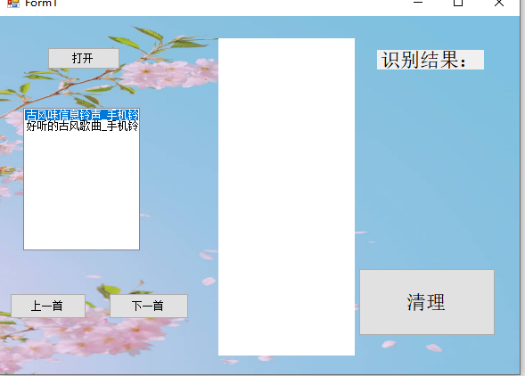

# 基于MNIST手写数字识别界面优化
>### 摘要 
开始想的是要实现基于ONNX Runtime手写数字推理识别出多个数字，但在网上搜索模型搜索不到，然后过程太过复杂繁琐，最终放弃，现在弄了个在手写数字识别的基础上进行界面优化，并在界面中添加了一个音乐播放器，然后实现成功。这次我对C#更加了解，还有MNIST的深入认知。
>### 关键字
### Formm美化，Mnist，音乐播放器，神经网络架构
>### 引言
对于这次设计，收获很多，更深入了解了Mnist手写数字识别的原理，还知道mnist 数据集是 Yann Lecun 大佬基于美国国家标准技术研究所构建的一个研究深度学习的手写数字的数据集。mnist 由 70000 张不同人手写的 0-9 10个数字的灰度图组成。还经过网络搜索，了解到神经网络的架构，认识到神经网络的魅力，从中知道要构建一个神经网络，那么首先就需要构建它的基本单元。学习到了如何在Form界面上添加一个音乐播放器，并实现上一首下一首和打开音乐这几个功能，上一首下一首是对listBOx中的Item进行操作,也是click事件,可以根据listConpenon.selectedIndex来确定哪一个歌曲处于被选中状态,这样就可以通过索引来找到下一首歌曲的索引,从而通过索引来播放与之对应的歌曲. 然后对于C#代码有了更深入的了解，根据代码实现了自己想要的功能。
>### 正文
## 一.基本原理
#### 1. Mnist手写数字识别介绍
Mnist手写数字识别是Kaggle上一个很经典的机器学习数据集，里边包括55000张训练数据和10000张图片的测试数据，每张图片大小为28*28像素的单通图片。该任务为通过机器学习来识别图片中的数字属于0，1，2，3，4，5，6，7，8，9中那个，是个典型的多分类问题，以至于Tensorflow在其example中加入了该数据集，并提供了相应的实现方法。
图片展示如下：

#### 2.神经网络架构介绍
神经网络每一层的神经元个数和层数虽说有很大的经验成分，但是神经元个数要和在输入数据维数和输出数据维数之间相“契合”。对于神经网络来说，输入的一张28*28像素的图像是将其“压扁”为784像素的一维向量，这784个像素点作为784个特征。一张图像有784个特征，那么将N张图像同时输入，则相当于将N*784的数据输入。这里的N通常是批量处理时每一次输入数据的批量大小，比如本例子中我们每次遍历输入100张图片，那么N就是100。

神经网络中，上一层的输出作为下一层的输入。计算主要包括线性计算和非线性计算，线性计算就是x*w+bias，非线性计算则是对x*w+bias的计算结果进行非线性激活，比如sigmod（）函数和ReLu（max(0, x*w+bias）函数。本例子对网络架构定义如下图所示，除了输入层和输出层外，增加了两个隐藏层。请注意在下图中两个有背景色的隐层一和隐层二中，通过线性计算后都有非线性计算。通过隐层一和隐层二（相当于两个黑盒子）来提取特征，然后和W3相乘进行线性计算，并将计算结果输入到softmax分类器中得到loss值。
## 二.基本思路
最开始是想识别多个手写数字，但是过程太过繁琐，而且对于我来说有点难，所以就换了一个思路，在MNIST手写识别基础上添加一个音乐播放器，设计音乐播放器的时候，想着直接打开音乐的原路径，加载到Form界面上，然后可以实现切歌功能，当然在开始的时候就改变了Form的背景图，还有手写字的颜色粗细，想着页面更加美观，功能多用。
## 三.基本过程 
#### 1.界面优化
首先点击Form界面，在属性中找到background，添加自己导入的图片，它会自己根据界面大小修改图片格局。如下图所示

#### 2.笔的颜色粗细设置
在源代码中找到关于手写笔的代码：
 Pen myPen = new Pen(Color.Pink, 20);
 设置它的颜色还有笔的粗细
 
 #### 3.在Form界面设置音乐播放器
 ##### 界面设计
 首先从工具箱中向Form中依次拖入控件并调整，添加一个listBox控件，还有三个button控件，并依次更改两个Button的标题分别为上一首，下一首，打开。
 - listBox是用来放置音乐成为目录盒.
 - 打开这个按钮是打开音乐所在位置并添加到目录中.
 - 剩下两个button实现切歌功能.
 最终效果如下：
 
##### 处理代码并加载模型进行推理
在Form.cs上点右键，选择查看代码，打开Form1.cs的代码编辑窗口。并添加代码：
``` C#
List<string> listsongs = new List<string>(); 
```
这个用来存储引言文件的全路径

回到Form1的设计界面，双击打开按钮，会自动跳转到代码页面并添加button4_Click方法。并添加代码：

``` C#
 private void button4_Click(object sender, EventArgs e)
        {
           
                OpenFileDialog ofd = new OpenFileDialog();
                ofd.Title = "请选择音乐文件";//打开对话框的标题      
                ofd.InitialDirectory = @"C:\Users\HUAT_IAE\source\repos\WindowsFormsApp1\WindowsFormsApp1\1\music"; //设置打开对话框的初始设置目录  
                ofd.Multiselect = true;  //设置多选
                ofd.Filter = @"音乐文件|*.mp3||*.wav|所有文件|*.*";  //设置文件格式筛选 
                ofd.ShowDialog();   //显示打开对话框
                string[] pa_th = ofd.FileNames;       //获得在文件夹中选择的所有文件的全路径
                for (int i = 0; i < pa_th.Length; i++)
                {
                    listBox1.Items.Add(Path.GetFileName(pa_th[i]));  //将音乐文件的文件名加载到listBox中
                    listsongs.Add(pa_th[i]);    //将音乐文件的全路径存储到泛型集合中
                }
            
        }
```
其中：
- OpenFileDialog:表示一个通用对话框，用户可以使用此对话框来指定一个或多个要打开的文件的文件名.不能被继承。
- 属性Multiselect 表示打开的文件目录,是否可以多选,True为多选
- Title 代表打开目录的提示;
- Filter属性是选择要查询的文件后缀名类型：

回到Form1的设计界面，双击listBox控件，会自动跳转到代码页面并添加listBox_Click方法，在其中添加代码：
``` C#
 //实现双击播放
        SoundPlayer sp = new SoundPlayer();
        private void listBox1_DoubleClick(object sender, EventArgs e)
        {
            SoundPlayer sp = new SoundPlayer();
            sp.SoundLocation=listsongs[listBox1.SelectedIndex];
            sp.Play();
        }

```
其中：
- SoundPlayer 类：控制 .wav 文件中的声音播放。

回到Form1的设计界面，双击上一首按钮，会自动跳转到代码页面并添加button3_Click方法，在其中添加代码：
``` C#
private void button3_Click(object sender, EventArgs e)
        {
           
                int index = listBox1.SelectedIndex; //获得当前选中歌曲的索引
                index--;

                if (index < 0)
                {
                    index = listBox1.Items.Count - 1;
                }
                listBox1.SelectedIndex = index; //将改变后的索引重新赋值给我当前选中项的索引
                sp.SoundLocation = listsongs[index];
                sp.Play();
            
        }
```
回到Form1的设计界面，双击下一首按钮，会自动跳转到代码页面并添加button2_Click方法，在其中添加代码：
``` C#
 private void button2_Click(object sender, EventArgs e)
        {
            
                int index = listBox1.SelectedIndex; //获得当前选中歌曲的索引
                index++;

                if (index == listBox1.Items.Count)
                {
                    index = 0;
                }
                listBox1.SelectedIndex = index; //将改变后的索引重新赋值给我当前选中项的索引
                sp.SoundLocation = listsongs[index];
                sp.Play();
            
        }
```
## 四.测试结果
Form界面美化


笔的颜色粗细


音乐播放器


## 五.分析和总结
通过本次深入学习，对于ONNX Runtime封装onnx模型更加了解，并在此基础上实现了Form界面的美化还有添加了一个音乐播放器，在此过程中，出现了很多问题：
- 添加模型后没有添加OnnxRuntime库，然后出现错误,通过同学的帮助，要在NuGet包管理器切换到浏览选项卡，搜索onnxruntime，找到Microsoft.ML.OnnxRuntime包，当前版本是0.4.0，点击安装，稍等片刻，按提示即可完成安装。
- 实现双击播放时，SoundPlayer出现错误，是因为前面没有命名空间，解决方法是在前面添加using System.Media;
- 当然还有path类出错，最后知道前面还要添加using System.IO；

解决了这些问题之后，我对于C#代码有了更加深入的了解，对于OnnxRuntime库有了认知，然后在实现中学习到了对list 界限的判断,单到达最后一个索引后,要返回第一个,,同时在我们建立歌曲List的时候,我们需要同步的将歌曲名字放入List中,这样我们就可以同步的对歌曲名和歌曲路径进行操作.通过这次学习，编辑能力有了进一步的提升，虽然对于之前的想法未实现有所遗憾，但是我在这次界面美化收获到了很多，对于我日后的学习有了很大的帮助。通过这次学习，让我认识到了不足，在今后的学习中，希望完善自己，好好学习，天天向上，学校到更多关于这些方面的知识。
>### 参考文献
- https://blog.csdn.net/mayong1234567/article/details/81102915
- https://blog.csdn.net/mayong1234567/article/details/81102915
- RobotVision中使用ONNX Runtime封装onnx模型并推理
- https://blog.csdn.net/xuanwolanxue/article/details/71565934