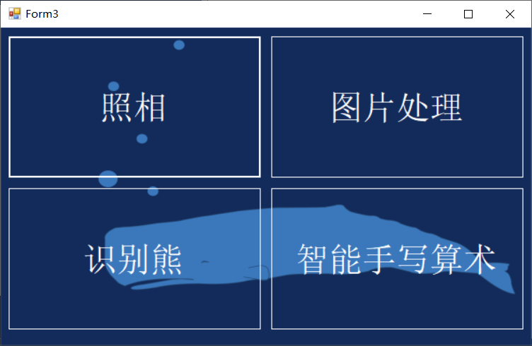
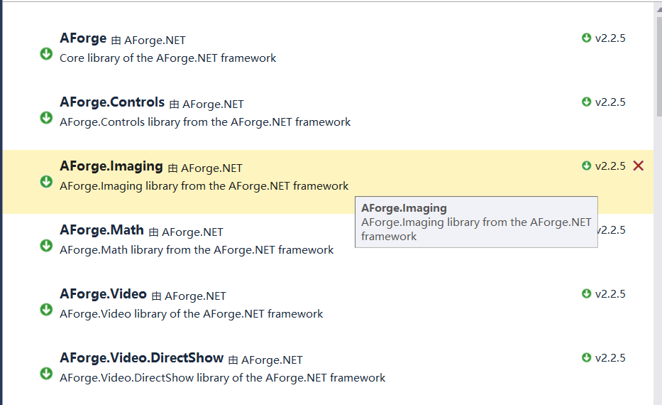
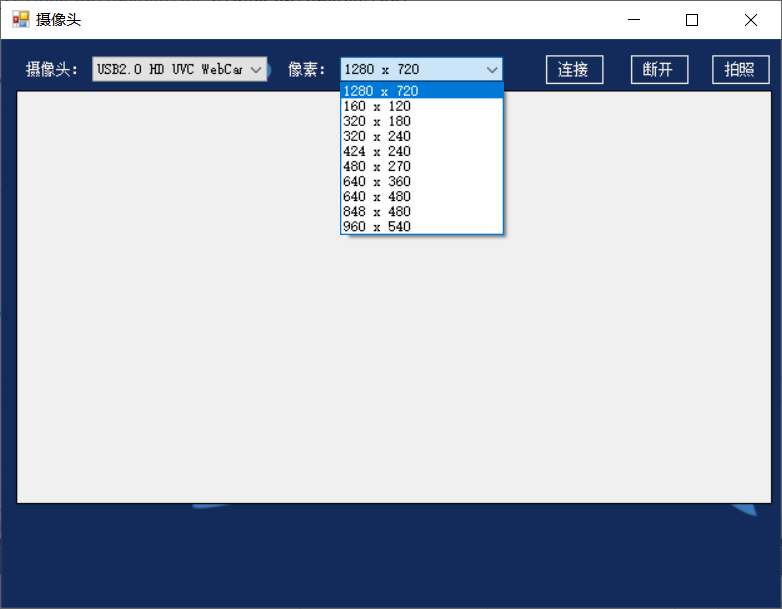
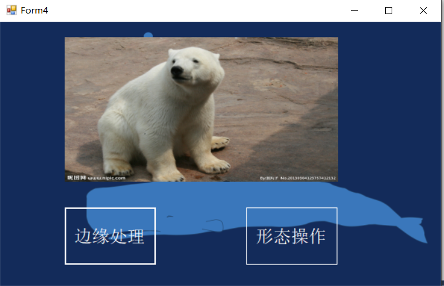
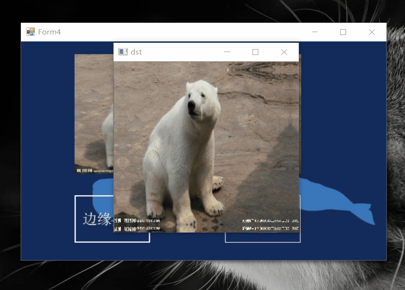
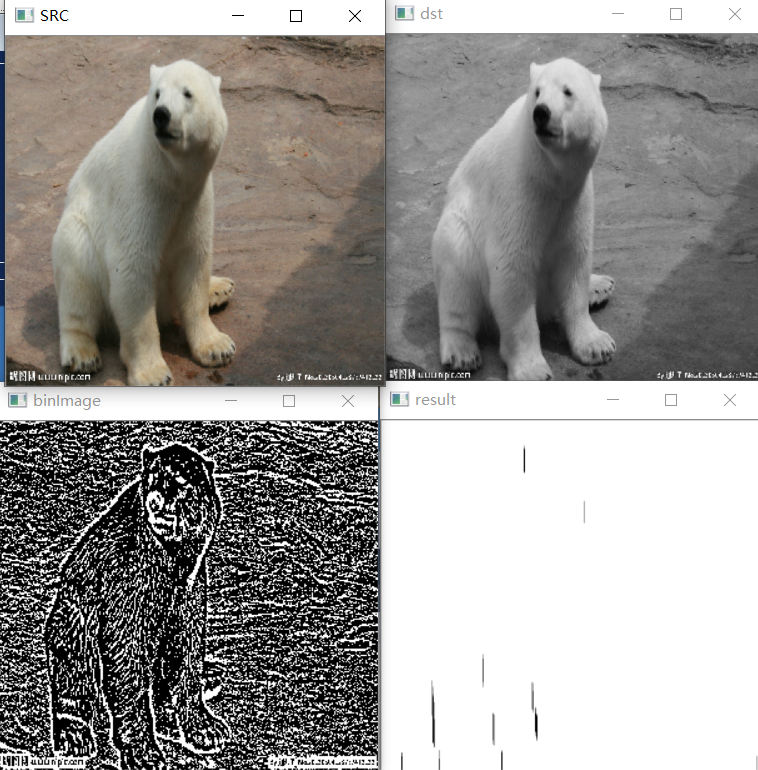
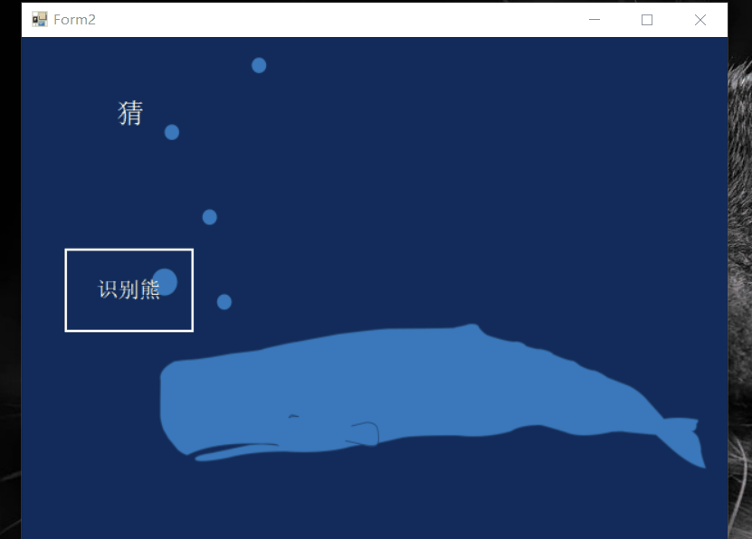
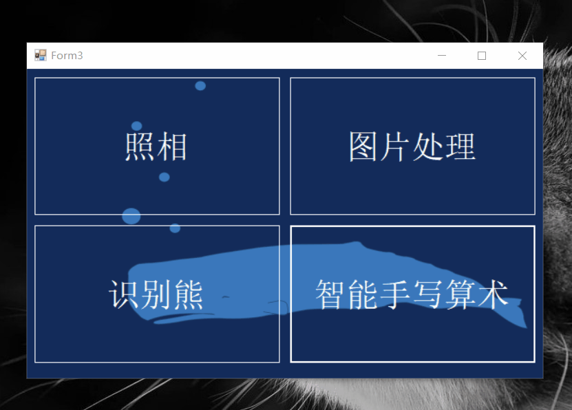
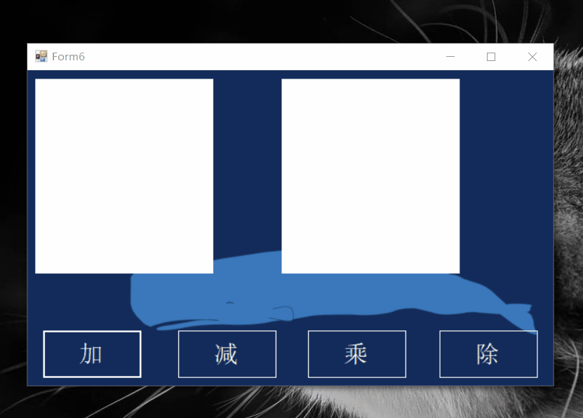

# **最终大论文**

## **工程内容**
>1. 手动拍照
>2. opencv处理
>3. 看图识熊
>4. **手写算术**
   
## **摘要**
在本学期初我在龚老师这里学习了不少东西，最后的工程是结合平时所学的结合起来。
其原理没有改变，只是进行了操作和思路的改变，也有语言的改变。
比如平时我只在C++的环境下使用opencv对图片进行处理，但是我发现，有一个**opencvsharp**的包可以在C#下实现opencv的一些算法。

------

# **工程总体介绍**

## **工程首界面**

> 我将首界面分成了四个区域也就是`四个按钮`，每个功能就是一个按钮，上课学了那么多，我可能将所有的功能都集中在一个form里面，我一共做了5个form，首界面一个，四个功能四个。

----
## **首界面ui处理**
可以看出，我才用的是简单的平面化界面，对于form我加了一张背景图片，以免显得界面单调无趣。
同时，我将四个按钮都进行了透明设计，让界面整体显得更加自然协调。**`如何实现`**，如图：
将BackColor的属性改为Transparent，FlatStyle改为Flat就可以了。

而且我整个工程都是采用同样的背景图片以及透明化的设计。

---
## **界面切换**
首先来演示一遍

### **代码**
    private void button3_Click(object sender, EventArgs e)
        {
            Form2 form2 = new Form2();
            form2.Show();
        }

> 这是打开识别熊的form，其实非常容易，只需要新建一个form对象并且把它show出来就可以了。
> 但是首界面还在，首界面在打开界面的下面，移动新打开的界面，就可以看见首界面。
> 我的本意是想： 打开新的界面，就界面就会消失，可是，hide的旧界面无法还原显示，所以，我将所以我将所有的界面都是固定在屏幕中央，这样覆盖掉首界面。
> ,这是把图片放中央的设置。

---
# **每个功能界面的介绍**
---
# 一.**手动拍照**

### **实现的功能**
>1. 获取笔记本摄像头
>2. 设置拍照像素
>3. 本地保存照片
>4. 连拍

## **获取笔记本摄像头**
### **下载的包**

### **获取摄像头代码**
    private void btnConnect_Click(object sender, EventArgs e)
        {
            if (videoDevice != null)//如果摄像头不为空
            {
                if ((videoCapabilities != null) && (videoCapabilities.Length != 0))
                {
                    videoDevice.VideoResolution = videoCapabilities[cboResolution.SelectedIndex];//摄像头分辨率
                    vispShoot.VideoSource = videoDevice;//把摄像头赋给控件
                    vispShoot.Start();//开启摄像头
                    EnableControlStatus(false);
                }
            }
        }

## 设置拍照像素
### **样式**

> 本界面的一些控件不能进行透明化处理。
### **代码**
    private void GetDeviceResolution(VideoCaptureDevice videoCaptureDevice)
        {
            cboResolution.Items.Clear();//清空列表
            videoCapabilities = videoCaptureDevice.VideoCapabilities;//设备的摄像头分辨率数组
            foreach (VideoCapabilities capabilty in videoCapabilities)
            {
                //把这个设备的所有分辨率添加到列表
                cboResolution.Items.Add($"{capabilty.FrameSize.Width} x {capabilty.FrameSize.Height}");
            }
            cboResolution.SelectedIndex = 0;//默认选择第一个
        }

## 保存到本地图片以及连拍
在对应路径可看见

打开图片

### **实现代码**
    private void btnPic_Click(object sender, EventArgs e)
        {
            Bitmap img = vispShoot.GetCurrentVideoFrame();//拍照
            picbPreview.Image = img;
            //这里可以根据情况，把照片存到某个路径
            k = k + 1;
            string Img_Name = "F:\\Microsoft Visual Studio\\project\\yoloaforge\\yoloaforge\\" + k.ToString()+".jpg";
            Mat mat = OpenCvSharp.Extensions.BitmapConverter.ToMat(img);
            Cv2.ImWrite(Img_Name, mat);
            Mat source = new Mat(Img_Name);
            Cv2.ImShow("sd", source);
            Cv2.WaitKey(0);
        }

>可以看见，我用的是opencv的方法保存到了本地。
>其中，对于k的值，每一次拍照都会加1，对应本地的图片名字也加1。

---
# 二.**opencv图片处理**
## **功能**
> 1. 边缘处理
> 2. 形态操作

## **界面展示**

## **边缘处理**

> 边缘处理是对图片的边框进行操作的，在这个动态图里，我分别通过按键来改变边框，WRCD同过这四个案件。`代码我就不给列出来了，在文件里`。

## **形态操作**

> 形态操作主要采用Blur()函数以及BitwiseNot()，进行腐蚀膨胀以及背景值取反。看以看出，这也是opencv的语法，在C#语言中使用opencv。

---
# **看图识熊**
## 界面展示

> 界面采用透明化处理，控件都是透明的。

## 效果演示

> 相对于平时上课的看图识熊，我采用的是本地图片识别。

## **实现代码**
    label1.Text = string.Empty;
            pictureBox1.Image = null;
            pictureBox1.Refresh();
            string Img_Name = "F:\\Microsoft Visual Studio\\project\\yoloaforge\\yoloaforge\\"  +"a.jpg";
            Mat source = new Mat(Img_Name);
            Bitmap bit = OpenCvSharp.Extensions.BitmapConverter.ToBitmap(source);
这是获取本地图片的代码，也是用的opencv的语法。

# **手写算术**
## **界面展示**

`对于两个写字板我没有采用透明的方式，因为我发现如果我采用透明的方式，智能识别也会发透明到的背景图也当成识别对象，从而导致识别有误。`
比如：
**我进行尝试有很高的错误率。**

## **最初想法**
>对于手写字，我刚开始识别任意的数字，不只是单位数，但是一切识别都是基于onnx模板，没有模板一切都是瞎装逼。
>最后我做了这个加减乘除简单运算，识别出的数字，对其进行变量类型的变话，让其转变为int类型，通过计算再次输出。

## **效果动图**

实现简单的个位数运算。

## **思维拓展**
其实这样我也可以实现两位数，三位数，或者小数的识别。
> 十位数：
> `也采用这种格式，加一个合成按钮，第一个手写板识别的数乘以10，再加上个位数，输出的数就是识别的两位数了。`

## **手写板的清空**
在平时实验时我们用**按钮**清空，这次我添加了**双击事件**，里面的内容是清除。
但是也有一个问题，先看动图。
### **左键双击清空**

> 可以看见双击清除的时候滑板确实清空了，但是lable却显示了3，这是为何？
> 我思考了一番，我认为，**是因为我定义的画图鼠标事件的监控的左键，如果我双击左键可能会导致程序的自动识别，只是picturebox被我清空了。**

### **右键双击清空**

> **通过效果动画图，很明显的看出，我的猜测是对的，确实如此，所以我的程序需要右键双击清空。**

---

# 最后的总结
这最后一个工程，说实话，是最后一个星期做的，自己也比较满意。
虽然不是很出众，但是我结合了的是课程所学的内容做出来的东西。
没有很强的大的技术，也没有令人惊叹的设计，有的是给这门课程的一份答卷。

我的工程总体协调自然，没有给人视觉上的冲击，不会显得突兀。
总体主题颜色背景有一个统一，虽然不拿不上台面，但在心里，已经不错了，自己在这一个月里一直很忙，在最后一个星期，用晚上的时间做出了这个。

对于不足还有很多，自己还有好几个想发没有实现，比如：YOLO识别图片，用onnxruntime做出来。还有，界面的切换，主界面一直存在，主界面还占用着内尺寸，没有找到有效的方法让其隐藏后又显示出来。

主要是存在C#编程能力的不足。我觉得通过这门课我看见了自己的进步，自己独立完成了很多东西。配置环境，网上查阅资料等等，都是自己独立完成。
虽然我以前做工程也都是自己独立完成，对于编程和工程我总喜欢独立完成，我一直觉得，和别人一起做工程，会打扰我的想法以及思路。
给自己一个表扬，这次的论文是自己一个字一个字打出来的，从语言上就可以看出来，文字功底很差，我没有看网上的任何论文指导，全是自己的想法，以及自己发现的问题。

对于多界面，我一直都有这个想法，我本意做出一个软件，最好的办法是用winml做。
可是我发现，我对他不了解，以目前的知识储备很难在一个星期里做出那个东西。
我其实还准备，做一个图片加密的以及解密的界面。用傅里叶变换以及逆变换来完成。可是，opencvsharp终究不是opencv，语法还是不同，我没有深入去研究。

在以后的时间里我会尝试完成我没有做完的东西。

感谢老师教导，非常感谢。学到了新东西，最起码以后问自己会什么的时候，自己可以多说几句了。哈哈哈。
