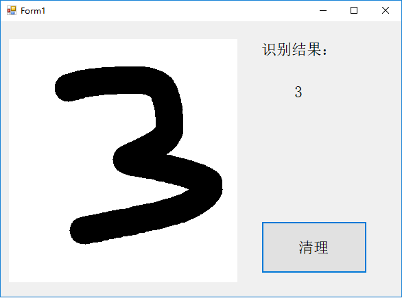
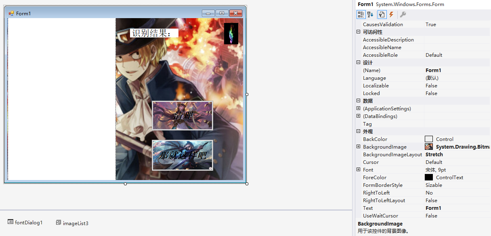
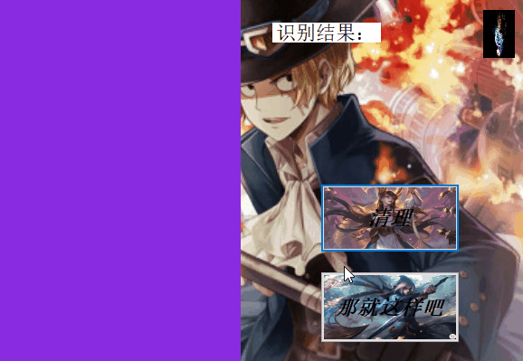

#  **基于 OnnxRuntime 实现识别手写字及优化**

## 摘要
手写体识别的应用已经非常流行了，如输入法，图片中的文字识别等。但对于大多数开发人员来说，如何实现这样的一个应用，还是会感觉无从下手。实验开始是本来准备实现看图识马，但由于模型问题没能完成，只能就手写字识别做了进一步学习。本文就基于 OnnxRuntime 实现识别手写字及优化，实现了手写字识别及擦除，音乐播放和退出。
### 关键字
手写字识别 ，OnnxRuntime，界面优化

## 引言
本文从基本原理，修改内容，相关代码，以及测试内容来描述这次修改的结果，通过查找代码完成这些增加的button按钮的功能，和这些花里胡哨的背景。

## 正文
### 手写字识别原理
通过调用OnnxRuntime的模型实现识别手写字
### onnx介绍
 ONNX全称是Open Neural Network Exchange，是微软和Facebook发布的一个深度学习开发工具生态系统，旨在让AI开发人员能够随着项目发展而选择正确的工具。

ONNX所针对的是深度学习开发生态中最关键的问题之一，在任意一个框架上训练的神经网络模型，无法直接在另一个框架上用。开发者需要耗费大量时间精力把模型从一个开发平台移植到另一个。因此，如何实现不同框架之间的互操作性，简化从研究到生产的路径，成为了重中之重。

ONNX的工作原理是：

实时跟踪某个神经网络是如何在这些框架上生成的，接着，使用这些信息创建一个通用的计算图，即符合ONNX标准的计算图。这样做行得通，是因为在计算方面，这些框架产生的最终结果都非常接近，虽然更高级的表达不同。

ONNX目前支持Caffe2、PyTorch、Microsoft Cognitive Toolkit、Apache MXNet等工具。 

### **ONNX Runtime介绍**
 1.**与ONNX版本保持一致**

ONNX Runtime提供对ONNX规范的全面支持，可用于运行基于ONNX v1.2.1及更高版本的所有模型。

截至2018年11月，ONNX Runtime支持最新发布的ONNX版本（1.3）。1.4发布后，ONNX Runtime将与更新的规范保持一致，增加对新运营商和其他功能的支持。

2.**传统的ML支持**

ONNX Runtime完全支持传统ML场景的ONNX规范的ONNX-ML配置文件。

3.**高性能**

可以将ONNX Runtime与CPU和GPU硬件配合使用。还可以将其他执行提供程序插入ONNX Runtime。通过许多图形优化和各种加速器，与其他运行时相比，ONNX Runtime通常可以提供更低的延迟和更高的效率。这提供了更平滑的端到端客户体验，并通过提高机器利用率降低了成本。

目前，ONNX Runtime支持CUDA和MKL-DNN（带有使用MKL构建的选项）以进行计算加速。

4.**跨平台支持**

ONNX Runtime支持Linux，Windows和Mac平台。

5.**ONNX Runtime技术设计**

ONNX Runtime采用可扩展的设计构建，使其具有多种功能，可支持各种高性能的模型。

### 修改类容

在已经完成了的手写字识别的基础上完成了几个按钮的添加

#### 退出按钮
代码如下：

         private void button2_Click(object sender, EventArgs e)
        {
         
            Application.Exit();

        }
在工具上添加一个按钮并给这个按钮一个单击响应并绑定

#### 音乐播放按钮

在同学的启发下想到了这个按钮
代码如下：

        private void button3_Click(object sender, EventArgs e)
                {
                    SoundPlayer player = new SoundPlayer("C:\\Users\\Administrator\\Desktop\\11770.wav");
                    
                    bool isPlaying = false;
                    if (isPlaying)
                        player.Stop();
                    else
                        player.Play();
                    player.Play();
                }

一，若只想播放.wav格式的音乐（提示音），则可以使用SoundPlay来实现。

1，添加引用using System.Media;

2，实例化 SoundPlayer play = new SoundPlayer();

3，加载 .wav格式音频文件的路径或URL  play.SoundLocation = "提示音.wav";

其中二三两步可以并在一起写，SoundPlayer play = new SoundPlayer("提示音.wav");因为调用Play方法时，会自动加载该文件。

#### 手写和擦除
该程序的擦除是在手写字的写字板上左键有了其他颜色的pen，右键则使用用与写字板颜色相同的pen完成擦除
代码如下：     

        if (e.Button == MouseButtons.Left)
                    {
                        Graphics g = Graphics.FromImage(digitImage);
                        Pen myPen = new Pen(Color.Black, 40);
                        myPen.StartCap = LineCap.Round;
                        myPen.EndCap = LineCap.Round;
                        g.DrawLine(myPen, startPoint, e.Location);
                        pictureBox1.Image = digitImage;
                        g.Dispose();
                        startPoint = e.Location;
         }
                    if (e.Button == MouseButtons.Right)
             {
                        Graphics g = Graphics.FromImage(digitImage);
                        Pen myPen = new Pen(Color.BlueViolet, 40);
                        myPen.StartCap = LineCap.Round;
                        myPen.EndCap = LineCap.Round;
                        g.DrawLine(myPen, startPoint, e.Location);
                        pictureBox1.Image = digitImage;
                        g.Dispose();
                        startPoint = e.Location;
                    }

#### 界面优化

如图   
在每个元件的属性里的BackgroundImage上更改图片，而且要将BackgroundImageLayout改为Stretch，不然显示的图片因为格式的原因只能显示局部的图片。

#### 实验结果

#### 总结
由于模板的原因没能完成之前想完成的看图识别其他事物，于是在已有的基础上做了修改，也学到了很多的东西，学会了c#的许多使用方法，也提高了动手的能力，也学会了与同学一起讨论问题，增进了同学之间的感情，这门课程对我影响很大。

## 参考文献
https://blog.csdn.net/SoftwareTeacher/article/details/80770347
https://blog.csdn.net/Dream_sunny/article/details/79982579