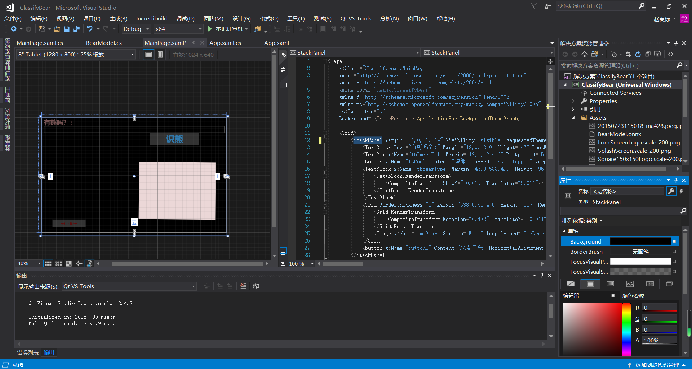
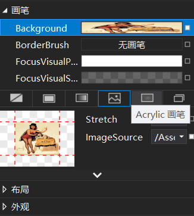
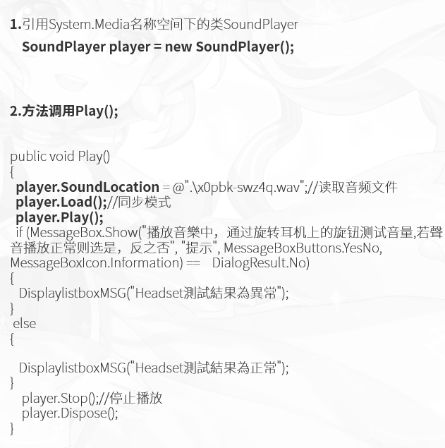
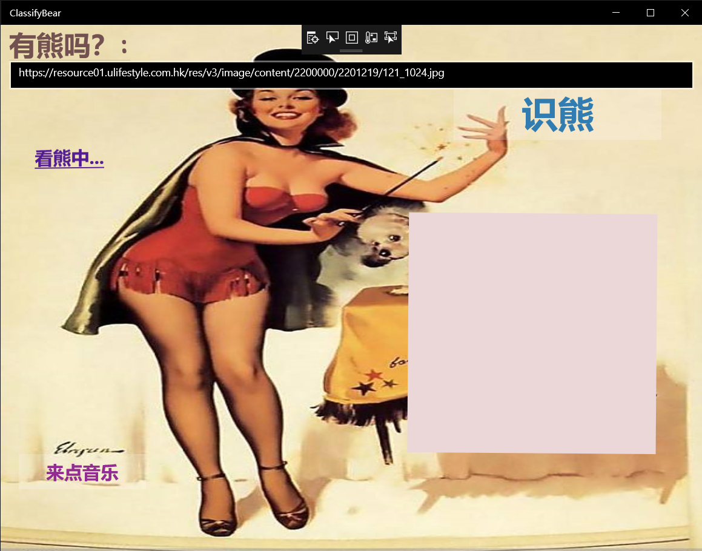
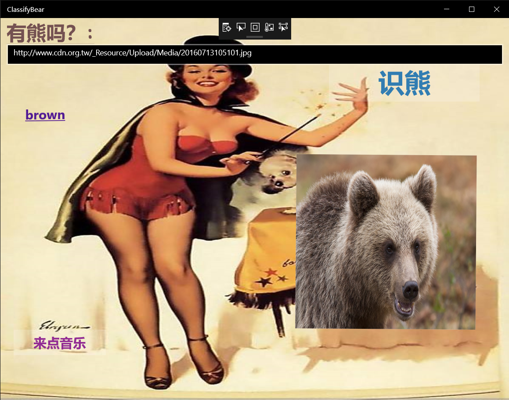
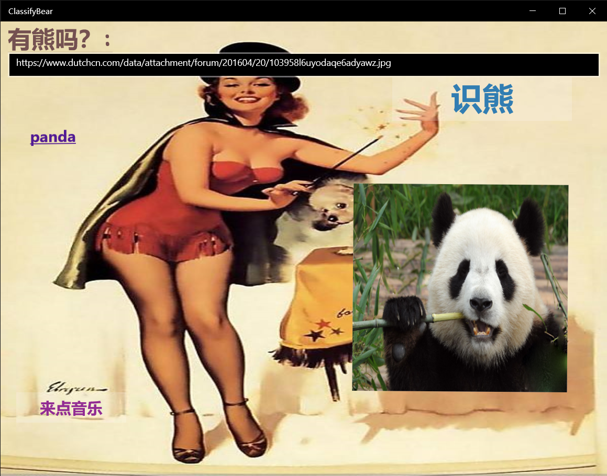

# 
# **Windows Machine Learning加载ONNX模型看图识熊界面优化**
>## 摘要
>>这次的实验初期希望是对人脸识别进行加深拓展，但因个人电脑原因无法达到配置标准最终选择对看图识熊进行优化实验。实验在winML的环境下通过c#达到对看图识熊桌面应用进行简单优化，其中有：
>>+ ui界面优化
>>+ 添加更换壁纸
>>+ 增加音乐播放功能
>>
>>实验的过程比较顺利，主要难点为加入一个按钮实现一些辅助功能，在同学的帮助下，网上查阅资料得到解决。
>## 关键词
>>+ **onnx库**
>>+ **c#**
>>+ **图像识别**
>>+ **ui界面设计**
>## 引言
>>本次实验的工作是基于本学期在车载信息处理这门课上对无人驾驶的认识学习进行的总结性实验。在这个课程中很多东西都是非常新鲜的，其中对人脸识别的内容最为深刻。选择看图识熊实验主要是自己在之前小组实验中顺利的完成了，有着一定的实验基础。这份实验报告也是我的结课作业，这门课开拓了我很多的视野，认识到很多科技上前卫的新东西。课下我也会多加练习学习去更深层次的了解它。
>## 正文
>>### **基本原理**
>>对WindowsML加载ONNX模型看图识熊应用进行界面设计优化并添加部分辅助桌面应用拓展。运用C#进行代码编写。ONNX，全称Open Neural Network Exchange，即开放神经网络交换格式，是由微软、FaceBook等多个相关公司一起推动的深度学习模型标准。Microsoft Cognitive Toolkit、Caffe2、PyTorch等工具已经支持ONNX。
>>### **基本思路**
>>对之前小组实验中所得到的成果进行复习并熟练掌握其方法，再对其加入自己想要的辅助功能，通过相关示例并查阅相关资料进行修改。
>>### **基本过程**
>>1.以之前小组实验看图识熊桌面应用为基础并对界面进行布局；在MainPage.xaml下
>>* 输入框tbImageURL中用来输入要识别的图片的URL
>>* 按钮tbRun用来触发加载图片
>>* 文本框tbBearType用来显示识别的结果
>>* 添加Button按钮增加其他相应事件
>>
>>* 更换界面背景
>>
>>
>>2.添加模型文件、图片资源、音乐资源到项目中。打开解决方案资源管理器中，在项目中的Asset目录上点右键->添加->现有项添加需要的资源。
>>
>>
>>3.对代码进行添加或修改。在界面中添加Button后在按键属性中双击Click后跳转到按钮代码处进行添加修改（MainPage.xaml.cs）。这里所添加的代码为按钮响应播放音乐。
>>
>>
>>这段代码中应用到soundplayer，开始简单的加入在运行时出现了一些逻辑错误，在查阅资料和同学的帮助下得到改进。
>>
>>+ **完整代码在“资源”文件夹里**
>>## **测试结果**
>>
>>
>>
>>
>>
>>+ 点击“来电音乐”按钮会播放资源文件中“45.wav”音乐文件。
>>+ 使用ImageFeatureValue时，你可以不用担心图片格式的转换和缩放，系统会自动处理图片来匹配模型需要的输入格式。目前支持的像素格式为Gray8、Rgb8和Bgr8，色值范围为0-255。
>## 分析和总结 
>>这次实验结果在原有的项目上得到了小部分的改变，主要在于外观上的变化和对新功能的可拓展性，实验中也达到了相应的效果。但这点小小的改进对于老师的要求还相差很多。主要原因在于自己相关知识的储备远远不够对AI应用的开发学习，面对无人车上所需条件的级别我们得下功夫。其实从结果可以看出我们才刚刚入门，设计中的改善对实际应用中效果并不突出。课后对自己的拓展还需加强，开拓自己的视野。
>## 参考文献
>>+ Daniel M. Solis.C#图解教程.人民邮电出版社,2009. 
>>+ Joseph Albahari.果壳中的C#.中国水利水电出版社，2013
>>+ https://github.com/gjy2poincare/RobotVision/tree/master/Lectures
>>+ https://blog.csdn.net/cpongo4/article/details/98197187
>>
>>
>>
>>
