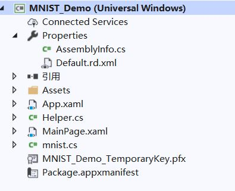
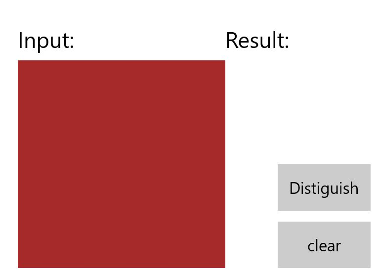
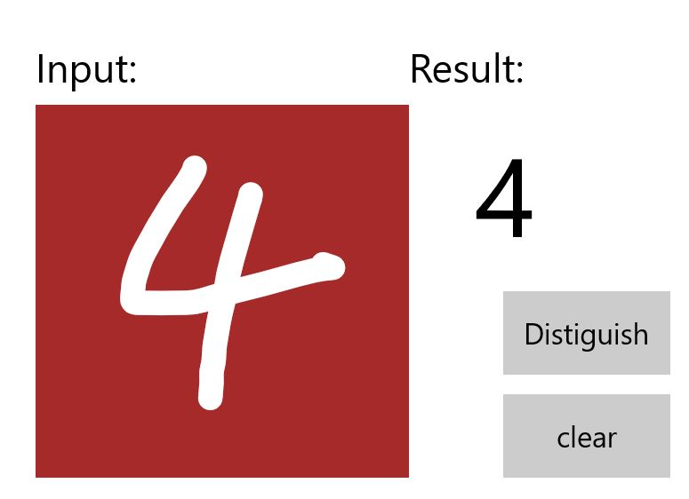
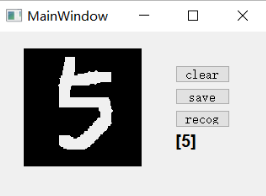

## 201702048武宇飞
***
# 基于WinMLMNIST与TnsorFlowWinML手写字
***

### 摘要

借助 Windows ML，在本地 Windows 10 设备或 Windows Server 2019 计算机上的 Windows 应用中使用以 C#、C++、JavaScript 或 Python 语言编写的已训练 ML 模型。 将已训练的 ML模型整合到应用程序代码。获取经过训练的开放神经网络交换 (ONNX)模型，或者使用 WinMLTools将其他ML框架中训练的模型转换为 ONNX。将 ONNX 模型文件添加到应用程序，将模型集成到应用程序代码中，然后生成并部署应用程序。识别手写字。从而识别最基本的数字。TensorFlow用到的基础工具：Anaconda，pytq5库，image库，TensorFlow（GPU版）

### 关键词
Windows ML、ONNX模型、TensorFlow ML
### 引言

本次报告主要是通过WindowsML与TensorFlow ML做Minst手写数字，InkCanvas绘制数字，创建机器学习模型，系统中默认创建会话，加入特定的模型，异步评估模型。掌握基本的工作原理，学习思路，创建项目，完成UI界面设计。深入学习代码理解代码。最后达到实验效果。

## 一、基本原理

InkCanvas绘制数字。用于解释数字并清除画布的按钮。帮助程序将InkCanvas输出转换为VideoFrame的例程。mnist.cs文件中新生成的代码。mnistModel创建机器学习模型表示，在系统默认设备上创建会话，将特定的输入和输出绑定到模型，并异步评估模型。mnistInput初始化模型期望的输入类型。同时需要输入一个ImageFeatureValue。mnistOutput初始化模型将输出的类型。在这种情况下，输出将是TensorFloat类型的名为Plus214_Output_0的列表。将这些类在项目中加载，绑定和评估模型。最后启动程序。
注：

- MainPage.xaml-所有的XAML代码都为InkCanvas，按钮和标签创建UI 。

- MainPage.xaml.cs-我们的应用程序代码所在的位置。

- Helper.cs-裁剪和转换图像格式的帮助程序例程。

- TensorFlow主要使用了四个py文件：DigitalMnistNum.py，MainWindowC.py，UI_MainWindow.py，run.py。
## 二、基本思路

掌握一些基本的UWP和C＃知识，启动UDP，构建项目，然后添加模型，加载、绑定和评估模型，编译并运行，启动程序。TensorFlow主要训练模型，具体的操作是根据网络查询，看资料来做的。

## 三、基本过程

### （1）选择项目环境
- Windows 10（版本1809或更高版本）
- TensorFlow用到的基础工具：Anaconda，pytq5库，image库，TensorFlow（GPU版）
- 掌握一些基本的UWP和C＃知识

### （2）启动UWP

完成项目后，启动Visual Studio并打开MNIST_Demo.sln文件。如果项目不可用，可选择重建项目，或者查找出错的位置。


### （3）构建并运行项目

在Visual Studio工具栏中，将解决方案平台更改为x64，以设备为64位时在本地计算机上运行项目，如果设备为32位，则在x86上运行。（我们可以在Windows设置应用中检入：“ 系统”>“关于”>“设备规格”>“系统类型”。）

运行项目，可直接单击工具栏上的“ 开始调试”按钮，或按F5键。显示一个InkCanvas，用户可以在其中写一个数字，识别按钮来解释该数字，一个清除标签字段，其中解释后的数字将以文本形式显示，同时清除按钮来清除InkCanvas。


### （4）添加模型
右键单击解决方案资源管理器中的Assets文件夹，然后选择“ 添加” >“ 现有项”。将文件选择器指向ONNX模型的位置，然后单击添加。

此时该项目现在应该有两个新文件：
mnist.onnx-训练的模型。
mnist.cs -Windows ML生成的代码


为了确保在编译应用程序时能够构建模型，请右键单击mnist.onnx文件，然后选择Properties。对于Build Action，选择Content。

### （5）加载，绑定和评估模型
对于Windows ML应用程序，我们要遵循的模式是：“加载”>“绑定”>“求值”。

加载机器学习模型。
将输入和输出绑定到模型。
评估模型并查看结果。
我们将使用mnist.cs中生成的接口代码来加载，绑定和评估应用程序中的模型。

### （6）启动应用程序

构建并启动应用程序后（按F5键），我们将能够识别在InkCanvas上绘制的数字。

## 四、相关代码分析

WindowsML手写字具体操作在GitHub里面，下面主要说一下TensorFlow的相关代码的功能
- DigitalMnistNum.py定义了clear，save，recog，以及result事件的操作。初始化时设置保存画布中图像为png格式，以及设置大小为28*28pixel。
```
 # 定义手写数字面板类
from PyQt5 import QtCore, QtGui, QtWidgets
from PyQt5.QtGui import QColor
class DigitalMnistNum(QtWidgets.QWidget):
def __init__(self, parent=None):
		super(DigitalMnistNum, self).__init__(parent)
           self.pen = QtGui.QPen()
10         self.pen.setStyle(QtCore.Qt.SolidLine)
11         self.pen.setWidth(12)  # 笔的粗细
12         self.pen.setColor(QtCore.Qt.white)  # 白色字体
13         # 图片大小为28*28 pixel
14         self.bitmapSize = QtCore.QSize(28, 28)
15         self.resetBitmap()
16 
17     def resetBitmap(self):
18         self.pix = QtGui.QBitmap(self.size())
19         self.pix.fill(QtCore.Qt.black)  # 设置黑色背景
20 
21     # 清除按钮
22     def clearBitmap(self):
23         self.resetBitmap()
24         self.update()
25     # 保存图片格式以及图片信息
26 
27     def recongBitmap(self):
28         pass
29 
30     def saveBitmap(self):
31         fileName = str("pic.bmp")
32         tmp = self.pix.scaled(
33             self.bitmapSize, QtCore.Qt.KeepAspectRatio)  # 保存图片
34         QtCore.qDebug(str(tmp.size()))
35         tmp.save(fileName)
36 
37     def setBitmapSize(self, size):
38         self.bitmapSize = QtCore.QSize(size[0], size[1])
```
- 四个鼠标事件：按下，移动，划线，释放函数参考博客：https://www.cnblogs.com/PyLearn/p/7689170.html
```
1 # 以下三个函数为记录鼠标手写数字事件
 2     # 定义鼠标按下事件
 3     def mousePressEvent(self, event):
 4         if event.button() == QtCore.Qt.LeftButton:
 5             self.startPos = event.pos()
 6             painter = QtGui.QPainter()
 7             painter.begin(self.pix)
 8             painter.setPen(self.pen)
 9             painter.drawPoint(self.startPos)
10             painter.end()
11         self.update()
12     # 鼠标移动事件
13 
14     def mouseMoveEvent(self, event):
15         painter = QtGui.QPainter()
16         painter.begin(self.pix)
17         painter.setPen(self.pen)
18         painter.drawLine(self.startPos, event.pos())
19         painter.end()
20         self.startPos = event.pos()
21         self.update()
22     # 鼠标画线事件
23 
24     def paintEvent(self, event):
25         if self.size() != self.pix.size():
26             QtCore.qDebug(str(self.size()) + "," +
27                           str(self.pix.size()) + "," + str(event.type()))
28             self.resetBitmap()
29         painter = QtGui.QPainter(self)
30         painter.drawPixmap(QtCore.QPoint(0, 0), self.pix)
31     # 鼠标释放事件
32 
33     def mouseReleaseEvent(self, event):
34         self.update()
```
-  MainWindowC.py
MainWindowC功能是调用clear，save，recong按钮事件。清除保存画布比较简单。
```
 1 class MainWindow(QtWidgets.QMainWindow):
 2     def __init__(self, parent=None):
 3         super(MainWindow, self).__init__(parent)
 4         self.ui = Ui_MainWindow()
 5         self.ui.setupUi(self)
 6 
 7     def clearBtn(self):
 8         QtCore.qDebug(str("clearBtn"))
 9         self.ui.widget.clearBitmap()
10 
11     def saveBtn(self):
12         QtCore.qDebug(str("saveBtn"))
13         self.ui.widget.saveBitmap()   
14     
15     def setLabelText(self, text):
16         self.ui.result.setText(text)
17 
18     def setBitmapSize(self, size):
19         self.ui.widget.setBitmapSize(size)
```
- 识别事件部分是重点：首先需要对保存的手写数字图片进行预处理，打开，调用image库读取图片list格式，还需要对初始值进行转换，转换为MNIST数据集中一样的数据格式。
```
 1     # 预测过程
 2     def recongBtn(self):
 3         QtCore.qDebug(str("recongBtn"))
 4         self.ui.widget.recongBitmap()
 5         # 打开自己的图片地址
 6         file_name = R"C:\Users\tensorflow\tensorflow-mnist-tutorial\TestProject\pic.bmp"
 7         img = Image.open(file_name).convert('L')
 8         cvtValue = list(img.getdata())
 9         # 初始化图片的值，1表示纯白色，0表示纯黑色
10         #resCvtValue = [(255 - x) * 1.0 / 255.0 for x in cvtValue]
11         resCvtValue = [x / 255.0 for x in cvtValue]
12         newShape = array(resCvtValue).reshape(28, 28, 1)
```
-TensorFlow中关于模型中参数恢复的方法。import_meta_graph()和restore()方法一起使用恢复模型中的参数。
```

1        # 加载保存的参数
2         with tf.Session() as sess:
3             sess.run(tf.global_variables_initializer())
4             new_saver = tf.train.import_meta_graph(
5                 R'C:\Users\tensorflow\tensorflow-mnist-tutorial\TestProject\mdlib\md2\init-1000.meta')
6             new_saver.restore(sess, tf.train.latest_checkpoint(
7                 R'C:\Users\tensorflow\tensorflow-mnist-tutorial\TestProject\mdlib\md2'))
8             print("model restore done\n")
9             graph = tf.get_default_graph()
```
-UI_MainWindow.py
 　　　　UI部分主要是设置窗口大小，画布大小，按钮显示大小等布局。
```
 1 from PyQt5 import QtCore, QtGui, QtWidgets
 2 # DigitalMnistNum为数字画板的子类
 3 from DigitalMnistNum import DigitalMnistNum
 4 
 5 
 6 class Ui_MainWindow(object):
 7     def setupUi(self, MainWindow):
 8         MainWindow.setObjectName("MainWindow")
 9         MainWindow.resize(320, 200)  # 主窗口大小
10         sizePolicy = QtWidgets.QSizePolicy(
11             QtWidgets.QSizePolicy.Fixed, QtWidgets.QSizePolicy.Fixed)
12         sizePolicy.setHorizontalStretch(0)
13         sizePolicy.setVerticalStretch(0)
14         sizePolicy.setHeightForWidth(
15             MainWindow.sizePolicy().hasHeightForWidth())
16         MainWindow.setSizePolicy(sizePolicy)
17         self.centralWidget = QtWidgets.QWidget(MainWindow)
18         self.centralWidget.setObjectName("centralWidget")
19         self.widget = DigitalMnistNum(self.centralWidget)
20         self.widget.setGeometry(QtCore.QRect(30, 20, 140, 140))  # 画布用140*140
21         self.widget.setObjectName("widget")
22         # 修改右侧布局
23         self.verticalLayoutWidget = QtWidgets.QWidget(self.centralWidget)
24         self.verticalLayoutWidget.setGeometry(QtCore.QRect(190, 20, 105, 140))
25         self.verticalLayoutWidget.setObjectName("verticalLayoutWidget")
26         self.verticalLayout = QtWidgets.QVBoxLayout(self.verticalLayoutWidget)
27         self.verticalLayout.setContentsMargins(20, 20, 20, 20)
28         self.verticalLayout.setSpacing(6)
29         self.verticalLayout.setObjectName("verticalLayout")
30 
31         self.clearBtn = QtWidgets.QPushButton(self.verticalLayoutWidget)
32         self.clearBtn.setObjectName("clearBtn")
33         self.verticalLayout.addWidget(self.clearBtn)
34 
35         self.saveBtn = QtWidgets.QPushButton(self.verticalLayoutWidget)
36         self.saveBtn.setObjectName("saveBtn")
37         self.verticalLayout.addWidget(self.saveBtn)
38 
39         self.recongBtn = QtWidgets.QPushButton(self.verticalLayoutWidget)
40         self.recongBtn.setObjectName("recongBtn")
41         self.verticalLayout.addWidget(self.recongBtn)
42         self.result = QtWidgets.QLabel(self.verticalLayoutWidget)
43 
44         font = QtGui.QFont()
45         font.setFamily("Arial")
46         font.setPointSize(12)
47         font.setBold(True)
48         font.setWeight(70)
49         # 结果显示区域
50         self.result.setFont(font)
51         self.result.setObjectName("res")
52         self.verticalLayout.addWidget(self.result)
53         self.verticalLayout.setStretch(0, 1)
54         self.verticalLayout.setStretch(1, 1)
55         self.verticalLayout.setStretch(2, 1)
56         self.verticalLayout.setStretch(3, 2)
57         MainWindow.setCentralWidget(self.centralWidget)
58 
59         self.retranslateUi(MainWindow)
60         self.clearBtn.clicked.connect(MainWindow.clearBtn)
61         self.saveBtn.clicked.connect(MainWindow.saveBtn)
62         self.recongBtn.clicked.connect(MainWindow.recongBtn)
63         QtCore.QMetaObject.connectSlotsByName(MainWindow)
64 
65     def retranslateUi(self, MainWindow):
66         _translate = QtCore.QCoreApplication.translate
67         MainWindow.setWindowTitle(_translate("MainWindow", "MainWindow"))
68         self.clearBtn.setText(_translate("MainWindow", "clear"))
69         self.saveBtn.setText(_translate("MainWindow", "save"))
70         self.recongBtn.setText(_translate("MainWindow", "recog"))
71         self.result.setText(_translate("MainWindow", "res"))
```
-run.py
　　　　链接上述三个文件，执行。
```
 1 import sys
 2 from PyQt5 import QtWidgets, QtGui
 3 from MainWindowC import MainWindow
 4 
 5 if __name__ == '__main__':
 6 
 7     app = QtWidgets.QApplication(sys.argv)
 8     win = MainWindow()
 9     win.show()
10     sys.exit(app.exec_())
```
## 五、测试结果


   

## 六、结果分析及总结

通过本次实验，的确学到了很多。最初我想做看图识熊，最基本的原型做出来了，但是不知道应该如何在识别出来的基础对所识别的图片进行处理，有一定的难度，通过查询资料，只能做到分离的情况下实现，没有达到预想的效果。后来，决定改做基于WinML MNIST 手写数字，挺有意思的，也比较容易一些，先是界面设计，和平常一样，没有做太多的处理，界面设计可以在初始界面做出相应更改，比如可以改关键词更换画布颜色，同时也可以导入图片更换背景。也可以加入按钮。通过按钮更换背景。我给出的是最基础样例。之后做了TensorFlow手写字，有点难，但是网上有资料来查询，学习的过程很好，有一次新的突破也会很开心。这次学习经历很难忘，可谓几经波折。但是实验中，我学会了很多，我觉得考察了我们的各方面能力如界面设计，编程能力，感知能力等。就我而言，总是觉得编程挺难的，也是我的不足之处。而实验深刻的学习，基本理解了他的原理。这也是我的最大收获。相信今后，能更加有自己的想法，也会更多的去思考，改善。

## 参考文献
* 博客：https://blog.csdn.net/wlmnzf/article/details/50994598
* 博客：https://blog.csdn.net/qq_38269418/article/details/78991649
* 简书：https://www.jianshu.com/p/2186766b69dc
* Github：https://github.com/gjy2poincare/RobotVision
* 博客：https://www.cnblogs.com/PyLearn/p/7689170.html