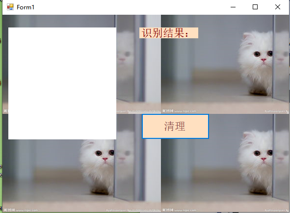
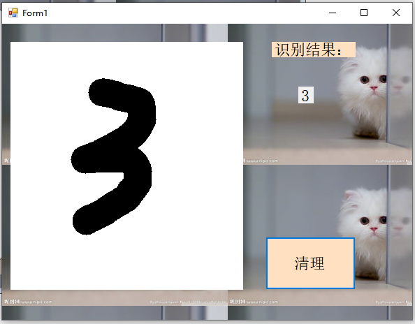
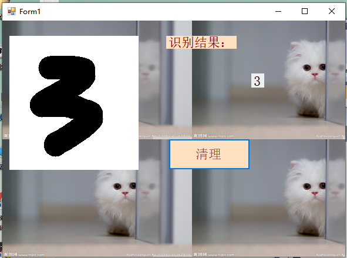
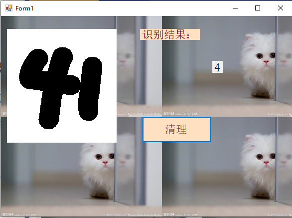
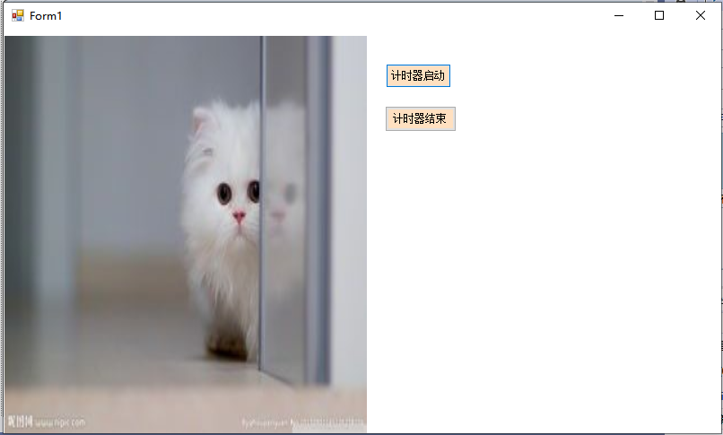
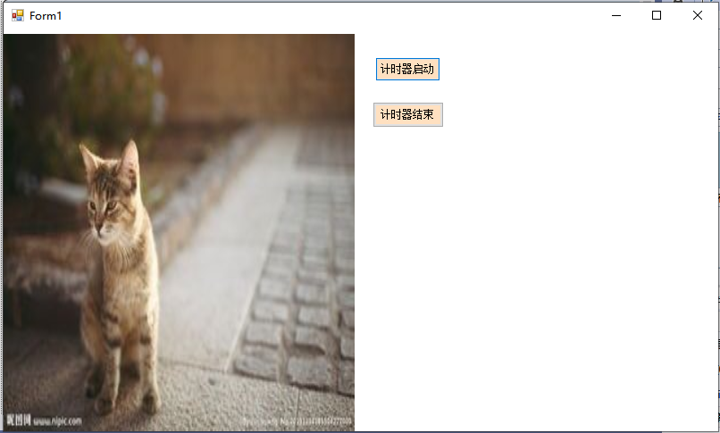

# 论文
## 摘要
将通过这一入门级案例展示人工智能应用开发中的典型元素，如准备人工智能应用开发所需的软件环境，使用Visual Studio Tools for AI快速集成模型、加速人工智能应用开发，以及在代码中处理用户输入，以便人工智能模型能正确地接受输入的数据等等。实现简单界面的设计、包装模型、规范输入的图片成为数据接口能够使用的格式、通过模型推理数字并显示。在此基础上美化界面、改变手写数字的笔画粗细。
此外，学习了关于定时器的相关知识：将利用定时器实现图片每秒切换一次的功能，在两张图片中来回切换。
本次论文将对这些工作和应用的主要代码逻辑进行分析、解释。
* 关键字：手写识别、定时器、图片切换
## 第一章 引言
在移动硬件得到高度发展的今天，手写输入已经成为了一种非常常见的输入方式。然而手写输入和传统的鼠标、键盘输入方式有很大的不同。传统的输入方式里，鼠标的点击可以对应到屏幕上精确的一点，进而对应到某一特定的UI控件；键盘的敲击可以产生一个特定的字符数据。这些都是计算机可以很容易处理的。相对于传统输入方式生产的数据，手写输入的内容——也即数据——在很多场景下都不是计算机能直接处理的。计算机得到的只是一块具有“特别的形状”的图形，但这图形中蕴含着的用户真正的意图，计算机却不能识别。而这些蕴含其中的意图，才是很多应用场景的核心价值所在。比如用户希望设备上的手写输入法，可以将手写的字转换成传统的字符数据；笔记应用应能识别用户手写的笔记，并进行索引以便查询或计算一些数学表达式的结果……然而我们都有所了解，用传统的技术手段，很难高质量地达成这一识别任务。
手写数字识别(Hand-written digits recognition)，顾名思义，就是将带有手写数字的图片输入到已经训练过的机器，且机器能够很快识别图片中的手写数字，并将之作为输出打印出来。
## 一.基本原理
通过借力MNIST数据集，具备最基本的手写输入功能和图像识别功能，能将用户手写的0，1，2，…，9数字单个地识别出来。
MNIST数据集包含了大量单个手写数字的位图数据，包含各种手写风格，并且这些位图数据都已经被很好地标记过了。即每一张手写数字的位图都存在一个对应的数字，并且这个数字是可以以数据的形式被访问的。这极大地简化了准备工作。MNIST数据集为本文中识别手写数字的问题提供了大量素材，利用这些素材可以训练出专门用于识别单个手写数字的人工智能模型。
## 三.基本思路
准备人工智能应用开发所需的软件环境，使用Visual Studio Tools for AI快速集成模型，以及在代码中处理用户输入，以便人工智能模型能正确地接受输入的数据。
## 四.基本过程
1. 手写识别
    * 实现简单的界面，将用户用鼠标的输入变成图片。
    * 将生成的模型包装起来，成为有公开数据接口的类。 
    * 将输入的图片进行规范化，成为数据接口能够使用的格式。
    * 最后通过模型来推理(inference)出图片应该是哪个数字，并显示出来。
* 核心代码分析
    - 当窗口加载时，绘制一个白色方框
        ```    
        digitImage = new Bitmap(pictureBox1.Width, pictureBox1.Height);
        Graphics g = Graphics.FromImage(digitImage);
        g.Clear(Color.White);            
        pictureBox1.Image = digitImage;
        ```
    - 当鼠标左键被按下时，记录下需要绘制的线段的起始坐标
        ```
        startPoint = (e.Button == MouseButtons.Left) ? e.Location : startPoint;
        ```
    - 当鼠标在移动，且当前处于绘制状态时，根据鼠标的实时位置与记录的起始坐标绘制线段，同时更新需要绘制的线段的起始坐标
        ```
        if (e.Button == MouseButtons.Left)
        {
            Graphics g = Graphics.FromImage(digitImage);
            Pen myPen = new Pen(Color.Black, 40);
            myPen.StartCap = LineCap.Round;
            myPen.EndCap = LineCap.Round;
            g.DrawLine(myPen, startPoint, e.Location);
            pictureBox1.Image = digitImage;
            g.Dispose();
            startPoint = e.Location;
        }
        ```
    - 当点击清除时，重新绘制一个白色方框，同时清除label1显示的文本
        ```
        digitImage = new Bitmap(pictureBox1.Width, pictureBox1.Height);
        Graphics g = Graphics.FromImage(digitImage);
        g.Clear(Color.White);
        pictureBox1.Image = digitImage;
        label1.Text = "";
        ```
    - 当鼠标左键释放时,开始处理图片进行推理
        ```
        if (e.Button == MouseButtons.Left)
        {
            Bitmap digitTmp = (Bitmap)digitImage.Clone();//复制digitImage
                                                             //调整图片大小为Mnist模型可接收的大小：28×28
                using (Graphics g = Graphics.FromImage(digitTmp))
                {
                    g.InterpolationMode = InterpolationMode.HighQualityBicubic;
                    g.DrawImage(digitTmp, 0, 0, MnistImageSize, MnistImageSize);
                }

                //将图片转为灰阶图，并将图片的像素信息保存在list中
                float[] imageArray = new float[MnistImageSize * MnistImageSize];
                for (int y = 0; y < MnistImageSize; y++)
                {
                    for (int x = 0; x < MnistImageSize; x++)
                    {
                        var color = digitTmp.GetPixel(x, y);
                        var a = (float)(0.5 - (color.R + color.G + color.B) / (3.0 * 255));                     

                        imageArray[y * MnistImageSize + x] = a;

                    }
    初步窗口界面如下：
    
1. 美化界面
   在以上的基础下，实现一些界面的美化
    * 选择设计器属性->修改Background Image：导入背景图片->应用
    * 选择组件属性->修改组件背景及字体颜色大小
  
    经过一些简单的选择与拖动还有调整大小，美化后的窗口界面如下:
    
    * 手写笔画的粗细
   
2. 识别结果
   
   在pictureBox中手写数字，识别并输出所识别的数字，如下图所示：

   
   尝试失败实现分割识别多个手写字符
   
3. 出现的问题
* 大小不一或没有居中

    在尝试书写的时候也会发现，当字写得小一点，或者写偏一点，错误识别的情况就会变多。这是因为训练数据为了提高识别率，对数据都进行了居中、缩放的处理。可能的解决方案有两种：

     - 采用图像处理算法，找到笔迹像素的分布中心，将其居中，并根据外围的笔迹像素来进行缩放，适配到识别区中。此方法逻辑清晰，不需要数据进行训练。缺点是如果手写数据来源于摄像头，会有很多噪点，会造成误判。

     - 训练一个目标检测（Object Detect）的 AI 模型来自动框出合适的大小。这种方法会将需要的目标（即字符）用矩形框出来、并基本保证其居中。将矩形做适当的缩放后，既可作为输入。如果数据量足够且有代表性，这种方法的效果会不错。但目标检测需要的数据标记工作却很繁琐，需要对每个训练数据中的字符画框标记，标记的质量也直接影响到了识别的质量。

6. 通过定时器实现图片每秒切换一次的功能
   
   Timer不直接显示在窗体上，和其它控件连用，表示每隔一段时间执行一次Tick事件。
   定时器控件中常用的属性是Interval,用于设置时间间隔，以毫秒为单位。
   启动定时器方法(Start),停止定时器方法(Stop)
* 核心代码分析
   - 窗体加载事件，在图片空间中设置图片
        ```
        private void Form1_Load(object sender, EventArgs e)
        {
            pictureBox1.Image = Image.FromFile(@"C:\\Users\\HUAT_IAE\\d.jpg");
            //图片在图片控件中被拉伸或收缩，适合图片的大小
            pictureBox1.SizeMode = PictureBoxSizeMode.StretchImage;
            //设置每隔1秒调用一次定时器Tick事件
            timer1.Interval = 1000;
            //启动定时器
            timer1.Start();
        }
        ```
    - 触发定时器的事件，在该事件中切换图片
        ```
        private void timer1_Tick(object sender, EventArgs e)
        {
            /*
             *当flag的值为TRUE时将图片控件的Image属性切换到d.jpg
             *否则将图片的Image属性切换到e.jpg
             */
            if (flag)
            {
                pictureBox1.Image = Image.FromFile(@"C:\\Users\\HUAT_IAE\\d.jpg");
                flag = false;
            }
            else
            {
                pictureBox1.Image = Image.FromFile(@"C:\\Users\\HUAT_IAE\\d.jpg");
                flag = true;
            }
        }
        ```
    - “启动定时器”按钮的单击事件
        ```
        private void button1_Click(object sender, EventArgs e)
        {
            timer1.Start();
        }
        ```
    - “停止定时器”按钮的单击事件
        ```
        private void button2_Click(object sender, EventArgs e)
        {
            timer1.Stop();
        }
        ```
* 定时器切换图片测试结果
    当flag的值为TRUE时将图片控件的Image属性切换到d.jpg,如下图：
    
    否则将图片的Image属性切换到e.jpg，如下图：
    
## 五.总结分析

本次设计报告中包含了之前所学的——基于本地模型的手写数字识别应用，完善之前学习时出现的漏洞，并在此基础上美化界面。之后尝试实现分割识别多个手写字符，发现需要模型并且编写程序时多次尝试失败.故转向关于图像的设计，包括加载显示图片，了解定时器的使用，利用定时器实现一定间隔时间后切换图片。通过查找资料，从资料中阅读分析代码，自己编写得到能够实现所需功能的代码并运行出结果。
在设计过程中，也出现了一些问题，如项目的NuGet包缺少Microsoft.ML.OnnxRuntime;加载图片出错（原因：图片路径书写错误），计时器设置等。最终经过与同学的交流，查阅资料，了解问题所在，并成功解决，实现了手写数字识别和定时器切换图片。遗憾的是，未能坚持完成分割识别多个手写字符，也希望自己在本门课程结束后，抽时间重新设计，能够最终实现识别多个数字甚至其他字符。

 


