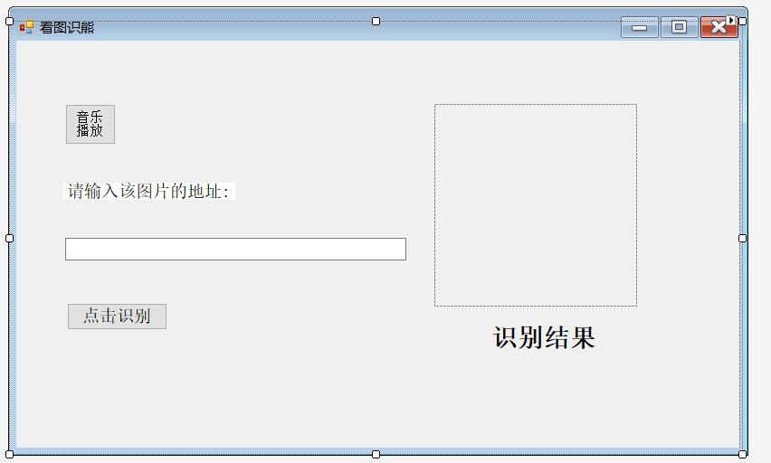
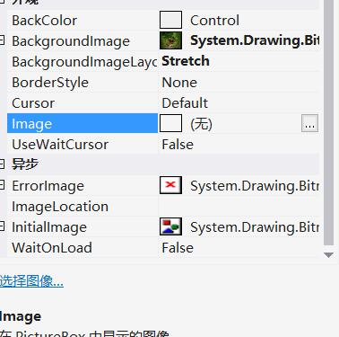
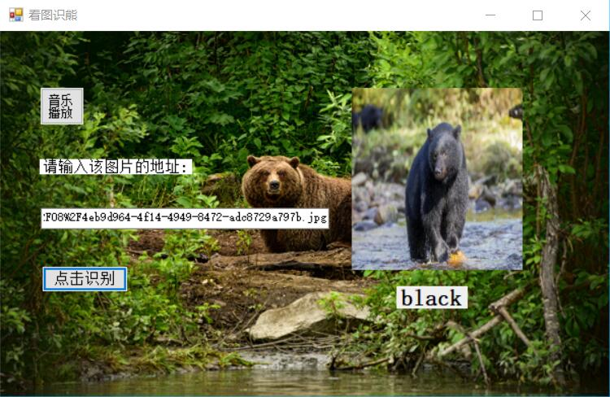
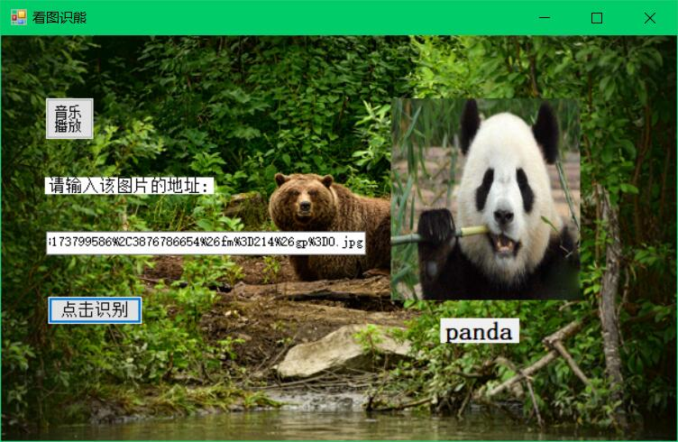
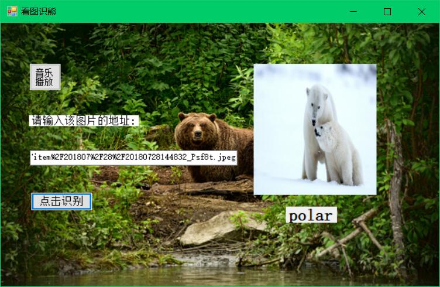
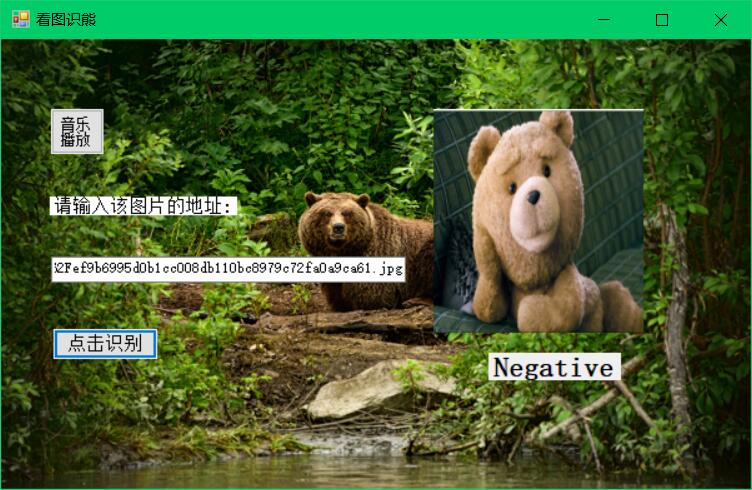
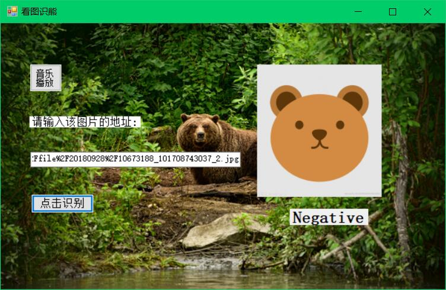
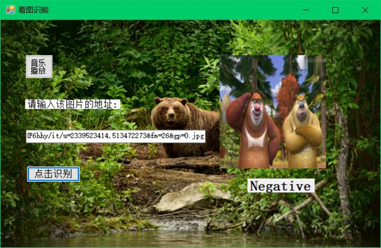

# **使用ONNX Runtime封装onnx模型实现实现看图识熊的优化**

## 摘要
 本来想要实现onnxruntime实现对其他物体的识别并处理识别后的图像的功能，但在后期尝试过程中发现难度较大，后来将目标缩小为看图识熊的界面优化和功能完善，实现的功能如下：
 - 看图识熊的识别功能
 - 实现了**form**界面美化，添加了背景
 - 使用**button**实现了音乐播放功能  

## 引言
上次在课堂上分组做过实验，已经配置了Visual Studio2017和C#的相关文件，并且在小组三个人的共同努力下完成了实验，通过实验积累的经验，我第二次做便比较容易了。在报告中，我以实验原理，基本过程，全篇代码描述，最终结果几方面阐述了实验，但是对代码改动并不大，希望在以后可以越来越多增加自己的东西，将onnxruntime和C#运用自如。


## 关键词
 #### 图像识别;onnxruntime库;C#;界面美化

## **正文**

 ### 基本过程
* 一. 界面设计和优化        
在创建Windows窗体应用(.NET Framework)项目后，给项目起名为ClassifyBear1。随后在解决方案资源管理器中找到Form1.cs，双击，打开界面设计器。从工具箱中向Form中依次拖入控件并调整，这时候多拖动了一个**button**和一个**PictureBox**，用来添加音乐播放和整体的背景图片。在**button2**里面写入“音乐播放”，将**PictureBox2**放大到全覆盖界面，再把每个控件的位置摆放合理，效果如下：
   
修改属性里面的外观设计，将**Backgroundlmage**改为事先准备好的图片，再将**BackgroundimageLayout**改为**Stretch**，如下图：
    
这里要注意了一下每个**button**，**label**的名称，后面修改代码时候要记得一一对应。
最终调试后的生成效果：


* 二. 添加模型文件和**OnnxRuntime**库           
打开解决方案资源管理器中，在项目上点右键->添加->现有项，在弹出的对话框中，将文件类型过滤器改为所有文件，然后导航到模型所在目录，选择模型文件并添加。
添加**OnnxRuntime**库，将其放到我们创建的目录下，然后记得将架构运行库改为x64即可

* 三. 代码完善            
增加代码:
```c++
private const int imageSize = 224;
```
这一步的主要作用是使用Netron查看模型，得到模型的输入应为224，224 大小的图片，与**PictureBox1**的大小对应。

随后在**button1_Click**中添加代码（双击**button1**即可找到）
```c++
label1.Text = string.Empty;
pictureBox1.Image = null;
pictureBox1.Refresh();
```
这一步的作用是识别之前先重置上一次识别显示的图片

在**button1_Click**中添加代码（双击**button2**即可找到）
```c++
SoundPlayer player = new SoundPlayer();
 player.SoundLocation = "E:/test   vs17/ClassifyBear1/1.wav";
player.Load();
player.Play();
```
音乐播放的文件要求是wav文件，并且要指定好路径，不然会出错。 

继续添加代码
```c++
bool isSuccess = false;
try
{
    pictureBox1.Load(textBox1.Text);
    isSuccess = true;
}
catch (Exception ex)
{
    MessageBox.Show($"读取图片时出现错误：{ex.Message}");
    throw;
}
```
这一步的代码可以让图片控件加载图片，如果加载不成功，则显示读取图片时出现错误，增加代码为这里做部分解释：
```c++
for (int y = 0; y < imageSize; y++)
    {
        for (int x = 0; x < imageSize; x++)
        {
            var color = bitmap.GetPixel(x, y);
            imageArray[y * imageSize + x] = color.B;
            imageArray[y * imageSize + x + 1 * imageSize * imageSize] = color.G;
            imageArray[y * imageSize + x + 2 * imageSize * imageSize] = color.R;
        }
    }
 ```
 按照先行后列的方式依次取出图片的每个像素值,使用Netron查看模型的输入发现需要依次放置224 * 224的蓝色分量、224* 224的绿色分量、224* 224的红色分量

 ```c++
 var shape = new int[] { 1, 3, imageSize, imageSize };
        var tensor = new DenseTensor<float>(imageArray, shape);
```
用Netron看到需要的输入类型是float32[None,3,224,224],第一维None表示可以传入多张图片进行推理,这里只使用一张图片，所以使用的输入数据尺寸为[1, 3, 224, 224].

如果加载成功，将图片数据处理成需要的大小，然后加载模型进行推理。但是要注意的是，这里的数据转换一定要按照前面查看的模型的信息来转换，图片大小需要长宽都是224像素，并且要依次放置所有的蓝色分量、所有的绿色分量、所有的红色分量，如F果顺序不正确，不能达到最佳的推理结果。

* 四. 测试                
编译运行，然后在网上找一张熊的图片，把地址填到输入框内，然后点击识别按钮，就可以看到识别的结果了。







我依次做了棕熊，黑熊，熊猫，北极熊，泰迪熊，卡通熊和动画片里熊的测试识别，可以看出识别失败后会出现Negative。

 ### 全篇代码(仅仅给出了Form1.cs的代码)
 ```c++
using System;
using System.Collections.Generic;
using System.ComponentModel;
using System.Data;
using System.Drawing;
using System.Linq;
using System.Text;
using System.Threading.Tasks;
using System.Windows.Forms;
using System.Numerics.Tensors;
using Microsoft.ML.OnnxRuntime;
using System.Media;

namespace ClassifyBear1
{
    public partial class Form1 : Form
    {
        public Form1()
        {
            InitializeComponent();
        }
        private const int imageSize = 224;

        private void button1_Click(object sender, EventArgs e)
        {
            label1.Text = string.Empty;
            pictureBox1.Image = null;
            pictureBox1.Refresh();
            bool isSuccess = false;
            try
            {
                pictureBox1.Load(textBox1.Text);
                isSuccess = true;
            }
            catch (Exception ex)
            {
                MessageBox.Show($"读取图片时出现错误：{ex.Message}");
                throw;
            }
            if (isSuccess)
            {
                // 图片加载成功后，从图片控件中取出224*224的位图对象
                Bitmap bitmap = new Bitmap(pictureBox1.Image, imageSize, imageSize);

                float[] imageArray = new float[imageSize * imageSize * 3];

                // 按照先行后列的方式依次取出图片的每个像素值
                for (int y = 0; y < imageSize; y++)
                {
                    for (int x = 0; x < imageSize; x++)
                    {
                        var color = bitmap.GetPixel(x, y);

                        // 使用Netron查看模型的输入发现
                        // 需要依次放置224 *224的蓝色分量、224*224的绿色分量、224*224的红色分量
                        imageArray[y * imageSize + x] = color.B;
                        imageArray[y * imageSize + x + 1 * imageSize * imageSize] = color.G;
                        imageArray[y * imageSize + x + 2 * imageSize * imageSize] = color.R;
                    }
                }

                string modelPath = AppDomain.CurrentDomain.BaseDirectory + "BearModel.onnx";

                using (var session = new InferenceSession(modelPath))
                {
                    var container = new List<NamedOnnxValue>();

                    // 用Netron看到需要的输入类型是float32[None,3,224,224]
                    // 第一维None表示可以传入多张图片进行推理
                    // 这里只使用一张图片，所以使用的输入数据尺寸为[1, 3, 224, 224]
                    var shape = new int[] { 1, 3, imageSize, imageSize };
                    var tensor = new DenseTensor<float>(imageArray, shape);

                    // 支持多个输入，对于mnist模型，只需要一个输入，输入的名称是data
                    container.Add(NamedOnnxValue.CreateFromTensor<float>("data", tensor));

                    // 推理
                    var results = session.Run(container);

                    // 输出结果有两个，classLabel和loss，这里只关心classLabel
                    var label = results.FirstOrDefault(item => item.Name == "classLabel")? // 取出名为classLabel的输出
                        .AsTensor<string>()?
                        .FirstOrDefault(); // 支持多张图片同时推理，这里只推理了一张，取第一个结果值

                    // 显示在控件中
                    label3.Text = label;
                }
            }
        }

        private void pictureBox1_Click(object sender, EventArgs e)
        {
        }

        private void Form1_Load(object sender, EventArgs e)
        {

        }

        private void textBox1_TextChanged(object sender, EventArgs e)
        {

        }

        private void label3_Click(object sender, EventArgs e)
        {

        }

        private void label3_Click_1(object sender, EventArgs e)
        {

        }

        private void label4_Click(object sender, EventArgs e)
        {

        }

        private void button2_Click(object sender, EventArgs e)
        {
            SoundPlayer player = new SoundPlayer();
            player.SoundLocation = "E:/test   vs17/ClassifyBear1/1.wav";
            player.Load();
            player.Play();
        }
    }
  
}
```


###  **分析和总结**
  本次实验出现的问题是添加控件时候label的问题，label修改属性后找不到该控件，原因是将它里面的文字清空了，尝试了多个方法无果后，我再次添加了两个label控件，分别是3和4，直接覆盖掉原来的1和2，最后也没有删除前两个控件，代码有一点点小的繁杂。在实验中，**C#**的理解不够深入，优化代码的时候出现错误，暴露了自己的学习的漏洞，最后参考相关资料得以解决。做课程设计是对自己的学习的考验，从课堂到课下的一次大的实践，在课后自己琢磨的过程中偶尔会焦躁，停滞不前，但慢慢走下来，不断克服设计中的困难才让我现在充满了学习的信心。希望本次的课程设计会在以后的学习中激励我不断向前，一步步克服困难成为一名合格的程序员。
 

### **参考文献**
  [1]Daniel M. Solis.C#图解教程.人民邮电出版社,2009.
  [2]Joseph Albahari.果壳中的C#.中国水利水电出版社，2013.
  [3]https://blog.csdn.net/cpongo4/article/details/98197193

  