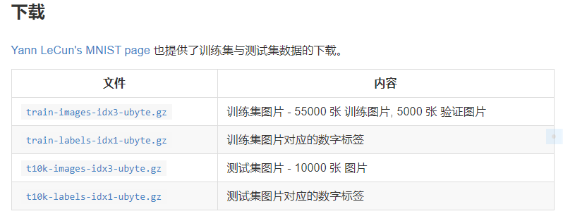
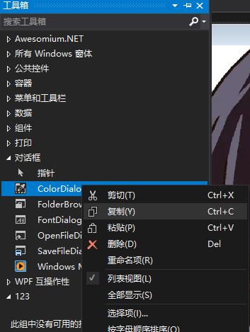
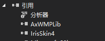
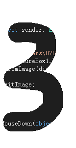
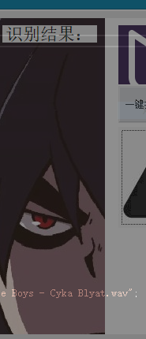
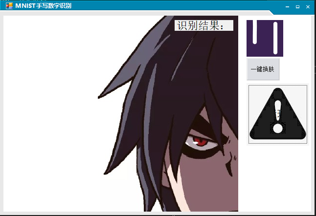
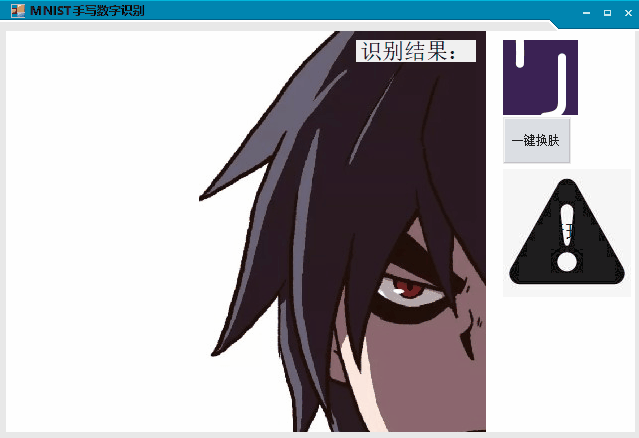
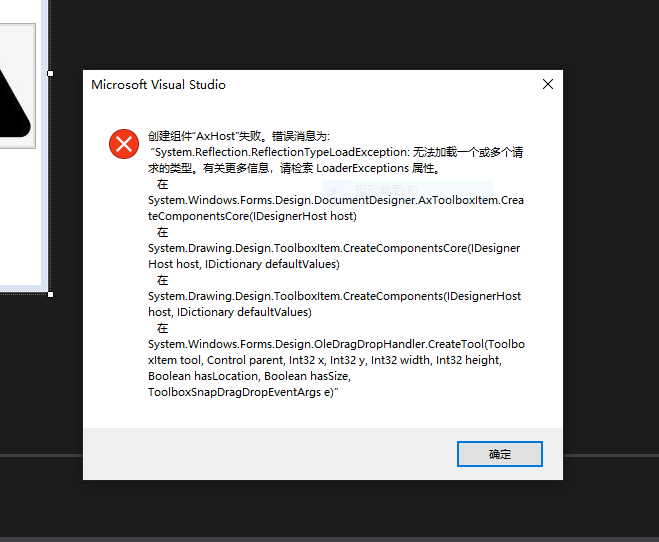
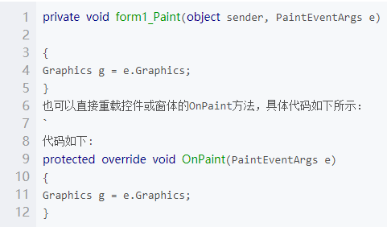

#
# **基于MNIST实现手写数字识别优化**

>### 摘要
初期想要实现**Windows ML**实现人脸识别进一步优化，过程太过繁琐，最终确定了手写数字识别的优化，最终功能
- 基础单个字的手写识别
- **UI**美化，壁纸添加
- **picturebox** 透明化
- 音乐播放**button**并添加**gif**作为背景图片布局
- **Form**优化，新增73种皮肤支持一键换肤功能  

通过对进一步的了解与编程，对**C#**了解更加深入，也对**tensflow**更加感兴趣，希望日后能在实际学习工作中用到实处


>### 关键词

## UI美化;Mnist数据集;透明墨迹;Tensflow;一键换肤

>### 引言
对于本次实验，从基本原理、基本思路，基本过程，关键代码描述，最终结果几方面描述，在对这些基础的的 **C#** 代码有了基础的了解以后，实现了这些功能，但对于基础数字识别代码没有改动，希望在日后可以自己通过**pytorch**训练**MNIST**数据集实现多个数字甚至数字运算进行识别，以达成更多功能  

>### 正文
## **一、基本原理** 
- **卷积神经网络**（**Convolutional Neural Networks / CNNs / ConvNets**）与普通神经网络非常相似，它们都由具有可学习的权重和偏置常量(**biases**)的神经元组成。每个神经元都接收一些输入，并做一些点积计算，输出是每个分类的分数，普通神经网络里的一些计算技巧到这里依旧适用  
- **TensorFlow** 是一个采用数据流图，用于数值计算的开源软件库。它是一个不严格的“神经网络”库，可以利用它提供的模块搭建大多数类型的神经网络。它可以基于CPU或GPU运行，可以自动使用GPU，无需编写分配程序。主要支持Python编写，但是官方说也有C++使用界面   
- **MNIST**数据集主要由一些手写数字的图片和相应的标签组成，图片一共有10类，分别对应从0~9，共10个阿拉伯数字，原始的MNIST数据库包含4个文件

- 利用**Skinengine**进行Form边框的更换，通过导入.dll库文件，实现Skin的更换   

- 利用VS工具箱中的**mediaplayer**工具实现.wav文件的播放
  

## **二、基本思路**    

最开始的想法是想通过官方给出的MNIST数据集[mnist.py](https://tensorflow.googlesource.com/tensorflow/+/master/tensorflow/g3doc/tutorials/mnist/mnist.py)并通过卷积神经网络训练出多个数字的MNIST，但是工作量太大不得已终止。最后还是自己训练的一个**mnist.onnx**模型完成本次报告。看过很多大佬用**C#**做出来的EXE甚至APP UI很美，于是想自己也设计一下

## **三、基本过程**  
### **<font face="STCAIYUN"  color=#00ffff>Form UI美化</font>** 
  首先是对于**Form background**的UI美化，在其中添加背景图，在**Form**属性中添加要导入到的图片并根据自身图片大小修改布局


### **<font face="STCAIYUN"  color=#00ffff>音乐文件的添加</font>** 
  对于音乐添加有两种方法实验成功 (**mediaplayer**,**soundplayer**) 

- 选择工具箱，并单击鼠标右键，在弹出的快捷菜单中选择“选择项”
- 弹出“选择工具箱项”对话框，选择“COM组件”选项卡
- 在COM组件列表中，选择名称为“Windows Media Player”，单击【确定】按钮，Windows Media Player控件添加
- 通过绑定button两个事件，play和stop来实现播放和暂停
``` C#
private void button2_Click(object sender, EventArgs e)
{
axWindowsMediaPlayer1.URL = openFile.FileName;
}
private void button3_Click(object sender, EventArgs e)
{
axWindowsMediaPlayer1.close();
}
```


#
- 新建一个**button**用来作为点击播放作用
- 在新建的button时间选项中双击**button_click**新建事件，添加代码如下，实现.wav波形文件的播放
``` C#
System.Media.SoundPlayer player = new System.Media.SoundPlayer();
            player.SoundLocation = @"C:\Users\87059\source\repos\MNIST\MNIST\DJ Blyatman,Russian Village Boys - Cyka Blyat.wav";
            player.Load();
            player.Play();
```
- **SoundLocation**定位文件位置，并实现播放

### **<font face="STCAIYUN"  color=#00ffff>一键换肤</font>** 
- 首先把DLL程序集文件和SSK皮肤文件放在要运行程序的DEBug文件夹下，然后引入引用。  
  


- 新建button用来实现点击变换皮肤的效果
- 实现单一的皮肤变换
  ``` C#
  //方法-01（使用全路径）
  skinEngine1.SkinFile = @"C:\Users\87059\source\repos\MNIST\MNIST\bin\Debug\Skins\DeepCyan.ssk";
  //方法-02
  Sunisoft.IrisSkin.SkinEngine se = new Sunisoft.IrisSkin.SkinEngine();
  se.SkinFile = "DeepCyan.ssk";
  //使所有的窗口都是用此皮肤
  se.SkinAllForm = true;
  ```
- 实现73种不同皮肤的切换
``` C#
//外部定义一个累加器
        int i = 0;
        /// <summary>
        /// 点击更换皮肤
        /// </summary>
        private void btn_ChangeSkin_Click(object sender, EventArgs e)
        {
            //读取所有的皮肤文件
            //获取皮肤文件夹中所有皮肤文件的全路径，存储到SkinPath数组中
            //引入命名空间：using system.IO;
            //Directory.GetFiles:用于获取，文件夹下，所有文件的全路径。
            string[] SkinPath = Directory.GetFiles(@"C:\Users\87059\source\repos\MNIST\MNIST\bin\Debug\Skins");

            //每点击一次，i加一
            i++;

            //当i == 最后一个皮肤文件时候，重新设置i= 0，让其返回到第一个皮肤文件
            if (i == SkinPath.Length)
            {
                i = 0;
            }

            //把文件路径赋给，skinFile，使用皮肤。
            skinEngine1.SkinFile = SkinPath[i];
        }
```
利用累加器实现对文件内的.ssk文件的循环使用以达到效果


### **<font face="STCAIYUN"  color=#00ffff>picturebox轨迹透明</font>** 

- 通过设置Form窗体属性的**TransparencyKey**实现
```C#
this.BackColor =Color.White; this.TransparencyKey = Color.White; 
```
但是对于**TransparencyKey**方法只支持透明或不透明，不支持过度色，比如PNG图片中的从不透明到透明的过渡色会显示出讨厌的效果，如图  


- 通过设置窗体的 **Opacity** 实现 
  设置透明度为50%，对比如图
  ``` C#
  this.Opacity = 0.5; 
  ```  
  <figure class="half">
    
    
</figure>

## **四、测试结果**  
# 
<font color=#ffa500 size=5 face="黑体">Form界面美化</font>


#
<font color=#66ffe6 size=5 face="黑体">音乐播放</font>


#
<font color=#ff0000 size=5 face="黑体">一键换肤</font>


#
<font color=#ffb3e6 size=5 face="黑体">轨迹透明</font>


## **五、分析和总结** 

通过本次深入的对C#代码段额分析与理解，编程能力有了进一步的提升，但是在过程中还是与达到了些问题
- 添加**Mediaplayer**的时候遇到错误，查阅资料没有找到本质解决办法
  尝试了很多。有的说是旧的解决方案与新的不兼容；重新编译 也都没有解决问题
  
- 对于C#中**e.graphics**引用不是太清楚，原本想在**Form**和**button**中将四角变圆滑  
  利用了控件和窗体的**Paint**事件中的**PainEventArgs**和**CreateGraphics**方法，结果都没有实现

- 对于本次实验更是一个总结过程，将有限时间的课上与课下时间学到的东西付诸实践，没有达到自己想要的实现多个数字的的识别，还是略有遗憾，也希望能在日后的学习中激励自己，能在以后的学习工作中付诸实际。


## **六、参考文献** 

- [TensorFlow中文社区](http://www.tensorfly.cn/index.html)
- [RobotVision](https://github.com/gjy2poincare/RobotVision)
- https://blog.csdn.net/Sparta_117/article/details/66965760
- https://www.sumaarts.com/share/620.html
