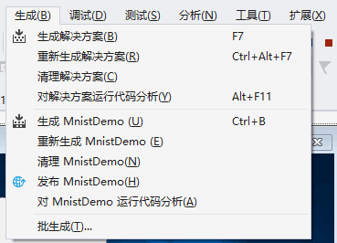
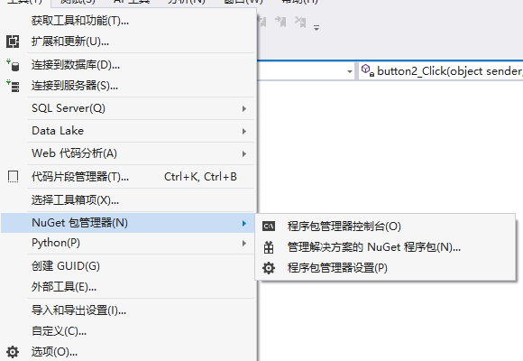
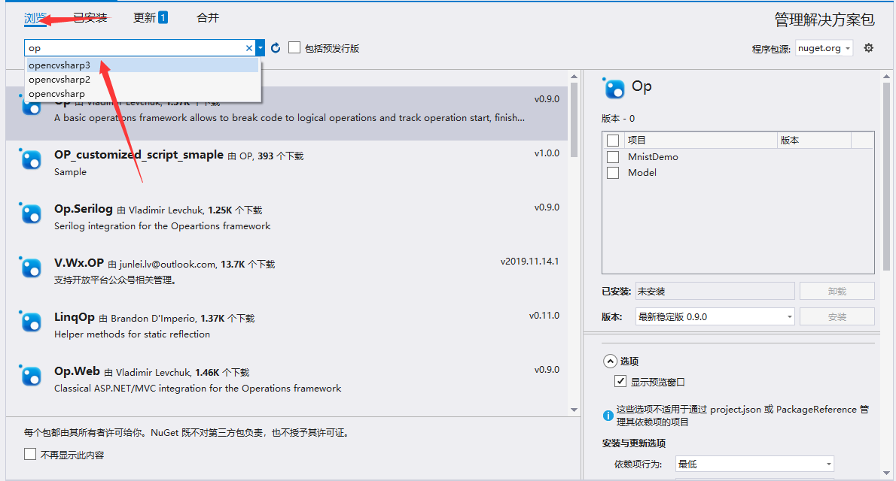
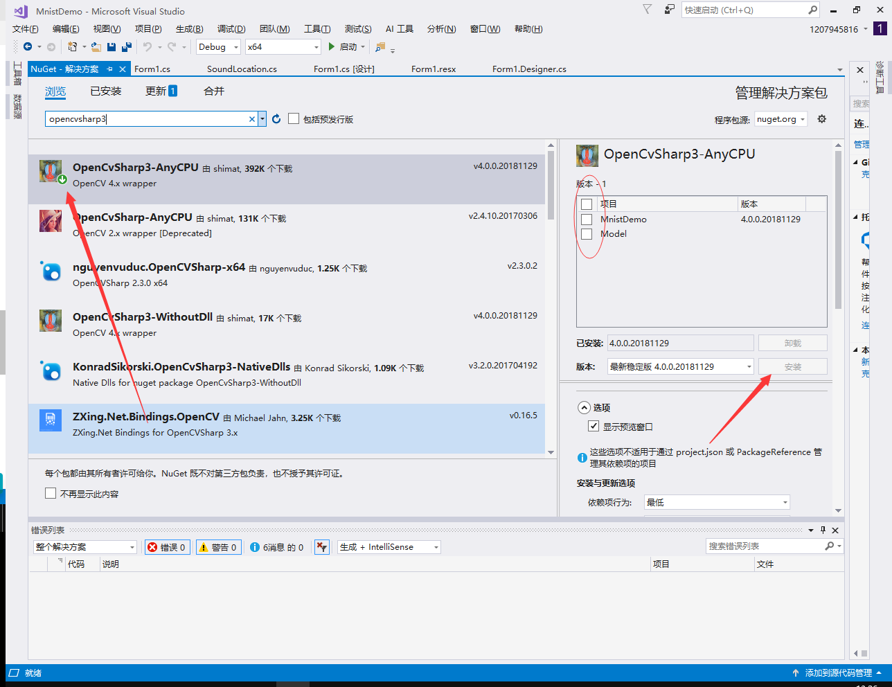
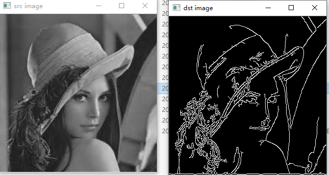
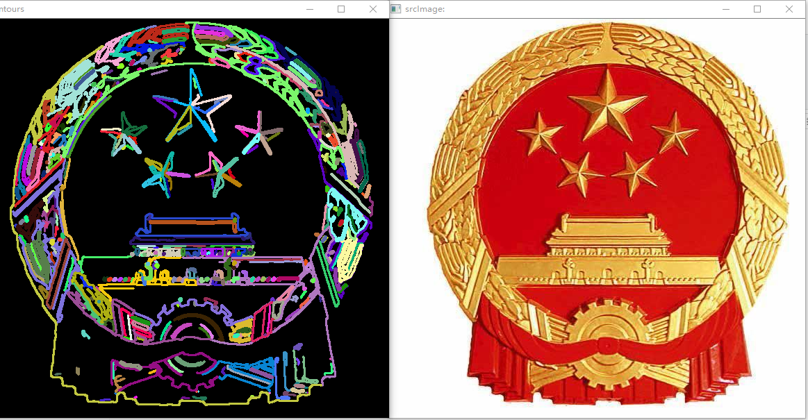
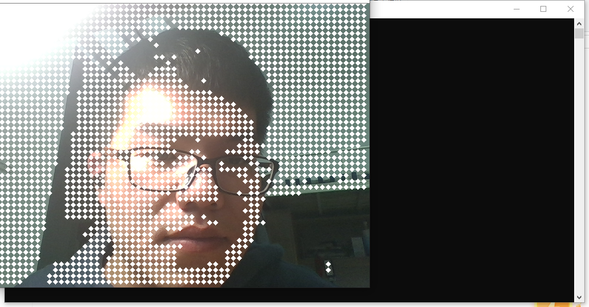

计算机视觉
----
摘要
---

在学习了用OpenCV来进行图像处理之后，结合微软visualStudio2017平台，基于ONNXRuntime或者Windows Machine Learning我们可以对计算机视觉做一些工作。比如利用训练模型来完成看图识熊、手写数字识别以及YOLO目标检测。在完成这些工作之后，我进一步地学习了C#进行UI设计，将手写数字识别的Demo的UI进行了完善。利用OpenCVSharp进行图片预处理、以及自制了一个能够调用摄像头的马赛克相机。在经过代码调试后均能实现正常的功能。相信在做了这些预处理之后，识别能够变得更加准确有效。

关键词（3-5个）
-----
计算机视觉 opencv OpenCVSharp C# ONNXRuntime

引言
---
基于手写字识别Demo的UI设计，以及计算机视觉的预处理工作。

正文
---

# 1.基于ONNX Runtime的手写数字识别的UI设计
-----------
## 1.1概述

在第一阶段实现了手写数字识别的UI设计。C#的UI设计重点在于控件对事件的绑定及图片的添加。另外若要实现两位数的识别，可以使用拼接的方法来加入一个新的pictureBox，通过修改尺寸，使它与之前的pictureBox大小保持一致。然后在识别区域添加一个新的label控件。同样的，通过修改尺寸使其与前者保持一致。

## 1.2UI设计效果如图：

## 1.3过程

图片一共有如下几种布局形式：
**Zoom**、**Center**、**Title**、**Stretch**、**None**

## 过程中的问题：
在打开MinistDemo之后，完成了图片字体布局之后，我运行发现还是空白的。

## 解决方案：
在经过网络查找后，我发现问题所在：没有生成新的解决方案。
这时候需要：

重新生成解决方案，再编译，运行即可。

## 1.4总结

    基于ONNX Runtime的手写数字识别的进一步就是对手写字程序进行Ui设计，加上各式各样的图片，使其美观易用。另外我还可以往里面加橡皮擦、加background music等基本功能，能够最大程度地使其功能丰富、完善起来。

# 2.OpenCVSharp的安装
-----

## 2.1OpenCVSharp简介
OpenCvSharp是一个OpenCV的.Net wrapper，应用最新的OpenCV库开发，使用习惯比EmguCV更接近原始的OpenCV，有详细的使用样例供参考。该库采用LGPL发行，对商业应用友好。使用OpenCvSharp，可用C#，VB.NET等语言实现多种流行的图像处理(image processing)与计算机视觉(computer vision)算法。 

1.相较于SharperCV与OpenCVDotNet，OpenCvSharp直接封装了更多的OpenCV方法，降低学习难度。

2.大部分了继承了IDisposable接口，方便使用using语句块。

3.不强加面向对象思维，可以直接调用原生风格的OpenCV方法。

4.可以将IplImage直接转为Bitmap(GDI+) 或者WriteableBitmap(WPF)。

5.支持Mono。可以运行于支持Mono的任何平台上(如Linux，BSD，Mac OS X等)。

## 2.2OpenCVSharp安装流程

在vs2017的工具->nuget包管理器->管理解决方案的nuget程序包

然后再在浏览中输入OPenCVSharp，选中项目下载即可。

# 3.利用OpenCVSharp进行计算机视觉预处理
-------
在成功安装好OpenCVSharp后，先用一个基础的Lenna例程来致敬经典。

### 代码展示：

    using System.Text;
    using System.Threading.Tasks;
    using OpenCvSharp;
    namespace Lenna
    {
        public class Class1
        {
            static void Main()
            {
                Mat src = new Mat("lenna.jpg", ImreadModes.Grayscale);
                // Mat src = Cv2.ImRead("lenna.png", ImreadModes.GrayScale);
                Mat dst = new Mat();

                Cv2.Canny(src, dst, 50, 200);
                using (new Window("src image", src))
                using (new Window("dst image", dst))
                {
                    Cv2.WaitKey();
                }
            }

        }
    }

利用OpenCVSharp的库函数设计一个图片预处理程序：

    用于把图片转化为灰度，进行滤波运算、Canny边缘检测

并用counter()来获得图像轮廓、通过重画的方式将处理过后的图像

画在空白画布上。

### 代码展示如下：

    using System;
    using System.Collections.Generic;
    using System.Linq;
    using System.Text;
    using System.Threading.Tasks;
    using OpenCvSharp;
    using OpenCvSharp.Extensions;
    namespace OpenCvSharp_03
    {
        class Program
        {

            static void Main(string[] args)
            {

             Mat srcImage = Cv2.ImRead(@"C:\Users\Thinkpad x260\source\repos\findContours\findContours\bin\Debug\1.jpg");
                Mat dst_Image = MyFindContours(srcImage);
                Cv2.ImShow("srcImage:", srcImage);
                Cv2.ImShow("contours", dst_Image);
                Cv2.WaitKey();

            }
            public static Mat MyFindContours(Mat srcImage)
            {
                //转化为灰度图
                Mat src_gray = new Mat();
                Cv2.CvtColor(srcImage, src_gray, ColorConversionCodes.RGB2GRAY);

                //滤波
                Cv2.Blur(src_gray, src_gray, new Size(3, 3));

                //Canny边缘检测
                Mat canny_Image = new Mat();
                Cv2.Canny(src_gray, canny_Image, 100, 200);

                //获得轮廓
                Point[][] contours;
                HierarchyIndex[] hierarchly;
                Cv2.FindContours(canny_Image, out contours, out hierarchly, RetrievalModes.Tree, ContourApproximationModes.ApproxSimple, new Point(0, 0));

                //将结果画出并返回结果
                Mat dst_Image = Mat.Zeros(canny_Image.Size(), srcImage.Type());
                Random rnd = new Random();
                for (int i = 0; i < contours.Length; i++)
                {
                    Scalar color = new Scalar(rnd.Next(0, 255), rnd.Next(0, 255), rnd.Next(0, 255));
                    Cv2.DrawContours(dst_Image, contours, i, color, 2, LineTypes.Link8, hierarchly);
                }
                return dst_Image;
            }
        }
    }

今年是伟大的祖国70岁生日，用渲染过后的国徽来致敬我们伟大的祖国、祝祖国永远繁荣昌盛！

# 4.设计一个程序调用摄像头并进行模糊处理
--------
### 效果展示：

### 代码展示：

    using System;
    using System.Collections.Generic;
    using System.Linq;
    using System.Text;
    using OpenCvSharp;  //引用

    namespace CvCam
    {
        class Program
        {
            static VideoCapture cap = new VideoCapture();

            static void Main(string[] args)
            {
                CamFunc_00();
                // CamFunc_01();
            }

            static void CamFunc_00()                     //固定背景对比,获取第一帧背景，启动后，摄像头的位置不能动
            {
                Mat bgMat = new Mat();
                Mat capMat = new Mat();

                bool isFirstFrame = true; 
                //判断是不是第一帧

                cap.Open(0); 

                //打开摄像头
                if (!cap.IsOpened()) return;

                //判断摄像头是否已经打开

                while (true)   

                //逐帧获取摄像头画面

                {
                    capMat = cap.RetrieveMat(); 

                    //获取摄像头画面

                    if (capMat.Empty()) continue;
                    //   Cv2.CvtColor(capMat, capMat, ColorConversionCodes.BGR2GRAY); 

                    //转成灰度图

                    if (isFirstFrame)
                    {
                        isFirstFrame = false;
                        bgMat = capMat;
                    }

                    for (int i = 0; i < capMat.Rows; i += 10)

                    {
                        for (int j = 0; j < capMat.Cols; j += 10)

                        {
                        
        if (Math.Abs(capMat.Get<Vec3b>(i, j).Item0 - bgMat.Get<Vec3b>(i, j).Item0) > 50 || Math.Abs(capMat.Get<Vec3b>(i, j).Item1 - bgMat.Get<Vec3b>(i, j).Item1) > 50 || Math.Abs(capMat.Get<Vec3b>(i, j).Item2 - bgMat.Get<Vec3b>(i, j).Item2) > 50)

                            {
                                Cv2.Circle(capMat, new Point(j, i), 2, Scalar.White, 4); 
    //画圆，在capMat的(j,i)位置画半径为2，厚度为4的白色的实心圆
                            }
                        }
                    }

                    Cv2.ImShow("CamFunc_00", capMat);

                    //显示

                    Cv2.WaitKey(20);
                }
            }

            static void CamFunc_01()     
            
            //前后两帧对比，此时物体需要一直移动才能被检测出

            {
                Mat lastMat = new Mat();
                Mat capMat = new Mat();

                bool isEvenFrame = true;           
                
                //判断是不是偶数帧，即为参照帧    

                cap.Open(0); 

                //打开摄像头

                if (!cap.IsOpened()) return;

                //判断摄像头是否已经打开

                while (true)

                //逐帧获取摄像头画面

                {
                    capMat = cap.RetrieveMat();

                    //获取摄像头画面

                    if (capMat.Empty()) continue;
                    //   Cv2.CvtColor(capMat, capMat, ColorConversionCodes.BGR2GRAY); 

                    //转成灰度图

                    if (isEvenFrame)
                    {
                        isEvenFrame = false;
                        lastMat = capMat;
                    }

                    else
                    {
                        for (int i = 0; i < capMat.Rows; i += 10)  

                        //遍历capMat所有像素

                        {
                            for (int j = 0; j < capMat.Cols; j += 10)
                            {
                            
                                if (Math.Abs(capMat.Get<Vec3b>(i, j).Item0 - lastMat.Get<Vec3b>(i, j).Item0) > 50 || Math.Abs(capMat.Get<Vec3b>(i, j).Item1 - lastMat.Get<Vec3b>(i, j).Item1) > 50 || Math.Abs(capMat.Get<Vec3b>(i, j).Item2 - lastMat.Get<Vec3b>(i, j).Item2) > 50)
                                {
                                    Cv2.Circle(capMat, new Point(j, i), 2, Scalar.White, 4); 
                                    
    //画圆，在capMat的(j,i)位置画半径为2，厚度为4的白色的实心圆

                                }
                            }
                        }
                        isEvenFrame = true;
                    }
                    Cv2.ImShow("CamFunc_01", capMat); //显示
                    Cv2.WaitKey(20);

                }
            }
        }
    }

### 功能简述

    这里面调度摄像头的函数为cap.Open()并且启动它的前提是，通过固定背景与动态的第一帧进行对比，当发现与固定的背景不一致时，即发生了相对运动，则可以调度摄像头工作。逐帧的获取图像，并进行灰度处理，前后两帧进行对比，当且仅当物体发生移动的时候才能被摄像头检出。这凸显了机器视觉这一主题。最后通过画圆函数cv2.Circle来画出哪些小圆片，圆片的半径可以调整。

# 5.总结

计算机视觉已经走进了我们的日常生活，无论是各式各样机器人、还是各种各样的人脸识别、人脸支付系统、亦或是无人驾驶的汽车等都离不开计算机视觉技术。计算机视觉在AI和大数据时代极大程度上为我们带来了更好地生活体验。它来源于最初始的数字图像处理、信号与系统以及计算机算法编程。在交叉融合后，诞生了更多更新、功能更强大的计算机视觉工具、计算机视觉处理库。比如opencv、Ros系统中的机器视觉库等等。我们提供这门课程，在龚老师的指导下得以初窥门径。兴趣是最好的老师，龚老师提供各种有趣的程序例程，吸引我们走进计算机视觉的世界。

这门课也是进入计算机专业课学习以来第一次接触到智能科学领域的课程，第一次接触Github，相比之前学习的许多经典理论课程而言，这门课它更前沿、更吸引人，大量学习运用微软提供的工具和模型进行实验。万丈高楼平地起，一切前沿的理论都是基于前面的基础理论几十年上百年的积累才能有今天繁荣蓬勃的盛景。AI在今天能这么hot绝对不是偶然现象。它是多种学科走向交叉的必然结果，也是无数计算机科学家、工程师、数以万计的开发者智慧的结晶。也许在不远的将来，计算机视觉将助力AI,真正实现AI+电动化汽车。
在学习这门课后，激发起我浓厚的学习兴趣，励志为人工智能科学领域贡献自己的力量。相信在深度拥抱开源的时代，无数的开发者用上百亿行代码构筑的人工智能，一定能够更好地为人类发展和探索未知领域服务！

最后感谢湖北汽车工业学院汽车工程师学院龚家元老师为我们带来精彩的计算机视觉课程！在接下来的学习中，学会总结和思考，脚踏实地地做好基础理论学习工作的同时，开拓眼界去看最前沿的东西。

参考文献
----
C# WinForm合集:
<https://www.cnblogs.com/mq0036/category/1402768.html>

C# opencvsharp学习笔记:
<https://blog.csdn.net/zanllp/article/details/79828968>

阿里云 云栖社区：计算机视觉库/人脸识别开源软件:
<https://yq.aliyun.com/articles/63292?spm=a2c4e.11155472.0.0.5a262367LeCcmd>

基于OpenCVSharp的图像处理软件:
<https://blog.csdn.net/you_big_father/article/details/86088531>

《数字图像处理》 冈萨雷斯 第三版

《opencv3编程入门》 毛星云 2015版

《GitHub入门与实践》 大塚弘记 （日本）

