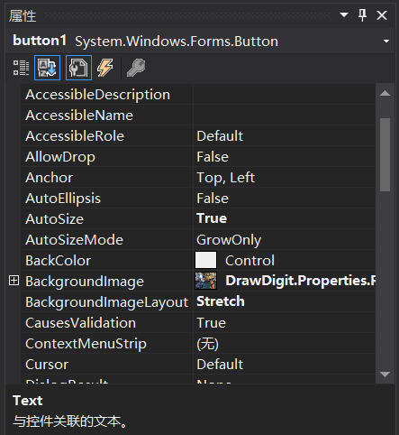
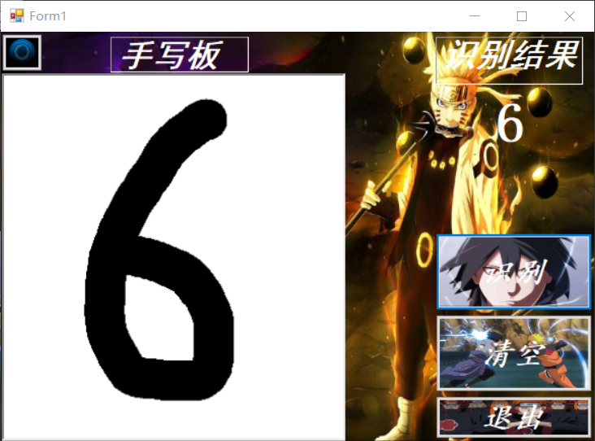
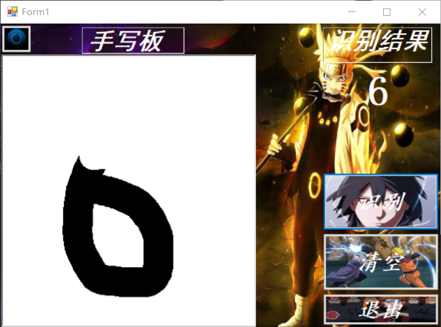
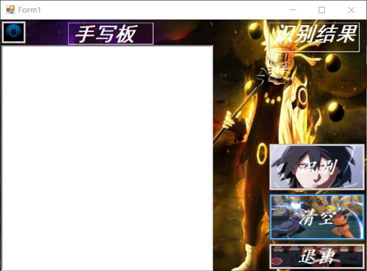
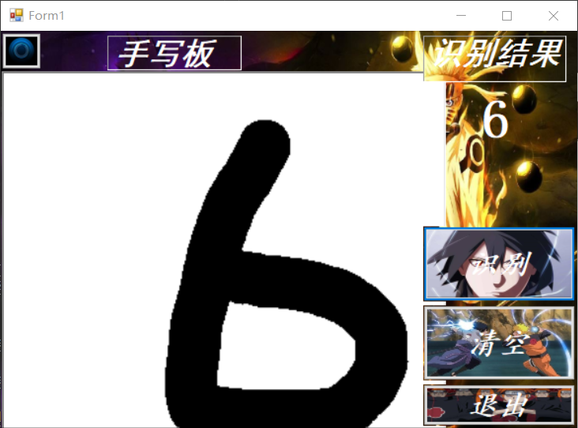
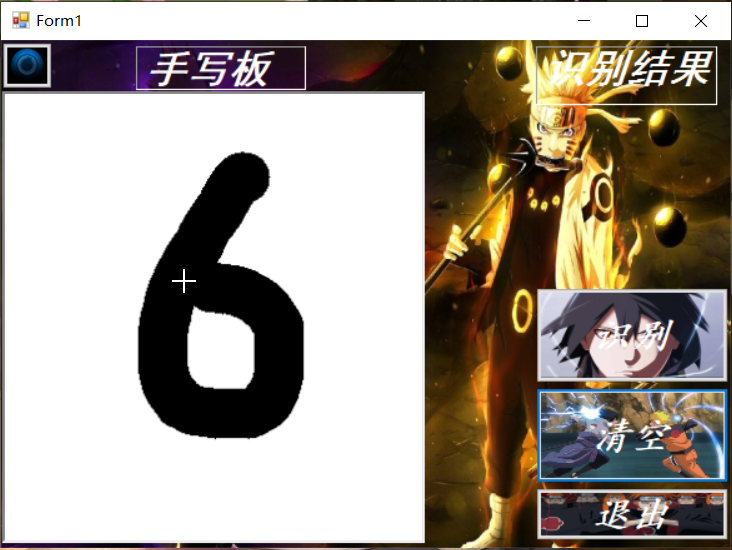
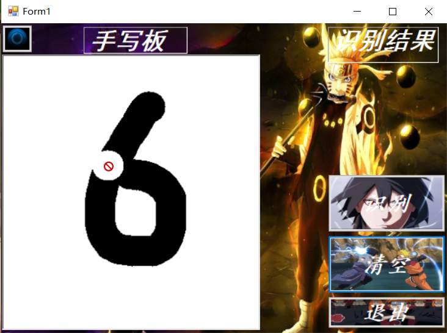
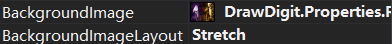

# 基于 OnnxRuntime 实现识别手写字及其它功能
## 摘要
这次实验对中期报告中提出的目标加以实现，通过查找资料与调试实现了用C#在原有项目的基础上实现播放音乐，缩放界面等功能，最终做出了一个界面较为美观，能实现一些功能的程序，通过这次的实验，我对C#语言有了一定的了解与掌握，对人工智能有了初步的了解与学习。

## 关键词
识别手写字 擦除墨迹 播放音乐 缩放界面 美化UI 人工智能
## 引言
这次报告我对实验从基本原理，基本思路，基本过程，关键代码描述，测试结果，分析和总结这六个方面做了论述，简要的描述了基于 OnnxRuntime 实现识别手写字及其它功能是如何实现的。

## 正文
### 一.基本原理
通过调用OnnxRuntime的模型实现识别手写字
### 二.基本思路
在之前学习的基于 OnnxRuntime 实现识别手写字的程序中加入其他元素来美化UI并实现一些功能。
### 三.基本过程
由于我的程序是基于 OnnxRuntime 实现识别手写字的程序，如何实现识别手写字的过程之前编写过所以在这里不做赘述。

我在程序中新加入了识别，退出，音乐播放等按钮，添加了鼠标右键相关的事件，滚轮相关的事件，并美化了UI。

1. 通过修改按钮属性改变按钮的背景图片与字体等
2. 加入播放音乐的函数并与按钮绑定
 ```private void button4_Click(object sender, EventArgs e)
        {
            SoundPlayer player = new SoundPlayer("bgm.wav");
            bool isPlaying = false;
            if (isPlaying)
                player.Stop();
            else
                player.Play();
            player.Play();
        }
        
 ```
3. 加入退出函数并与按钮绑定
```
private void button3_Click(object sender, EventArgs e)
        {
            Application.Exit();
        }
```
4.加入滚轮缩放函数并与按钮绑定
```
void Form1_MouseWheel(object sender, MouseEventArgs e)
        {
            double scale = 1;
            if (pictureBox1.Height > 0)
            {
                scale = (double)pictureBox1.Width / (double)pictureBox1.Height;
            }
            pictureBox1.Width += (int)(e.Delta * scale);
            pictureBox1.Height += e.Delta;
        }
```
### 四.关键代码描述
为音乐按钮绑定事件
```
        private void button4_Click(object sender, EventArgs e)
        {
            SoundPlayer player = new SoundPlayer("bgm.wav");
            bool isPlaying = false;
            if (isPlaying)
                player.Stop();
            else
                player.Play();
            player.Play();
        }
```

```
private Bitmap digitImage;//用来保存手写数字
        private Point startPoint;//用于绘制线段，作为线段的初始端点坐标
        //private Mnist model;//用于识别手写数字
        private const int MnistImageSize = 28;//Mnist模型所需的输入图片大小

        private void Form1_Load(object sender, EventArgs e)
        {
            this.MouseWheel += Form1_MouseWheel;
            //当窗口加载时，绘制一个白色方框
            //model = new Mnist();
            digitImage = new Bitmap(pictureBox1.Width, pictureBox1.Height);
            Graphics g = Graphics.FromImage(digitImage);
            g.Clear(Color.White);
            pictureBox1.Image = digitImage;
        }

        private void pictureBox1_MouseDown(object sender, MouseEventArgs e)
        {
            //当鼠标左键或右键被按下时，记录下需要绘制的线段的起始坐标
            Cursor = Cursors.Cross;
            startPoint = (e.Button == MouseButtons.Left) ? e.Location : startPoint;
            startPoint = (e.Button == MouseButtons.Right) ? e.Location : startPoint;
        }

        private void pictureBox1_MouseMove(object sender, MouseEventArgs e)
        {
            //当鼠标在移动，且当前处于绘制状态时，根据鼠标的实时位置与记录的起始坐标绘制线段，同时更新需要绘制的线段的起始坐标，鼠标左键按住绘制黑色线段，右键按住绘制白色线段
            if (e.Button == MouseButtons.Left)
             
                {
                Graphics g = Graphics.FromImage(digitImage);
                Pen myPen = new Pen(Color.Black, 40);
                myPen.StartCap = LineCap.Round;
                myPen.EndCap = LineCap.Round;
                g.DrawLine(myPen, startPoint, e.Location);
                pictureBox1.Image = digitImage;
                g.Dispose();
                startPoint = e.Location;
            }
            if (e.Button == MouseButtons.Right)

            {
                Cursor = Cursors.No;
                Graphics g = Graphics.FromImage(digitImage);
                Pen myPen = new Pen(Color.White, 40);
                myPen.StartCap = LineCap.Round;
                myPen.EndCap = LineCap.Round;
                g.DrawLine(myPen, startPoint, e.Location);
                pictureBox1.Image = digitImage;
                g.Dispose();
                startPoint = e.Location;
            }
        }


        private void button1_Click(object sender, EventArgs e)
        {
            //当点击清除时，重新绘制一个白色方框，同时清除label1显示的文本
            digitImage = new Bitmap(pictureBox1.Width, pictureBox1.Height);
            Graphics g = Graphics.FromImage(digitImage);
            g.Clear(Color.White);
            pictureBox1.Image = digitImage;
            label1.Text = "";
        }

        private void button2_Click(object sender, EventArgs e)
        {
            //当鼠标左键释放时
            //开始处理图片进行推理     
                {
                Bitmap digitTmp = (Bitmap)digitImage.Clone();//复制digitImage
                //调整图片大小为Mnist模型可接收的大小：28×28
                using (Graphics g = Graphics.FromImage(digitTmp))
                {
                    g.InterpolationMode = InterpolationMode.HighQualityBicubic;
                    g.DrawImage(digitTmp, 0, 0, MnistImageSize, MnistImageSize);
                }


                //将图片转为灰阶图，并将图片的像素信息保存在list中
                float[] imageArray = new float[MnistImageSize * MnistImageSize];
                for (int y = 0; y < MnistImageSize; y++)
                {
                    for (int x = 0; x < MnistImageSize; x++)
                    {
                        var color = digitTmp.GetPixel(x, y);
                        var a = (float)(0.5 - (color.R + color.G + color.B) / (3.0 * 255));

                        imageArray[y * MnistImageSize + x] = a;

                    }
                }

                // 设置要加载的模型的路径，跟据需要改为你的模型名称
                string modelPath = AppDomain.CurrentDomain.BaseDirectory + "mnist.onnx";

                using (var session = new InferenceSession(modelPath))
                {
                    var inputMeta = session.InputMetadata;
                    var container = new List<NamedOnnxValue>();


                    // 用Netron看到需要的输入类型是float32[1, 1, 28, 28]
                    // 第一维None表示可以传入多张图片进行推理
                    // 这里只使用一张图片，所以使用的输入数据尺寸为[1, 1, 28, 28]
                    var shape = new int[] { 1, 1, MnistImageSize, MnistImageSize };
                    var tensor = new DenseTensor<float>(imageArray, shape);

                    // 支持多个输入，对于mnist模型，只需要一个输入，输入的名称是input3
                    container.Add(NamedOnnxValue.CreateFromTensor<float>("Input3", tensor));

                    // 推理
                    var results = session.Run(container);

                    // 输出结果: Plus214_Output_0
                    IList<float> imageList = results.FirstOrDefault(item => item.Name == "Plus214_Output_0").AsTensor<float>().ToList();

                    // Query to check for highest probability digit
                    var maxIndex = imageList.IndexOf(imageList.Max());

                    // Display the results
                    label1.Text = maxIndex.ToString();


                }


            }

        }
```
退出函数
```
private void button3_Click(object sender, EventArgs e)
        {
            Application.Exit();
        }
```
缩放函数
```
void Form1_MouseWheel(object sender, MouseEventArgs e)
        {
            double scale = 1;
            if (pictureBox1.Height > 0)
            {
                scale = (double)pictureBox1.Width / (double)pictureBox1.Height;
            }
            pictureBox1.Width += (int)(e.Delta * scale);
            pictureBox1.Height += e.Delta;
        }
```
### 五.测试结果
ui设计

左上角音响为播放音乐功能，点击播放音乐，再次点击暂停

手写识别功能

擦除功能

清空功能

缩放功能

光标美化


### 六.分析和总结
#### 分析
在调试代码的过程中，我遇到了如下几个问题
>1.播放音乐中所支持的格式为.wav，我在下载歌曲时下载的是.mp3文件，直接将文件后缀改为.wav时程序仍然报错，后来将.mp3文件转码为.wav后成功的解决了这个问题。

>2.将按钮图片改为自己挑选的图片后图片显示不完整，后来将BackgroundImageLayout改为Stretch后得到解决。
#### 总结
本次实验，是对我编程能力的进一步锻炼，也是一种考验。从中获得的诸多收获，也是很可贵的，是十分有意义的。经过这次实验，我收获了很多，一方面学习到了许多以前没学过的专业知识与知识的应用，另一方面还提高了自我动手做项目的本领。在实训中我学到了许多新的知识。是一个让我把书本上的理论知识运用于实践中的好机会，原先，学的时候感叹学的资料太难懂，此刻想来，有些其实并不难，关键在于理解。在这次实训中还锻炼了我其他方面的能力，提高了我的综合素质。首先，它锻炼了我做项目的能力，提高了独立思考问题、自我动手操作的能力，在工作的过程中，复习了以前学习过的知识，并掌握了一些应用知识的技巧等。
## 参考文献
https://github.com/gjy2poincare/RobotVision/tree/master/Lectures/5-%E7%9B%AE%E6%A0%87%E6%A3%80%E6%B5%8B%E4%B8%8E%E8%AF%86%E5%88%AB1-AI301/1-AI-edu-MNIST/HUAT-%E6%96%B9%E6%A1%883

https://blog.csdn.net/Dream_sunny/article/details/79982579

https://blog.csdn.net/guankeliang/article/details/82910524

https://www.cnblogs.com/jinqier/p/3497201.html

