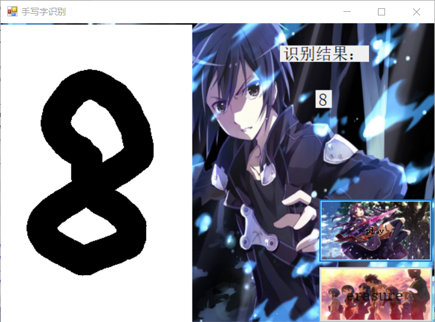
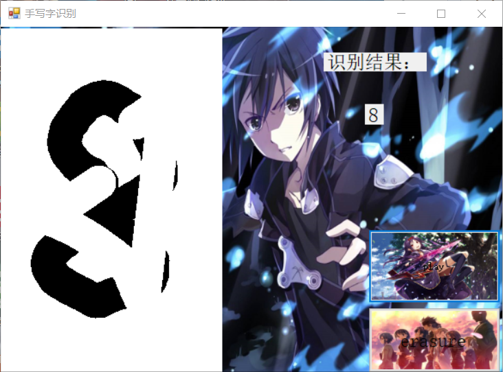

# 基于 MNIST 数据集的手写数字识别优化
## 摘要
MNIST是一个非常庞大的手写数字数据库。而我们这里的手写数字识别是符号识别的一个分支，只能识别10个数字，所以本次实验是在这10个数字的基础上，能够进一步优化，比如擦除，界面优化以及音乐的播放。
## 关键字
MNIST 手写数字识别 界面优化 音乐的播放
## 引言
在本次的论文中，我将介绍如何完成界面优化和音乐播放,这个的原界面本身是空白的，我会将空白的界面改为自己喜欢的图片，同时添加一些音乐。
并且在本次设计中，我对mnist有了进一步的了解，加深我对代码的理解。

## 正文
### 1.mnist
MNIST数据集是机器学习领域中非常经典的一个数据集，由60000个训练样本和10000个测试样本组成，每个样本都是一张28 * 28像素的灰度手写数字图片。它包括四个部分，训练集（Training set）、训练集标签（Training set labels）、测试集（Test set）、测试集标签（Test set labels）。一般情况下，我们可以在 http://yann.lecun.com/exdb/mnist/ 获取MNIST数据集。
### 2.美化思路
如上图所示，虽然在功能上的识别没什么问题，但我认为其美观太单一，所以我想在界面上进行优化，添加自己喜欢的图片和音乐。然后，再写的基础，我添加了擦除，左键写字，右键擦除。
### 3.美化过程
首先，在Forms.cs（设计）中，更改界面，添加自己喜欢的图片，将界面和按钮的图片全部进行了更改。然后，由于我需要一个播放音乐的按钮，所以我添加了一个play的按钮，并对它进行了更改，同时这是一个新的按钮，所以需要对它进行声明，最后我在进行擦除，选择右键进行擦除，这样左键手写，右键擦除也方便。
### 4.实验代码
#### 音乐播放的代码
        private void button2_Click(object sender, EventArgs e)
        {
            SoundPlayer player = new SoundPlayer("C:\\Users\\lenovo\\Desktop\\10291.wav");
            bool isPlaying = false;
            if (isPlaying)
                player.Stop();
            else
                player.Play();
            player.Play();
        }
#### 擦除的代码
            if (e.Button == MouseButtons.Right)
            {
                Graphics g = Graphics.FromImage(digitImage);
                Pen myPen = new Pen(Color.White, 40);
                myPen.StartCap = LineCap.Round;
                myPen.EndCap = LineCap.Round;
                g.DrawLine(myPen, startPoint, e.Location);
                pictureBox1.Image = digitImage;
                g.Dispose();
                startPoint = e.Location;
            }

### 5.实验结果
#### 以下是界面用到的图片

#### 以下是实验结果图片

### 6.总结
在本次的设计中，需要我们自己去尝试开发，这是对我们编程能力的一种锻炼，也是一种检验。我在这次设计中获得的一些收获，这些收获对我很有意义，。第一点，学习到了新的知识，第二点，这次的设计是在老师讲的基础上做的，提高了动手能力，第三点，经过了这次的成功，在以后的编程也会更有信心。不过，在这次的设计里面，还是遇到了一些小问题，不过通过查询百度和询問同学已经解决，期待下次能做的更好，在内容上更丰富些。
## 参考文献
https://blog.csdn.net/Dream_sunny/article/details/79982579
https://blog.csdn.net/guankeliang/article/details/82910524