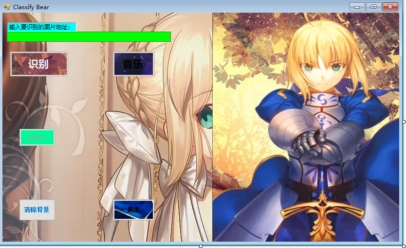
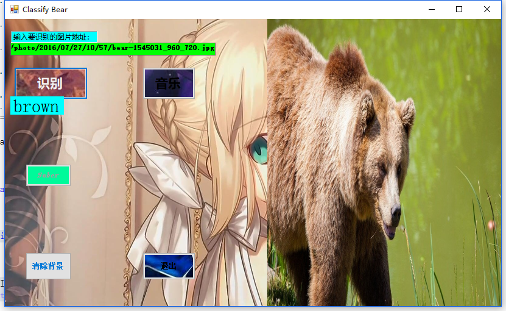
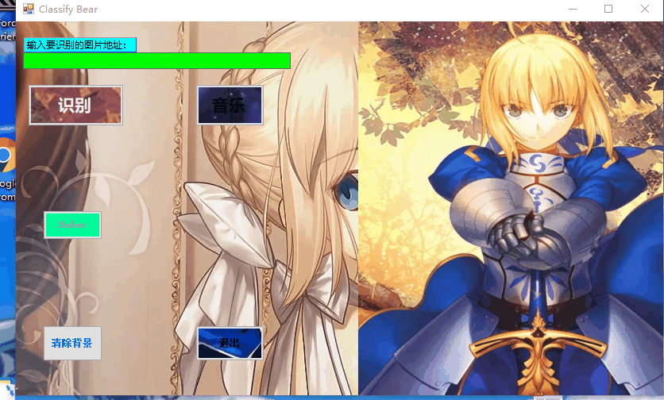
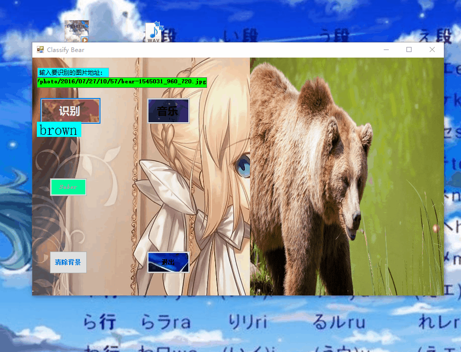
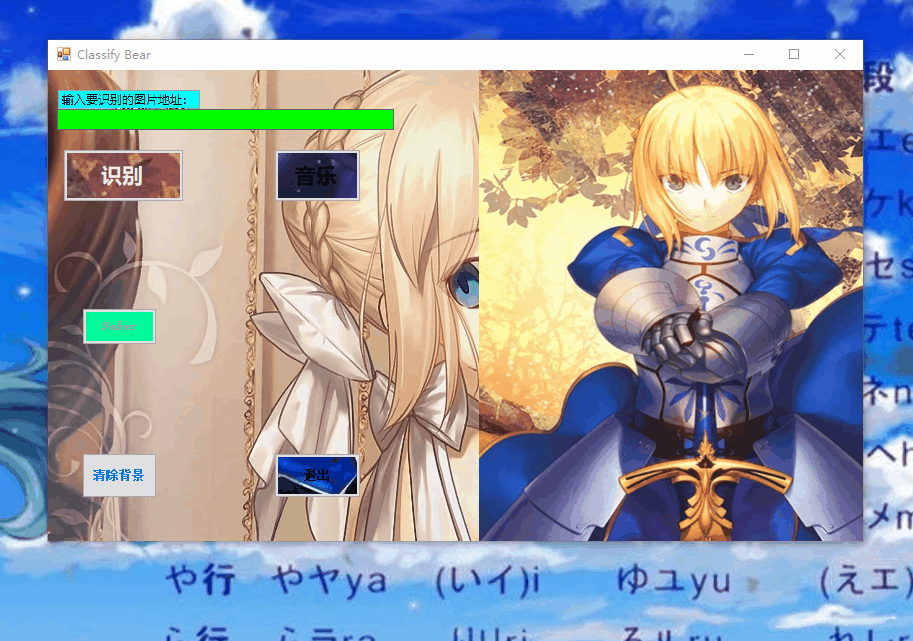

#  **基于ONNX Runtime的看图识熊界面优化**

##  **摘要**
    创建Windows窗体应用，通过老师所给步骤，来实现看图识熊并对界面进行优化，实现更多按钮的功能。

   
### **关键词**
看图识熊
界面优化
播放音乐

#### **引言**
    看图识熊，创建Windows窗体应用来设计界面，添加模型文件和OnnxRuntime库，实现看图识熊
    并添加多个按钮，实现功能。
   
# **正文**
 ## 基本原理

   通过调用OnnxRuntime的模型实现看图识熊.

##  基本思路

  基于 OnnxRuntime 实现看图识熊并且加入更多的按钮实现其功能并且美化界面。

 ## 基本过程

  基本过程与老师所给过程类似，代码大同小异，主要集中在新添加的按钮功能实现上。
  ## 关键代码描述
  
1. 添加按钮改变按钮属性改变按钮的背景图，改变界面的背景图让界面更加美观

   
2. 添加退出函数并与按钮绑定

 private void button4_Click(object sender, EventArgs e)

        {
            Application.Exit();
        }
3. 添加播放音乐函数并与按钮绑定

   先要引用 **using System.Media;**
   
    private void button3_Click(object sender, EventArgs e)

        {
            SoundPlayer player = new SoundPlayer("C:\\Users\\hasee\\source\\repos\\ClassifyBear1\\ClassifyBear1\\calon.wav");
            bool isPlaying = false;
            if (isPlaying)
                player.Stop();
            else
                player.Play();
            player.Play();
        }
4. 添加清除函数并于按钮绑定

    private void button5_Click(object sender, EventArgs e)
        {
            
            Bitmap bitmap = new Bitmap(pictureBox1.Width, pictureBox1.Height);
            Graphics g = Graphics.FromImage(bitmap);
            g.Clear(Color.White);
            pictureBox1.Image = bitmap;
            label1.Text = "";
        }

5. 添加timer控件并书写响应事件的代码 再通过按钮来调用方法
6. 
   要注意的是要先在public saber() 里 添加 **this.timer1.Stop();**
   不然会一直循环播放图片而不是点击按钮后才循环播放图片
   
    private void button2_Click_1(object sender, EventArgs e)
        {

            this.timer1.Start(); 
        }
        
        int i;
        private void timer1_Tick(object sender, EventArgs e)
        {
            i++;
            if (i == imageList1.Images.Count)
            {
                i = 0;
            }
            this.pictureBox1.Image = this.imageList1.Images[i];

        }
    
  ## 测试结果
  1. 看图识熊能够实现 
   
  2. 退出按钮能够实现 
   
  3. 清除背景能够实现 
   
  4. 循环播放本地图片能够实现 
 
  5. 播放音乐按钮能够播放本地音乐

### **分析和总结**
    通过本次用c#进行编程和分析，让我的编程能力和对代码的理解能力有了进一步的提高
    在编程碰到过的主要问题是循环播放本地图片，开始的时候通过查阅网络资料了解了timer控件
    的基本用法，但是在使用的时候碰到一个问题就是自己写的循环函数还没等我点按钮就开始自动播放本地图片，一开始有点不知所措，后来查阅资料才知道调用函数的时候应当先添加一个段代码this.timer1.Stop();还有就是播放音乐的按钮一开始要引用using System.Media;而且必须要
    .wav格式的音乐，在本次实训中我学到了一些新的知识，锻炼了我独立思考的能力，提高了我的实际动手操作能力，提高了我的综合素质。

#### **参考文献**

https://blog.csdn.net/Dream_sunny/article/details/79982579

https://blog.csdn.net/ycigwy/article/details/70242669

https://github.com/719920244/ai-edu/blob/master/B-%E6%95%99%E5%AD%A6%E6%A1%88%E4%BE%8B%E4%B8%8E%E5%AE%9E%E8%B7%B5/B3-%E5%AE%9A%E5%88%B6%E5%8C%96%EF%BC%8D%E5%9B%BE%E5%83%8F%E8%AF%86%E5%88%AB%E5%BA%94%E7%94%A8%E6%A1%88%E4%BE%8B%EF%BC%8D%E7%9C%8B%E5%9B%BE%E8%AF%86%E7%86%8A/%E5%BE%AE%E8%BD%AF-%E6%96%B9%E6%A1%881/OnnxWithRuntime.md