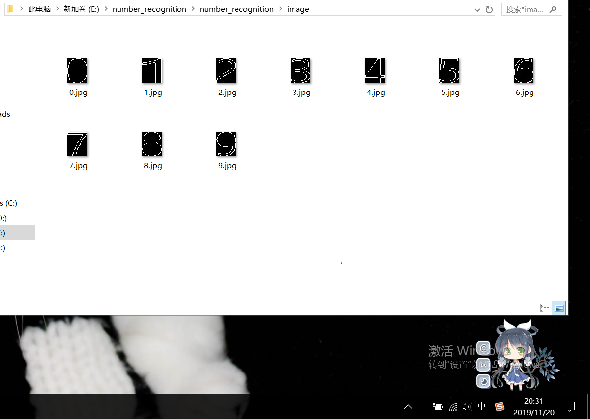
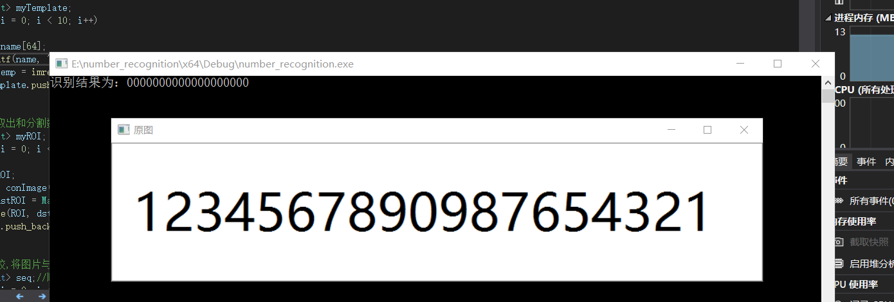
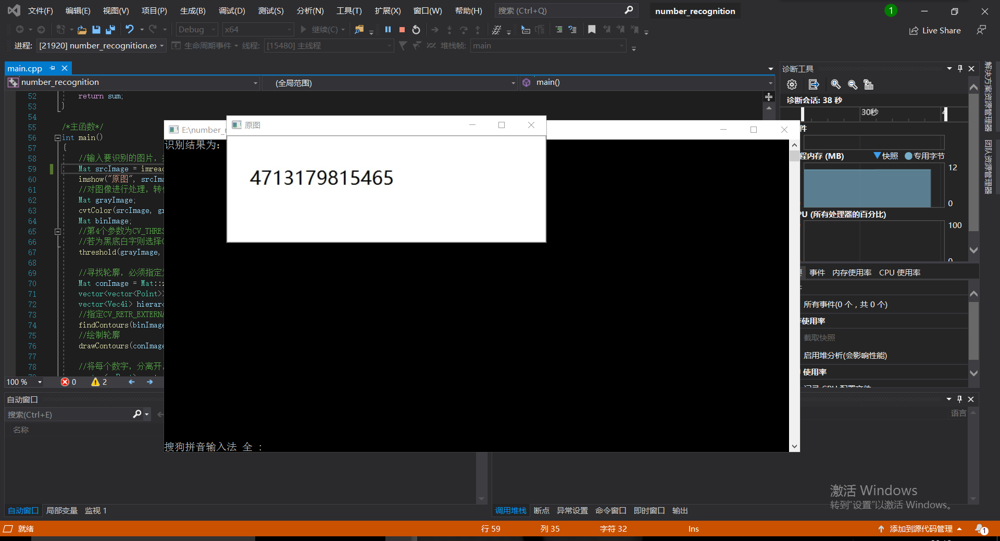

# 基于opencv的图片识别文字
### 摘要
这是一个简单的识别数字的例子，局限性是只能识别规范字体。比如本程序以一个包含0~9数字(Times New Roman字体，其他字体准确度可能会略有降低)的图片为模板，然后对提取资源图片中每个数字，进行模板匹配。优点在于理论上可以识别任何规范的图形，例如车牌识别等，本程序的核心是 matchTemplate() 这个方法。
### 引言
本文简单介绍图片字符识别的原理，主要识别图片中的数字，其他字符识别原理类似。大家应该知道，对于人类来说，可以很容易理解一张图片所表达的信息，这是人类视觉系统数万年演变进化的结果。但对于计算机这个诞生进化不到百年的 “新星”，要让它理解一张图像上的信息是一个复杂的过程。计算机理解图像是一个数字计算比较的过程。如图，我们一目了然的识别的图像中的数字，如何让计算机识别图片中的数字呢？
### 关键字
opencv，数字识别，AI
### 实验环境
opencv2.4.9加vs2017
要识别图像字符，首先需要模版库。对于识别简单字符，可自己训练，也可网上下载数据集。这里就直接用提前做好的（用photoshop制作，字体和字大小尽量和待识别字符相近，不然影响识别率），为便于识别，模版名就以数字命名。如下图所示

### 实验目标
本次实验我要做的是把0123456789印刷体数字识别出来 
### 实验步骤
#### 对图片进行预处理
首先读取待识别图像，灰度化、二值化。
//输入要识别的图片，并显示	Mat srcImage = imread("number.jpg");	imshow("原图", srcImage);	//对图像进行处理，转化为灰度图然后再转为二值图	Mat grayImage;	cvtColor(srcImage, grayImage, COLOR_BGR2GRAY);	Mat binImage;	//第4个参数为CV_THRESH_BINARY_INV是因为我的输入原图为白底黑字	//若为黑底白字则选择CV_THRESH_BINARY即可	threshold(grayImage, binImage, 100, 255, CV_THRESH_BINARY_INV);
filename：文件地址 flags：标志，读取什么样（灰度，彩色）图像hdrtype：传入的为载入什么类型(enum {LOAD_CVMAT=0,LOAD_IMAGE=1, LOAD_MAT=2 };这三个中的一个。) Mat ：保存图像的Mat对象了。
double threshold(InputArray src, OutputArray dst, double thresh, double maxval, int type) 
##### 参数信息：
* 第一个参数，InputArray类型的src，输入数组，填单通道 , 8或32位浮点类型的Mat即可。
* 第二个参数，OutputArray类型的dst，函数调用后的运算结果存在这里，即这个参数用于存放输出结果，且和第一个参数中的Mat变量有一样的尺寸和类型。
* 第三个参数，double类型的thresh，阈值的具体值。
* 第四个参数，double类型的maxval，当第五个参数阈值类型type取 THRESH_BINARY 或THRESH_BINARY_INV阈值类型时的最大值.
* 第五个参数，int类型的type，阈值类型,。
* 其它参数很好理解，我们来看看第五个参数，第五参数有以下几种类型
0: THRESH_BINARY  当前点值大于阈值时，取Maxval,也就是第四个参数，下面再不说明，否则设置为0
1: THRESH_BINARY_INV 当前点值大于阈值时，设置为0，否则设置为Maxval
2: THRESH_TRUNC 当前点值大于阈值时，设置为阈值，否则不改变
3: THRESH_TOZERO 当前点值大于阈值时，不改变，否则设置为0
4: THRESH_TOZERO_INV  当前点值大于阈值时，设置为0，否则不改变
#### 寻找数字轮廓
寻找轮廓，必须指定为寻找外部轮廓，不然一个数字可能有多个轮廓组成，比如4,6,8,9等数字
#### 对轮廓进行排序
 在排序之前呢，我们需要定义一个类，用来存放轮廓的外接矩阵以及方便后续的排序， 有了这个类之后，我们可以将一个一个轮廓外接矩阵保存于该类中。而且类中重载了比较操作符，很容易对轮廓进行排序。 排序算法的话，采用比较简单的冒泡法， 这样，sort_rect容器中的轮廓矩形是按我们输入的图片中的数字顺序存放的。
 #### 加载数字模板
 在进行数字匹配时，需要先加载模板进行比较。
 #### 分割数字
  图片经过二值化后每个像素点的值只有1和0两种，在这里黑色部分的像素点的值为0白色字体部分的值为1.先进行列扫描求每列的和。刚开始是都是黑色所以每列的和都是0，知道扫描到3的左边缘的那列的时候因为有白色所以这列的和大于0，这时候记下当前位置left，然后接着扫描，接下来每列的和都大于0，直到3的右边缘时候这列和右等于0，记下当前位置right，则right减去left则是3的宽度，高度仍为原图的高度，这样通过函数就可以把3截取出来了，但是3的上下部分没有截取，同样对图片进行行扫描，截取上下部分，就这样循环截取图片就可以吧其他数字截取下来了，但是每次截取的原图是不一样的
  #### 比较和匹配
   我采用的比较和匹配方法是，将absdiff计算模板和待识别数字的差值，然后比较出差值最小的即为最匹配的数字，从而实现匹配。在匹配前我们需要定义一个getPiexSum函数以计算两幅图片的差值的像素之和。最终运行效果图如下所示
   
   此次因为环境配置问题没有识别出正确的数字

   再次运行效果图如下
   

   ### 总结
   通过本次实验，在手写识别数字的基础上，我学会了如何通过opencv识别图片中的数字，与手写识别数字不同的是，图片识别数字需要加载图片并对图片进行预处理，还有因为识别的是多个数字，所以还需要对数字进行分割处理。并且此次使用的opencv环境是opencv3.4.1，我们之前上课所用的是opencv3.4.7，因此此次实验需要重新配置环境。 存在的不足：这种识别方式有个不好的点就是，模板的数字大小（比如我用的是48号字体大小）不能与待识别的数字的大小相差太多，否则会降低识别准确率。如果相差不是很大的话是可以准确识别的。然后该程序也只能识别单行数字，暂时还不能识别多行
   ### 参考文献

原文链接：https://blog.csdn.net/LTG01/article/details/50492556

原文链接：https://blog.csdn.net/m0_37543178/article/details/82658020