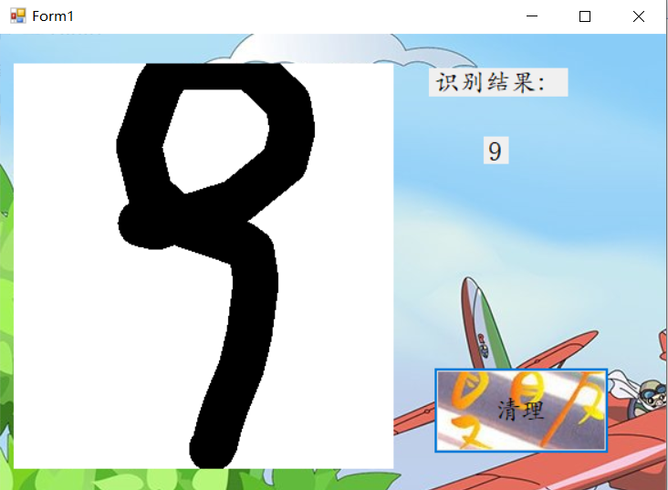
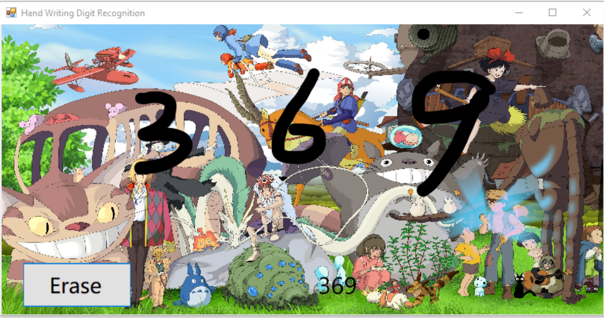

**MNIST手写字识别应用**
# 摘要
MNIST数据集是一个手写体数据集，这个数据集由四部分组成，分别是一个训练图片集，一个训练标签集，一个测试图片集，一个测试标签集；课堂上学到的MNIST手写字识别是识别单个数字的，我想优化一下，实现识别多位数字。
# 引言
  优化mnist手写字识别应用界面，尝试识别两位数。
# 一、初步想法
       
最初想设计一个基于Windows Machine Learning的图像分类（image classification）的应用，但由于无法训练模型，后来便改成MNIST手写字识别应用的优化。

# 二、思路
**步骤如下：**
  
     1.实现简单的界面，将用户用鼠标画出的数字变成图片。
     2.将生成的模型包装起来，变成有公开数据接口的类。
     3.将输入的图片进行规范化，成为数据接口能够使用的格式。
     4.最后通过模型来推理(inference)出图片应该是哪个数字，并显示出来。

# 三、动手
## 3.1获取手写的数字
  首先，打开Visual Studio，选择文件->新建->项目。

  在弹出的窗口里选择Visual C#->Windows窗体应用，项目名DrawDigit，解决方案MnistForm，点击确定。
 
 此时，Visual Studio也自动弹出了一个窗口的设计图。
 在DrawDigit项目上点击右键，选择属性，在生成一栏将平台目标从Any CPU 改为x64。
 否则，DrawDigit（32位)与它引用的MnistForm（64位）的编译平台不一致会引发System.BadImageFormatException的异常。
 然后对这个窗口做一些简单的修改:
 首先打开VS窗口左侧的工具箱，这个窗口程序需要以下三种组件：

     1.PictureBox：用来手写数字，并且把数字保存成图片
     2.Label：用来显示模型的识别结果
     3.Button：用来清理PictureBox的手写结果

 经过布局之后窗口是这样的
 
 接下来给这些组件添加事件！
 然后开始补全对应的函数体内容。

    using System; 
    using System.Collections.Generic;
    using System.ComponentModel;
    using System.Data;
    using System.Drawing;
    using System.Drawing.Drawing2D;//用于优化绘制的结果
    using System.Linq;
    using System.Text;
    using System.Threading.Tasks;
    using System.Windows.Forms;
    using MnistModel;
    namespace DrawDigit
    {
    public partial class Form1 : Form
    {
        public Form1()
        {
            InitializeComponent();
        }

        private Bitmap digitImage;
        private Point startPoint;
        private Mnist model;
        private const int MnistImageSize = 28;

        private void Form1_Load(object sender, EventArgs e)
        {
            
            model = new Mnist();
            digitImage = new Bitmap(pictureBox1.Width, pictureBox1.Height);
            Graphics g = Graphics.FromImage(digitImage);
            g.Clear(Color.White);
            pictureBox1.Image = digitImage;
        }

        private void clean_click(object sender, EventArgs e)
        {
           
            digitImage = new Bitmap(pictureBox1.Width, pictureBox1.Height);
            Graphics g = Graphics.FromImage(digitImage);
            g.Clear(Color.White);
            pictureBox1.Image = digitImage;
            label1.Text = "";
        }

        private void pictureBox1_MouseDown(object sender, MouseEventArgs e)
        {
            
            startPoint = (e.Button == MouseButtons.Left) ? e.Location : startPoint;
        }

        private void pictureBox1_MouseMove(object sender, MouseEventArgs e)
        {
           
            if (e.Button == MouseButtons.Left)
            {
                Graphics g = Graphics.FromImage(digitImage);
                Pen myPen = new Pen(Color.Black, 40);
                myPen.StartCap = LineCap.Round;
                myPen.EndCap = LineCap.Round;
                g.DrawLine(myPen,startPoint, e.Location);
                pictureBox1.Image = digitImage;
                g.Dispose();
                startPoint = e.Location;
            }
        }

        private void pictureBox1_MouseUp(object sender, MouseEventArgs e)
    }
    }
## 3.2把模型包装成一个类
    
首先，我们在解决方案MnistForm下点击鼠标右键，选择添加->新建项目，在弹出的窗口里选择AI Tools->Inference->模型推理类库，名称叫做MnistModel，点击确定  然后弹出一个模型推理类库创建向导，导入训练好的模型。

# 四、效果展示
 
# 五、扩展
   **尝试识别多个数字**

已经支持了单个手写数字的识别，那能不能支持多个手写数字的识别呢？在现有的应用里尝试一次写下两位数字，并不能识别，因为之前训练的Mnist数据集只覆盖了单个的手写数字，在程序中也并未对字迹图形做额外的处理。改善方法是，Mnist模型已经能很好的识别单个数字，只需要把多个数字分开，让Mnist模型一个一个进行是识别。
     
**分割多个数字**
       
可以设计一种基本的分割规则：在水平面上的投影相重叠的笔画，我们就认为它们同属于一个数字。
   笔画和水平方向上投影的关系示意如下图：
   
    因此书写时，就要求不同的数字之间尽量隔开。当然为了尽可能处理不经意的重叠，我们还可以为重叠部分相对每一笔画的位置设定一个阈值，如至少进入笔画一端的10%以内。
应用这样的规则后，我们就能比较好的把多个手写数字分割开，并能利用Visual Studio Tools for AI提供的批量推理功能，一次性对所有分割出的图形做推理。
多个手写数字识别的最终效果如图：

# 六、总结
   这次课程设计，最开始我是准备做一个基于Windows Machine Learning的图像分类的应用，对于这方面是比较感兴趣的，所以最初就选择了这个课题，但通过前期实验发现自己训练模型需要Azure账号，然后就放弃了做图像分类转而做MNIST手写字识别应用优化，从最开始的了解MNIST数据的基本原理到最后改进代码，主要锻炼了动手能力，检验上课的学习成果，查找资料的同时拓宽了自己的知识面。

 

 