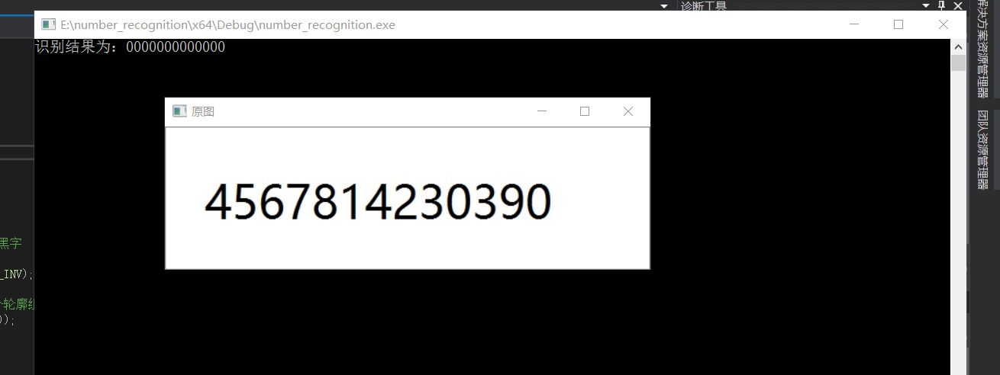

# 基于Opencv的图片数字识别
### 一、摘要
机器学习(ML)是OpenCV模块之一，对于常见的数字识别与英文字母识别都可以做到很高的识别率，完成这类应用的主要思想与方法是首选对训练图像数据完成预处理与特征提取，根据特征数据组成符合OpenCV要求的训练数据集与标记集，然后通过机器学习的KNN、SVM、ANN等方法完成训练，训练结束之后保存训练结果，对待检测的图像完成分割、二值化、ROI等操作之后，加载训练好的分类数据，就可以预言未知分类。
### 关键字
opencv、数字识别、数字轮廓
### 二、引言
图片数字的识别是模式识别及机器学习的一个重要应用,应用范围非常广泛。图片数字识别有着极为广泛的应用前景,可以应用于大规模数据统计、财务、税务、金融、邮件分拣等方面,这也正是它受到世界各国的研究工作者重视的一个主要原因。图片数字识别方面,经过多年研究,研究者们已经开始把它向各种实际应用推广,为图片数据的高速自动输入提供了一种解决方案。
### 一、关于opencv
OpenCV的全称是Open Source Computer Vision Library，是一个跨平台的计算机视觉库。

OpenCV用C++语言编写，它的主要接口也是C++语言，但是依然保留了大量的C语言接口。该库也有大量的Python, Java and MATLAB/OCTAVE (版本2.5)的接口。这些语言的API接口函数可以通过在线文档获得。现在也提供对于C#, Ruby的支持。

它有以下特点：

1) 开放的C/C++源码
2) 基于Intel处理器指令集开发的优化代码
3) 统一的结构和功能定义
4) 强大的图像和矩阵运算能力
5) 方便灵活的用户接口
6）同时支持MS-WINDOWS、LINUX平台

作为一个基本的计算机视觉、图像处理和模式识别的开源项目，OPENCV可以直接应用于很多领域，作为第二次开发的理想工具。
### 二、数字识别设计思路
要识别图像字符，首先需要模版库。对于识别简单字符，可自己训练，也可网上下载数据集。笔者这里就直接用提前做好的（用photoshop制作，字体和字大小尽量和待识别字符相近，不然影响识别率），为便于识别，模版名就以数字命名。

1.首先要加载一幅含有数字的图片，并对它进行二值化。
2.寻找数字的大致轮廓。
3.对找到的数字轮廓按照输入图片的顺序进行排序。
4.根据上一步找到的顺序对数字轮廓进行分割，将单个数字轮廓提取出来。
5.模板匹配 
### 三、图片二值化处理
输入一幅图片并进行二值化处理，方便下一步找到轮廓。

Mat srcImage=imread("E://pictured//photo.jpg");

imshow(''原图",srcImage);

Mat grayImage,binImage;

cvtColor(srcImage,grayImage,COLOR_BGR2GRAY);

threshold(grayImage,binImage,100,255,CV_THRESH_BINARY_INV);//这个CV_THRESH_BINARY_INV参数的选择是根据输入图片的数字颜色和背景颜色决定的。
### 四、寻找数字的轮廓
Mat conImage = Mat::zeros(binImage.size(), binImage.type());//寻找轮廓，必须指定为寻找外部轮廓。目的是为了限定一个数字只有一个轮廓。

 vector<vector<Point>> contours;

    vector<Vec4i> hierarchy;

    findContours(binImage, contours, hierarchy, CV_RETR_EXTERNAL, CV_CHAIN_APPROX_NONE);//指定CV_RETR_EXTERNAL寻找数字的外轮廓

    drawContours(conImage, contours, -1, 255);//绘制轮廓
### 五、对找到的轮廓进行排序
在排序之前，定义一个类，用来存放轮廓的外接矩阵以及方便后续的排序。比较矩形左上角的横坐标，以便排序，重载赋值运算符，获取矩形，然后再存放矩形。

有了这个类之后，我们可以将一个一个轮廓外接矩阵保存于该类中。而且类中重载了比较操作符，很容易对轮廓进行排序。  排序算法的话，采用比较简单的冒泡法。

这样，sort_rect容器中的轮廓矩形是按我们输入的图片中的数字顺序存放的。
### 六、初始化数字模板
我们在进行数字匹配时，需要先加载模板进行比较。如果没有就要先新建一个。新建模板需要输入的是0-9的数字模板，不用修改程序，只需要添加以下代码。

制作模板其实就是将我们需要的ROI区域保存为图片，代码中的路径是我的路径，可以根据自己情况修改。 然后是加载模板，也就是从文件中将各个模板图片读入，路径根据自己的情况修改。
### 七、数字分割
图片经过二值化后每个像素点的值只有1和0两种，在这里黑色部分的像素点的值为0白色字体部分的值为1,分割数字比较容易，即通过轮廓外接矩形在二值图片上寻找我们要使用的ROI，然后分别保存下来，以供识别。根据排好序的sort_rect可以分割出待识别的数字。我们需要将图像中的字符分割开。整个过程分两部，左右分割和上下分割。基本思想是，从图像的左上角第一列开始，从左往右逐列扫描扫描，当遇到像素值为255时，记录该列号sCol，继续扫描再遇到整列像素值为0时，记录列号eCol，sCol与eCol之间即为字符所在区间。复制二值图该区域，这样完成了左右分割。
### 八、数字识别
把切割的数字图片大小调整到和模板一样的大小，然后让需要匹配的图和分别和10个模板相减，（让两个图片对应像素点值相减）然后求返回图片的整个图片的像素点值得平方和，和哪个模板匹配时候返回图片的平方和最小则就可以得到结果。只需要更改主函数。在匹配前我们需要定义一个getPiexSum函数以计算两幅图片的差值的像素之和。
### 九、模版匹配
首先进行比较，使用adsdiff计算模板和待识别数字的差值，差值最小的即为最匹配的数字，最后与哪个模板匹配时绝对值和最小，则就可以得到图像与该模版最匹配，进而识别该字符。
### 十、运行结果

### 十一、总结
通过本次采用opencv进行图像数字识别的实验，我发现模板的数字大小不能与待识别的数字的大小相差太多，否则会降低识别准确率。如果相差不是很大的话是可以准确识别的。然后该程序也只能识别单行数字，暂时还不能识别多行。但是可以在本程序的基础上做点修改就可以了。本程序也有局限性，局限性是只能识别规范的数字。在实验过程中我还发现有很多影响准确率的因素，例如数字颜色与背景颜色，要识别的字体的大小与控制台输出字体大小的差异。图片放大可以把各个数字分开一点，防止数字黏在一起导致找轮廓时出错。寻找外轮廓，必须是外轮廓，不可以找所有轮廓，这样就可以等到各个数字。根据轮廓找出各个轮廓的最小矩形。根据最小矩形左上角的坐标为各个矩形排序，这样就可以知道各个字符输出顺序了。