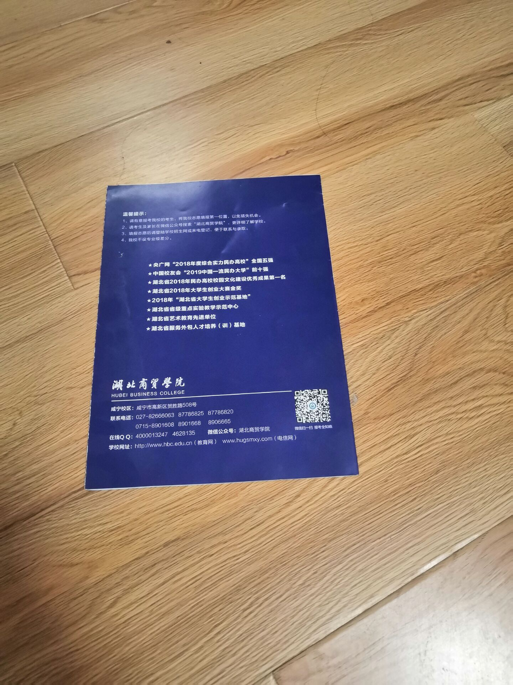
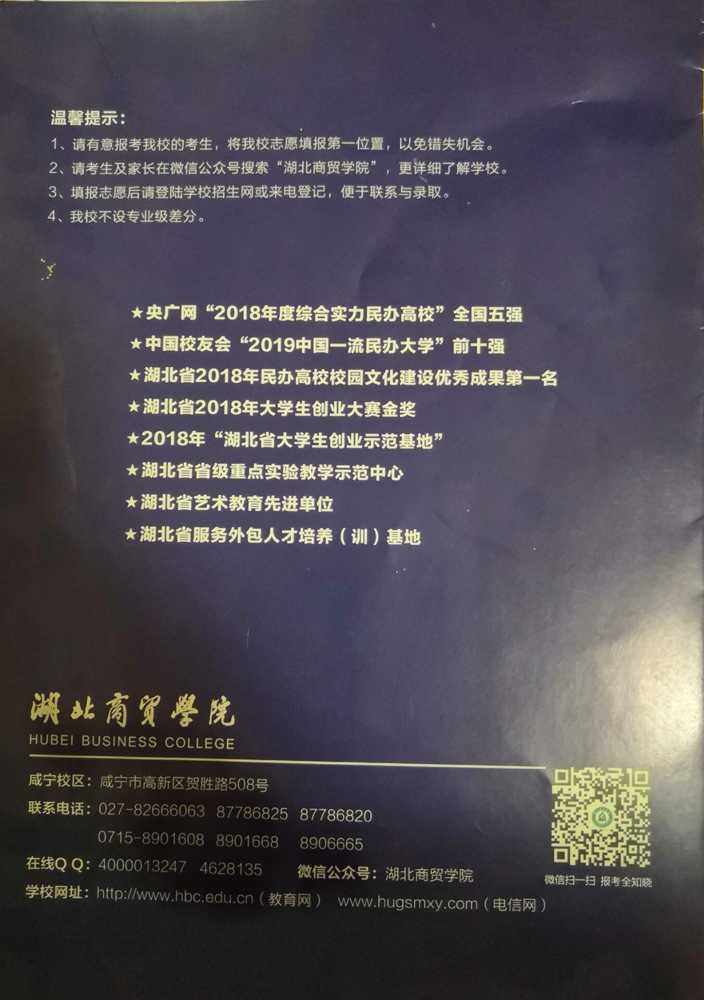
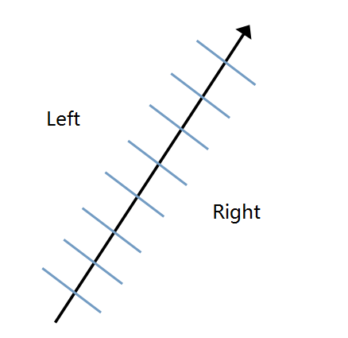

#  利用OpenCV检测图像中的长方形画布或纸张并提取图像内容
## 摘要  
生活中，我们有时候拍图片的的时候不能很好的还原原图，旁边总会有一些边边角角存在些许的背景。比如在博物馆里看到一幅很喜欢的画，用手机找了下来，可是回家一看歪歪斜斜，脑补原画内容又觉得不对，那么就需要算法辅助来从原图里提取原来的内容了。这个时候就可以利用Opencv来对图片进行提取，获得原图。经过百度资料，然后基本可以将图片中的原图提取出来。   
     

## 关键词  
Opencv,检测图像，提取图像内容。  
## 引言
本次设计可以分为两种情况吧，第一种，纸张的四角坐标已知的情况下，这种就可以直接进行提取。第二种就是纸张四角的坐标未知或难以准确标注的情况这种场景可能是小屏幕应用，或是原始图像就很小，比如我这里用的这个300x400例子，点坐标很难精确标注。这种情况下一个思路是，用边缘检测提取纸张四边，然后求出四角坐标，Perspective Transform。 
## 正文   
### 纸张四角的坐标(图中红点)已知的情况  
也就是图中4个红点是可以准确获取，比如手动标注，那么就简单了：用OpenCV的Perspective Transform就可以。具体步骤如下：  
1) 将标注好的四个点坐标存入一个叫corner的变量里，比如上面的例子中，原图的分辨率是300x400，定义x和y的方向。  
把这四个坐标按如上顺序放到一个叫corner的变量里。如果我们打算把这幅图案恢复到一个300x400的图像里，那么按照对应的顺序把下面四个坐标放到一个叫canvas的变量里：  
假设原图已经用OpenCV读取到一个叫image的变量里，那么提取纸张图案的代码如下：  
1 M = cv2.getPerspectiveTransform(corners, canvas)  
2 result = cv2.warpPerspective(image, M, (0, 0))  
### 纸张四角的坐标未知或难以准确标注的情况    
1) 图像预处理  
一般而言即使做普通的边缘检测也需要提前对图像进行降噪避免误测，比如最常见的办法是先对图像进行高斯滤波，然而这样也会导致图像变得模糊，当待检测图形边缘不明显，或是图像本身分辨率不高的情况下(比如本文用的例子)，会在降噪的同时把待检测的边缘强度也给牺牲了。当背景和纸张的颜色差别不大时，这时候一个替代方案是可以考虑使用Mean Shift，Mean Shift的优点就在于如果是像背景桌面的浅色纹理，图像分割的过程中相当于将这些小的浮动过滤掉，并且保留相对明显的纸张边缘。  
Meanshift的代码：
1 image = cv2.pyrMeanShiftFiltering(image, 25, 10)  
因为主要目的是预处理降噪，windows size和color distance都不用太大，避免浪费计算时间还有过度降噪。降噪后可以看到桌面上的纹理都被抹去了，纸张边缘附近干净了很多。然而这还远远不够，图案本身，和图像里的其他物体都有很多明显的边缘，而且都是直线边缘。
2) 纸张边缘检测   
虽然降噪了，可是图像里还是有很多边缘明显的元素。怎么尽量只保留纸张的边缘呢，这时候可以考虑用分割算法，把图像分为纸张部分和其他部分，这样分割的mask边缘就和纸张边缘应该是差不多重合的。在这里可以考虑用GrabCut，这样对于简单的情况，比如纸张或画布和背景对比强烈的，直接把图像边缘的像素作为bounding box就可以实现自动分割。当自动分割不精确的情况下再引入手动辅助分割。  
3) 直线检测  
对检测到的边缘使用Hough变换检测直线，我例子里用的是cv2.HoughLinesP，分辨率1像素和1°，可以根据图像大小设置检测的阈值和minLineLength去除大部分误检测。特别提一下的是如果使用OpenCV的Python binding，OpenCV 2和OpenCV 3的结果结构是不一样的，如果进行代码移植需要相应的修改。  
4) 判断纸张边缘  
那么如何选取纸张边缘的四条线呢(即使图像分割步骤非常好得分开了纸张和其他部分，这在有些情况下还是难以避免的，比如图案里有和边缘平行的线条)，可以沿着提取线段的两边采样像素的灰度：
  
在线段的两个端点之间平均采样左右两边像素的值，因为一般来说如果是纸张或者画布，边缘和背景的颜色在四边上应该都是类似的。然而这样做的话引入另外一个问题是需要区分线段的“左”和“右”，对于线段本身而言就是要区分前后。所以需要对画面里所有的线段端点进行排序，而这个排序的基准就是相对画布。  
5) 计算四角的坐标  
接下来计算四条线的交点，方法点这里。因为有4条线，会得到6个结果，因为在这种应用场景中，方形的物体在透视变换下不会出现凹角，所以直接舍弃离纸张中心最远的两个交点就得到了四个角的坐标.  
## 总结  
写了这么多，其实有一条至关重要的假设，甚至可以说是最关键的步骤之一我一直没提，那就是Camera Calibration，如果有相机的情况下，meta data都知道，那么需要先坐Camera Calibration才能知道纸张或者画布的原始尺寸。我这里试的例子当然是没有的，也可以有，相应的算法OpenCV里也有现成的，但准确度未必够，而且还是非常麻烦，所以我的所有流程都是默认原始尺寸已经获得了。再说了，就算没有，变换回方形之后使用者凭感觉进行简单轴缩放都比Camera Calibration方便得多。总的来说，这次实验的目的基本可以实现，可以基本上的还原出来原图。