# OpenCv实现人脸检测+美颜功能及基于ONNX Runtime的手写数字推理识别的UI设计
## 摘要
opencv是一个开源的计算机视觉库,它有着C++,Python,Java等接口,支持Windows,Linux,Mac OS,IOS 和 Android平台.Opencv 是使用C/C++所写的,可以利用多核处理.通过OpenCL启用，它可以利用底层异构计算平台的硬件加速。本篇论文主要的目标是利用Opencv的分类器CascadeClassifier,对从Camera读取的数据进行实时检测,并且把结果显示在屏幕上。另外美颜的主要实现方法是先调亮度，再结合高斯模糊与双边模糊进行磨皮，最后进行图像增强。在ONNX Runtime的手写数字推理识别的UI设计这部分我主要将主界面做了修改以及增加了“退出”、“清理”、“右键手动擦除”、“放大/缩小”四个按钮，还有增加了两个不同音乐背景的button。
## 关键词：人脸检测，美颜，界面设计，新增功能
## 引言
在此次的论文中，我将介绍自己如何完成OPencv实现人脸检测+美颜功能及基于ONNX Runtime的手写数字推理识别的UI设计的过程。在车载信息处理这门课中，老师在基于OpenCv实现人脸识别方面提及的比较少，所以在这次的论文中，我将用OpenCV本身所带有的库进行人脸识别，同时我还会利用在这门课上所学到高斯滤波进行拓展，将它应用到人脸美颜。在ONNX Runtime的手写字推理识别的UI上面，我将整个窗体的界面加了一个具有AI科技感的背景，同时在各个按钮上，我也添加了背景，以及相应的功能。
## 一、基本原理
## 1.OpenCv实现人脸检测+美颜功能基本原理
## 1.1人脸检测介绍
### （1）人脸检测分类

基于知识方法主要利用先验知识将人脸看作器官特征的组合，根据眼睛、眉毛、嘴巴、鼻子等器官的特征以及相互之间的几何位置关系来检测人脸。
基于统计的方法则将人脸看作一个整体的模式——二维像素矩阵，从统计的观点通过大量人脸图像样本构造人脸模式空间，根据相似度量来判断人脸是否存在。在这两种框架之下，发展了许多方法。

目前随着各种方法的不断提出和应用条件的变化，将知识模型与统计模型相结合。

在实际工程应用中，用得广泛的人脸检测算法还是基于Adaboost的这些算法，主要是其计算量小，特别适合在嵌入式端实现，或者是基于浅层的神经网络检测算法。随着芯片技术的发展，带有深度学习网络的芯片将会越来越普遍，这样基于深度学习的人脸检测算法将会成为主流。

### （2）人脸检测原理
人脸检测属于目标检测(object detection) 的一部分，主要涉及两个方面。


①先对要检测的目标对象进行概率统计，从而知道待检测对象的一些特征，建立起目标检测模型。

②用得到的模型来匹配输入的图像，如果有匹配则输出匹配的区域，否则什么也不做。
## 1.2美颜功能基本原理
### （1）实现方案
主要实现方案就是先调亮度，再结合高斯模糊与双边模糊进行磨皮，最后进行图像增强（非锐化掩蔽方案 ——Unsharpening Mask）

### （2）双边滤波（Bilateral filter）原理
双边滤波（Bilateral filter）是一种非线性的滤波方法，是结合图像的空间邻近度和像素值相似度的一种折衷处理，同时考虑空域信息和灰度相似性，达到保边去噪的目的。
双边滤波器之所以能够做到在平滑去噪的同时还能够很好的保存边缘（Edge Preserve），是由于其滤波器的核由两个函数生成：空间域核和值域核：
- （1）空间域核：由像素位置欧式距离决定的模板权值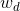
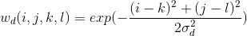

为模板窗口的其他系数的坐标；其中为模板窗口的中心坐标点；为高斯函数的标准差。 使用该公式生成的滤波器模板和高斯滤波器使用的模板是没有区别的。
- （2）值域核：由像素值的差值决定的模板权值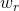


其中，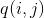为模板窗口的其他系数的坐标，表示图像在点处的像素值；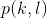为模板窗口的中心坐标点，对应的像素值为；为高斯函数的标准差。

- （3）将上述两个模板相乘就得到了双边滤波器的模板权值：

因此，双边滤波器的数据公式可以表示如下：
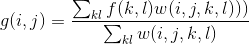
### （3）高斯滤波原理
数值图像处理中，高斯滤波主要可以使用两种方法实现。一种是离散化窗口滑窗卷积，另一种方法是通过傅里叶变化。最常见的就是滑窗实现，只有当离散化的窗口非常大，用滑窗计算量非常搭的情况下，可能会考虑基于傅里叶变化的实现方法。所以本文将主要介绍滑窗实现的卷积。

离散化窗口划船卷积时主要利用的是高斯核，高斯核的大小为奇数，因为高斯卷积会在其覆盖区域的中心输出结果。常用的高斯模板有如下几种形式：
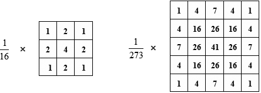
高斯模板是通过高斯函数计算出来的，公式如下：
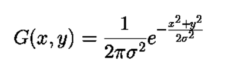
以3 × 3的高斯滤波器模板为例，以模板的中心位置为坐标原点进行取样。模板在各个位置的坐标，如下所示（x轴水平向右，y轴竖直向上）。


这样，将各个位置的坐标带入到高斯函数G中，得到的每个值按照位置排列，就得到了模板。

这样输出的模板有两种形式：

① 小数类型：直接计算得到的值，没有经过任何处理。

② 整数类型：将得到的值进行归一化处理，即将坐上叫的值归一化为1，其他每个系数都除以左上角的系数，然后取整。在使用整数模板时，则需要在模板的前面加一个系数，该系数为模板系数之和的倒数。

例如：生成高斯核为3 × 3，σ = 0.8的模板

小数模板：


整数模板：


再经过四舍五入和添加系数得到最终结果：
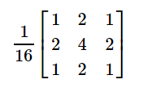

 从以上描述中我们可以看出，高斯滤波模板中最重要的参数就是高斯分布的标准差σ。它代表着数据的离散程度，如果σ较小，那么生成的模板中心系数越大，而周围的系数越小，这样对图像的平滑效果就不是很明显；相反，σ较大时，则生成的模板的各个系数相差就不是很大，比较类似于均值模板，对图像的平滑效果就比较明显。通过下面的一维高斯分布图也可验证上述观点。

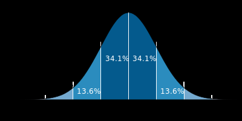

## 2.基于ONNX Runtime的手写数字推理识别的UI设计的基本控件原理
## 2.1 UI背景图
在手写数字推理识别的窗口界面中选择控件属性，点击Backgroundimage选择导入背景图片，其他按钮的背景图也是这个原理。


## 2.2 Button功能
主要是在Button这个函数下添加一些具有相关功能的C#程序。清理功能主要是上次程序的源代码，退出功能主要是使用C#中的Exit（）函数，放大/缩小主要是用到FormWindowState的方法，手动擦除主要是利用鼠标的右键擦除方法。添加音乐背景主要是用到C#的 SoundPlayer方法。
## 二、基本思路
## 1.OpenCv实现人脸检测+美颜功能
人脸检测依靠opencv中的cascadeClassfier级联分类器，opencv有训练好的模型使用。美颜功能的思路就是先调亮度，再结合高斯模糊与双边模糊进行磨皮，最后进行图像增强（非锐化掩蔽方案 ——Unsharpening Mask）。
## 2.基于ONNX Runtime的手写数字推理识别的UI设计
基本思路就是添加一些背景图，然后再找到相应按钮的功能的实现函数及方法。主要用到C#中的一些基本的函数的，例如退出，媒体函数等等。

## 三、基本过程
## OpenCv实现人脸检测+美颜功能
## 1.环境准备
首先，我们应该按照第一节课老师交给我们的方法进行OpenCV环境的配置，配置相关的环境变量。
## 2.添加相关的代码
在这一部分，我们可以利用OpenCV自带的训练模型进行编程，主要是string face_cascade_name这一行，后面主要写haarcascade_frontalface_alt2.xml这个文件所在的路径。然后调用高斯滤波和双边滤波函数进行美颜。
## 基于ONNX Runtime的手写数字推理识别的UI设计
## 1.设计准备
在设计之前，我们可以在网上选取一些具有AI科技感的图片进行下载作为背景素材以及一个比较有科技感的背景音乐。然后，我们需要进行界面排版，划分不同的区域，每个区域一个放什么东西。
## 2.素材封装
将我们从网上下载好的素材添加到整个界面中，同时将素材放置在一个素材文件夹中，便于管理。
## 3.功能实现
界面设计完成后，我们需要进行具体功能的实现，不同按钮实现不同的功能。在我的界面中有六个按钮，两个不同背景音乐按钮以及四个具体功能按钮，这些都需要C#程序作为支撑才能完成。
## 四、关键代码描述
## 1.OpenCv实现人脸检测+美颜
①人脸识别部分：
``` C++
#include <opencv2/opencv.hpp>
#include <iostream>
using namespace std;
using namespace cv;
String face_cascade_name = "haarcascade_frontalface_alt.xml";
CascadeClassifier face_cascade;
String window_name = "Capture - face detection";

void detectFace(Mat frame);

int main()
{
	VideoCapture capture;
	Mat frame;

	//检测是否成功读取人脸的haar分类器，就是那个xml文件
	if (!face_cascade.load(face_cascade_name))
	{
		cout << "Error: cannot load face casade!!!" << endl;
		return -1;
	}

	capture.open(0);//打开摄像头
	//检测摄像头是否成功打开
	if (!capture.isOpened())
	{
		cout << "Error: cannot open the camera!!!" << endl;
		return -1;
	}

	namedWindow(window_name);//创建窗口

	while (true)
	{
		capture >> frame;   //从摄像头读入一帧图像

		detectFace(frame);//对那帧图像进行处理，识别人脸

		//等待按键，若按下esc键，则退出循环
		int c = waitKey(10);
		if (c == 0x1B)
			break;
	}


	return 0;
}

//从输入图像中检测人脸
void detectFace(Mat frame)
{
	Mat frame_gray;
	vector<Rect> face;

	cvtColor(frame, frame_gray, COLOR_BGR2GRAY);//转成灰度图像
	equalizeHist(frame_gray, frame_gray);//直方图均衡化

	//按照文档说明调用函数即可
	face_cascade.detectMultiScale(frame_gray, face, 1.1, 2, CASCADE_SCALE_IMAGE, Size(30, 30));

	//遍历所有人脸
	for (size_t i = 0; i < face.size(); i++)
	{
		//根据返回的Rect的x坐标、y坐标、宽width和高height算出中心位置
		Point center(face[i].x + face[i].width / 2, face[i].y + face[i].height / 2);
		//调用ellipse画出椭圆型边框，指示人脸
		ellipse(frame, center, Size(face[i].width / 2, face[i].height / 2), 0, 0, 360, Scalar(255, 0, 255), 4, 8, 0);

	}

	//最后刷新窗口，显示图像
	imshow(window_name, frame);
}

```
②美颜部分：
```C++
#include <core.hpp>
#include <opencv2\core\cuda.inl.hpp>
#include <opencv2\imgcodecs.hpp>
#include <opencv2\highgui.hpp>
#include <opencv2\imgproc.hpp>
using namespace cv;
void whiteFace(cv::Mat& matSelfPhoto, int alpha, int beta)
{
	for (int y = 0; y < matSelfPhoto.rows; y++)

	{

		for (int x = 0; x < matSelfPhoto.cols; x++)

		{

			for (int c = 0; c < 3; c++)

			{

				matSelfPhoto.at<Vec3b>(y, x)[c] = cv::saturate_cast<uchar>(alpha * (matSelfPhoto.at<Vec3b>(y, x)[c]) + beta);

			}

		}

	}

}

int main()

{

	cv::Mat matResult;

	cv::Mat src = cv::imread("D://jpg//1.png");

	int bilateralFilterVal = 30;  // 双边模糊系数

	imshow("0000", src);

	whiteFace(src, 1.1, 68);  // 调整对比度与亮度，参数2为对比度，参数3为亮度

	imshow("1111", src);

	cv::GaussianBlur(src, src, cv::Size(9, 9), 0, 0); // 高斯模糊，消除椒盐噪声

	imshow("2222", src);

	bilateralFilter(src, matResult, bilateralFilterVal, // 整体磨皮

		bilateralFilterVal * 2, bilateralFilterVal / 2);

	imshow("3333", matResult);
	cv::Mat matFinal;
	// 图像增强，使用非锐化掩蔽（Unsharpening Mask）方案。

	cv::GaussianBlur(matResult, matFinal, cv::Size(0, 0), 9);

	cv::addWeighted(matResult, 1.5, matFinal, -0.5, 0, matFinal);
	imshow("4444", matFinal);
	imwrite("E:\\test\\result.png", matFinal);
	cv::waitKey(50000);
	return 0;
}

```

说明：双边滤波（Bilateral filter）API:
```C++
void bilateralFilter( InputArray src, OutputArray dst, int d,  double sigmaColor, double sigmaSpace,int borderType = BORDER_DEFAULT );
```
- src：Source 8-bit or floating-point, 1-channel or 3-channel image；

- dst：Destination image of the same size and type as src；

- d：用于滤波的每个像素邻域的直径。如果它是非正数，则从sigmaSpace计算；

- sigmaColor：在颜色空间中过滤。较大的参数值意味着像素邻域内的较远颜色(参见sigmaSpace)将混合在一起，从而产生较大的半等色区域；

- sigmaSpace：在坐标空间中过滤。参数值越大，表示距离越远的像素只要颜色足够接近就会相互影响(参见sigmaColor)。当d > 0时，它指定了与sigmaSpace无关的邻域大小。否则，d与sigmaSpace成正比；

- borderType：用于推断图像外部像素的边界模式，请参见#BorderTypes。

高斯滤波(GaussianBlur filter)API:
```C++
void GaussianBlur(InputArray src, OutputArray dst, Size ksize, 
                  double sigmaX, double sigmaY=0,
                  int borderType=BORDER_DEFAULT )
```
 - src，输入图像，即源图像，填Mat类的对象即可。它可以是单独的任意通道数的图片，但需要注意，图片深度应该为CV_8U,CV_16U, CV_16S, CV_32F 以及 CV_64F之一。
- dst，即目标图像，需要和源图片有一样的尺寸和类型。比如可以用- Mat::Clone，以源图片为模板，来初始化得到如假包换的目标图。
- ksize，高斯内核的大小。其中ksize.width和ksize.height可以不同，但他们都必须为正数和奇数（并不能理解）。或者，它们可以是零的，它们都是由sigma计算而来。
- sigmaX，表示高斯核函数在X方向的的标准偏差。
-sigmaY，表示高斯核函数在Y方向的的标准偏差。若sigmaY为零，就将它设为sigmaX，如果sigmaX和sigmaY都是0，那么就由ksize.width和ksize.height计算出来。
为了结果的正确性着想，最好是把第三个参数Size，第四个参数sigmaX和第五个参数sigmaY全部指定到。
- borderType，用于推断图像外部像素的某种边界模式。注意它有默认值BORDER_DEFAULT。
## 2.基于ONNX Runtime的手写数字推理识别的UI设计
主要函数：①擦除：
```C++
 private void button1_Click(object sender, EventArgs e)
        {
            //当点击清除时，重新绘制一个白色方框，同时清除label1显示的文本
            digitImage = new Bitmap(pictureBox1.Width, pictureBox1.Height);
            Graphics g = Graphics.FromImage(digitImage);
            //g.Clear(Color.Wheat);
            pictureBox1.Image = digitImage;
            label1.Text = "";
        }
```
②退出：
```C++
private void button2_Click(object sender, EventArgs e)
        {
            Application.Exit();
        }
```
③放大/缩小：
```C++
private void button9_Click(object sender, EventArgs e)
        {
            {
                if (this.WindowState == FormWindowState.Maximized) //若最大化
                {
                    this.WindowState = FormWindowState.Normal; //则正常化
                }
                else if (this.WindowState == FormWindowState.Normal) //若正常化
                {
                    this.WindowState = FormWindowState.Maximized; //则最大化
                }
            }
        }
```
④手动右键擦除
```C++
        private void pictureBox1_MouseMove(object sender, MouseEventArgs e)
        {
            //当鼠标在移动，且当前处于绘制状态时，根据鼠标的实时位置与记录的起始坐标绘制线段，同时更新需要绘制的线段的起始坐标
            if (e.Button == MouseButtons.Left)
            {
               Graphics g = Graphics.FromImage(digitImage);

                Pen myPen = new Pen(Color.BlueViolet, 40);

                myPen.StartCap = LineCap.Round;

                myPen.EndCap = LineCap.Round;

                g.DrawLine(myPen, startPoint, e.Location);

                pictureBox1.Image = digitImage;

                g.Dispose();

                startPoint = e.Location;
            }
            if (e.Button == MouseButtons.Right)

            {
                Cursor = Cursors.No;
                Graphics g = Graphics.FromImage(digitImage);
                Pen myPen = new Pen(Color.White, 40);
                myPen.StartCap = LineCap.Round;
                myPen.EndCap = LineCap.Round;
                g.DrawLine(myPen, startPoint, e.Location);
                pictureBox1.Image = digitImage;
                g.Dispose();
                startPoint = e.Location;
            }
        }
```
⑤音乐：
```C++
   private void button5_Click(object sender, EventArgs e)
        {
            System.Media.SoundPlayer player = new System.Media.SoundPlayer();
            player.SoundLocation = @"D:\l\Hero.wav";
            player.Load();
            player.Play();
        }

        private void button6_Click(object sender, EventArgs e)
        {
            SoundPlayer player = new SoundPlayer("D:\\l\\ten.wav");
            bool isPlaying = false;
            if (isPlaying)
                player.Stop();
            else
                player.Play();
            player.Play();
        }
```
## 五、测试结果
## 1.OpenCv实现人脸检测+美颜功能测试结果：

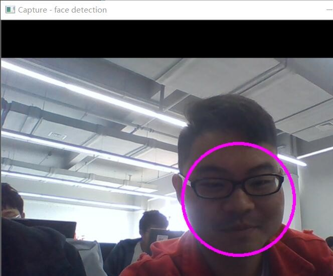


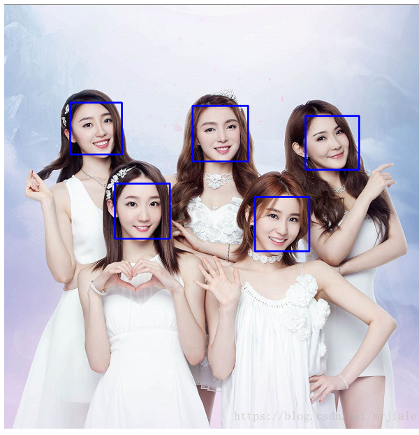
## 2.基于ONNX Runtime的手写数字推理识别的UI设计测试结果：


放大：

## 六、结果分析及总结
   通过结果分析得出：基本实现了静态图片和相机识别人脸的功能，在人脸美颜方面，的确将人脸的斑点去除了，同时也将图像增白了。在ONNX Runtime的手写字推理识别的UI设计这个工程中，界面实现了美化，增加了相应按钮的功能。但是在窗口放大和缩小有一点问题，放大之后它能回到正常窗体大小，但是最小化可能有一点不是很明显。在背景音乐这个控件上，我特地做了两个按钮，两个是不同功能，一个是点击播放，再点击就会暂停。另一个是点击播放，但是再点击会重新播放。这是我特别设计的。总的来说，基本功能都实现了，可能有些地方还是有点设计的不是很全面，但总体达到了我的预期。、

   总结：这次实验让我学到了很多在课本上没有学到的东西。例如，OPenCv的人脸识别以及高斯滤波用来实现美颜功能。在课上，我学到点是理论的知识，但在自己设计时，我动手的能力就增加了，同时，我对知识的理解更加深刻了。在UI设计这个方面，我发散了自己的四维，想到了很多idea，但是，我可能实现的就几个，因为有些想法虽然理论可以，但是实际操作却出现了很多问题，这也告诉我们理论与实践往往有一定的差别。总的来说，这门课让我掌握了很多新的知识，同时拓展了我的视野，我也基本上掌握了一门新的编程语言C#。
## 参考文献

[1]https://blog.csdn.net/zhangbijun1230/article/details/81676792

[2]https://blog.csdn.net/godadream/article/details/81568844

[3]https://www.iteye.com/blog/lps-683-2251180

[4]https://blog.csdn.net/qq_34914551/article/details/80302027

[5]毛星云 OpenCV3编程入门电子工业出版 2018-02-02

[6]Learning OpenCV 3  Adrian Kaehler/ Gary Bradski   O'Reilly Media   2017-1-8