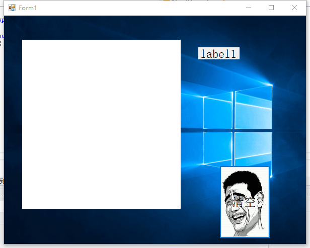

中期报告
--------
________
基于ONNX Runtime的手写数字识别的UI设计
----
在第一阶段实现了手写数字识别的UI设计。其中的重点在于控件对事件的绑定及图片的添加。另外若要实现两位数的识别，可以使用拼接的方法来加入一个新的pictureBox，通过修改尺寸，使它与之前的pictureBox大小保持一致。然后在识别区域添加一个新的label控件。同样的，通过修改尺寸使其与前者保持一致。

UI设计效果如图：

图片一共有如下几种布局形式：
**Zoom**、**Center**、**Title**、**Stretch**、**None**

## 过程中的问题：
在打开MinistDemo之后，完成了图片字体布局之后，我运行发现还是空白的。

## 解决方案：
在经过网络查找后，我发现问题所在：没有生成新的解决方案。
这时候需要：

重新生成解决方案，再编译，运行即可。

下一步工作：
-------
抓紧一切可用的时间，尽可能的完成开题报告中计划完成的任务：

1.加入一部分基于opencv图像处理的功能

2.完善人脸检测识别功能

3.优化摄像头的调度算法，使其尽可能占用更少的计算机资源，以免卡顿。
