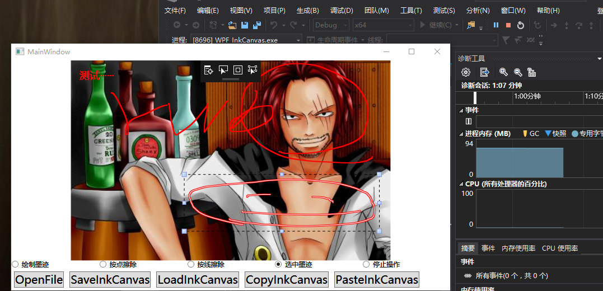

1. 设计任务:
   
   利用vs来建立wpf项目来实现画板对图片进行涂鸦和绘画。
   通过OnnxRuntime来与已建立的wpf项目进行结合来实现图片的涂鸦，进一步实现优化。

2. 进展情况：
   
   初步已完成第一个项目的建立和处理成功的实现了对图片的涂鸦和绘画。（如图）
   

3. 下一步工作:
   
   来实现OnnxRuntime方法与所建立的wpf项目进行结合实现用机器学习的方法进行涂鸦，绘画。