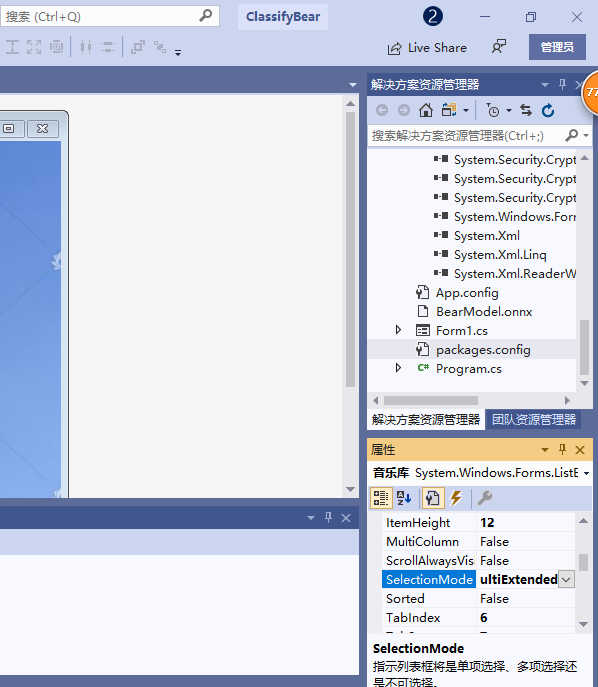
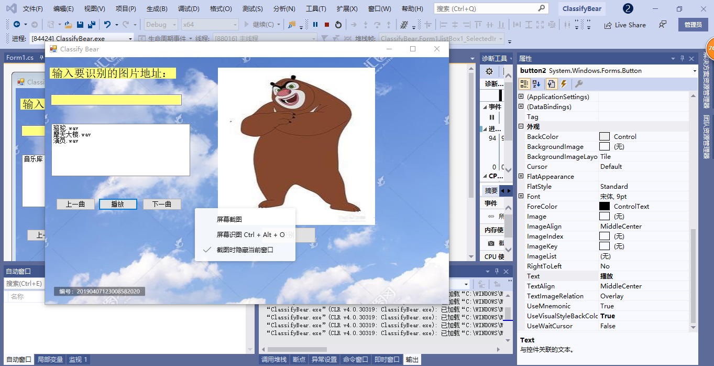
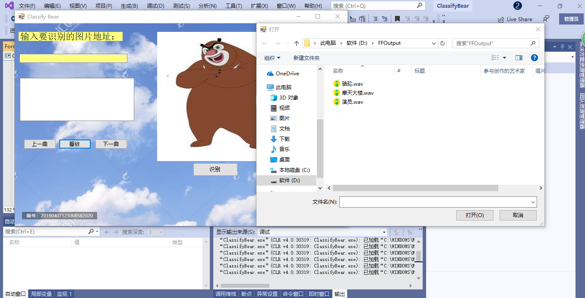

# 摘要
在前期设想中，我是想设计一个既能识别熊，又能识别注入猫狗

其他动物的应用。但是在具体实现的步骤中，我未能找到其他

onnxruntime封装模型，所以我把我的设计更改为仅识别熊一

种，但是在设别熊的基础上，我进行了界面的一些美化，和一些

功能的丰富。 

主要有一下改进：

1.进行背景的优化，使得背景不单调。

2.利用listbox控件实现了音乐播放的功能，能播放我保存的特

定格式的音乐

# 引言

本次最终成果是我在识别熊的基础上，可以播放音乐库的文件，

并可以切换上一首，下一首各。本也想进行多种动物这方面的识

别，和百度的看图识物一样，不单单局限于熊这一种类的识别，

但是我在网上查阅了不少资料，网上有布局文件和代码，但是缺

少核心的onnx模型，故我的设想未能成行，我就想对我的现有

成果进行一些改进，使得功能更加完善，然后我想能不能利用控

件来播放一些音乐，在我的查阅资料下，我成功的完成了我的目

标。

# 正文
第一步

添加一些看图识熊所需的组件，我们要添加两个lable，和一个

用来存放图片统一资源定位符（url）的文本框，然后需要一个

框来存放图片（picturebox组件），这就是最基本的界面设

计，在这基本设计上，我们可以来进行一些改动，如通过

backgroundmage来改变背景图片，使得背景图不那么单调，还

可以通过backcloro来改变各个框的颜色，然后根据我的目标，

我在添加了几个新的事件响应按钮，和一个用来存放音乐文件的

listbox，最后界面设计如下图

 

然后为了实现我的目的，事件响应我添加了以下代码

using Microsoft.ML.OnnxRuntime;
using System;
using System.Collections.Generic;
using System.ComponentModel;
using System.Data;
using System.Drawing;
using System.Linq;
using System.Numerics.Tensors;
using System.Text;
using System.Threading.Tasks;
using System.Windows.Forms;

using System.Media;

using System.IO;

namespace ClassifyBear
{
    public partial class Form1 : Form
    {
        List<string> songs = new List<string>();
        SoundPlayer song = new SoundPlayer();//申明songs

        public Form1()
        {
            InitializeComponent();
        }

        // 使用Netron查看模型，得到模型的输入应为224*224大小的图片
        private const int imageSize = 224;

        private void button1_Click(object sender, EventArgs e)
        {
            // 识别之前先重置界面显示的内容
            label1.Text = string.Empty;
            pictureBox1.Image = null;
            pictureBox1.Refresh();

            bool isSuccess = false;
            try
            {
                pictureBox1.Load(textBox1.Text);
                isSuccess = true;
            }
            catch (Exception ex)
            {
                MessageBox.Show($"读取图片时出现错误：{ex.Message}");
                throw;
            }

            if (isSuccess)
            {
                // 图片加载成功后，从图片控件中取出224*224的位图对象
                Bitmap bitmap = new Bitmap(pictureBox1.Image, imageSize, imageSize);

                float[] imageArray = new float[imageSize * imageSize * 3];

                // 按照先行后列的方式依次取出图片的每个像素值
                for (int y = 0; y < imageSize; y++)
                {
                    for (int x = 0; x < imageSize; x++)
                    {
                        var color = bitmap.GetPixel(x, y);

                        // 使用Netron查看模型的输入发现
                        // 需要依次放置224 *224的蓝色分量、224*224的绿色分量、224*224的红色分量
                        imageArray[y * imageSize + x] = color.B;
                        imageArray[y * imageSize + x + 1 * imageSize * imageSize] = color.G;
                        imageArray[y * imageSize + x + 2 * imageSize * imageSize] = color.R;
                    }
                }

                string modelPath = AppDomain.CurrentDomain.BaseDirectory + "BearModel.onnx";

                using (var session = new InferenceSession(modelPath))
                {
                    var container = new List<NamedOnnxValue>();

                    // 用Netron看到需要的输入类型是float32[None,3,224,224]
                    // 第一维None表示可以传入多张图片进行推理
                    // 这里只使用一张图片，所以使用的输入数据尺寸为[1, 3, 224, 224]
                    var shape = new int[] { 1, 3, imageSize, imageSize };
                    var tensor = new DenseTensor<float>(imageArray, shape);

                    // 支持多个输入，对于mnist模型，只需要一个输入，输入的名称是data
                    container.Add(NamedOnnxValue.CreateFromTensor<float>("data", tensor));

                    // 推理
                    var results = session.Run(container);

                    // 输出结果有两个，classLabel和loss，这里只关心classLabel
                    var label = results.FirstOrDefault(item => item.Name == "classLabel")? // 取出名为classLabel的输出
                        .AsTensor<string>()?
                        .FirstOrDefault(); // 支持多张图片同时推理，这里只推理了一张，取第一个结果值

                    // 显示在控件中
                    label1.Text = label;
                }
            }
        }

        private void pictureBox1_Click(object sender, EventArgs e)
        {

        }

        private void label2_Click(object sender, EventArgs e)
        {

        }
        SoundPlayer player = new SoundPlayer();
        
private void button2_Click(object sender, EventArgs e)
        {

            songs.Clear();
            音乐库.Items.Clear();

            OpenFileDialog openFile = new OpenFileDialog();
            openFile.InitialDirectory = @"E:\test";
            openFile.Multiselect = true;
            openFile.ShowDialog();

            string[] selectFiles = openFile.FileNames;
            songs.AddRange(selectFiles);

            for (int i = 0; i < selectFiles.Length; i++)
            {
                音乐库.Items.Add(Path.GetFileName(selectFiles[i]));
            }

        }

        private void listBox1_SelectedIndexChanged(object sender, EventArgs e)
        {
            song.SoundLocation = songs[音乐库.SelectedIndex];
            song.Play();
        }

        private void button3_Click(object sender, EventArgs e)
        {
            int count = songs.Count;
            if (音乐库.SelectedIndex == 0)
                音乐库.SelectedIndex = count - 1;
            else
                音乐库.SelectedIndex = (音乐库.SelectedIndex - 1) % count;

            song.SoundLocation = songs[音乐库.SelectedIndex];
            song.Play();

        }

        private void button4_Click(object sender, EventArgs e)
        {
            int count = songs.Count;
            音乐库.SelectedIndex = (音乐库.SelectedIndex + 1) % count;
            song.SoundLocation = songs[音乐库.SelectedIndex];
            song.Play();
        }
    }
}
通过按钮与事件的一一绑定我完成了我要实现的功能，以下是各

部分代码负责的功能，

载入文件代码

using System.Media;

using System.IO;

namespace ClassifyBear
{
    public partial class Form1 : Form
    {
        List<string> songs = new List<string>();
        SoundPlayer song = new SoundPlayer();

        public Form1()
        {
            InitializeComponent();
        }
 
 * 定义播放按钮，双击播放  

  private void button2_Click(object sender, EventArgs e)
        {

            songs.Clear();
            音乐库.Items.Clear();

            OpenFileDialog openFile = new OpenFileDialog();
            openFile.InitialDirectory = @"E:\test";
            openFile.Multiselect = true;
            openFile.ShowDialog();

            string[] selectFiles = openFile.FileNames;
            songs.AddRange(selectFiles);

            for (int i = 0; i < selectFiles.Length; i++)
            {
                音乐库.Items.Add(Path.GetFileName(selectFiles[i]));
            }

        }

* 添加一个listbox用来存放文件

        private void listBox1_SelectedIndexChanged(object sender, EventArgs e)
        {
            song.SoundLocation = songs[音乐库.SelectedIndex];
            song.Play();
        }
* 上一曲播放按钮
        private void button3_Click(object sender, EventArgs e)
        {
            int count = songs.Count;
            if (音乐库.SelectedIndex == 0)
                音乐库.SelectedIndex = count - 1;
            else
                音乐库.SelectedIndex = (音乐库.SelectedIndex - 1) % count;

            song.SoundLocation = songs[音乐库.SelectedIndex];
            song.Play();

        }
* 下一曲播放按钮
        private void button4_Click(object sender, EventArgs e)
        {
            int count = songs.Count;
            音乐库.SelectedIndex = (音乐库.SelectedIndex + 1) % count;
            song.SoundLocation = songs[音乐库.SelectedIndex];
            song.Play();
        }
    }
}

## 关于c# listbox的介绍及其使用
ListBox控件可以一次呈现多个项，并且语序对控件中的选项进

行选择操作，ListBox类公开Items属性，它是一个集合，类型

为ListBox.ObjectCollection,是ListBox的一个嵌套类，该

类实现了IList接口，可以调用Add方法向列表中添加新的项

。ObjectCollection类提供了一个AddRange方法，允许一次

性添加多个项。

　　通过设置可以控制

ListBox的选择行为，它是一个枚举值
 
枚举值  None    
如果设置该值，则无法选择项  
One  
每次只能选择一项  
MultiSimpl  
可以选择多项，第一次单击某项时将其选中，再次单击就可以取消选择  
MultiExtended  
 多选，可以使用（Ctrl）和（Shift）等控制键来辅助操作  

 
 
### 我的实际使用情况
在我的设想中，要利用listbox这个控件来储存多个音乐进行选

择播放，故我把ListBox控件的SelectionMode属性改为了

MultiExtended 

如图

 
如此我可以选择多个文件进入listbox，效果图如下

 
 
在实验中需要注意的是soundplayer 仅支持播放wav格式的音

乐，故需提前转换格式，用一个专门的文件夹来保存你需要的音

乐文件，

如图

,

如果你只选择一首歌，他会单独显示在

listbox上，通过ctrl 辅助鼠标来选择多首歌进入listbox，

双击即可播放

 点击下一首可以切换歌

 

在放歌的同时，识别熊的工作可以同时进行

两个事件同时响应，互不影响

像素过大的无法识别

 可以识别多种熊
 

# 总结
看图失误的关键是onnx模型的使用，只要有足够精确的模型就

可以准确的识别一种物体，一个优秀的模型更能快速识别。在此

次实验中我也遇到了很多困难，没能找到好的封装模型，仅仅能

在看图识别熊的基础上进行一些改进，在今后的探索中，找到更

加好的模型，我会对此次实验进行进一步的研究，而我此次实验

的改进是基于listbox控件，比较与一般的音乐播放，我的方案

有几个优点，不用指定路径，操作简单，可以切换多首歌，方便

快捷，在实验的过程中我开始不会使用这个控件，通过学习，我

知道了这个控件的基本常识，并能使用。另外布局文件特别重

要，要引起我的重视，因为布局文件，我在实验的过程中遇到了

不少挫折。故要对此更加注意，吸取教训

参考文献
https://www.cnblogs.com/hjxzjp/p/7688361.html
