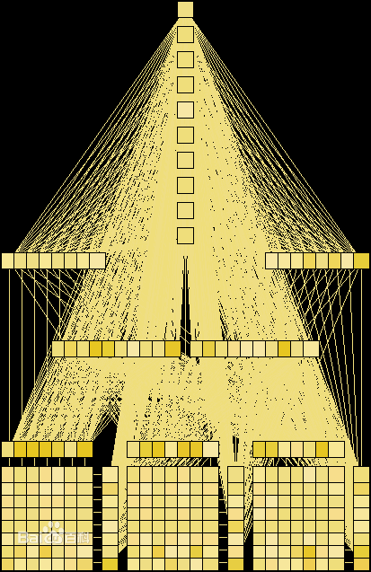

>>>>>>>>> # 人脸识别报告
##### 摘要：最终因为验证椭圆，矩阵需要模型，我就放弃了，转向了人脸识别，根据老师给的代码也运行出来，在代码上面进行加工处理。这个部分其实很难的，但是我觉得可以稍微改进一点，因为本来是椭圆，圆形识别太难了，文字识别我真的也尽力了，就转换成了这里。

##### 先上网查询人脸识别的文件，了解人脸的识别是什么形式，和人脸识别的作用和发展。和自己对于老师给的代码进行了修改和加工，做成了摄像头识别。

##### 结果是做成了人脸识别，在自己的脸上画了个圈圈。定位自己脸的位置。运用了眼睛和正脸的结合识别定位出自己脸所在的位置。

##### 我这里的人脸识别只是定位出了人脸的位置，但是对于查看资料出来的虹膜识别，瞳孔识别这方面的还是欠佳的，作出这个识别都是耗费了很久，修改了代码错误，查看代码作用，怎么调用，怎么定义，怎么使用。在自己做代码的时候还是很需要耐心和毅力，在不停报错之后还要抱着我要修正他的这种心态去努力，这样改正的才会快，效率才会高。

### 关键字：人脸识别，检测正脸，检测眼睛，定位人脸。

##### 引言：这次的代码结果是圈出了人脸所在位置。本也想进行人脸识别性别这方面的，就像我们的拍照相机中的识别，还有识别年龄的等等...但是对于这个的代码就是消耗了很多时间，识别别的功能还需要时间去琢磨。这次结合了检查眼睛和正脸，进行圈出人脸。代码的查询、解释、调用和定义，都需要自己花时间去琢磨，和不停的测试是否正确。运行出最后的结果之前，我的代码报错了一晚上，就进行调试，环境配置，和摄像头的代码查询。CV_CAP_ANY，开启摄像头的函数。一直报错，最后换了个方式才得到成功。

>>>>>>>>>>>>>#  正文

>>>>>>>>>>## 一、代码应用
* string cascadeName = "E:\\path\\opencv\\sources\\data\\haarcascades\\haarcascade_frontalface_alt.xml";
* string nestedCascadeName = "E:\\path\\opencv\\sources\\data\\haarcascades\\haarcascade_eye_tree_eyeglasses.xml ";
  ##### 这两行代码是对于脸和眼睛的检测。是在opencv的文件中存在的，进行调用。cascadeName是检测正面人脸，nestedCascadeName是检测眼睛。

* CascadeClassifier cascade, nestedCascade; 
  ##### 定义人脸和眼睛的检测，方便下面的调用。

* if (!cascade.load(cascadeName))
  ##### 载入cascade文件，有定义了这里就可以调用。

* cv::VideoCapture camera(CV_CAP_ANY);
	if (!camera.isOpened())
		return -1;
  ##### CV_CAP_ANY是打开摄像头。

* double rate = camera.get(CV_CAP_PROP_FPS);
  ##### 得到帧率，CV_CAP_PROP_FPS - 帧率（只对摄像头有效）

* detectAndDraw(image, cascade, nestedCascade, scale, 0);
  ##### 检测人脸。结合了cascade和nestedCascade进行人脸检测

* const static Scalar colors[] = {
		CV_RGB(0, 0, 255),
		CV_RGB(0, 128, 255),
		CV_RGB(0, 255, 255),
		CV_RGB(0, 255, 0),
		CV_RGB(255, 128, 0),
		CV_RGB(255, 255, 0),
		CV_RGB(255, 0, 0),
		CV_RGB(255, 0, 255) }
  ##### 用于画线，在检测到人脸的时候进行圈出人脸。

* 运行结果

#### 这里是结合眼睛和正脸进行人脸识别标记。眼睛识别是用来定位的脸部位置的，正脸识别用来确定脸的大小。最终得出了结果。

>>>>>>>>>>## 二、人脸识别
##### 人脸识别，是基于人的脸部特征信息进行身份识别的一种生物识别技术。用摄像机或摄像头采集含有人脸的图像或视频流，并自动在图像中检测和跟踪人脸，进而对检测到的人脸进行脸部识别的一系列相关技术，通常也叫做人像识别、面部识别。
##### 传统的人脸识别技术主要是基于可见光图像的人脸识别，这也是人们熟悉的识别方式，已有30多年的研发历史。但这种方式有着难以克服的缺陷，尤其在环境光照发生变化时，识别效果会急剧下降，无法满足实际系统的需要。解决光照问题的方案有三维图像人脸识别，和热成像人脸识别。但这两种技术还远不成熟，识别效果不尽人意。

#### 1. 人脸与人体的其它生物特征（指纹、虹膜等）一样与生俱来，它的唯一性和不易被复制的良好特性为身份鉴别提供了必要的前提，与其它类型的生物识别比较人脸识别具有如下特点：
   * 非强制性：用户不需要专门配合人脸采集设备，几乎可以在无意识的状态下就可获取人脸图像，这样的取样方式没有“强制性”；
   * 非接触性：用户不需要和设备直接接触就能获取人脸图像；
   * 并发性：在实际应用场景下可以进行多个人脸的分拣、判断及识别；
   * 还符合视觉特性：“以貌识人”的特性，以及操作简单、结果直观、隐蔽性好等特点。
  
#### 2. 人脸识别系统主要包括四个组成部分，分别为：人脸图像采集及检测、人脸图像预处理、人脸图像特征提取以及匹配与识别。
 1. 人脸图像采集及检测
   + 人脸图像采集：不同的人脸图像都能通过摄像镜头采集下来，比如静态图像、动态图像、不同的位置、不同表情等方面都可以得到很好的采集。当用户在采集设备的拍摄范围内时，采集设备会自动搜索并拍摄用户的人脸图像。
   + 人脸检测：人脸检测在实际中主要用于人脸识别的预处理，即在图像中准确标定出人脸的位置和大小。人脸图像中包含的模式特征十分丰富，如直方图特征、颜色特征、模板特征、结构特征及Haar特征等。人脸检测就是把这其中有用的信息挑出来，并利用这些特征实现人脸检测。
   + 主流的人脸检测方法基于以上特征采用Adaboost学习算法，Adaboost算法是一种用来分类的方法，它把一些比较弱的分类方法合在一起，组合出新的很强的分类方法。
   + 人脸检测过程中使用Adaboost算法挑选出一些最能代表人脸的矩形特征(弱分类器)，按照加权投票的方式将弱分类器构造为一个强分类器，再将训练得到的若干强分类器串联组成一个级联结构的层叠分类器，有效地提高分类器的检测速度。
  
 2. 人脸图像预处理
   + 人脸图像预处理：对于人脸的图像预处理是基于人脸检测结果，对图像进行处理并最终服务于特征提取的过程。系统获取的原始图像由于受到各种条件的限制和随机干扰，往往不能直接使用，必须在图像处理的早期阶段对它进行灰度校正、噪声过滤等图像预处理。对于人脸图像而言，其预处理过程主要包括人脸图像的光线补偿、灰度变换、直方图均衡化、归一化、几何校正、滤波以及锐化等。
  
 3. 人脸图像特征提取
   + 人脸图像特征提取：人脸识别系统可使用的特征通常分为视觉特征、像素统计特征、人脸图像变换系数特征、人脸图像代数特征等。人脸特征提取就是针对人脸的某些特征进行的。人脸特征提取，也称人脸表征，它是对人脸进行特征建模的过程。人脸特征提取的方法归纳起来分为两大类：一种是基于知识的表征方法；另外一种是基于代数特征或统计学习的表征方法。
   + 基于知识的表征方法主要是根据人脸器官的形状描述以及他们之间的距离特性来获得有助于人脸分类的特征数据，其特征分量通常包括特征点间的欧氏距离、曲率和角度等。人脸由眼睛、鼻子、嘴、下巴等局部构成，对这些局部和它们之间结构关系的几何描述，可作为识别人脸的重要特征，这些特征被称为几何特征。基于知识的人脸表征主要包括基于几何特征的方法和模板匹配法。
  
 4. 人脸图像匹配与识别
   + 人脸图像匹配与识别：提取的人脸图像的特征数据与数据库中存储的特征模板进行搜索匹配，通过设定一个阈值，当相似度超过这一阈值，则把匹配得到的结果输出。人脸识别就是将待识别的人脸特征与已得到的人脸特征模板进行比较，根据相似程度对人脸的身份信息进行判断。这一过程又分为两类：一类是确认，是一对一进行图像比较的过程，另一类是辨认，是一对多进行图像匹配对比的过程。
  
####  3. 识别算法
+ 人脸识别算法分类：
   * 基于人脸特征点的识别算法（Feature-based recognition algorithms）。
   * 基于整幅人脸图像的识别算法（Appearance-based recognition algorithms）。
   * 基于模板的识别算法（Template-based recognition algorithms）。
   * 利用神经网络进行识别的算法（Recognition algorithms using neural network）。
   * 利用神经网络进行识别的算法（Recognition algorithms using neural network）。
   * 基于光照估计模型理论：提出了基于Gamma灰度矫正的光照预处理方法,并且在光照估计模型的基础上，进行相应的光照补偿和光照平衡策略。
   * 优化的形变统计校正理论：基于统计形变的校正理论，优化人脸姿态；
   * 强化迭代理论：强化迭代理论是对DLFA人脸检测算法的有效扩展；
   * 独创的实时特征识别理论：该理论侧重于人脸实时数据的中间值处理，从而可以在识别速率和识别效能之间，达到最佳的匹配效果
   * 人脸识别：
   * 神经网络识别：
  
#### 4. 优势
  ###### 人脸识别的优势在于其自然性和不被被测个体察觉的特点。
   * 所谓自然性，是指该识别方式同人类（甚至其他生物）进行个体识别时所利用的生物特征相同。例如人脸识别，人类也是通过观察比较人脸区分和确认身份的，另外具有自然性的识别还有语音识别、体形识别等，而指纹识别、虹膜识别等都不具有自然性，因为人类或者其他生物并不通过此类生物特征区别个体。
   * 不被察觉的特点对于一种识别方法也很重要，这会使该识别方法不令人反感，并且因为不容易引起人的注意而不容易被欺骗。人脸识别具有这方面的特点，它完全利用可见光获取人脸图像信息，而不同于指纹识别或者虹膜识别，需要利用电子压力传感器采集指纹，或者利用红外线采集虹膜图像，这些特殊的采集方式很容易被人察觉，从而更有可能被伪装欺骗。

#### 5.困难
   ###### 人脸识别被认为是生物特征识别领域甚至人工智能领域最困难的研究课题之一。人脸识别的困难主要是人脸作为生物特征的特点所带来的。
   * 相似性：不同个体之间的区别不大，所有的人脸的结构都相似，甚至人脸器官的结构外形都很相似。这样的特点对于利用人脸进行定位是有利的，但是对于利用人脸区分人类个体是不利的。
   * 易变性：人脸的外形很不稳定，人可以通过脸部的变化产生很多表情，而在不同观察角度，人脸的视觉图像也相差很大，另外，人脸识别还受光照条件（例如白天和夜晚，室内和室外等）、人脸的很多遮盖物（例如口罩、墨镜、头发、胡须等）、年龄等多方面因素的影响。

#### 6. 主要用途 
   * 生物识别技术已广泛用于政府、军队、银行、社会福利保障、电子商务、安全防务等领域。
   * 当前社会上频繁出现的入室偷盗、抢劫、伤人等案件的不断发生，鉴于此种原因，防盗门开始走进千家万户，给家庭带来安宁；然而，随着社会的发展，技术的进步，生活节奏的加速，消费水平的提高，人们对于家居的期望也越来越高，对便捷的要求也越来越迫切，基于传统的纯粹机械设计的防盗门，除了坚固耐用外，很难快速满足这些新兴的需求：便捷，开门记录等功能。人脸识别技术已经得到广泛的认同，但其应用门槛仍然很高：技术门槛高（开发周期长），经济门槛高（价格高）。
   * 人脸识别产品已广泛应用于金融、司法、军队、公安、边检、政府、航天、电力、工厂、教育、医疗及众多企事业单位等领域。随着技术的进一步成熟和社会认同度的提高，人脸识别技术将应用在更多的领域。
    * 1、企业、住宅安全和管理。如人脸识别门禁考勤系统，人脸识别防盗门等。
    * 2、电子护照及身份证。中国的电子护照计划公安部一所正在加紧规划和实施。
    * 3、公安、司法和刑侦。如利用人脸识别系统和网络，在全国范围内搜捕逃犯。
    * 4、自助服务。
    * 5、信息安全。如计算机登录、电子政务和电子商务。在电子商务中交易全部在网上完成，电子政务中的很多审批流程也都搬到了网上。而当前，交易或者审批的授权都是靠密码来实现，如果密码被盗，就无法保证安全。但是使用生物特征，就可以做到当事人在网上的数字身份和真实身份统一，从而大大增加电子商务和电子政务系统的可靠性。
   * 数码相机，门禁设备，身份识别：网络识别，娱乐应用。 

参考文献：[1] 人脸识别 --- 百度百科
         [2] OpenCV学习笔记（一）：使用CascadeClassifier检测人脸 ---该-昵称已被占用
         [3] 实现人脸识别（vs2013+opencv3.0） --- lemonCode
         

