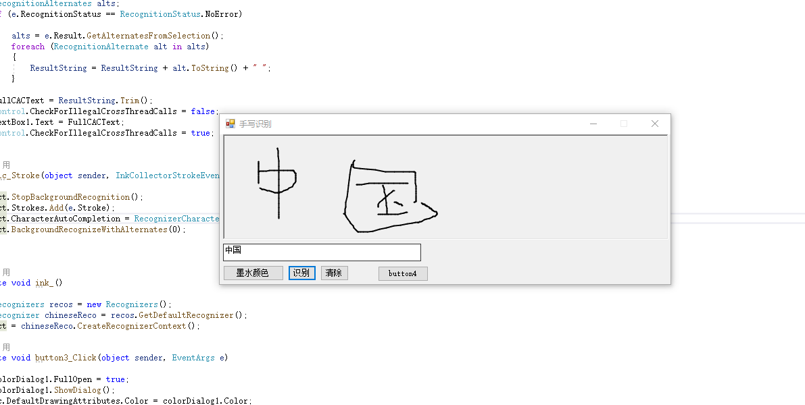

# 手写汉字识别的实现与界面美化

##### 摘要：

mnist手写数字数据集通常做为深度学习的练习数据集，这个数据集恐怕早已经被大家玩坏了。本次报告主要用TensorFlow将汉字的数据集和相关操作封装到了库中，来实现手写汉字的识别。通过在空白框中写入汉字，识别出对应的汉字在输出框。最后将界面进行美化。

##### 关键词：

mnist ， TensorFlow ，数据集

##### 引言：

首先通过对手写数字集——mnist数据集的理解，将数字集转换成汉字集，由于机器的深度学习与训练本次实验还不作要求，所以本文不多赘述，主要讲解手写汉字的基础知识和我是如何实现手写汉字的。

### 一.对手写汉字技术的概述

#### 1.1 MNIST概述

要弄懂手写汉字识别，首先要弄懂数据集是什么，我们在上课时训练的手写数字识别就是基于MNIST数据集，MNIST是深度学习的经典入门demo，他是由6万张训练图片和1万张测试图片构成的，每张图片都是28*28大小（如下图），而且都是黑白色构成（这里的黑色是一个0-1的浮点数，黑色越深表示数值越靠近1），这些图片是采集的不同的人手写从0到9的数字。TensorFlow将这个数据集和相关操作封装到了库中以实现数字的识别。

每一个 MNIST 数据单元有两部分组成：一张包含手写数字的图片和一个对应的标签。我们把这些图片设为 xs，把这些标签设为 ys。训练数据集和测试数据集都包含 xs 和 ys，比如训练数据集的图片是 mnist.train.images ，训练数据集的标签是 mnist.train.labels，每张图片是 28 x 28 像素，即 784 个像素点，我们可以把它展开形成一个向量，即长度为 784 的向量。每一张图片包含28X28个像素点。我们可以用一个数字数组来表示这张图片。在MNIST训练数据集中，mnist.train.images 是一个形状为 [60000, 784] 的向量，第一个维度数字就是训练集中包含的图片个数，用来索引图片，第二个维度的数字用来索引每张图片中的像素点。在此张量里的每一个元素，都表示某张图片里的某个像素的强度值，值介于0和1之间。

#### 1.2 文字识别的基本原理

手写汉字识别的基本原理也是将输人的文字与各个标准文字进行模式的匹配，计算类似度,将具有最大类似度的标准文字作为识别结果。识别手写汉字要把识别手写洋文难上很多。首先，英文字符的分类少，总共10+26*2；而中文总共50,000多汉字，常用的就有3000多。其次，汉字有书法，每个人书写风格多样。。手写体文字的人为因素随意性大，经常会出现连笔，和背景融合的现象，因而在对手写体文字的识别中一般都会加人汉字识别的预处理阶段,该阶段主要是完成汉字图像的正规化,将手写输人的文字尺寸归一及矫正变形。然后再进行汉字识别阶段，在汉字识别阶段，完成汉字的识别，涉及特征提取和分类器的设计。最后进行识别后处理阶段,利用汉字的结构知识、语义、词义等上下文先验信息进行结果的纠错和最后确定。对用于计算机自动识别的手写汉字应有所要求。具体地说，对构成汉字的笔画及其相互关系，应有必要的规定和限制，不能无约束地随意书写。这种字叫做“限制性手写汉字”。显然，这种限制不能太严，规定不能过于复杂，否则用户难以适应，识别系统也不容易推广应用。另一方面，对书写的要求也不宜太宽，否则难以使系统具有足够高识别率。尽管进行了这三个阶段，我依然发现我实现的结果在对稍微潦草的文字的识别中，错误的比率依然很高。所以总结来说，实际看来汉字识别是图像识别的一种，不过汉字数量比较多，很多手写的连人类都无法识别，估计难以达到 mnist 数据集的准确率。

#### 1.3 汉字数据集

正如前一部分提到的，手写数字的写法带有明显的地区性和民族性，因而选择一个可供系统训练和测试使用的样本库是手写数字识别研究的重要基础之-，对识别系统的性能也有重要的影响。研究者对所需的样本库有两种选择:一是自己根据需要建立专门的样本库，二是选用其它机构做好的现成的样本库。前者的优点是帖近自己的应用，缺点也是明显的:要费相当的精力且代表性很难保证，与其它人的结果不好比较。因此，现在的趋势是使用有权威性的通用样本库。目前，比较有代表性的、样本数量较大的手写数字样本库有: (1).NIST 数据库，由美国国家标准与技术局收集; (2).CEDAR 数据库，是由纽约州立大学Buffalo分校计算机科学系文本分析与识别中完成的邮政编码的样本库; (3).ETL 数据库，由日本电工技术研究所收集; (4). ITPT  数据库，由日本邮电通信政策研究所收集。

由于本次实验对机器的深度学习并不做要求，所以我通过运用现成的汉字数据集，来实现手写汉字识别。网上可以找到各种各样的汉字数据集。

### 二.程序实现

#### 2.1 开发环境

本次试验采取 .Net Framework桌面环境作为开发环境，基于WPF框架在vs studio2019上实现用户界面，并依赖TensorFlow等组件来完成手写汉字识别。

#### 2.2 基本原理

手写数字识别在学科上属于模式识别和人工智能的范畴。在过去的四十年中，人们想出了很多办法获取手写字符的关键特征。这些手段分两大类:全局分析和结构分析。对前者，我们可以使用模板匹配、象素密度、矩、特征点、数学变换等技术。这类的特征常常和统计分类方法一起使用。 对后者，多半需要从字符的轮廓或骨架上提取字符形状的基本特征，包括:圈、端点、节点、弧、突起、凹陷、笔画等等。与这些结构特征配合使用的往往是句法的分类方法。
多年的研究实践表明，对于完全没有限制的手写数字，几乎可以肯定:没有一种简单的方案能达到很高的识别率和识别精度。因此，最近这方面的努力向着更为成熟、复杂、综合的方向发展。将知识运用到预处理，特征提取，分类当中，如:神经网络、数学形态学等。

#### 2.3 基本思路

拿到实验题目后，我首先想到的就是对我印象最深的，基于mnist数据集实现的手写数字识别，手写数字识别主要思路是将数字写在面板上，然后通过opencv生成图片，在运用代码将生成的图片中的数字识别出来，那么同样的，汉字能不能也用这种方式识别出来呢？带着这个疑问，我确定了我的实验命题，手写汉字的识别运用也非常广泛，再加上汉字的数据集，实现的方法，有很多可以让我参考，东西都大同小异，在熟知了手写数字识别的原理后，我通过改动数据集，实现了手写汉字识别。这就是我的idea。
在实现后，为了更加个性，我将实验的界面进行了自己的设计和美化，主要是添加了“墨水”这一插件，来改变手写出的汉字的颜色，以达到更加美观的目的。这就是本次实验的基本思路

#### 2.4 基本过程

首先理解课上学习的手写数字识别，理解怎么将TensorFlow数字数据集封装到了库中，然后以此为知识基础，通过运用现有的汉字数据集，同样用TensorFlow封装，最后得以实现。
实现后，再将实验的界面进行美化。加入自己的设计。

#### 2.5 关键代码描述

``` c++
namespace Properties {
    using System;[global::System.CodeDom.Compiler.GeneratedCodeAttribute("System.Resources.Tools.StronglyTypedResourceBuilder", "16.0.0.0")][global::System.Diagnostics.DebuggerNonUserCodeAttribute()][global::System.Runtime.CompilerServices.CompilerGeneratedAttribute()]
    internal class Resources {
         private static global::System.Resources.ResourceManager resourceMan;
        private static global::System.Globalization.CultureInfo resourceCulture;
        [global::System.Diagnostics.CodeAnalysis.SuppressMessageAttribute("Microsoft.Performance", "CA1811:AvoidUncalledPrivateCode")]
        internal Resources() {
        }
```

分析代码：一个强类型的资源类，用于查找本地化的字符串等。此类是由 StronglyTypedResourceBuilder，类通过类似于 ResGen 或 Visual Studio 的工具自动生成的。若要添加或移除成员，编辑 .ResX 文件，然后重新运行 ResGen。(以 /str 作为命令选项)，或重新生成 VS 项目。

```c++
private void button2_Click(object sender, EventArgs e)
        {
            if (!ic.CollectingInk)
            {
                Strokes strokesToDelete = ic.Ink.Strokes;                rct.StopBackgroundRecognition();
                ic.Ink.DeleteStrokes(strokesToDelete);
                rct.Strokes = ic.Ink.Strokes;
                ic.Ink.DeleteStrokes();
                ink_here.Refresh();
                textBox1.Text = "";
            }
        }
```

### 三 ui界面设计

#### 3.1 界面布局

界面主要布局包括：手写板，识别按钮，识别框，清除按钮，画笔颜色改变按钮

手写板：将手写的汉字写在上面，为了方便书写，手写板设计的较大，占界面的1/2.

识别按钮：手写完成后，按下识别按钮，在识别框中显示汉字

清除按钮：手写有误或识别完成后，按下清除按钮可清空手写板和识别框的内容

墨水：改变画笔颜色，可根据喜好自定义颜色，可调节色调，饱和度，亮度等参数。可保存自定义颜色。

#### 3.2界面设计代码

墨水代码：这段代码主要实现清除手写区域笔画以及刷新手写区域。
手写字颜色更改代码：

```c++
 private void ink_()
        {
            Recognizers recos = new Recognizers();
            Recognizer chineseReco = recos.GetDefaultRecognizer();
            rct = chineseReco.CreateRecognizerContext();
        }
        private void button3_Click(object sender, EventArgs e)
        {
            colorDialog1.FullOpen = true;
            colorDialog1.ShowDialog();
            ic.DefaultDrawingAttributes.Color = colorDialog1.Color;

        }
```

清除按钮代码：

```c++
private void button2_Click(object sender, EventArgs e)
        {
            if (!ic.CollectingInk)
            {
                Strokes strokesToDelete = ic.Ink.Strokes;                rct.StopBackgroundRecognition();
                ic.Ink.DeleteStrokes(strokesToDelete);
                rct.Strokes = ic.Ink.Strokes;
                ic.Ink.DeleteStrokes();//清除手写区域笔画;
                ink_here.Refresh();//刷新手写区域
                textBox1.Text = "";
            }
        }
```

识别按钮代码：

```c++
private void button1_Click(object sender, EventArgs e)
        {
            Ink ink = ic.Ink;
            string str = ic.Ink.Strokes.ToString();
          textBox1.SelectedText = ic.Ink.Strokes.ToString();
        }
```

#### 3.3 自定义界面展示

颜色修改：


设计界面：


主要以简介，大方，实用，美观为主

### 四 测试结果

最开始的界面：


增加了一段墨水代码和按钮，可改变书写的文字的颜色：


修改文字颜色前：


修改文字颜色为红色：


### 五 分析和总结

本次实验，在课上所学的手写数字识别的基础完成了对手写汉字的识别，其实这中间最难的东西应该是数据集的使用，对汉字的训练等。要想熟练使用，还是要先掌握它的原理，掌握它的插件和函数的使用。然后为了设计出更好看的界面，我增加了“墨水”的函数，墨水主要是为了改变字体的颜色，在网上找到了墨水插件后，将它加入到程序里，然后自己仿照其他按钮插件写出了墨水的代码，这样在书写过程中就可以通过颜色来变换汉字，更加美观个性。但其实本次实验还存在所有手写识别的一个通病，就是准确率没有手写数字的高，主要在于手写汉字的多变性，每个人的笔锋不同，也会带来不同的识别正确率。

总结：本次实验的收获是很大的，因为自己分析了手写数字到底是怎么实现的，然后又在这个基础上，去找手写汉字的方法，找到合适的数据集，并运用。用tensorFlow,onnx等最终实现。最后看到成果很有成就感。现在开始对数据集的训练很感兴趣，希望可以多多学习。

#### 参考文献：

[1]https://cloud.tencent.com/developer/article/1061713

[2]http://www.nlpr.ia.ac.cn/databases/handwriting/Offline_database.html

[3]https://cloud.tencent.com/developer/article/1005116

[4]https://zhuanlan.zhihu.com/p/31200100
