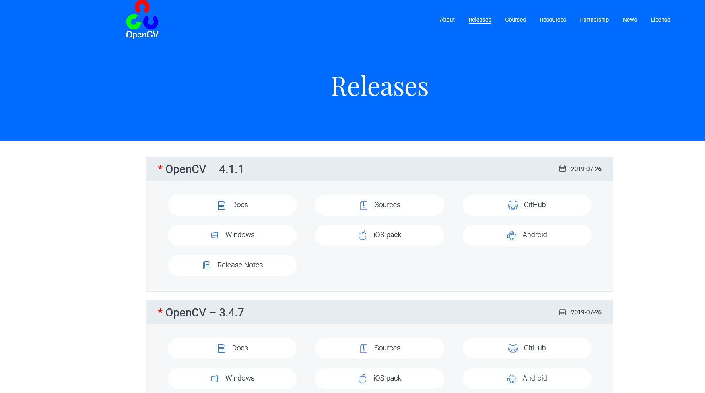
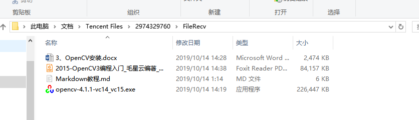
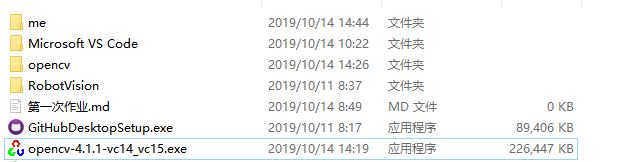
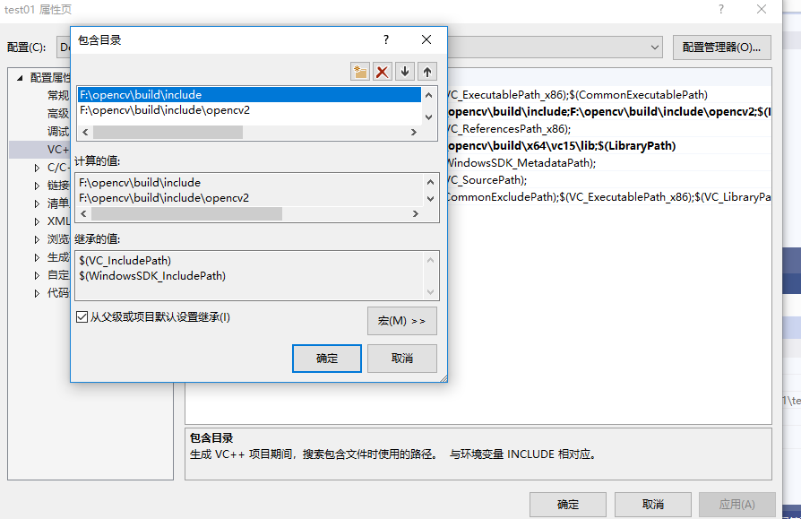
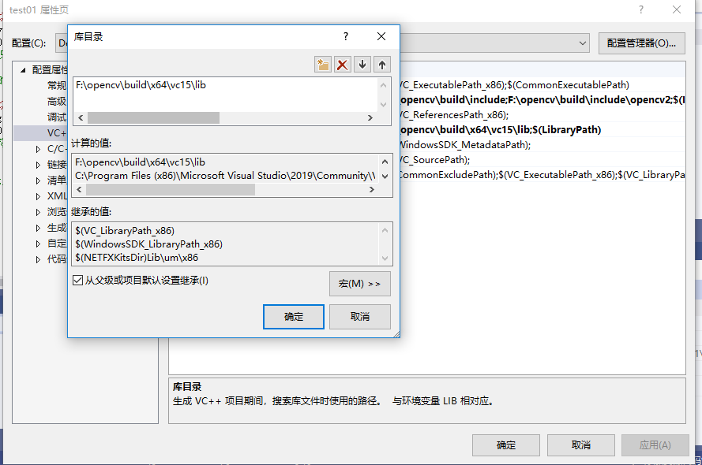
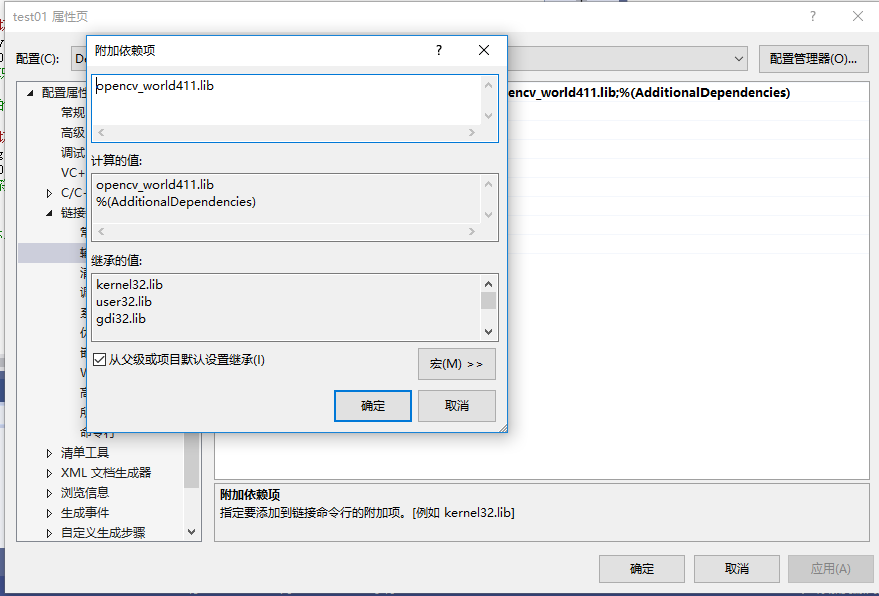

# 第一次作业
本次课学习VS2019与OpenCV4.11的环境配置
## 一. 准备工具
OpenCV：4.1.1
IDE：VS2019
安装环境：Win10    64位操作系统
## 二.主要步骤
1.下载OpenCV自解压程序

点击Win pack，设置好路径，开始下载。下载完成后，如下图所示

双击该exe文件进行解压。解压后如图所示。

2.安装VS2019

安装后打开，启动界面如下：

3.配置OPenCV环境变量
在我的电脑上右键“属性”，点击“高级系统环境”，并点击“环境变量”，在path变量里面添加d11所在路径

4.在vs 2019中新建项目
打开软件并开启，创建新项目，并选择windows桌面向导，如图所示

新项目名称test01，并选择空项目。然后打开文件，在源文件中添加test01.cpp，如图所示

5.配置包含路径
将编译器由【x86】改为【x64】，这是因为OpenCV4.1.0仅支持x64。再点击【视图】→【其他窗口】→【属性管理器】，结果如图所示。

点击属性，在VC++工具中点击包含目录添加F:\opencv\build\include和F:\opencv\build\include两个目录

在库目录中添加F:\opencv\build\x64\vc15\lib

点击链接链的输入在附加依赖项添加opencv_world411d.lib静态库

点击ok并确定退出

6.测试配置是否成功

配置成功

## 总结
在本次课程中，通过老师的讲解，我初步了解计算机视觉，计算机视觉是一门研究如何使机器“看”的科学。OpenCV在计算机视觉领域中扮演重要的角色，它是一个基于开源发行的跨平台计算机视觉库，实现了图像处理和计算机视觉方面的很多通用算法。然后学习如何OpenCV与VS之间的环境配置，在配置环境的过程中，遇到很多操作错误，比如在配置的时候，没有在电脑的属性环境变量的path中添加d11，以至于出错，还有在调试代码的时候，出现无法解析外部命令的错误，这个是因为自己马虎，忘记将X86编译器换成X64而导致出现错误，等等。虽然遇到很多错误，但通过老师还有同学的帮助都逐一解决了。不过配置环境对于新手的我来说有点困难，配置了好久才配置成功，当然收获也颇多，对OpenCV环境配置有了相对的了解。还有，在过程中发现自己很多不足，配置的时候很不仔细，在这次学习我深刻认识到这些，在以后的学习中，我会更加仔细，充实自己，改掉自己的不足。
