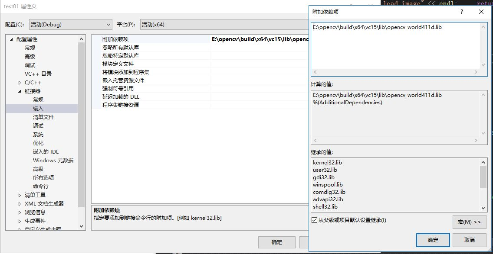

# 学习体会
  1. 下载并安装vs 2019或vs 2017
  2. 下载并安装opencv4.1.1版本  
  3. 配置OpenCV环境变量
  在我的电脑上右键“属性”，点击“高级系统环境”，在用户变量中，点击Path变量并编辑,
  添加opencv的dll的路径E:\opencv\build\x64\vc14\bin，E:\opencv\build\x64\vc15\bin
  4. 在vs 2019上新建项目
  5. 在项目属性的vc++目录的包含目录下添加E:\opencv\build\include\opencv2，
  E:\opencv\build\include 在库目录下添加E:\opencv\build\x64\vc15\lib
  在连接器下的输入添加附加依赖项E:\opencv\build\x64\vc15\lib\opencv_world411d.lib
  
  6. 开始测试
  按照书上的代码显示图片，需要把图片的位置找到，\要换成\\不然会报错，过程中有很多问提，在老师的指导下改过来，能正确显示图片。
  原图如下
    
  7. 改写代码完成其他的图像处理，例如图像腐蚀
   
  8. 其他的代码照着ppt上编写也完成了，都是先载入图片，显示原图，进行图片处理，显示效果图。

# 总结：
通过半天的学习，主要花大部分时间来配置环境了，同时也对vs2019和opencv有了初步的了解，完成了环境的配置，学会如何进行图像的编辑，以及opencv的基本数据结构，常用的数据结构和函数，对基本图形绘制也有了一点了解。

