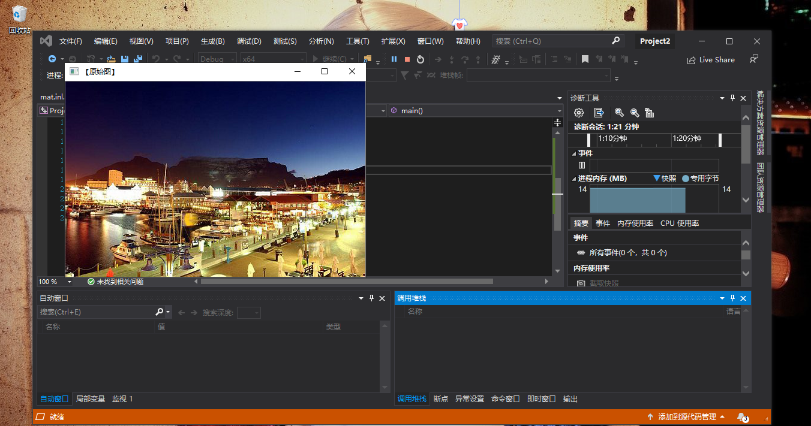
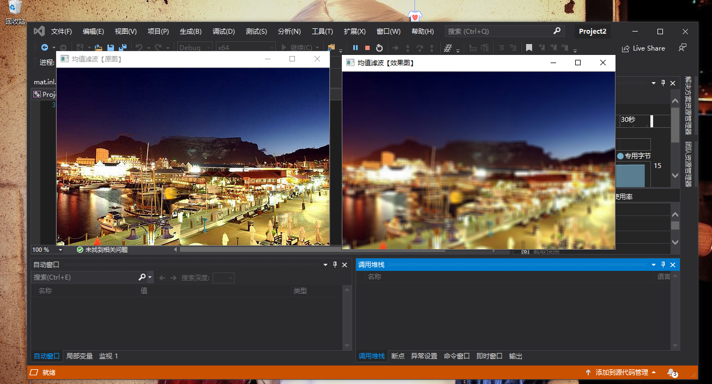
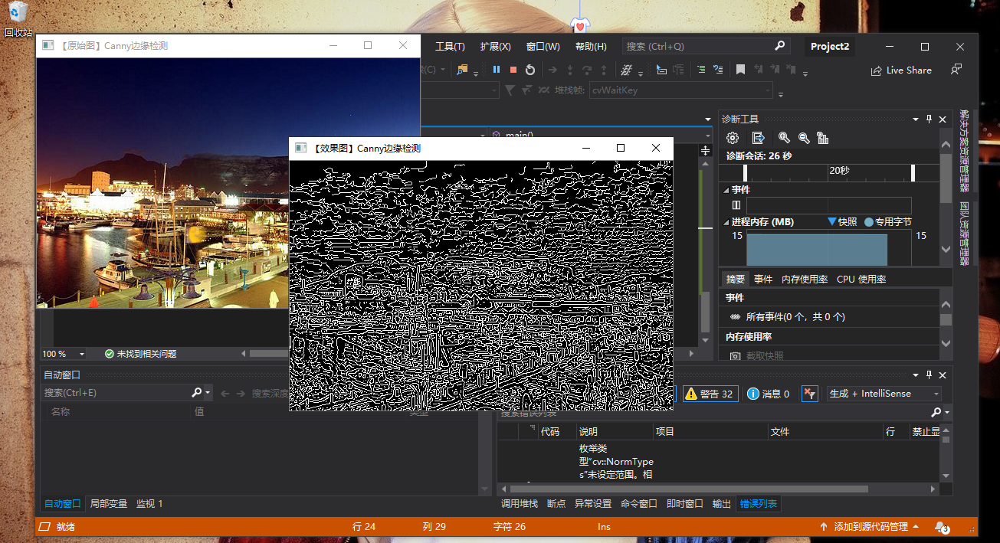

学习小结：
1，下载并且安装了OpenCV和VS，进行了环境变量的配置。
环境变量的配置是一个较为复杂且不能有丝毫偏差的步骤，在此过程中需注意文件间的对应，一旦对应出错将会影响我们后期的应用，甚至会导致许多实验无法完成。
2，在VS上进行了图片的显示测试。在环境配置好的VS上建立项目，加载程序，锁定我们想要显示的图片路径。进行调试，无误后即可显示路径对应图片。
3，对图片进行模糊处理并显示。这一步骤可以在显示测试图片的基础上进行，载入模糊图片代码后，找到对应图片路径，开始调试，最后可得出模糊图片。
4，对图片进行边缘检测并显示。在对何为边缘检测进行初步的了解后，同样的载入边缘检测的代码后，找到想要检测图片，进行调试，然后得出的就是边缘检测效果的图片。
注意：2,3,4步骤均需要在配置好的OpenCV，VS环境下完成。

