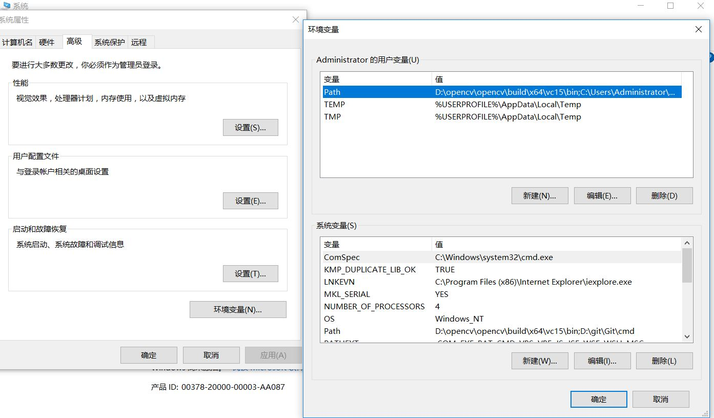
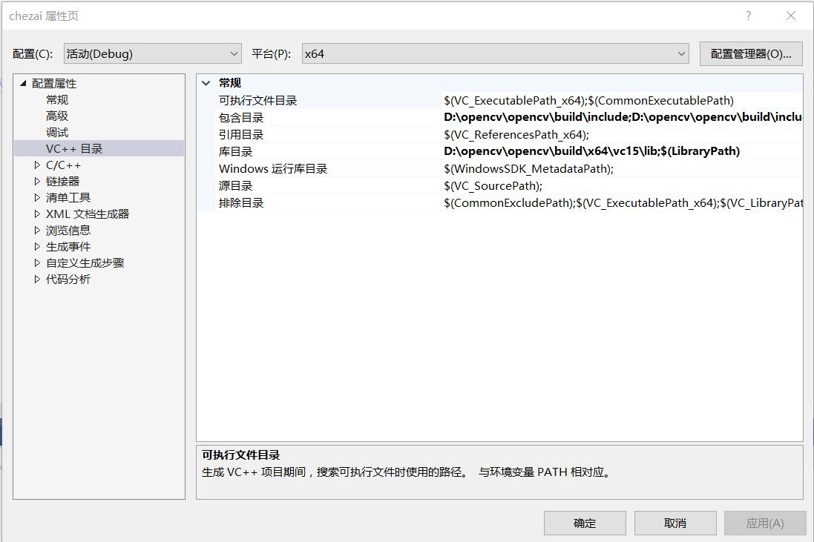

#OpenCV开发环境的配置

##一、安装步骤
###1.安装vs2019 Community
下载地址https://visualstudio.microsoft.com/：

安装后打开，启动界面如下：

###2.下载opencv
从www.opencv.org下载，并安装到某个给定目录下（路径无中文），如下

###3.配置OpenCV环境变量
在我的电脑上右键“属性”，点击“高级系统环境”，

在用户变量中，点击Path变量并编辑，添加dll所在路径

确定后，并重启以使得环境变量生效。
###4.在vs 2019中新建项目
选择路径“File->New->Project”：

依次选择Language为C++，Platform为Windows，Project type为desktop,选择Windows Desktop Wizard，并选择Next,
创建完成以后，添加c.cpp源文件。
右键Project,选择Properties:

选择VC++ Directories，在Include Directories中，
添加C:\Programs\OpenCV\include和C:\Programs\OpenCV\include\opencv2这两个目录。

在Library Directories中添加C:\Programs\OpenCV\build\x64\vc15\lib：
在Linker->Input目录下，点击Additional Dependencies并添加opencv_world411d.lib静态库：

点击OK并确定退出。
####二、测试代码：
#include <opencv2/opencv.hpp>  //头文件
using namespace cv;  //包含cv命名空间
void main( )
{    
	// 【1】读入一张图片，载入图像
	Mat srcImage = imread("1.jpg");
	// 【2】显示载入的图片
	imshow("【原始图】",srcImage);
	// 【3】等待任意按键按下
	waitKey(0);
}  
###三、效果展示

###四、心得体会
通过VS2019和OpenCV的安装及环境配置，改变了我的看法。起初，感觉很麻烦，配置了好几次都没有成功，反复检查，感觉没问题，后来经过多次试验重新改变路径，配置成功。总结起来，还是自己不信任自己，总想着好麻烦，想图省事，可实际做过之后，发现没有那么困难，感觉还挺好的。本次学习，我了解到了OpenCV是Intel®开源计算机视觉库。它由一系列 C 函数和少量 C++ 类构成，实现了图像处理和计算机视觉方面的很多通用算法的集合。在我们安装opencv的过程中就可以看到，它实际上是一个解压的过程。就是把他的函数库解压到自己的计算机硬盘上。配置环境变量PATH ，众所周知，path是程序运行过程中寻找所需文件的路径，要把opencv的bin目录也要配置进去。配置完成以后就是建立工程测试代码实现我们要的结果。总之，只要我们勤于动手思考，就会有不一样的收获。
