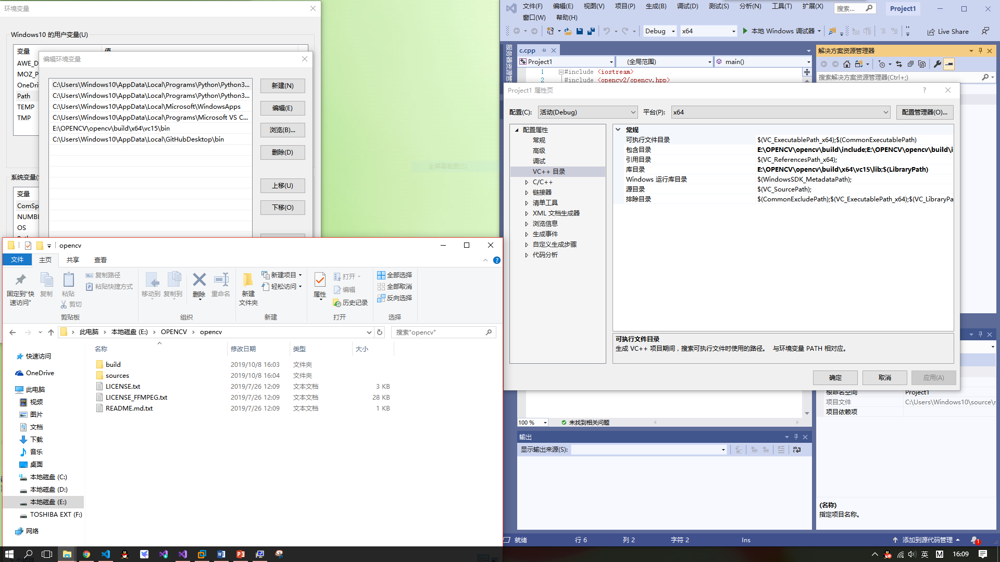
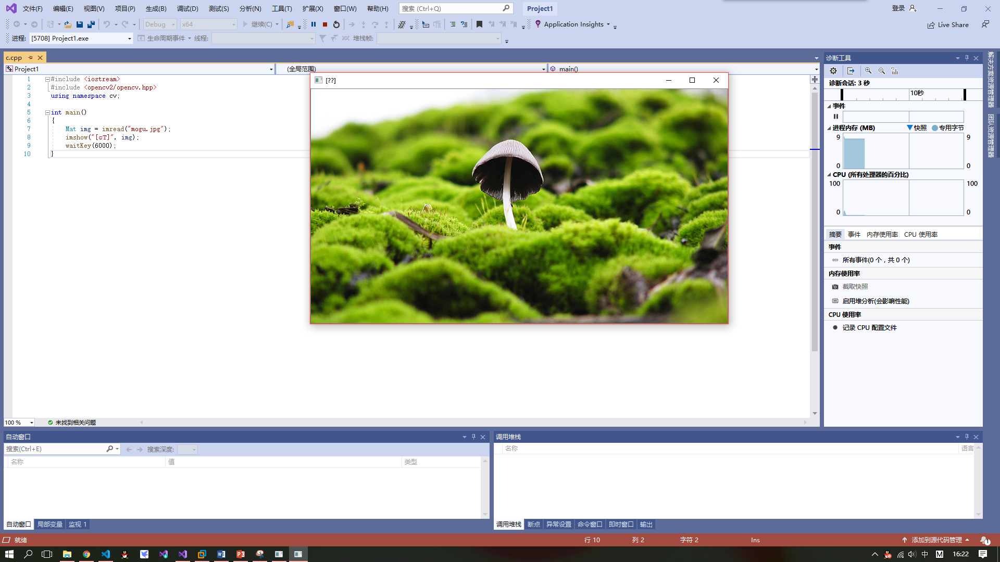

# 总结

## **第一次课堂总结**

>#### OPENCV的安装与环境配置

* 1配置OpenCV环境变量
* 在vs 2019中新建项目并添加.cpp
* 在属性中更改包含目录，库目录和输入中的相应路径
* 在C盘 **SYSTEMWOW64** 和 **SYSTEM31** 中相应的添加.dll文件为系统使用
* 最终配置如图
* 执行测试程序，得到结果程序通过imread（）根据图像中存在的颜色通道数返回2D或3D矩阵再通过imshow显示出来

> #### Github使用方法

* *创建一个新的仓库*  
1、在页面的最右上角，你的头像的左边，点击“＋”，在弹出的下拉选项中选择**“New repository”**。 在仓库名称输入框中输入你的仓库名称：“hello-world”。  
3、写一个简短的描述  

* *做出修改并提交：*  
1、点击“README.md”文件，切换到“README.md”内容页面  
2、点击编辑框右上角的铅笔按钮，进入编辑界面  
3、在 Edit file 标签上，输入一些关于你自己的信息

* *提出更改别人的项目*  
使用** forks** 提出改变的一个很好的例子是漏洞修复。与其记录一个你发现的问题，比如：  
1.Fork 这个仓库  
2.进行修复  
3.向这个项目的拥有者提交一个** pull requset**

如果这个项目的拥有者认同你的成果，他们可能会将你的修复更新到原始的仓库中！
