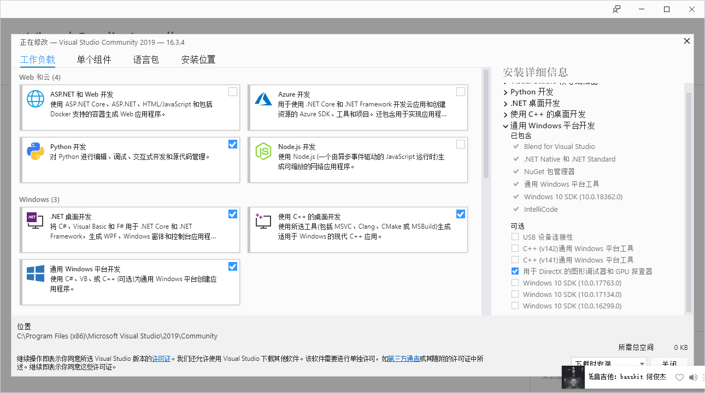
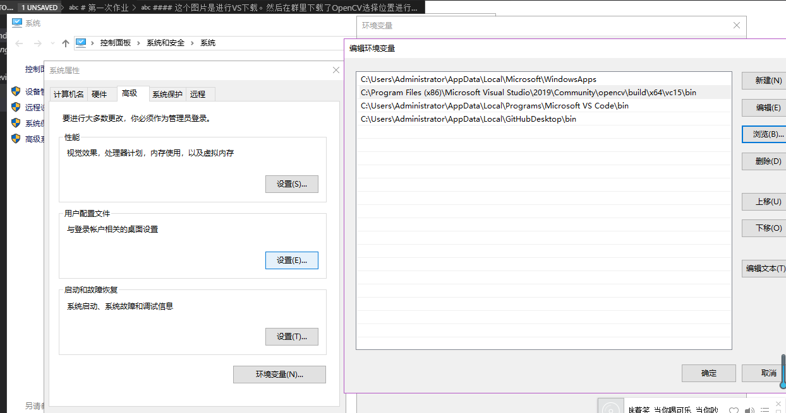
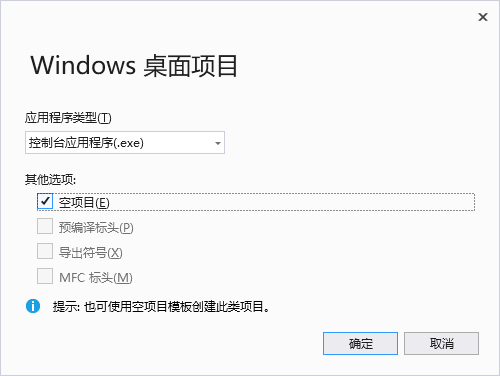
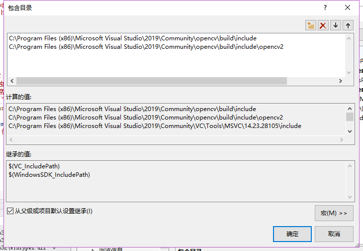
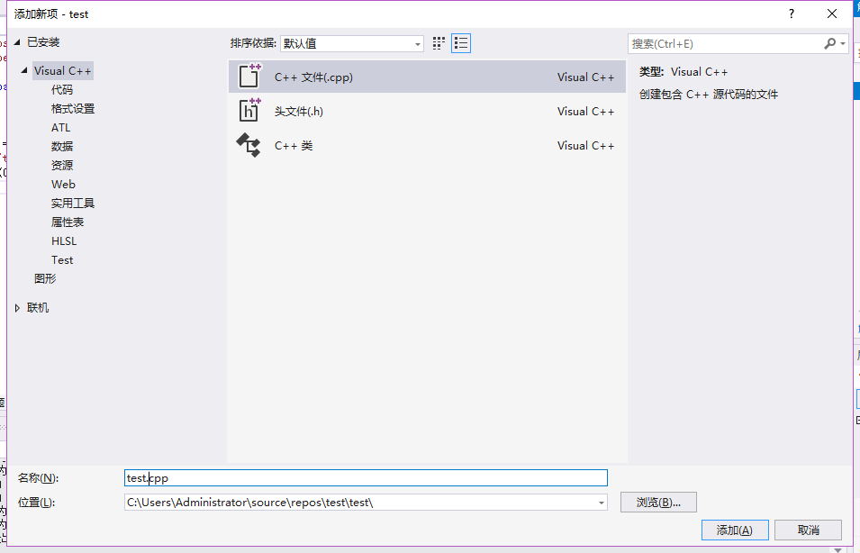
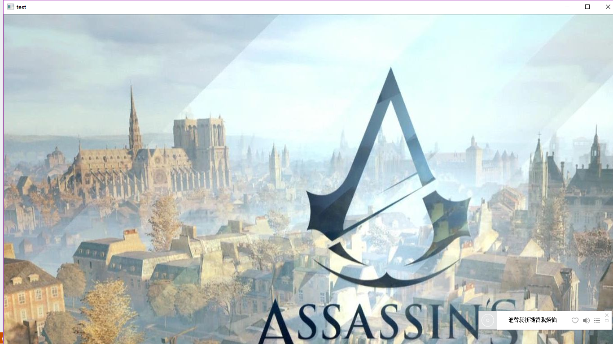

  # 第一次作业
#### 下载VS（Visual Studio）和OpenCV，再进行环境配置。如下图

#### 在下载VS的时候，在我的电脑的属性中点开高级环境配置中的环境配置，path添加dll所在路径。然后重启电脑进行生效。

#### VS下载完成创建项目。windows 桌面向导。（要有C++项目的一项）,在控制台应用程序这个界面选择空项目进行创建项目。

#### 创建完项目之后，对于解决方案平台改为x64。对创建的项目进行属性配置。include，opencv2、lib的途径和opencv_world411d.lib。opencv_world411d.lib这个是对于Debug的静态库。点击确认退出。

#### 然后创建.cpp文件，进行环境测试。

#### 在test.cpp文件中写入测试代码。最后测试成果将会显示你放在c盘User文件夹中的图片。

#### 这次环境配置耗费了很长时间，可能因为教室网络太差，也有原因是自己的技能不足。我因为自己在下载的opencv-3.7.4和opencv-4.1.1这两个opencv的安装包都安装到了一个文件夹中，导致了重复无法识别，但是这个问题一开始并没有发现，和同学一起解决，我们重建项目和不停测试，但是一直报错，不停重新配置环境也没有结果。最后在老师的指点下我们才得到解决方案。在最后我们成功的时候特别开心，感觉自己的一直努力得到了成果。
