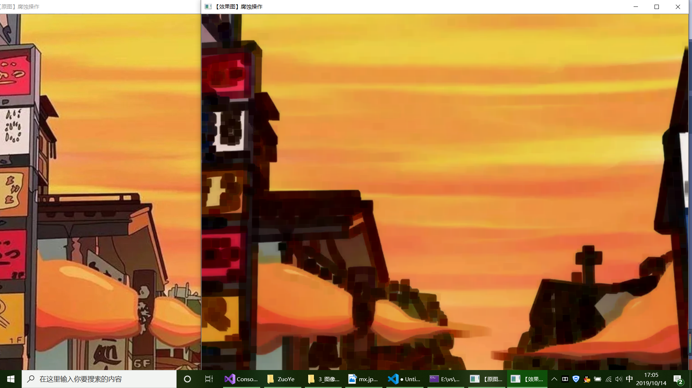

# openCV环境安装与配置
安装Visual Studio和openCV环境的配置
首先从VS官网下载VS 2019并安装
下载openCV-4.11-vc14_vc15并安装
配置openCV环境变量，在我的电脑上右键点击属性，点击高级系统环境在用户变量中，点击Path变量并编辑，添加dll所在路径
在VS中新建项目，语言选择c++，平台选择Windows，项目类型选择控制台
在新建的项目中添加源文件并配置openCV的环境 
选择VC++目录，在包含目录中添加C:\Programs\OpenCV\opencv411\build\include和C:\Programs\OpenCV\opencv411\build\include\opencv2这两个目录
在库目录中添加C:\Programs\OpenCV\opencv411\build\x64\vc15\lib：
在链接器的输入中添加opencv_world411d.lib静态库，点击应用并确定
最后测试openCV代码

出现期望图片，表示环境配置成功

上午学习了图像腐蚀操作
主要代码如下
Mat element = getStructuringElement(MORPH_RECT, Size(15, 15));
	Mat dstImage;
	erode(srcImage, dstImage, element);
 效果图：
 
 
 ## 总结：
 OpenCV是一个开放的跨平台计算机视觉库，实现了图像处理和计算机视觉方面的很多通用算法，学习它首先得将环境配置好，配置环境的过程虽然不复杂，但步骤很多，添加属性时要细心，要注意将对应的地址添加到对应的目录中。环境配置成功后便试了一下简单的图像处理操作：腐蚀处理。腐蚀就是原图中的高亮部分被腐蚀，效果图拥有比原图更小的高亮区域。函数getStructuringElement，可以获取常用的结构元素的形状，erode(srcImage, dstImage, element);进行腐蚀操作。