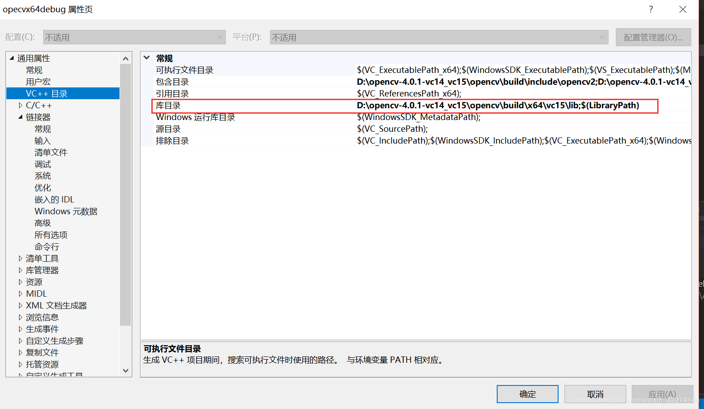
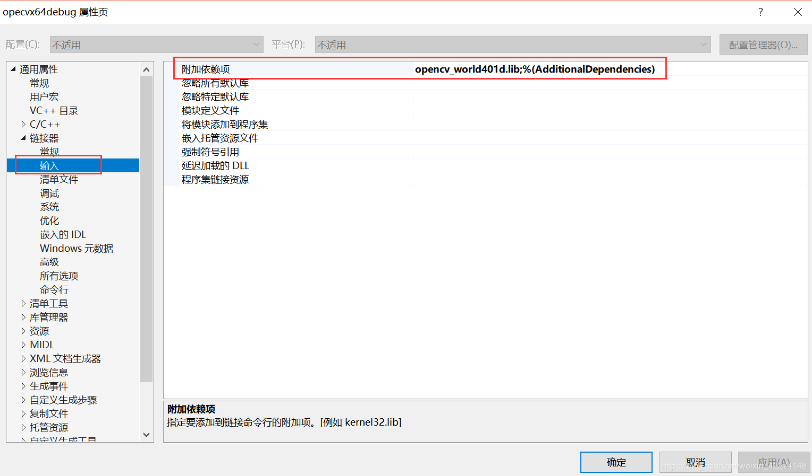

# 第一次作业
## VS2019配置OpenCV
一、环境

vs2019社区版、win10 64位操作系统

二 、opencv配置步骤（共5步）

1、下载OpenCV4.0.1，官网为opencv.org

2、安装opencv，我的安装目录是   D:\opencv-4.0.1-vc14_vc15

3、添加环境变量，在PATH中添加：      D:\opencv-4.0.1-vc14_vc15\opencv\build\x64\vc15\bin

4、将D:\opencv-4.0.1-vc14_vc15\opencv\build\x64\vc15\bin目录下面的

      opencv_world401.dll和opencv_world401d.dll文件复制到

      C:\Windows\SysWOW64这个文件夹；

另外：以上如果不想copy到C盘，把两个文件添加到工程的引用中应该也是可行的；

5、将bin目录里面的opencv_ffmpeg341_64.dll复制到C:\Windows\System32这个文件夹；  

三、vs配置步骤（共3步）

1、包含目录中加入

D:\opencv-4.0.1-vc14_vc15\opencv\build\include和D:\opencv-4.0.1-vc14_vc15\opencv\build\include\opencv2  
注：上图是自己添加的项目属性表，名称自己随意；
  

  
2、库目录中加入    D:\opencv-4.0.1-vc14_vc15\opencv\build\x64\vc15\lib    

3、 链接器->输入->附加依赖项中加入opencv_world401d.lib  

 四、测试代码
  
  可以去参考官网的demo   https://docs.opencv.org/4.0.1/d3/d52/tutorial_windows_install.html#tutorial_windows_install_path  

  ### 总结
  第一次课的主要内容就是先在自己的电脑上配置好环境，为以后的上课打好基础，首先，需要先提前下好所需的应用的安装包，然后按照老师给的步骤一步步的配置环境，但是中途还是出了不少错误，在同学的帮助下，最终还是把环境搭建起来了。虽然花了很多的时间，但是还是很值得的，在配置环境的过程中，也学到了很多东西。比如有些东西需要放在同一文件夹下，否则就会出现错误。以后会尽量避免这种小错误的。