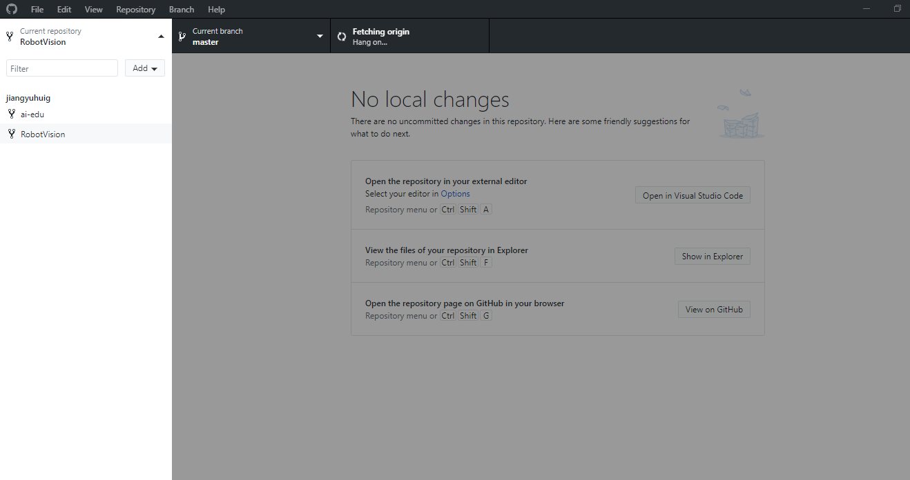
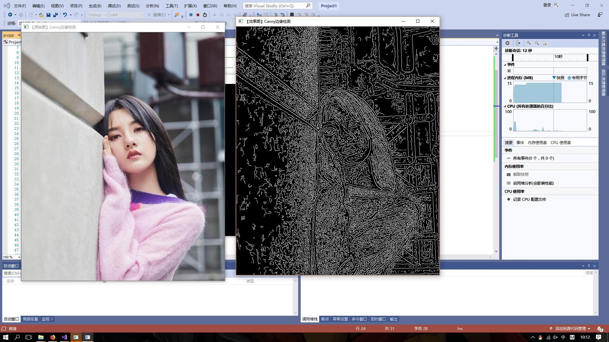
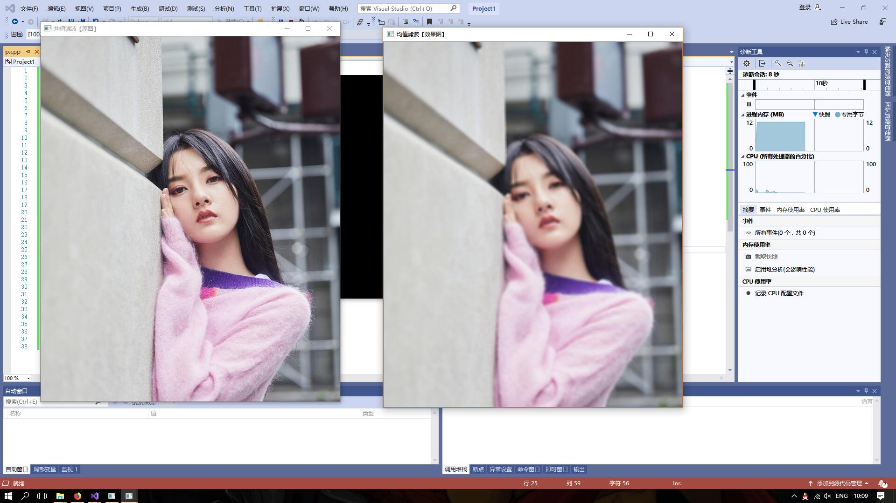

# 第二次作业
1本次课学习github的注册和使用  
首先是注册github  
这是一个链接<https://github.com>  
注册用户sign in  
然后下载github客户端
加入老师的分组  
clone两个文件
  

2学会用opencv进行图片处理  
图片显示

边缘检测  
   
模糊
  
 腐蚀
  
总结
本次是在老师的指导下学会使用opencv进行图片的处理。我在环境的配置上还是出了问题，最后通过请教同学改正了，还有一些小问题，我以后不会再次 出现。