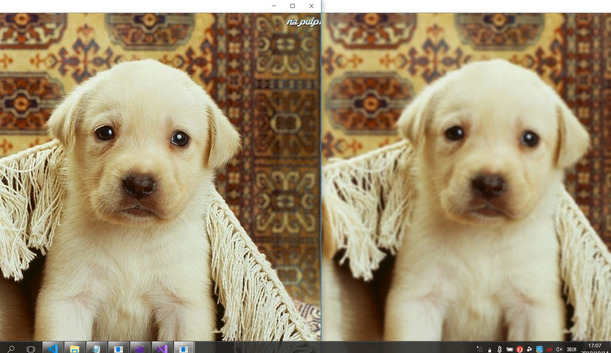

#图像腐蚀与图像模糊处理
##一、实验主题：
###图像腐蚀与图像模糊处理
##二、实验目的：
###（1）如何使用opencv处理两种最基本的形态操作：腐蚀与模糊。
###（2）掌握opencv运行环境及腐蚀与模糊的基本操作过程
###（3）学习如何编写代码以及对基本函数的使用
##三、实验代码：
###（1）图像腐蚀
using namespace cv;
int main()
{
	//载入原图  
	Mat srcImage = imread("D:\\opencv\\002.jpg");
	//显示原图
	imshow("【原图】腐蚀操作", srcImage);
	//进行腐蚀操作 
	Mat element = getStructuringElement(MORPH_RECT, Size(15, 15));
	Mat dstImage;
	erode(srcImage, dstImage, element);
	//显示效果图 
	imshow("【效果图】腐蚀操作", dstImage);
	waitKey(0);
	return 0;
}
###（2）图像模糊
 
using namespace cv;

int main()
{
	//【1】载入原始图
	Mat srcImage = imread("D:\\opencv\\002.jpg");

	//【2】显示原始图
	imshow("均值滤波【原图】", srcImage);

	//【3】进行均值滤波操作
	Mat dstImage;
	blur(srcImage, dstImage, Size(7, 7));

	//【4】显示效果图
	imshow("均值滤波【效果图】", dstImage);

	waitKey(0);
}
##四、实验效果：
###（1）图像腐蚀

###（2）图像模糊

##五、心得体会
通过本次实验我再一次学会了一种新的图像处理方法，了解并使用Opencv提供的两种基本形态操作，腐蚀与模糊的基本原理，学习对输入图片的腐蚀及模糊处理，我加深了很大的印象。不足之处就是对代码的编写还需要逐步改进。进行深入的学习，更好的提升自己