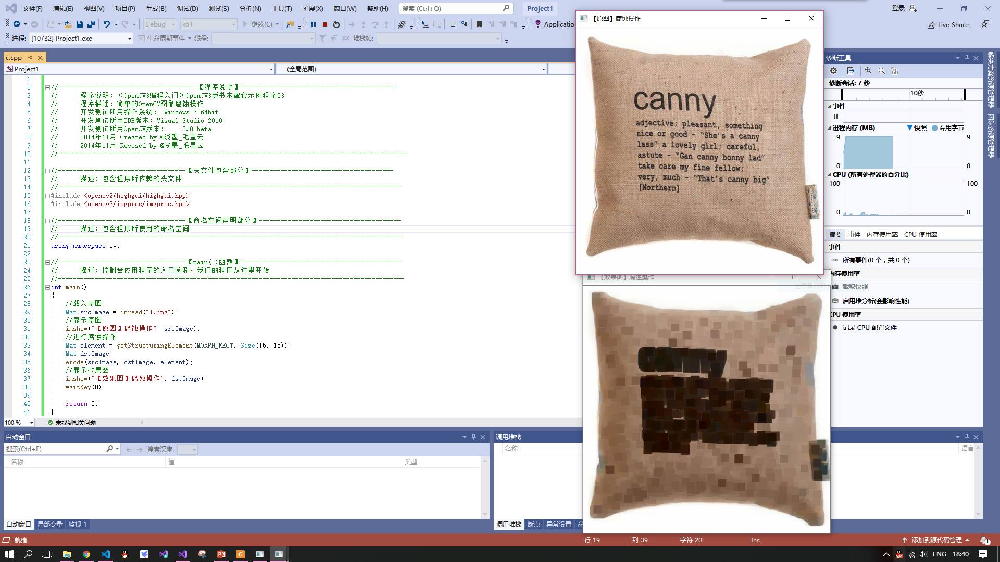
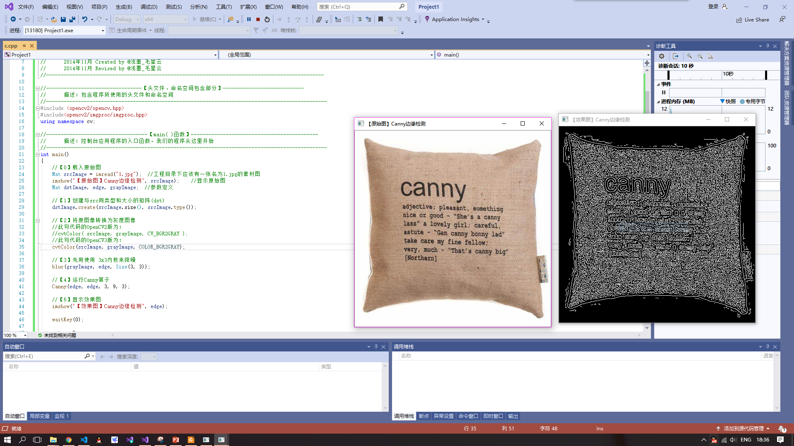

  #
## **第二次课堂总结**

>#### 用户OPENCV实现一些简单的图像识别和变化
#### *图像腐蚀*  
*  通过MAT，immread载入图片
*  用 **getStructuringElement** 进行腐蚀
*  将原图和经处理后的图片一起用**imshow**显示出来，效果如图
#### *图像模糊*
* 同前一个实验一样，通过imshow载入原图
* 调用blur函数进行均值滤波操作将原图转换为模糊图像，效果如图  

#### *边缘检测*  
 * 同前几个项目一样，通过imshow显示原图
 * 通过**dst.create**创建矩阵作为后面的图的转换 
 * cv2默认为BGR顺序，而其他软件一般使用RGB，所以需要转换进而通过**grayimage**方法将图片转换为灰度图像
 * 然后用3*3内核来降噪
 * Canny边缘检测算子是一种多级检测算法,运用Canny算子进行边缘算法的检测  
  【第一步】 消除噪声  
  【第二步】 计算梯度幅值和方向  
  【第三步】 非极大值抑制  
  【第四步】 滞后阈值 
* 最后通过imshow将原图和效果图显示出来，效果如图
