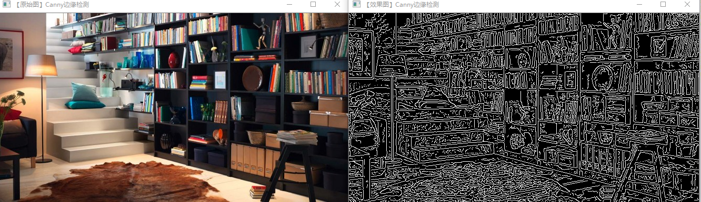

RobotVision
----

# 第二次总结
OpenCV是一个基于BSD许可（开源）发行的跨平台计算机视觉库，可以运行在Linux、Windows、Android和Mac OS操作系统上。它轻量级而且高效——由一系列 C 函数和少量 C++ 类构成，同时提供了Python、Ruby、MATLAB等语言的接口，实现了图像处理和计算机视觉方面的很多通用算法。

OpenCV用C++语言编写，它的主要接口也是C++语言，但是依然保留了大量的C语言接口。该库也有大量的Python、Java and MATLAB/OCTAVE（版本2.5）的接口。这些语言的API接口函数可以通过在线文档获得。如今也提供对于C#、Ch、Ruby,GO的支持。

RobotVision课程中图像处理我们采用OpenCV提供的库函数来完成图像的处理。

第二次课我们开始学习图像处理基础的图像显示、图像腐蚀处理、blur图像模糊处理、canny图像边缘检测。

## 图像显示
代码展示：

    #include <opencv2/opencv.hpp>  //头文件
    using namespace cv;  //包含cv命名空间

    void main( )
    {    
	//  【1】读入一张图片，载入图像
	    Mat srcImage = imread("1.jpg");
	//  【2】显示载入的图片
	    imshow("【原始图】",srcImage);
	//  【3】等待任意按键按下
	    waitKey(0);
    }  
效果展示：

原理分析：

1.OpenCV采用cv作为其命名空间；

2.图像显示常会使用两个函数：

imread()和imshow()

imread()是计算机语言中的一个函数，用于读取图片文件中的数据。

imshow()是计算机语言中的一个函数，用于显示图片。

3.关于waitKey()函数,OpenCV官方文档给出了说明如下：

This function should be followed by cv::waitKey function which displays the image for specified
milliseconds. Otherwise, it won’t display the image. For example, waitKey(0) will display the window
infinitely until any keypress (it is suitable for image display). waitKey(25) will display a frame
for 25 ms, after which display will be automatically closed. (If you put it in a loop to read
videos, it will display the video frame-by-frame)

cv :: waitKey函数，该函数显示指定毫秒时间的图像。若不使用该函数，将不会显示图像。例如，waitKey（0）将无限期显示窗口，直到任何按键为止（适用于图像显示）。 waitKey（25）将显示25毫秒的帧，此后将自动关闭显示。 （如果将其放在循环中以阅读视频，它将逐帧显示视频）。

## 图像腐蚀处理
代码展示：

    #include <opencv2/highgui/highgui.hpp>
    #include <opencv2/imgproc/imgproc.hpp>
 
    using namespace cv;

    int main(   )
    {
	    //载入原图  
	    Mat srcImage = imread("1.jpg");
	    //显示原图
	    imshow("【原图】腐蚀操作", srcImage);
	    //进行腐蚀操作 
	    Mat element = getStructuringElement(MORPH_RECT,     Size(15, 15));
	    Mat dstImage;
	    erode(srcImage, dstImage, element);
	    //显示效果图 
	    imshow("【效果图】腐蚀操作", dstImage);
	    waitKey(0); 

	    return 0;
    }

效果展示：

腐蚀主要用于形态学中除去图像的某些部分

原理分析：

1.【highgui】--高层GUI图形用户界面，包含媒体的输入输出、视频捕捉、图像和视频的编码解码、图像交互界面的接口等内容。

2.Mat类，是用于保存图像及其他矩阵数据的数据结构，默认情况下其尺寸为0.我们也可以为其指定初始尺寸。

3.getStructuringElement函数会返回指定形状和尺寸的结构元素。

其中种类可以选择，尺寸可以定义。

这个函数的第一个参数表示内核的形状，有三种形状可以选择。

矩形：MORPH_RECT;

交叉形：MORPH_CROSS;

椭圆形：MORPH_ELLIPSE;

第二和第三个参数分别是内核的尺寸以及锚点的位置。一般在调用erode函数之前，先定义一个Mat类型的变量来获得getStructuringElement函数的返回值。对于锚点的位置，有默认值Point（-1,-1），表示锚点位于中心点。element形状唯一依赖锚点位置，其他情况下，锚点只是影响了形态学运算结果的偏移。

形态学各种功能实现，都归结为腐蚀erode与膨胀dilate的组合。所以，接口函数morphologyEx的内部实现都是调用erode与dilate函数。

## blur图像模糊处理
代码展示：

    #include<opencv2/highgui/highgui.hpp>
    #include<opencv2/imgproc/imgproc.hpp>
    using namespace cv;

    int main()
    {
	    Mat srcImage = imread("1.jpg");
	    imshow("均值滤波【原图】", srcImage);
	    Mat dstImage;
	    blur(srcImage, dstImage, Size(8, 8));
	    imshow("均值滤波【效果图】", dstImage);
	    waitKey(0);

    }
效果展示：

图像模糊处理分为：

1.线性滤波：
>+ 均值滤波
>+ 高斯滤波
>+ 中值滤波

2.非线性滤波：
>+ 双边滤波

图像模糊的作用：模糊操作是图像处理中最简单和常用的操作之一，使用该操作的原因之一就为了给图像预处理时降低噪声。

模糊处理的基本操作实际上可以理解为复杂的卷积运算。

### 均值滤波（归一化滤波）

均值滤波是典型的线性滤波算法，它是指在图像上对目标像素给一个模板，该模板包括了其周围的临近像素（以目标像素为中心的周围8个像素，构成一个滤波模板，即去掉目标像素本身），再用模板中的全体像素的平均值来代替原来像素值。

均值滤波的缺点：由于边缘的像素点无法产生上述的这样一个模板，因为无法以边缘上的某个像素点为中心产生滤波末班，故无法对边缘点进行处理。这会造成图像边缘的缺失。

OpenCV提供的均值滤波：
<u>**void blur**(Mat src,Mat dst, Size(xradius,yradius), Point(-1, -1))</u>

### 中值滤波（椒盐去燥）
中值：中间值，将数据从小到大排序后的中间值。
用3×3大小模板进行中值滤波。对模板中的9个数进行从小到大排序：1,1,1,2 ，2,5,6,6,10。中间值为2所有，中值滤波后（2,2）位置的值变为2.同理对其他像素点。

OpenCV提供的中值滤波的函数：

<u>**void medianBlur**(InputArray src, OutputArray dst, int ksize)</u>

### 高斯滤波
高斯滤波是一种线性平滑滤波，适用于消除高斯噪声，广泛应用于图像处理的减噪过程。

高斯滤波就是对整幅图像进行加权平均的过程，每一个像素点的值，都由其本身和邻域内的其他像素值经过加权平均后得到。

高斯滤波的具体操作是：用一个模板（或称卷积，掩模）扫描图像中的每一个像素，用模板确定的邻域内像素的加权平均灰度值去替代模板中心像素点的值。

高斯函数：

一维的：

二维的：

OpenCV提供的高斯滤波的函数：

 <u>void GaussianBlur(InputArray src, OutputArray dst, Size ksize, double sigmaX, double sigmaY=0, int borderType=BORDER_DEFAULT);</u>

 **InputArray src**：输入图像，可以是Mat类型.

 **OutputArray dst**：输出图像，与输入图像有相同类型和尺寸 
大小.

**ksize**：高斯内核大小，这个尺寸与前面两个滤波内核尺寸不同，ksize.width和ksize.height可以不相同但是这两个值必须为正奇数，如果这两个值为0，他们的值将由西格玛计算。

**double sigmaX**：高斯核函数在X方向上的标准偏差。

**double sigmaY**：高斯核函数在Y方向上的标准偏差，如果sigmaY是0，则函数会自动将sigmaY的值设置为与sigmaX相同的值，如果sigmaX和sigmaY都是0，这两个值将由ksize.width和ksize.height计算而来。
具体可以参考getGaussianKernel（）函数查看具体细节。

建议将size，sigmaX和sigmaY都指定出来。

**int borderType** = BORDER_DEFAULT：推断图像外部像素的某种便捷模式，有默认值BORDER_DEFAULT，如果没有特殊需要不用更改，具体可以参考borderInterpolate（）函数。

### 双边滤波

双边滤波是一种非线性的滤波方法，是结合图像的空间邻近度和像素值相似度的一种折中处理，同时考虑空间与信息和灰度相似性，达到保边去噪的目的。

具有简单，非迭代，局部处理的特点。

之所以能够达到保边去噪的滤波效果是因为滤波器由两个函数构成：一个函数是由几何空间距离决定滤波器系数，另一个是由像素差值决定滤波器系数。

OpenCV提供的双边滤波处理的函数有：

<u>**void bilateralFilter**(InputArray src, OutputArray dst, int d, double sigmaColor, double sigmaSpace, int borderType=BORDER_DEFAULT )</u>

以上关于图像模糊处理的滤波知识补充，感谢csdn博主分享。
<https://blog.csdn.net/qq_39861376/article/details/82109127>

## canny边缘检测
代码展示：

    #include <opencv2/opencv.hpp>
    #include<opencv2/imgproc/imgproc.hpp>
    using namespace cv;

    int main( )
    {
	    //【0】载入原始图  
	    Mat srcImage = imread("1.jpg");  //工程目录下应该有一张名为1.jpg的素材图
	    imshow("【原始图】Canny边缘检测", srcImage); 	//显示原始图 
	    Mat dstImage,edge,grayImage;	//参数定义

	    //【1】创建与src同类型和大小的矩阵(dst)
	    dstImage.create( srcImage.size(), srcImage.type() );

	    //【2】将原图像转换为灰度图像
	    //此句代码的OpenCV2版为：
	    //cvtColor( srcImage, grayImage, CV_BGR2GRAY );
	    //此句代码的OpenCV3版为：
	    cvtColor( srcImage, grayImage, COLOR_BGR2GRAY );

	    //【3】先用使用 3x3内核来降噪
	    blur( grayImage, edge, Size(3,3) );

	    //【4】运行Canny算子
	    Canny( edge, edge, 3, 9,3 );

	    //【5】显示效果图 
	    imshow("【效果图】Canny边缘检测", edge); 

	    waitKey(0); 

	    return 0; 
    }

效果展示：

### canny边缘检测算法的发展和用途

Canny边缘检测于1986年由JOHN CANNY首次在论文《A Computational Approach to Edge Detection》中提出，就此拉开了Canny边缘检测算法的序幕。

Canny边缘检测是从不同视觉对象中提取有用的结构信息并大大减少要处理的数据量的一种技术，目前已广泛应用于各种计算机视觉系统。Canny发现，在不同视觉系统上对边缘检测的要求较为类似，因此，可以实现一种具有广泛应用意义的边缘检测技术。边缘检测的一般标准包括：

1) 以低的错误率检测边缘，也即意味着需要尽可能准确的捕获图像中尽可能多的边缘。

2) 检测到的边缘应精确定位在真实边缘的中心。

3) 图像中给定的边缘应只被标记一次，并且在可能的情况下，图像的噪声不应产生假的边缘。

为了满足这些要求，Canny使用了变分法。Canny检测器中的最优函数使用四个指数项的和来描述，它可以由高斯函数的一阶导数来近似。

在目前常用的边缘检测方法中，Canny边缘检测算法是具有严格定义的，可以提供良好可靠检测的方法之一。由于它具有满足边缘检测的三个标准和实现过程简单的优势，成为边缘检测最流行的算法之一。

### canny算法的处理流程

Canny边缘检测算法可以分为以下5个步骤：

1) 使用高斯滤波器，以平滑图像，滤除噪声。

2) 计算图像中每个像素点的梯度强度和方向。

3) 应用非极大值（Non-Maximum Suppression）抑制，以消除边缘检测带来的杂散响应。

4) 应用双阈值（Double-Threshold）检测来确定真实的和潜在的边缘。

5) 通过抑制孤立的弱边缘最终完成边缘检测。

### 高斯平滑滤波

为了尽可能减少噪声对边缘检测结果的影响，所以必须滤除噪声以防止由噪声引起的错误检测。为了平滑图像，使用高斯滤波器与图像进行卷积，该步骤将平滑图像，以减少边缘检测器上明显的噪声影响。

高斯滤波是一种线性平滑滤波，适用于消除高斯噪声，广泛应用于图像处理的减噪过程。

高斯滤波就是对整幅图像进行加权平均的过程，每一个像素点的值，都由其本身和邻域内的其他像素值经过加权平均后得到。高斯滤波的具体操作是：用一个模板（或称卷积、掩模）扫描图像中的每一个像素，用模板确定的邻域内像素的加权平均灰度值去替代模板中心像素点的值。

一维的高斯滤波前面已经引用过：

二维的高斯滤波前面已经引用过：

### 高斯模糊

高斯模糊（英语：Gaussian Blur），也叫高斯平滑。

图像的高斯模糊过程就是图像与正态分布做卷积。由于正态分布又叫作高斯分布，所以这项技术就叫作高斯模糊。

