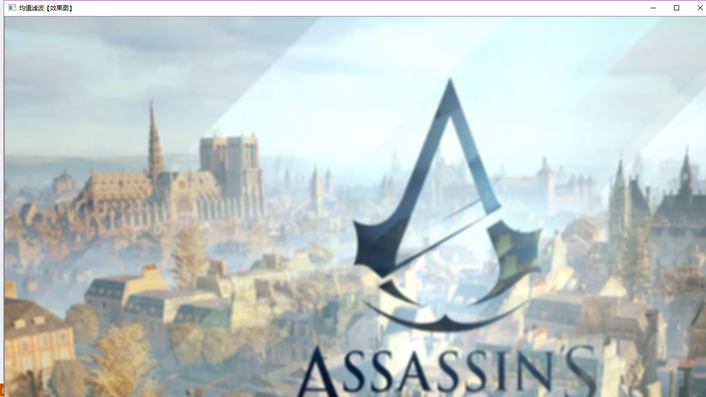

>>>>>>>>> # 第二次作业
#### 由于第一次的配置环境花费了太多时间，在第二次上课的时候，进行了图片腐蚀、模糊、边缘测试、opencv的基本数据结构和GitHub的注册。
  
  
  #### 1.进行图片腐蚀。
* erode这个函数是腐蚀的作用。在写腐蚀函数的时   候要用erode和getStructuringElement函数，这个函数会返会    指定形状和尺寸的结构元素。
* 
* 第一个参数表示内核的形状，有三种   可以选择矩形（MORPH_RECT）、交叉形（MORPH_CROSS）和椭圆形（MORPH_ELLIPSE）。
* 第二和第三个参数分别是内核的尺寸以    及锚点的位置。一般在调用erode函数之前，先定义一个Mat类型    的变量来获得getStructuringElement函数的返回值。对于锚点    的位置，有默认值Point（-1,-1），表示锚点位于中心点。     
  
  
  
  
  #### 2.进行图片模糊。
* 在图片模糊的代码中，运用blur函数。blur的作用是对输入的图像src进行均值滤波后用dst输出。
* void erode( const Mat& src, Mat& dst, const Mat& element,Point anchor=Point(-1,-1), int iterations=1,int borderType=BORDER_CONSTANT,
const Scalar& borderValue=morphologyDefaultBorderValue() );
* src:原图像。
* 
* dst：目标图像。
* 
* element:腐蚀操作的内核。 如果不指定，默认为一个简单的 3x3 矩阵。否则，我们就要明确指定它的形状，可以使用函数getStructuringElement().
* 
* anchor:默认为Point(-1,-1),内核中心点。省略时为默认值。
* 
* iterations:腐蚀次数。省略时为默认值1。

* borderType:推断边缘类型，具体参见
* 
* borderInterpolate函数。默认为BORDER_DEFAULT，省略时为默认值。
* 
* borderValue:边缘值，具体可参见createMorphoogyFilter函数。可省略。
 

#### 3.进行边缘测试。
* Canny函数进行边缘测试。
* void cvCanny( const CvArr* image,  CvArr* edges,  double threshold1,double threshold2int aperture_size=3);
* 第一个参数表示输入图像，必须为单通道灰度图。

* 第二个参数表示输出的边缘图像，为单通道黑白图。

* 第三个参数和第四个参数表示阈值，这二个阈值中当中的小阈值用来控制边缘连接，大的阈值用来控制强边缘的初始分割即如果一个像素的梯度大与上限值，则被认为是边缘像素，如果小于下限阈值，则被抛弃。如果该点的梯度在两者之间则当这个点与高于上限值的像素点连接时我们才保留，否则删除。

* 第五个参数表示Sobel 算子大小，默认为3即表示一个3*3的矩阵。Sobel 算子与高斯拉普拉斯算子都是常用的边缘算子，详细的数学原理可以查阅专业书籍。

* 灰度转换 - cvtColor()函数

#### 4.opencv的基本数据结构
##### （1）Mat类：图像容器
* 由两个数据部分组成：矩阵头（包含矩阵尺寸、存储方法、存储地址等）和一个指向存储所有像素值的矩阵的指针。矩阵头的尺寸是常数值，但矩阵本身的尺寸会依图像的不同而不同，通常比矩阵头的尺寸大数个数量级。
##### （2）像素值的存储方法
* RGB是最常见的。
* HSV和HLS把颜色分解成色调、饱和度和亮度/明度。这是描述颜色更自然的方式。
* YCrCb在JPEG图像格式中广泛使用
* CIE L*a*b是一种在感知上均匀的颜色空间。
##### （3）常用数据结构和函数
* Point类：点的表示。表示了二维坐标系下的点，即由其图像坐标x和y指定的2D点。
* Scalar类:颜色的表示。
  Scalar()表示具有四个元素的数组。
  eg：Scalar(a,b,c);
  a为蓝色分量。b为绿色分量，c为红色分量。
* Size类：尺寸表示。
  Size(w,h);
  w 为像素宽度， h为像素高度.
* Rect类：矩形的表示
   Rectangle类的成员变量有x，y，width，height，分别为左上角点的坐标和矩形的宽和高。
常用的成员函数：Size()返回值为Size;area()返回矩形的面积;contain(Point)判断点是否在矩形内;inside(Rect)函数办多矩形是否在该矩形内;tl()返回左上角点坐标;br()返回右下角点坐标。
* cvtColor()函数：颜色空间转换
cvtColor()函数式OpenCV里的颜色空间转换函数，可以实现RGB颜色向HSV、HSI等颜色空间的转换，也可以转换为灰度图像。
