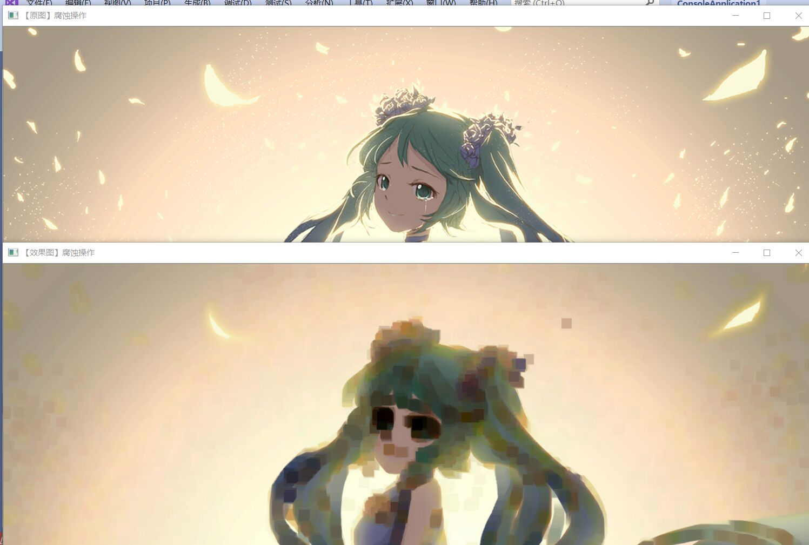
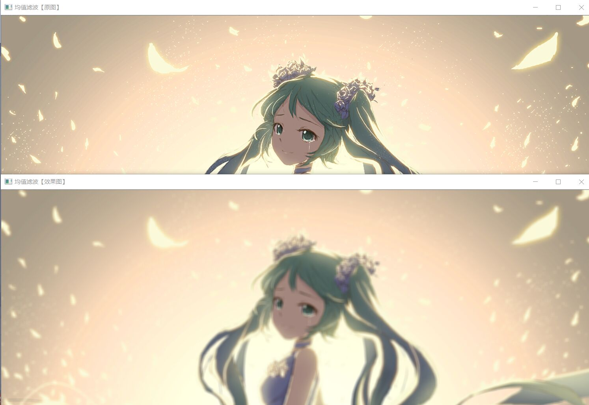

# 第二次作业
今天， 通过本次实验，我学到了一种图像处理的最基础方法，了解并使用OpenCV实现了它————腐蚀与膨胀，同时也明白了腐蚀和膨胀的基本原理，今天我虽然熟悉了对图片的腐蚀与膨胀的的操作和具体代码，但写代码期间遇到过很多问题，不过都一一改正了过来，总之，代码还是不太熟悉，还有待于进一步提高，期待下次有更一步的进步。
在本次代码中的改进：
代入滤波操作
    Mat element=getStructuringElement(MORPH_RECT,Size(15,15));
    Mat dstImage;
    erode(srcImage,dstImage,element);
    //显示效果图
    imshow("rendering-corrosion",dstImage);
    //图像模糊
    //进行均值滤波操作
    blur(srcImage,dstImage,Size(7,7));
    imshow("fuzzy-last",dstImage);
在这次实验后，开始进行githup的注册，以及使用vscode，方便以后交作业，但对于githup和vscode还是不了解，所以花了一段时间去学它。

下面是实验结果：

