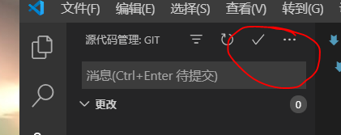
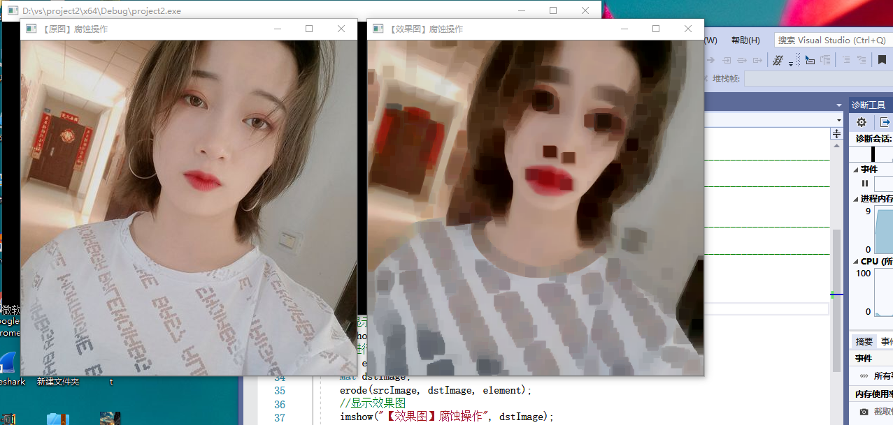
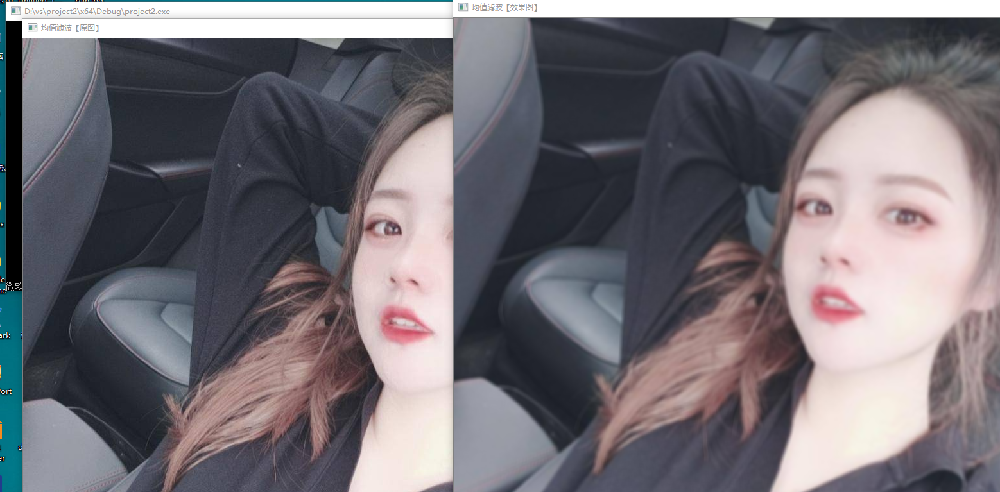

学习总结：
今天主要跟着老师了解github的功能和用处
1. 先学会注册gethub并且如何fork老师的RobotVision(如图)

2. 如何利用提交作业到github（利用vs code来编写markdown为辅助）
在提交过程中通过上网查询如何把 vs code的东西提交到github
先要下载git通过git来在github和vs  code建立联系
先在自己的github建立仓库添加一个ssh公匙利用ssh来建立来联系，配置完成后用 vs code
来完成提交（通过资源管理器来推送提交）（如图）

3.最后就是接着前一天的图像进行更深入的处理。
对图像的模糊和腐蚀处理
腐蚀处理：
#include <opencv2/opencv.hpp>

using namespace std;
using namespace cv;//包含cv命名空间
int main()
{

    Mat src_img = imread("C:\\a.png");//imread()函数载入图像
    //从文件中读入图像，注意图像路径最好不要用相对路径，因为CLion生成的exe不在当前目录下。
    if(src_img.empty())
    {
        fprintf(stderr, "Can not load image\n");//如果读入图像失败，返回错误信息
        return -1;
    }
    //显示图像
    imshow("origin image and erode operation", src_img);//imshow()函数显示图像
    Mat ele = getStructuringElement(MORPH_RECT,Size(15,15));//getStructuringElement返回值定义内核矩阵
    Mat des_img;
    erode(src_img,des_img,ele);//erode函数直接进行腐蚀操作
    imshow("after erode operation",des_img);
    waitKey();//此函数等待按键，按键盘任意键就返回
    return 0;
}

模糊处理：(利用均值滤波，高值滤波来进行处理)

201702062 任文博